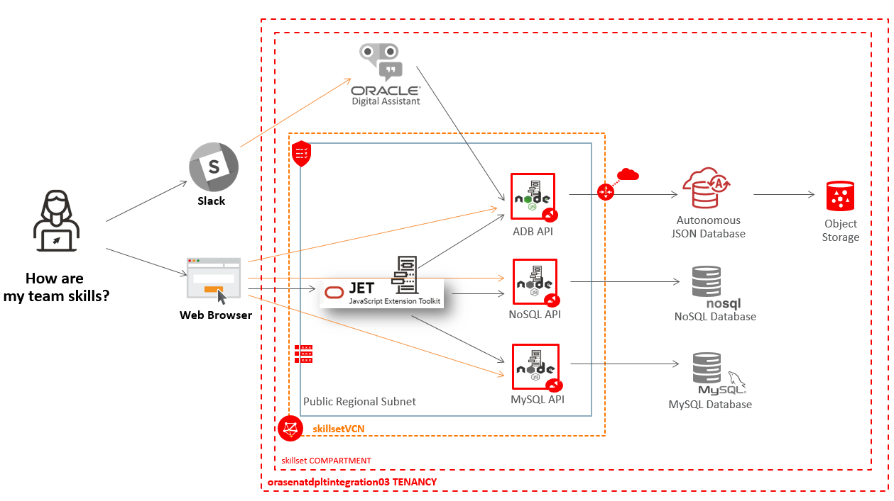

# Introduction to Skillset Tracking Application                                   

The goal of this workshop is to build a customizable application starting from a ***simple JSON file***, using an ***Oracle Autonomous JSON Database*** to store the data in ***SODA Document Collections***. The application is using ***NodeJS*** and ***SODA for NodeJS*** on the server-side, and ***OracleJET*** for the interface. There is also an integration with ***Oracle Digital Assistant (ODA)***.

The infrastructure of the application is build in Oracle Cloud Infrastructure and will use several resouces, as shown in the architecture diagram below.

## Is it customizable?
The application presented in the following labs is based on a sample JSON file with data regarding a group of employees and details about them and their skills on certain categories of skills and areas of development. The JSON can be easily updated in order to fit any other business need.

For example, you can build up a JSON with information for an online shop if instead of having details about employees and their skills you have details about products in the shop and product specifications for each of them.

Another idea would be to have information regarding the physical stores a company owns as well as the categories of products and the product list for each store.
It's up to you to customize the JSON according to your business need.

  **Note**: See more about the JSON files and how they can be customized in **Lab 4 - Autonomous JSON Database & SODA Collections**.

## What are Oracle Autonomous JSON Databses?
As stated on [oracle.com](https://www.oracle.com/autonomous-database/autonomous-json-database/),
**Oracle Autonomous JSON Databases** are a cloud document database service that makes it easier to develop JSON-centric applications. These offer several functionalities, including the possibility to easily develop _REST APIs_ in popular programming languages such as _NodeJS_, _Java_ and _Python_.

## What is SODA and what are SODA Document Collections?
**SODA**, or **Simple Oracle Document Access** is a set of NoSQL-style APIs that allow you create and store JSON document collections in Oracle Databases, as well as perform several queries without using SQL or how the documents are actually stored in the database.

## What is OracleJET?
**OracleJET**, or **Oracle JavaScript Extension Toolkit**, is a modular open source toolkit used by front-end developers & engineers for building websites and user interfaces. OracleJET provides a collection of reusable components in the [OracleJET Cookbook](https://www.oracle.com/webfolder/technetwork/jet/jetCookbook.html) which can be used to customize the interface of an application in any way possible.

## Workshop Objectives
  * Set up the environment in OCI
  * Provision an Autonomous JSON Database
  * Create SODA collections in the database
  * Use SODA for NodeJS to create API calls to the database
  * Create a sample OracleJET application
  * Put it all together in one single application
  * Integrate with Oracle Digital Assistant

## Lab Breakdown
- **Lab 1:** Generate SSH Key
- **Lab 2:** Login to OCI
- **Lab 3:** Install and prepare prerequisites
- **Lab 4:** Autonomous JSON Database & SODA Collections
- **Lab 5:** Build an OracleJET Web Application
- **Lab 6:** Build NodeJS APIs
- **Lab 7:** Set up the Development Environment
- **Lab 8:** Integration with Oracle Digital Assistant and Slack

## Want to Learn More?
* [Oracle Autonomous JSON Databases](https://www.oracle.com/autonomous-database/autonomous-json-database/)
* [SODA](https://docs.oracle.com/en/database/oracle/simple-oracle-document-access/index.html)
* [OracleJET](https://www.oracle.com/webfolder/technetwork/jet/index.html)

## Acknowledgements

**Authors/Contributors** - Giurgiteanu Maria Alexandra, Gheorghe Teodora Sabina, Minoiu (Paraschiv) Laura Tatiana, Digori Gheorghe
