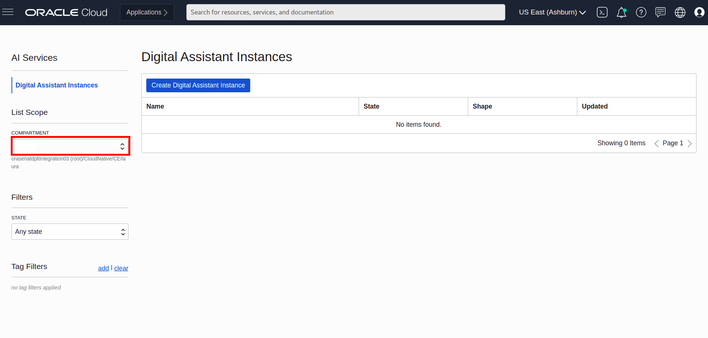
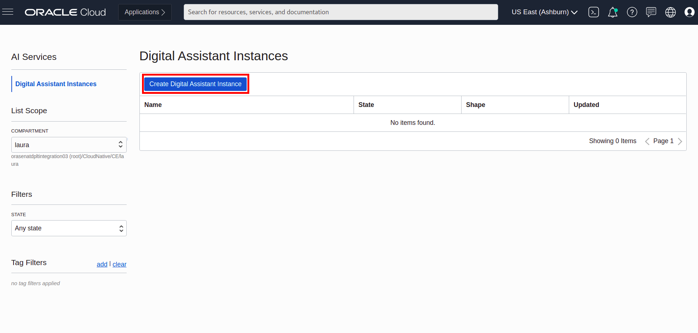
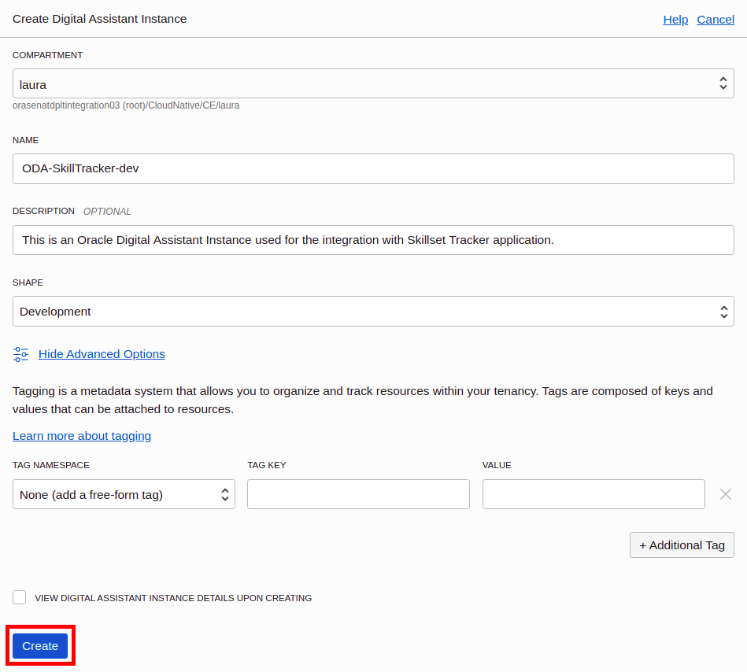

# Integrate your application with Oracle Digital Assistant

## Introduction

### Terminology

**Digital assistants** are virtual devices that help users accomplish tasks through natural language conversations, without having to seek out and wade through various apps and web sites. Each digital assistant contains a collection of specialized skills. When a user engages with the digital assistant, the digital assistant evaluates the user input and routes the conversation to and from the appropriate skills.

### Basic Concepts

**Intents**—Categories of actions or tasks users expect your skill to perform for them.

**Entities**—Variables that identify key pieces of information from user input that enable the skill to fulfill a task.

Both intents and entities are common NLP (Natural Language Processing) concepts. NLP is the science of extracting the intention of text and relevant information from text.

**Components**—Provide your skill with various functions so that it can respond to users. These can be generic functions like outputting text, or they can return information from a backend and perform custom logic.

**Flows**—The definition for the skill-user interaction. The dialog flow describes how your skill responds and behaves according to user input.

**Channels**—Digital assistants and skills aren’t apps that you download from an app marketplace, like iTunes. Instead, users access them through messaging platforms or through client messaging apps. Channels, which are platform-specific configurations, allow this access. A single digital assistant or skill can have several channels configured for it so that it can run on different services simultaneously. Example of Channels: Slack, Facebook Messenger

Estimated Lab Time: 30 minutes

### Objectives

- some Objectives

### Prerequisites

- This lab assumes you have an Oracle Cloud account and compartment, user, groups and policies created into it and you are logged in your account. For an overview of compartments, users, groups, policies etc see this [link](https://docs.oracle.com/en/cloud/paas/digital-assistant/use-chatbot/users-groups-and-policies1.html#GUID-145DC7BA-2A9B-43BD-90A9-6FDBCAEBB7B0).

## **Step 1:** Create an Oracle Digital Assistant Service Instance

1. In the Infrastructure Console, click on Hamurger menu on the top left to open the navigation menu, select **Analytics & AI**, and select **Digital Assistant** (which appears under the AI Services category on the page).

2. From the **Compartments** panel, select a compartment.

3. Click **Create Instance**.

4. On the **Create Instance** page, fill in the following details:

   - **Compartment**.
   - **Name**. Enter a name that reflects usage of the instance.
   - **Description**. (Optional) Enter a description for your instance.
   - **Instance shape**. Select between the following shapes:
     - **Development**. This is a lightweight option that is geared toward development work.
     - **Production**. This option should be selected for production instances of Digital Assistant. In comparison with the Development shape, this option has higher rate limits and greater database capacity, which enables more Insights data to be collected.
   - **Tag Namespace**. (Optional)

   

5. Click **Create**.

After a few minutes, your instance will go from the status of **Creating** to **Active**, meaning that your instance is ready to use.

## **Step 2:** Access the Service Instance from the Infrastructure Console

Once you have provisioned an instance, you can access it from the **Infrastructure Console** by following these steps:

1. Select your Digital Assistance Instance.

2. Click **Service Console**. It will open a new page.

3. **Sign In** to the Console. Click on the arrow located on the right side of **Oracle Cloud Infrastructure Direct Sign-In** text and enter your **Username** and **Password**, then click on **Sign In**.

4. In the Infrastructure Console, click on Hamurger menu on the top left to open the navigation menu, select **Development**, then select **Skills**.

5. Download the **Skill** by accessing this [link]().

6. In the up right corner of the Console, select **Import Skill**.

7. Select the downloaded file from your computer then click **Open**.

## Want to Learn More?

## Acknowledgements

**Authors/Contributors** - Minoiu (Paraschiv) Laura Tatiana, Digori Gheorghe
