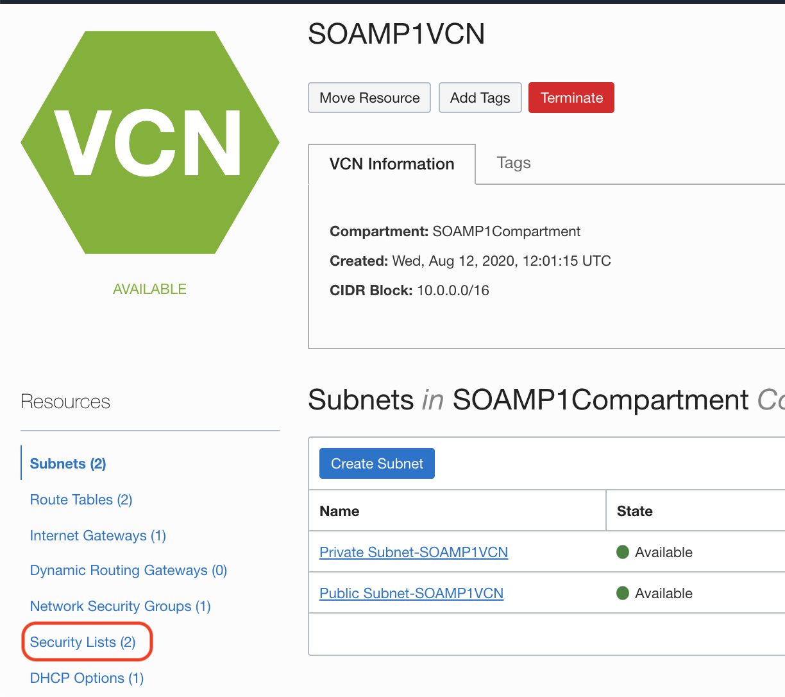
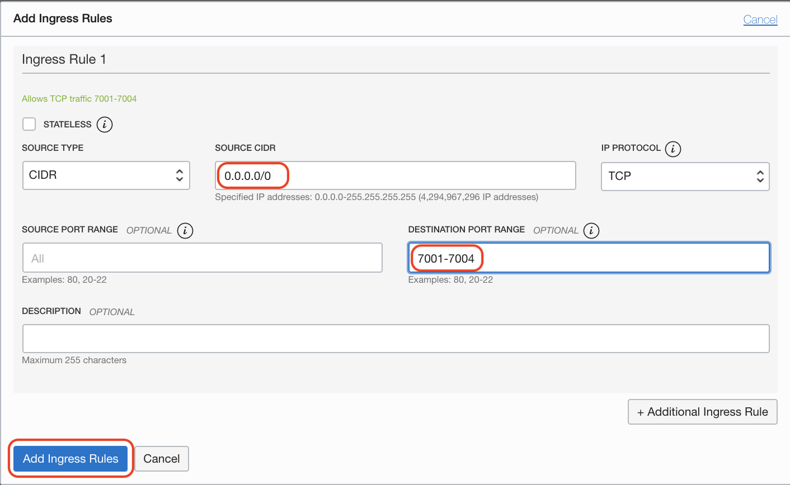
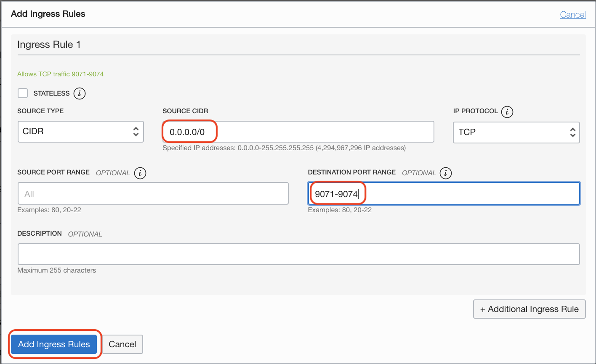

# Network setup

## Introduction: 

This lab with guide you through how to setup Compartments and Virtual Cloud Network (VCN) with the required policies for cloud environment (tenancy)

Estimated Lab Time: 20 min

### Requirements

If you are not an administrator in your tenancy, you will need the administrator to create the compartment and set the following policies in place:

```
<copy>
allow group soa-migration to manage instance-family in compartment SOAMP1Compartment
allow group soa-migration to manage virtual-network-family in compartment SOAMP1Compartment
allow group soa-migration to manage volume-family in compartment SOAMP1Compartment
allow group soa-migration to use database-family in compartment SOAMP1Compartment
allow group soa-migration to use autonomous-database-family in compartment SOAMP1Compartment
</copy>
```

### Objectives

In this lab you will:

- Create a Compartment
- Create a VCN with private and public subnets


## **STEP 1:** Create the Compartment

Before we can provision the Application Database (SOADB), we need to provision a **Compartment** where we can setup the Network Layer ,or you can take details of already created **Compartment** from your network administrator.

1. Go to the menu button on the top left and select **Identity -> Compartment** .

  

2. Click on **Create Compartment**

  

3. Provide all the required details and make sure you have relevant permissions from your OCI Administrator to create the **Compartment**.

  

## **STEP 2:** Create the VCN

We need to provision a **VCN** by choosing **Start VCN Wizard** with preconfigured **public subnet** and **private subnet** with appropriate **Security Lists** to open up the required ports:

1. Go to the menu button and go to **Networking -> Virtual Cloud Networks**.

  

2. Click on **Create VCN** button and then select **VCN with Internet Connectivity** and click on **Start VCN Wizard** button.

  

3. Provide the VCN NAME (we'll use `SOAMP1VCN`) and select the Compartment which you have created earlier.

  

4. Select the default values for Configure VCN and Subnets unless you have been provided by specific CIDR range from your Network Administrator to use, then click on **Next** button.

  

5. Review all the **VCN** ,**Subnet** ,**Gateway**, **Security List** and **Route Table** details and then click on **Create** button.

Here you can see stack has created two subnets which we we'll use later for creating DB and SOA instance:-
A **Private Subnet** with its security list **Security List For Private Subnet-SOAMP1VCN**,
A **Public Subnet** with it's security lists **Default Security List for SOAMP1VCN**

6. Click **Create**

  

7. If you see any provisioning error, make sure to click **Re-provision**

8. When all is clear click **Close**

## **STEP 3:** Create the required Security Lists

Before we can provision the SOAMP Instance, we need to provision a **Security list** for the database subnet to be reachable from the SOA instances, and open up the required ports: 

  - port 1521 for the database
  - port 22 for SSH

As well as open up ports to access the WebLogic and SOA domain servers:

  - 7001-7004 for SOA weblogic
  - 9001-9004 for weblogic internal ports

In this section we will create a Security List for the SOA subnet to be able to reach the Database subnet on port 1521 (the Oracle Database default port), SSH port 22 and weblogic ports 7001-7004 , 9001-9004 to communicate to SOA instance.

1. Click **Security Lists**

  

2. Click **Security List for Private Subnet-SOAMP1VCN** 

  

3. Click on **Add Ingress Rules**

4. Add an ingress rules to open the DB port to the VCN CIDR.

  

5. Add an ingress rules to open the 7001-7004 ports to the world CIDR (0.0.0.0/0).

  

6. Add an ingress rules to open the 9071-9074 ports to the world CIDR (0.0.0.0/0).

  

< !-- 
Not clear if needed. it seems like it was an artifact of bad deployment of VCN
9. Click **Subnets**

10. Select the **Private Subnet-SOAMP1VCN**

  

11. Click **Add Security List**

  

12. Select the **Security List for Private Subnet-SOAMP1VCN**

  

13. Click **Add Security List** -->


You may proceed to the next lab
## Acknowledgements

 - **Author** - Akshay Saxena, September 2020
 - **Last Updated By/Date** - Akshay Saxena, Septemebr 2020

## See an issue?
Please submit feedback using this [form](https://apexapps.oracle.com/pls/apex/f?p=133:1:::::P1_FEEDBACK:1). Please include the *workshop name*, *lab* and *step* in your request.  If you don't see the workshop name listed, please enter it manually. If you would like for us to follow up with you, enter your email in the *Feedback Comments* section.
