# Scan QR code for Greenpoints

## Introduction

This lab shows how you can add a table inside a Visual Builder Application

Estimated Time:  30 minutes

### Chrome Browser

Please use a Chrome browser to run this lab.

### Background

In a previous lab, you have created a visual builder installation and imported the base OfficeDay program that you will extend.

## Task 1: Create a camera button

In this task, you will create the user interface

1.  Click Mobile Application. Then choose the page "user-custom"
2.  In the component filter, type "camera", and drag and drop the camera component in the middle of the page. 

    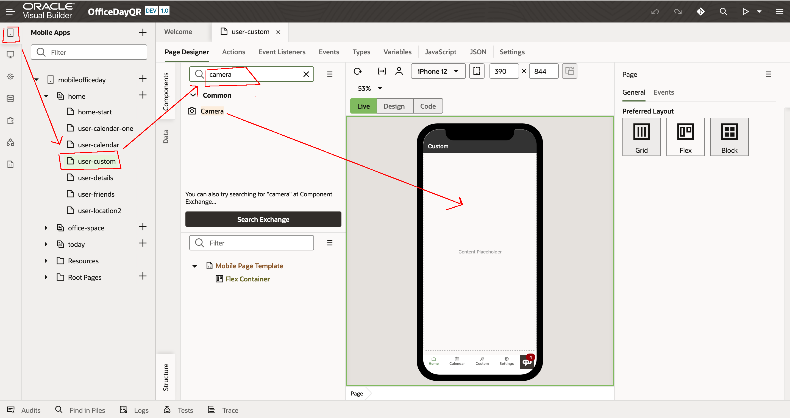

3. Then do the same and add an input text below the camera

    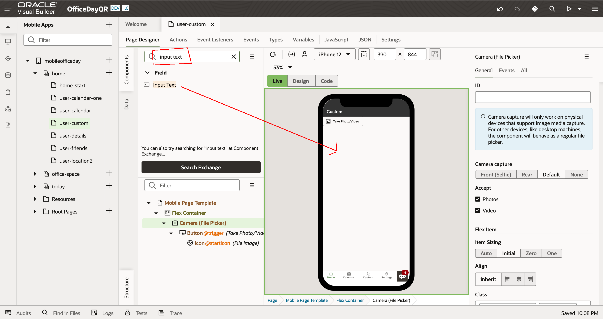

4. Then add a variable for the input-text. Click in the properties / tab **data**. Then in value, **Create Variable**.

For the variable name, type **scannedText**. Then **Create**

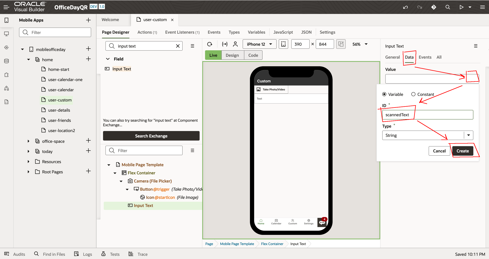

5. Now, let's configure the camera button. Click on it. Then in General properties. Remove the video property.
   
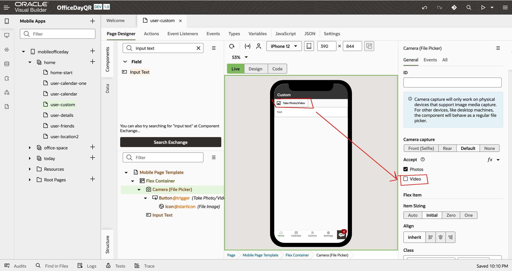

6. Still in the camera, go in the **Events** tab. Then click **New Event**, then **On Selected Files**
   
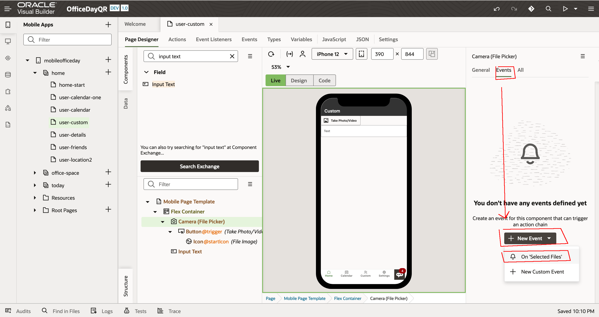

## Task 2: Create the Action

You should be now in the Action  **CameraFilePickerSelectChain**

1.  Drag and drop the **Call Function** in the actions tree.

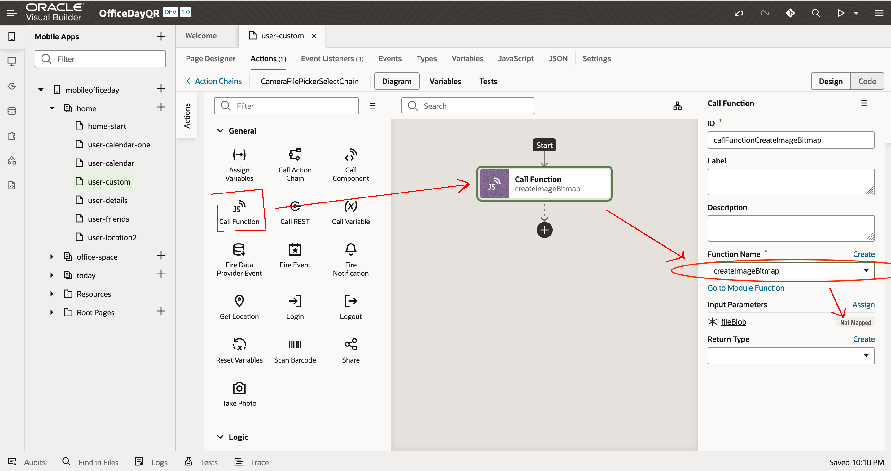

2.  Then choose the function **createImageBitmap** who will convert the image to be used by the Barcode Scanner. Then in the input parameters, click **Not Mapped** to run the mapping wizard.

3.  In the mapping, drag and drop **files/item[0]** on the fileBlob. Then **Save**

    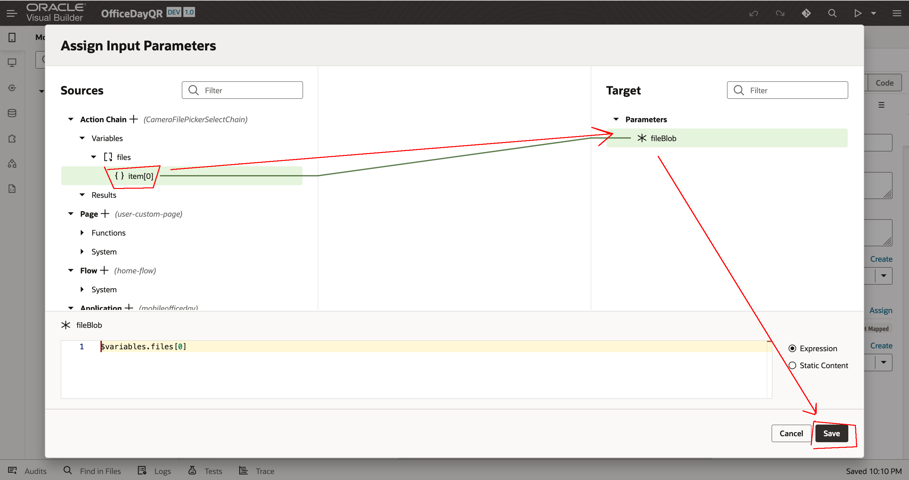

4.  Still in the Action definition, drag and drop the **Scan Barcode**.

    Set the image to the result of the previous function: **[[ $chain.results.callFunctionCreateImageBitmap ]]**. There is a drop-down for this.

    

5. Still in the Action definition, drag and drop the **Assign Variable**.

   Then click on **Variables / Assign** 

    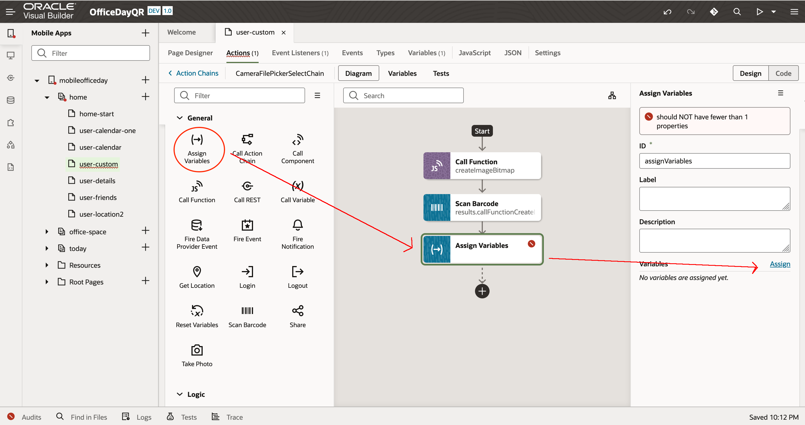

6. In the mapping, drang and drop **scanBarCode/rawValue** to **scannedText**. Then **Save**

    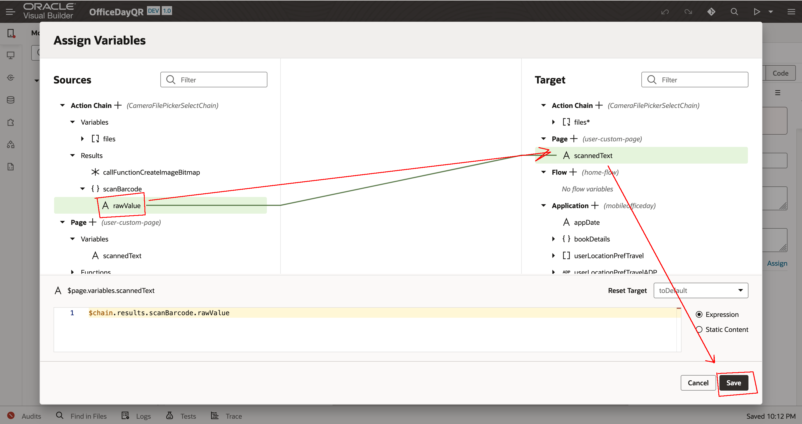

## Task 3: Test

Let's test.

1. QR Code

Save the both images on your laptop. Right click then **Save Image As...**.

  
  

2.  Press the preview button

    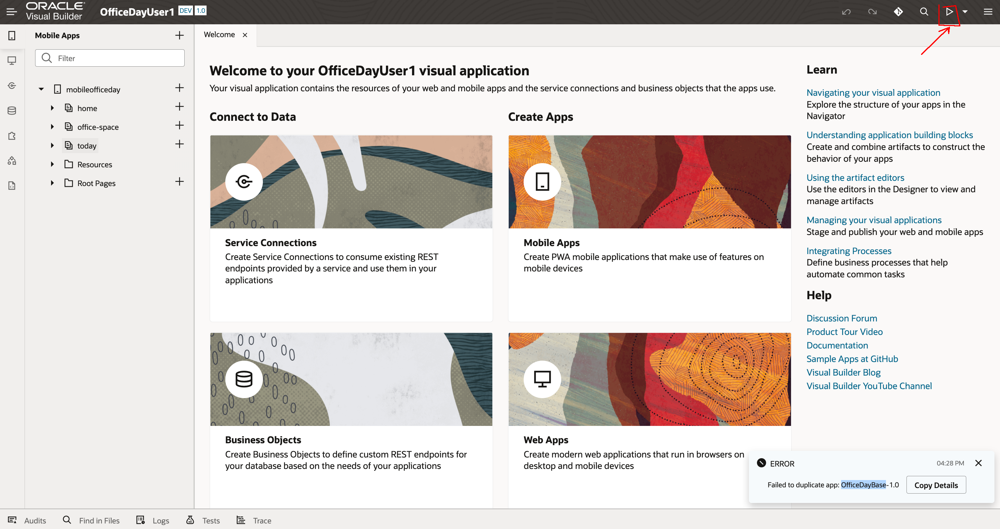

3.  Go to your custom tab.

Click **Take Photo**

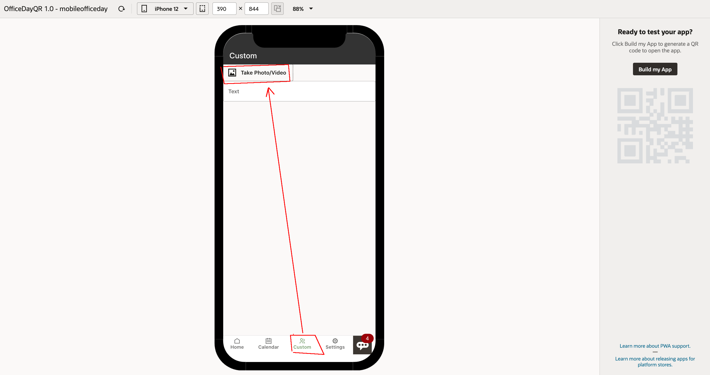  

Choose one of the above QR-code.

3. Check the result

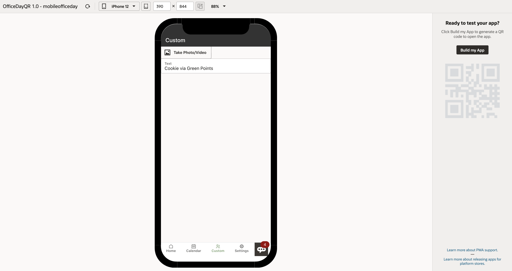  

That is it. If you reached this point, CONGRATULATION !!

  

## Optional: Run on your Phone ??

## Acknowledgements

* **Author** - Marc Gueury
* **Last Updated By** - March 2022
