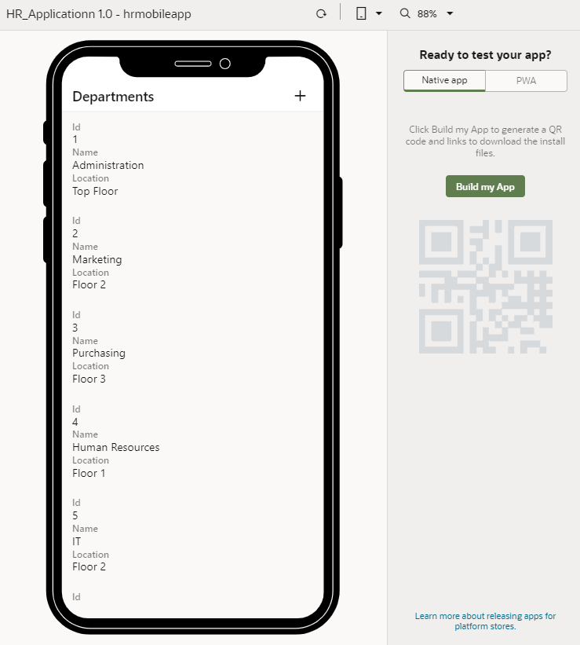
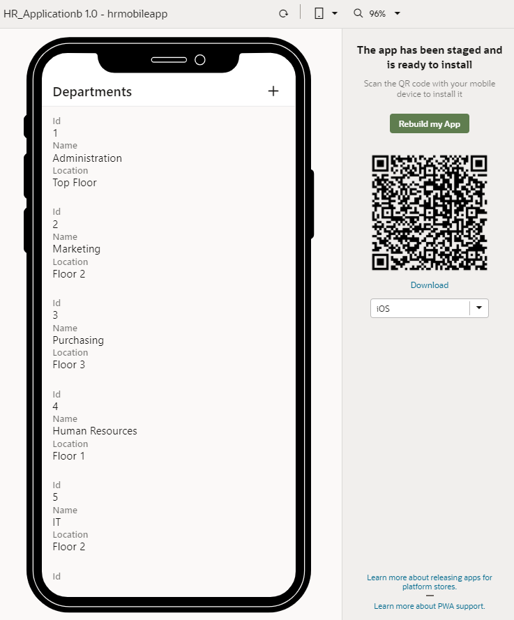

# Build a Mobile Application for Installation on Android and iOS Devices

## Introduction

This tutorial shows you how to build a mobile application for installation on Android and iOS devices. 

### Estimated Lab Time:  10 minutes

### Background

After you define build configurations that define deployment information for the Android and iOS platforms, you are ready to build the mobile application and stage it for testing. Visual Builder generates a QR code and a link to an installation file for each platform after the build process is complete. Users can scan the QR code or download the installation file to install the mobile application.

In this tutorial, you'll build a mobile application to generate QR codes and installation files for both the Android and iOS platforms. The steps to build a mobile application for installation on any one platform (either Android or iOS) are identical, except that a QR code and an installation file are generated only for the specified platform.

## **STEP 1**: Build a Mobile Application

After you create the build configuration for both Android and iOS, you can build the installation files (APK for an Android device and IPA for an iOS device) to install the mobile application on those devices.  

1.  Click **Preview**  to run the app on a new tab in the browser.

    

2.  Click **Build my App**.
3.  In the Stage Application dialog box, select **Stage application with a clean database** and click **Stage**.

    

    When the build is complete, the QR code and the **Download** link are displayed.

    

4.  Download the installation file for each platform:
    -   Select **iOS** in the drop-down list, then scan the QR code to download the installation file onto the iOS device, or use the **Download** link to download the IPA file to your file system.
    -   Select **Android** in the drop-down list, then scan the QR code to download the installation file onto the Android device, or use the **Download** link to download the APK file to your file system.
5.  Close the tab or window.

## Acknowledgements
**Author** - Sheryl Manoharan

**Last Updated** - December 2020

## Need Help?
Please submit feedback or ask for help using our [LiveLabs Support Forum](https://community.oracle.com/tech/developers/categories/livelabsdiscussions). Please click the **Log In** button and login using your Oracle Account. Click the **Ask A Question** button to the left to start a *New Discussion* or *Ask a Question*.  Please include your workshop name and lab name.  You can also include screenshots and attach files.  Engage directly with the author of the workshop.

If you do not have an Oracle Account, click [here](https://profile.oracle.com/myprofile/account/create-account.jspx) to create one.
