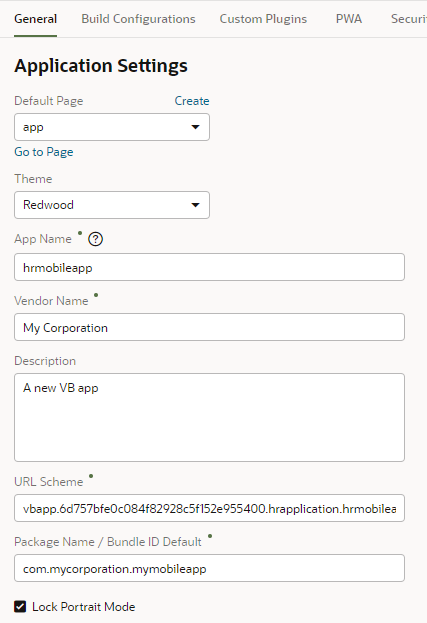
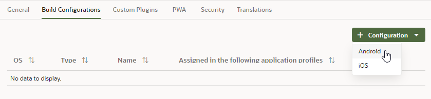
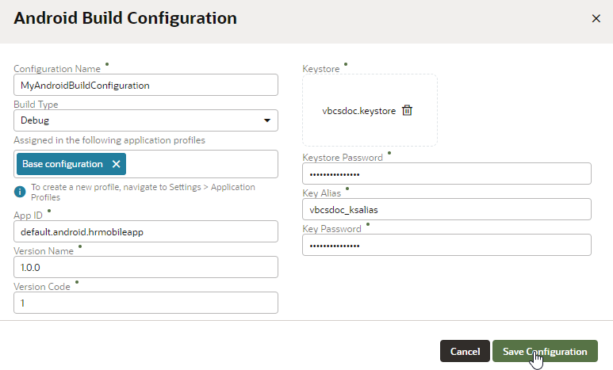
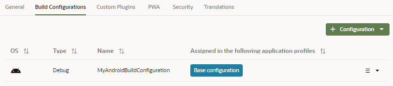

# Create a Build to Install a Mobile Application on Android Devices

## Introduction

This tutorial shows you how to define a build configuration to install a mobile application on Android devices. 

### Estimated Lab Time:  10 minutes

### Background

Before you can stage or publish a mobile application, you'll need to create a build configuration that defines deployment information for the Android platform. In this tutorial, you'll define application settings and a build configuration, you'll then use these settings to build the mobile application for installation on Android devices in a later tutorial.

## **STEP 1**: Create a Keystore for Signing the App

Your mobile application must be signed before it can be deployed to an Android device. Android does not require a certificate authority; an application can instead be self-signed.

To sign your mobile application, you must have a key. If you do not have a key, you can create one using the keytool utility.

The following example shows how to create a keystore with a single key that is valid for 10,000 days. As described in the _Sign Your App_ document, available on the Android Developers website, the keytool prompts you to provide passwords for the keystore and key, and to provide the Distinguished Name fields for your key before it generates the keystore. Complete all the prompts and the created keystore is saved in the specified directory.

`keytool -genkeypair -v -keystore c:\mykeystore\releasesigning.keystore -alias releaseKeyAlias -keyalg RSA -keysize 2048 -validity 10000`

If you do not want to create a key, right-click [this sample keystore file](./files/vbcsdoc.keystore "Sample Keystore file") and download it to your file system to use in this tutorial. Here are the credentials for the keystore file.

-   **Keystore Password**: `vbcsdoc_ks_pass`
-   **Key alias**: `vbcsdoc_ksalias`
-   **Key password**: `vbcsdoc_ks_pass`

## **STEP 2**: Configure Application Settings

These steps assume that you are already logged in to Oracle Visual Builder and are viewing the HR Application you created.

1.  In the Navigator, click the **Mobile Applications**  tab.
2.  Click the **hrmobileapp** node and click the **Settings** tab.
3.  In the General tab, review the Application Settings. Revise values that are displayed to the users (as suggested in the following examples):

-   **App Name**: Accept the default value or specify an alternative value for the app name. This value specifies the name that is displayed when the app is installed on a mobile device.
-   **URL Scheme:** Accept the default value. This value specifies the URL scheme for the app.
-   **Package name / Bundle ID Default:** Accept the default value. This value specifies the package name for the app. To avoid naming conflicts, Android uses reverse package names, such as _com.company.application_. For more information, refer to the Android Developers website.
-   **Lock Portrait Mode:** Accept the default value to render the application in Portrait mode on the mobile device. Deselecting the check box renders the mobile application in both Landscape and Portrait mode.

    

## **STEP 3**: Define a Build Configuration

A build configuration includes deployment configuration and specifies if the build is to be deployed in the debug or release mode.

1.  Click the **Build Configurations** tab and select **Android** in the + Configuration drop-down list.

    

2.  In the Android Build Configuration dialog box, enter:

    -   **Configuration Name:** Enter the configuration name, for example, `MyAndroidBuildConfiguration`.  

    -   **Build Type:** Set the build type to **Debug**. Options are **Debug** or **Release**.
    -   **Assigned in the following application profiles**: Accept the default application profile (Base configuration) that Visual Builder provides. You could also create your own application profile.
    -   **App ID:** Enter a unique ID for the application, for example, you could enter `default.android.hrmobileapp`. Each application deployed to an Android device has a unique ID, one that cannot start with a numeric value or contain spaces.  

    -   **Version Name:** Accept the default value for the application's release version number. This is the release version of the application code that is displayed to the user. For example, enter `2.0.0` if this is the second version of your application. The value you enter appears in application information dialogs when you deploy the application to a device.
    -   **Version Code:** Accept the default value for the version code. This is an integer value that represents the version of the application code, which is checked programmatically by other applications for upgrades or downgrades. The minimum and default value is 1. You can select any value and increment it by 1 for each successive release. 
    -   **Keystore:** Drag and drop (or browse to and select) the keystore file containing the private key used for signing the application for distribution. Use the provided sample keystore file, `vbcsdoc.keystore`.
    -   **Keystore Password:** Enter the password for the keystore. This password allows access to the physical file. If using the sample keystore file, enter `vbcsdoc_ks_pass`.
    -   **Key Alias:** Enter an alias for the key. This is the value set for the _keytool's -alias_ argument. Only the first eight characters of the alias are used. If using the sample keystore file, enter `vbcsdoc_ksalias`.
    -   **Key Password:** Enter the password for the key. This password allows access to the key (identified by the alias) within the keystore. If using the sample keystore file, enter `vbcsdoc_ks_pass`.

    

3.  Click **Save Configuration**. The new build configuration is displayed on the Build Configurations page.

## Acknowledgements
**Author** - Sheryl Manoharan

**Last Updated** - December 2020

## Need Help?
Please submit feedback or ask for help using our [LiveLabs Support Forum](https://community.oracle.com/tech/developers/categories/livelabsdiscussions). Please click the **Log In** button and login using your Oracle Account. Click the **Ask A Question** button to the left to start a *New Discussion* or *Ask a Question*.  Please include your workshop name and lab name.  You can also include screenshots and attach files.  Engage directly with the author of the workshop.

If you do not have an Oracle Account, click [here](https://profile.oracle.com/myprofile/account/create-account.jspx) to create one.
