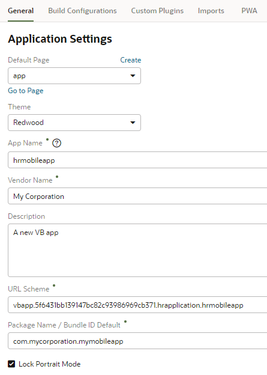
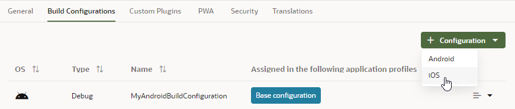
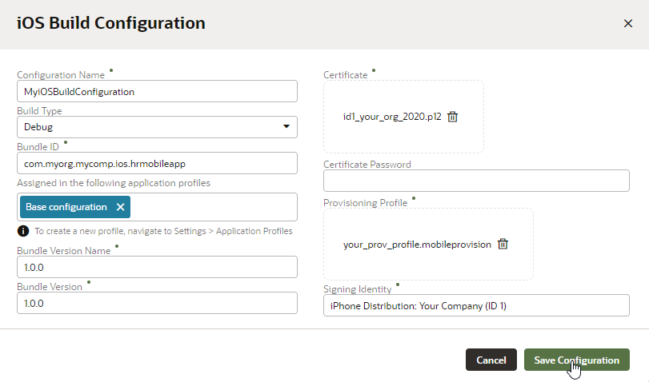

# Create a Build to Install a Mobile Application on iOS Devices

## Introduction

This tutorial shows you how to create a build configuration to install a mobile application on iOS devices. 

### Estimated Lab Time:  10 minutes

### Background

In the previous tutorial, you defined application settings and a build configuration to deploy your mobile application on the Android platform; you'll do the same for the iOS platform in this tutorial. You'll then use these settings to build the mobile application for installation on both Android and iOS devices in a later tutorial.

## **STEP 1**: Enroll in an iOS Developer Program

Deployment to an iOS-powered device or to a distribution site requires membership in the iOS Developer Program or the iOS Developer Enterprise Program.

Visit the Apple website and enroll for the iOS Developer Program or iOS Developer Enterprise Program. You can enroll as an individual or organization. For information about these programs, see this [page](https://developer.apple.com/programs/).

## **STEP 2**: Create a Provisioning Profile

You must have a provisioning profile to deploy an iOS application (.IPA file) to an iOS-powered device or to publish it either to the App Store or to an internal hosted download site. A provisioning profile associates development certificates, devices, and an application ID.

Use the iOS Provisioning Portal, accessible only to members of the iOS Developer Program, to create a provisioning profile. For more information, review the [iOS Developer Support page](https://developer.apple.com/support/).

## **STEP 3**: Configure Application Settings

These steps assume that you are already logged in to Oracle Visual Builder and are viewing the HR Application you created.

1.  If necessary, click the **Mobile Applications** tab in the Navigator.
2.  Click the **hrmobileapp** node and click the **Settings** tab.
3.  In the General tab, review Application Settings. If you already looked over the values when creating an Android build configuration in the previous tutorial and are comfortable with the settings, skip this step. Otherwise, revise values that are displayed to the users (as suggested in the following examples):

-   **App Name**: Accept the default value or specify an alternative value for the app name. The value specified is the name that is displayed when the app is installed on a mobile device.  

-   **URL Scheme:** Accept the default value. This value specifies the URL scheme for the app.
-   **Package Name / Bundle ID Default:** Accept the default value. This value specifies the package name for the app. To avoid naming conflicts, iOS uses reverse package names, such as _com.company.application_. For more information, refer to the iOS Developer Library.
-   **Lock Portrait Mode:** Accept the default value to render the application in Portrait mode on the mobile device. Deselecting the check box renders the mobile application in both Landscape and Portrait mode.  

    

## **STEP 4**: Define a Build Configuration

A build configuration includes deployment configuration information, such as the credentials of the certificate that you use to sign the application, and other information, such as the build type, bundle ID, and bundle version.  

1.  Click the **Build Configurations** tab and select **iOS** in the + Configuration drop-down list.

    

2.   In the iOS Build Configuration dialog box, enter:
    -   **Configuration Name:** Enter the configuration name, for example, `MyiOSBuildConfiguration`.
    -   **Build Type:** Set the build type to **Debug**. Options are **Debug** or **Release**.
    -   **Bundle ID:** Enter a unique bundle ID for the application, for example, `com.myOrg.myComp.ios.hrmobileapp`. This ID must be unique for each application installed on an iOS device and must adhere to reverse-package style naming conventions (`com._organization_name_._company name_`). The application ID must adhere to the format set in the iOS Provisioning Portal and cannot contain any spaces. For more information, refer to the iOS Developer Library.  

    -   **Assigned in the following application profiles:** Accept the default application profile (Base configuration) that Visual Builder provides. You could also create your own application profile.
    -   **Bundle Version Name:** Accept the default value for the application's release version number. This version number is displayed to users and identifies a released iteration of the application. It is a string made up of three non-negative and period-separated integers, such as 3.1.2. The string should only contain numeric (0-9) and period (.) characters.
    -   **Bundle Version:** Accept the default value for the version number identifying the build. The version you enter corresponds to the build number that identifies an iteration (released or unreleased) of the application and must be incremented each time the application is uploaded to the Apple App Store. The build version is typically a string made up of three non-negative and period-separated integers, such as 3.1.2. The string should only contain numeric (0-9) and period (.) characters. 
    -   **Certificate:** Drag and drop (or browse to and select) the certificate. The certificate file is a P12 file (CER format is not supported), for example, `id1_your_org_2020.p12`. The iOS Development Certificate electronically associates a developer’s identity with a public key and private key. The certificate identifies you as an iOS developer and enables the signing of the application for deployment. In the iOS operating environment, all certificates are managed by the Keychain.  
    -   **Certificate Password:** Enter the password for the certificate that was set to protect the provisioning profile certificate when it was exported from the Keychain Access app.
    -   **Provisioning Profile:** Drag and drop (or browse to and select the location of) the provisioning profile, for example, `your_prov_profile.mobileprovision`.
    -   **Signing Identity:** Enter the name of the developer or distribution certificate that identifies the originator of the code (such as a developer or a company), for example, `iPhone Distribution: Your Company (ID 1)`. Enter the entire name as it appears in the Common Name column of the Keychain Access app.

4.  Click **Save Configuration**. The new build configuration is displayed on the Build Configurations page.

## Acknowledgements
**Author** - Sheryl Manoharan

**Last Updated** - December 2020

## Need Help?
Please submit feedback or ask for help using our [LiveLabs Support Forum](https://community.oracle.com/tech/developers/categories/livelabsdiscussions). Please click the **Log In** button and login using your Oracle Account. Click the **Ask A Question** button to the left to start a *New Discussion* or *Ask a Question*.  Please include your workshop name and lab name.  You can also include screenshots and attach files.  Engage directly with the author of the workshop.

If you do not have an Oracle Account, click [here](https://profile.oracle.com/myprofile/account/create-account.jspx) to create one.
