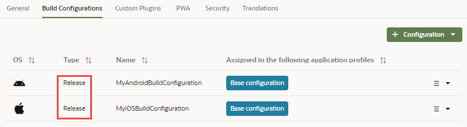
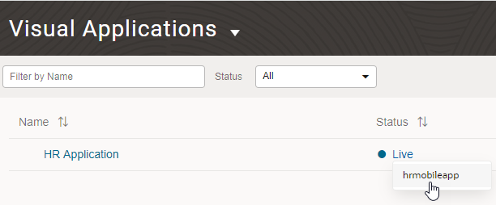
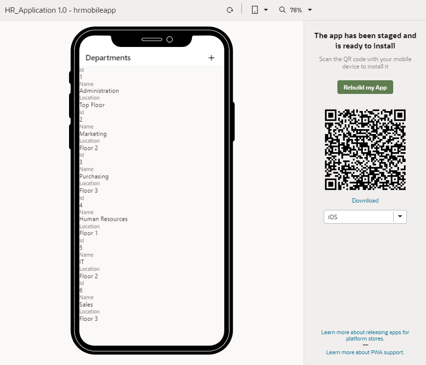

# Publish an Oracle Visual Builder Mobile Application

## Introduction

This tutorial shows you how to publish a mobile application.

### Estimated Lab Time:  10 minutes

### Background

After you successfully test the staged application, you can publish it and make the application live. Users who have the proper credentials can view the live application. You can’t make changes to an application once it's published. Instead, you must create and edit a new version.

## **STEP 1**: Publish the Application

These steps assume that you are already logged in to Oracle Visual Builder and are viewing the HR Application you created.

1.  If necessary, sign in to Oracle Visual Builder. If you're still in the HR Application, click **Oracle Visual Builder** to return to the Visual Applications page.

    

2.  Click **HR Application** to open it.
3.  In the Navigator, click the **Mobile Applications**  tab.
4.  Click the **hrmobileapp** node, click the **Settings** tab, then the **Build Configurations** tab.
5.  Select the Android build configuration, click **Options**  and select **Edit**.
6.  From the **Build Type** drop-down list, select **Release**, then click **Save Configuration**.
7.  Do the same for the iOS build configuration, so that both your build configurations are set for release.

    

8.  Click **Oracle Visual Builder** to return to the Visual Applications page.
9.  Click **Options**  for the HR Application, and select **Publish**.
10.  In the Publish Application dialog box, select **Include data from Stage**, and click **Publish**.

    

    The schema and data from the staging database are copied to the live database. The application is now live.

11.  On the Visual Applications page, click **Live** and select **hrmobileapp**.

    

    The application opens in a browser simulator tab, where the user can view the start page of the mobile application. On the right is the QR code and installation file link for downloading and installing the mobile application on a supported device (Android and iOS).

    

## Acknowledgements
**Author** - Sheryl Manoharan

**Last Updated** - December 2020

## Need Help?
Please submit feedback or ask for help using our [LiveLabs Support Forum](https://community.oracle.com/tech/developers/categories/livelabsdiscussions). Please click the **Log In** button and login using your Oracle Account. Click the **Ask A Question** button to the left to start a *New Discussion* or *Ask a Question*.  Please include your workshop name and lab name.  You can also include screenshots and attach files.  Engage directly with the author of the workshop.

If you do not have an Oracle Account, click [here](https://profile.oracle.com/myprofile/account/create-account.jspx) to create one.
