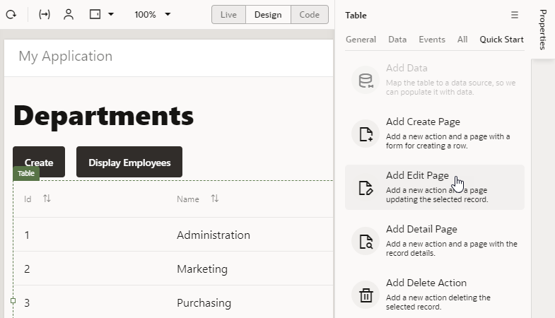
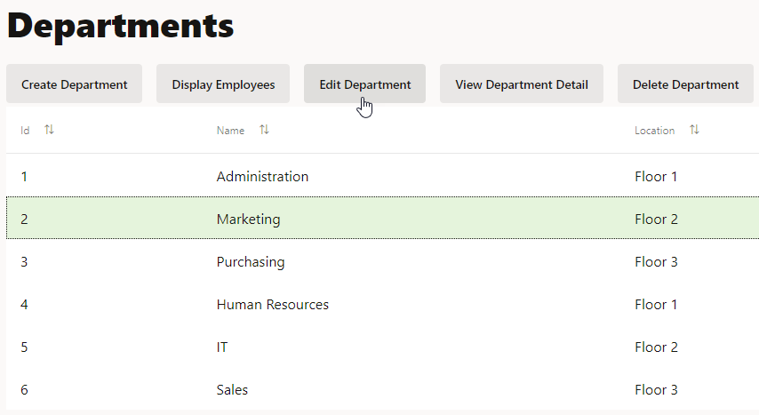
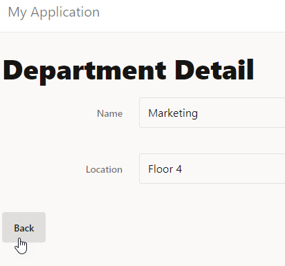
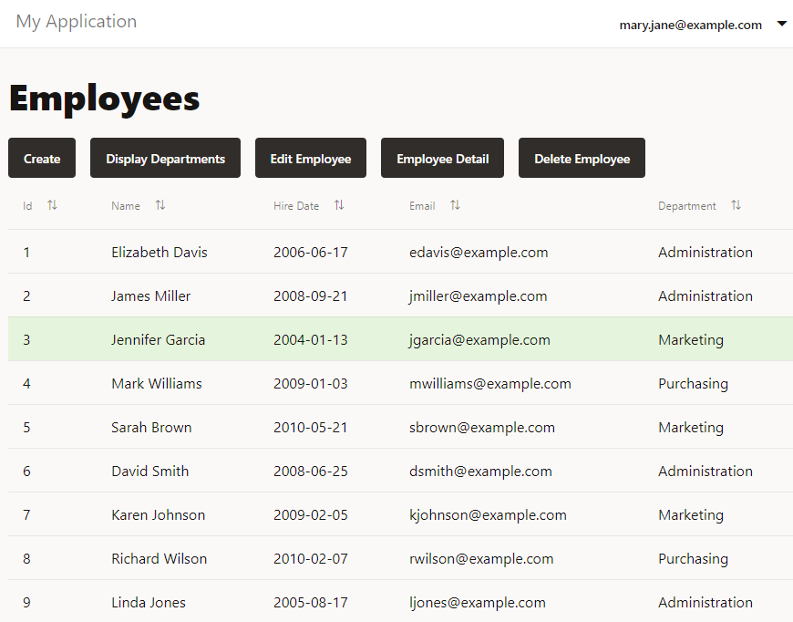

# Add Pages for Working with Data

## Introduction

This lab shows you how to use the Quick Starts provided with Oracle Visual Builder to create pages and buttons that allow you to edit data, view details of data, and delete data in a table.

Estimated Lab Time:  15 minutes

### Background

In Oracle Visual Builder, you can use Quick Starts for table components to create specific kinds of pages to create, edit, and delete business object data. The Quick Starts add buttons and action chains that save you the work of creating these elements yourself.

In a previous tutorial, you used a couple of the table quick starts. In this tutorial, you'll use the rest of them.

## **STEP 1**: Add an Edit Page for the Department Business Object

1.  In the HR Application, click the **Web Applications**  tab, go to the **main-departments** page, then click the **Table** component in the **Page Designer** tab. If necessary, click **Reload page**  to view the departments. Click the **Components** tab to make room to view the page.
2.  Click the **Quick Start** tab in the Property Inspector to display the Quick Start menu, then click **Add Edit Page**.

    

3.  On the Select Read Endpoint page, select the **Department** business object, if necessary, and click **Next**.
4.  On the Select Update Endpoint page, select the **Department** business object, if necessary, and click **Next**.
5.  On the Page Details page, select **location** under Endpoint Structure (**name** is already selected) and click **Finish**.

    An **Edit Department** button is displayed in the toolbar on the main-departments page. The button is inactive.

## **STEP 2**: Add a Detail Page for the Department Business Object

1.  In the Quick Start menu, click **Add Detail Page**.
2.  On the Select Endpoint page, select the **Department** business object, if necessary, and click **Next**.
3.  On the Page Details page, select **name** under Endpoint Structure. Expand the **locationObject** and **items** nodes (**item\[i\]** is expanded automatically) and select **name**, then click **Finish**.  

    A **Department Detail** button is displayed in the toolbar on the main-departments page. The button is inactive.

4.  Click **Live**, select a row, then click the **Department Detail** button to open the main-department-detail page.
5.  Click **Design** to return to Design view.
6.  Click the **Input Text** field for the second **Name** label to open the Input Text Property Inspector. In the **General** tab, change the **Label Hint** value to `Location`.

## **STEP 3**: Add a Delete Button for the Department Business Object

1.  Return to the **main-departments** page. Click the **Quick Start** tab if necessary, and click **Add Delete Action**.
2.  On the Select Endpoint page (the only page of the Quick Start), select the **Department** business object, if necessary, and click **Finish**.

    A **Delete Department** button is displayed in the toolbar on the main-departments page. The button is inactive.

## **STEP 4**: Test Your New Department Pages

1.  Click **Preview**  to test the new pages.

    The application opens in another browser tab. The three buttons you created are inactive.

2.  Select a row. All the buttons are now active.
3.  Click **Edit Department**.

    

4.  On the Edit Department page, change the **Location** field to `Floor 4` and click **Save**. A success message appears briefly, and you are returned to the Departments page.
5.  Select the row again and click **Department Detail** to display the data.

    

6.  Click **Back**.
7.  Click **Create** and specify the name and location of a new department, then click **Save**. A success message appears. The new department is displayed in the table.
8.  Select the new department and click **Delete Department**. A success message appears. The department is no longer displayed.
9.  Close the browser tab.

## **STEP 5**: Add an Edit Page for the Employee Business Object

1.  Go to the **main-employees** page, click the **Table** component in the **Page Designer** tab.
2.  In the Property Inspector, click **Quick Start** to display the Quick Start menu, then click **Add Edit Page**.
3.  On the Select Read Endpoint page, select the **Employee** business object, if necessary, and click **Next**.
4.  On the Select Update Endpoint page, select the **Employee** business object, if necessary, and click **Next**.
5.  On the Page Details page, select **hireDate**, **email**, and **department** under Endpoint Structure (**name** is already selected), and then click **Finish**.

    An **Edit Employee** button is displayed in the toolbar on the main-employees page. The button is inactive.

6.  Click **Live**, select a row, and click the **Edit Employee** button to open the main-edit-employee page.
7.  Click **Design** to go to Design view.
8.  Click within the form on the page but outside of a component (that is, in the **Form Layout** component on the page). In the **General** tab of the Property Inspector, set the **Max Columns** value to **2**. The fields now appear in two columns.

## **STEP 6**: Add Detail and Delete Pages for the Employee Business Object

1.  Go to the **main-employees** page. If necessary, click the table, then click the **Quick Start** tab.
2.  In the Quick Start menu, click **Add Detail Page** tab.
3.  On the Select Endpoint page of the Quick Start, select the **Employee** business object, if necessary, and click **Next**.
4.  On the Page Details page of the Quick Start, select **name**, **hireDate**, and **email** under Endpoint Structure. Expand the **departmentObject** and **items** nodes (**item\[i\]** is expanded automatically) and select **name**, then click **Finish**.

    An **Employee Detail** button is displayed in the toolbar on the main-employees page. The button is inactive.

5.  In the Quick Start menu, click **Add Delete Action**.
6.  On the Select Endpoint page (the only page of the Quick Start), select the **Employee** business object, if necessary, and click **Finish**.

    A **Delete Employee** button is displayed in the toolbar on the main-employees page. The button is inactive.

7.  Click **Live**, select a row, and click the **Employee Detail** button to open the main-employee-detail page.
8.  Click the **Design** button.
9.  Click the **Input Text** component for the second **Name** label to open the Input Text Property Inspector. Change the **Label Hint** value to `Department`.
10.  Click within the form on the page but outside of a component (that is, in the **Form Layout** component on the page). In the **General** tab of the property inspector, set the **Max Columns** value to **2**.

## **STEP 7**: Test Your New Employee Pages

1.  Click **Preview**  to test the pages.

    The application opens in another browser tab, displaying the Departments page.

2.  Click **Display Employees Page**.

    The three buttons you created are inactive.

3.  Select a row. All the buttons are now active.

    

4.  Click the **Edit Employee** button.
5.  On the Edit Employee page, change the **Department** field to `IT` and click **Save**. A success message appears, and you are returned to the Employees page.
6.  Select the row again and click **Employee Detail** to display the data, then click **Back**.
7.  Click **Create** and specify the data for a new employee, then click **Save**. A success message appears, and the new employee is displayed in the table.
8.  Select the new employee and click **Delete Employee**. A success message appears. The employee is no longer displayed.
9.  Close the browser tab.

## Acknowledgements
* **Author** - Sheryl Manoharan, Visual Builder User Assistance
* **Last Updated By** - December 2020

## Need Help?
Submit feedback or ask for help using our [Visual Builder Support Forum](https://cloudcustomerconnect.oracle.com/resources/e610f4723c/summary). Click the **Log In** button and login using your Oracle Account. Click the **Post a new topic** button to the right to start a new discussion, or search for an answer using keywords.  Please include your workshop name and lab name, and include screenshots and attach files if needed.  Here's your chance to engage directly with the author of the workshop!

If you do not have an Oracle Account, click [here](https://profile.oracle.com/myprofile/account/create-account.jspx) to create one.
