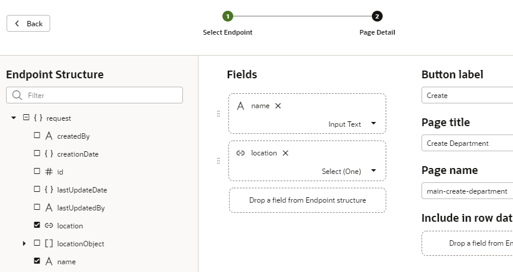

# Create Pages for Business Objects
## Introduction

This lab shows you how to create web pages to display the business objects you created in the previous tutorial, _Create a Web Application in Oracle Visual Builder_, and how to create new instances of the business objects.

Estimated Lab Time:  15 minutes

### Background

In Oracle Visual Builder, you create web pages by dragging and dropping components. You can use a Quick Start to specify how to display your business objects in a table. A table component offers several Quick Starts that add buttons and pages to create, view, edit, and delete data in the business objects.

In this tutorial, you'll create a page to display departments and another page to display employees. You'll add a **Create** button to each page to allow you to create a new instance of the business object. The button is associated with an _event_, and the event sets off an _action chain_, which is a sequence of actions that the application executes. The Quick Starts create complex action chains automatically. In the tutorial after this one, you'll create very simple action chains yourself.

As a refresher, here's the Location, Department, and Employee business objects you created in the previous tutorial.

## **STEP 1**: Use the main-start Page to Display Departments

These steps assume that you are already logged in to Oracle Visual Builder and are viewing the HR Application you created.

1.  Click the **Web Applications**  tab in the Navigator.
2.  Expand the **Flows** and **main** nodes if necessary, then click **main-start**, the page that was automatically created for your web application. You're viewing the Page Designer, with the Components palette visible.

    You may want to click the **Web Applications** tab to close the Web Apps pane and create more room. You may also want to widen your browser window.

3.  In the Components palette, locate the **Heading** component under Common and drag it onto the page.

    

4.  In the Heading Property Inspector, enter `Departments` in the **Text** field. (If you don't see the Property Inspector on the right, click the **Properties** tab.)

    

    After you enter text in the field, click anywhere else in the UI to see the text appear on the page.

5.  In the Components palette, scroll down to **Collection** and drag a **Table** component onto the page below the heading.

    You'll use this table to display three fields from the department business object: the id, name, and location.

6.  Click **Add Data** in the Property Inspector to open the Add Data Quick Start.  

    

7.  On the Locate Data page of the Quick Start, select the **Department** business object, then click **Next**.  

    

8.  On the Bind Data page, under **item\[i\]**, select the **id** and **name** check boxes (in that order).

    

9.  Expand the **locationObject** and **items** nodes (**item\[i\]** is expanded automatically) and select **name** to enable the location name to appear in the table. Click **Next**.

    

10.  On the Define Query page, click **Finish**.  

    A Departments table with three empty columns is displayed on the main-start page. Notice that the second Name column (which maps to the location name field) shows simply as Name.

11.  To make the location name column descriptive, click the **Data** tab. Under **Table Columns**, click the  **Column Detail** arrow next to **Name _(locationObject)_**.  

    

12.  In the **Columns, Header Text** field, change `Name` to `Location`, then click  **Table** to return to the main **Data** tab.  

    

    The main-start page now has a table with three columns: Id, Name, and Location. You won't see any information in your table because we are yet to import data for the Department business object.

## **STEP 2**: Add a Create Page for the Department Business Object

A Create page allows you to populate your table with data by creating new instances of a business object.

1.  Select the table if necessary, click the **Quick Start** tab, then click **Add Create Page**.
2.  On the Select Endpoint page, select the **Department** business object, if necessary, and click **Next**.
3.  On the Page Detail page, under Endpoint Structure, select the **location** check box (the **name** check box is already selected, because name is a required field). These are the only fields the user needs to specify.
4.  Change the **Button label** field to `Create`. Leave the other values set to their defaults. Click **Finish**.

    

    A **Create** button appears in a **Toolbar** component above the table on the main-start page. (Click next to the button to see the Toolbar component.) Click the **Web Applications** tab to see the main-create-department page created in the pages list under **Flows** and **main**.

    

5.  Click the **main-create-department** page in the Navigator to open it in the Page Designer.

    The page created by the Quick Start has a form for you to enter the fields you specified. It also has two buttons.

6.  In the Page Designer toolbar, click **Live** to make the form active. Click **Properties** to make room for the form.

    To indicate that you are in Live view, the **Live** button now has a green background, and a green line appears around the page.

7.  Enter `Administration` in the **Name** field, and select **Floor 1** from the **Location** drop-down list.

    

    Click **Save**. A message appears briefly, and Oracle Visual Builder places you in the main page flow of your application, where you can see that the main-start page points to the main-create-department page. The arrow means that you can navigate from one page to the other.

    

    By convention, a page name has its flow name as a prefix. This simple application uses only the main flow. More complex applications can have more than one flow.

8.  Open the **main-start** page (you can either click the tab above the page canvas or click the page in the Navigator), then click **Reload page** , if necessary, to see the table row you created.

    

9.  Click **Design** to return to Design view.

## **STEP 3**: Add a Page to Display Employees

In this step, you'll create a page to display employees, similar to the one you created for departments.

1.  In the Web Apps tree, under **hrwebapp** and **Flows**, click **+** (Create Page) next to the **main** node.

    

2.  In the Create Page dialog box, enter `employees` in the **Page ID** field after the `main-` prefix and click **Create**. The main-employees page opens in the Page Designer.

    

3.  In the Components palette, locate the **Heading** component under Common and drag it onto the page.
4.  Click the **Properties** tab and in the Heading Property Inspector, enter `Employees` in the **Text** field.
5.  In the Components palette, scroll down to Collection and drag a **Table** component onto the page.
6.  Click **Add Data**.
7.  On the Locate Data page, select the **Employee** business object and click **Next**.
8.  On the Bind Data page, select the **id**, **name**, **hireDate**, and **email** check boxes under **item\[i\]**. The columns appear in the order selected; if you want to change the order, drag a **Handle**  to reorder the columns as desired.

    

9.  Expand the **departmentObject** and **items** nodes (**item\[i\]** is expanded automatically) and select **name**, then click **Next**.

    

10.  On the Define Query page, click **Finish**.

    An empty Employees table is displayed.

11.  To make the second Name column descriptive, click the **Data** tab. Under **Table Columns**, click the  **Column Detail** arrow next to **Name _(departmentObject)_**.

    

12.  In **Columns, Header Text** field, change `Name` to `Department`, then click  **Table** to return to the main **Data** tab.

## **STEP 4**: Add a Create Page for the Employee Business Object

1.  Click the **Quick Start** tab, then click **Add Create Page**.
2.  On the Select Endpoint page, select the **Employee** business object, if necessary, and click **Next**.
3.  On the Page Detail page, under Endpoint Structure, select the **hireDate**, **email**, and **department** check boxes (**name** is already selected, because it's a required field).
4.  Change the **Button label** field to `Create`. Leave the other values set to their defaults. Click **Finish**.

    

    A **Create** button appears above the table, and the main-create-employee page appears in the pages list.

5.  In the pages list, click the **main-create-employee** page to open it in the Page Designer.
6.  Click within the form on the page but outside of a component (that is, in the **Form Layout** component on the page). In the **General** tab of the Property Inspector, set the **Max Columns** value to **2**. The fields now appear in two columns.
7.  Click **Live** to make the form active. To hide the Property Inspector and make more room, click **Properties**. Enter `Leslie Smith` in the **Name** field. Select today's date from the **Hire Date** calendar, and enter `lsmith@example.com` in the **Email** field. Select `Administration` (the only choice) from the **Department** drop-down list. (You can use other data if you wish, except for the department, because you have only one department.) Click **Save**.  

    Oracle Visual Builder briefly displays a message and then places you in the main page flow of your application. As with the departments pages, you can navigate from the main-employees page to the main-create-employee page. There is no connection between the Employee page flow and the Department page flow, however.

    

8.  Return to the main-employees page. (You can double-click the page tile in the page flow, in addition to using other navigation mechanisms.) If necessary, click **Reload page**  to display the table with the row you created.
9.  Click **Code** to view HTML code for the main-employees page. You can see the code for the heading, the toolbar, and the table within `div` elements. You could edit this code to create a customized user interface. The components and classes all begin with `oj-`, indicating that they are Oracle JavaScript Extension Toolkit (JET) components.  

    

10.  Click **Design** to return to the main-employees page, then click **Structure** to view the page's component structure.

    

11.  Click **Structure** again to close the structure view.

## **STEP 5**: Change the Name of the main-start Page

It makes sense at this point to change the name of the main-start page to main-departments, to match the name of the main-employees page.

1.  In the Web Apps pane of the Navigator, right-click the **main-start** page and select **Rename**.

    

2.  In the Rename dialog box, replace `start` with `departments` in the **ID** field and click **Rename**. Click the **main** node. The Page Flow page shows the renamed page along with the others.

    

3.  Double-click **main-departments** to go to that page again.
4.  Although you have changed its name, the main-departments page will continue to be the page where your application starts when you run it. To find out why, click the **Source View**  tab and expand the **webApps**, **hrwebapp**, **flows**, and **main** nodes. Then click **main-flow.json**.

    

    You can see that the `defaultPage` property has been set to the value `main-departments`, making it the starting page for the web application flow. (If we'd looked before, it would have been set to `main-start`.)

## Acknowledgements
* **Author** - Sheryl Manoharan, Visual Builder User Assistance
* **Last Updated By** - December 2020

## Need Help?
Submit feedback or ask for help using our [Visual Builder Support Forum](https://cloudcustomerconnect.oracle.com/resources/e610f4723c/summary). Click the **Log In** button and login using your Oracle Account. Click the **Post a new topic** button to the right to start a new discussion, or search for an answer using keywords.  Please include your workshop name and lab name, and include screenshots and attach files if needed.  Here's your chance to engage directly with the author of the workshop!

If you do not have an Oracle Account, click [here](https://profile.oracle.com/myprofile/account/create-account.jspx) to create one.
