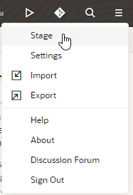
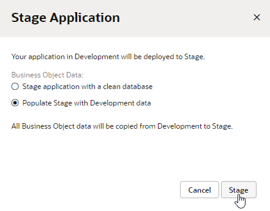
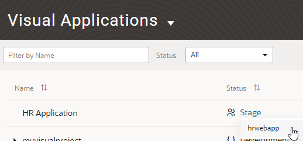
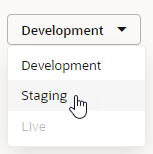
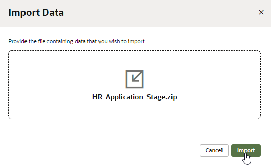
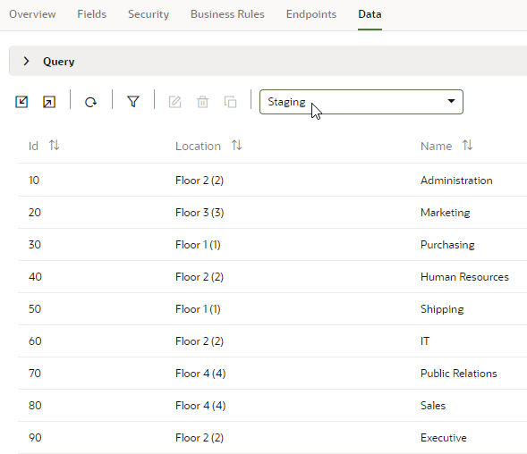
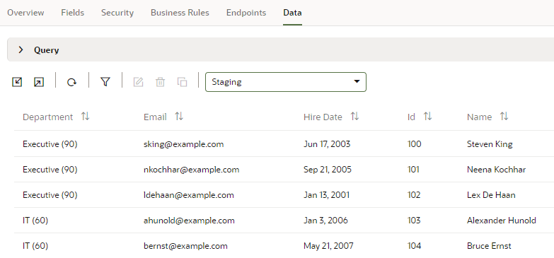
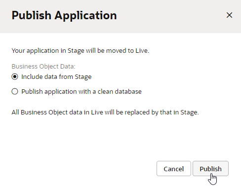
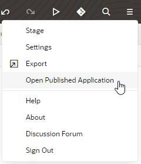

# Stage and Publish an Oracle Visual Builder Web Application

## Introduction

This tutorial shows you how to stage and publish a web application.

Estimated Lab Time:  10 minutes

### Background

Once you have created an Oracle Visual Builder application, you can stage it to allow team members to test it thoroughly. After testing is complete, you can publish the application and make it available to users.

Oracle Visual Builder provides different databases for the development, staging, and live phases of an application. You can use an empty database for the staging or live phase, or you can transfer data from one to another, or you can import specific data for each.

This tutorial shows you how to stage, publish, and access those apps within the Designer. You can also perform these operations from the application's Options menu on the Visual Applications page. 

## **STEP 1**: Stage the Application

Stage the application so that other users can test its behavior.

1.  If necessary, log in to Oracle Visual Builder and access the HR Application you created.

2.  Click the **Menu**  icon in the header and select **Stage**.

    

3.  In the Stage Application dialog box, select the **Populate Stage with Development data** option and click **Stage**.

    

    The application is staged, and its status as shown in the header changes from `DEV` to `STAGE`.

4.  From the header **Menu** , click **Open Staged Application**.

    

    The staged application opens in a new browser tab. The tables are populated with the data from Development.

5.  Make a note of the URL of the staged application. You can share this URL with members of your group so that they can test it.

    When you have finished using the application, close the browser tab to return to the  application in the Designer.

## **STEP 2**: Import Data Into the Application (Optional)

You can import data for the Department and Employee business objects from a zip file. You can skip directly to the publishing step if you wish.

1.  Click [this link](https://objectstorage.us-ashburn-1.oraclecloud.com/p/kcwuO0EddkCHQQnigbOXMoxJDD4xNLT6azZzK_dRbejWKG5XHRVra7DUO6K2dF2V/n/c4u04/b/solutions-library/o/HR_Application_Stage.zip) and save the `HR_Application_Stage.zip` file. The zip file contains CSV files of the Department and Employee business objects of the HR Application schema, with more records and data.
3.  In the Navigator, click the **Business Objects**  tab, then click **Menu**  and select **Data Manager**.

    

4.  From the drop-down list in the upper right corner, select **Staging** to import the data into the staging database.  

    

5.  Click **Import from File**.
6.  In the Import Data dialog box, click the import box, select `HR_Application_Stage.zip`, and click **Import**. When the import succeeds, click **Close**.

    

7.  In the Business Objects pane, click **Department**.
8.  Click the **Data** tab if necessary, then select **Staging** from the drop-down list to view the new departments.

    

9.  Click **Employee**, then click the **Data** tab and select **Staging** to view the new employees.

    

## **STEP 3**: Publish the Application

After you have successfully tested the staged application, you can publish it and make the application live. The live application is visible to users with proper credentials.

1.  Click the **Menu**  icon in the header and select **Publish**.
2.  In the Publish Application dialog box, select the **Include data from Stage** option and click **Publish**.  

    

    The application is now live. Notice the status change in the header next to the application name.

3.  From the header **Menu** , click **Open Published Application**.

    

    The application opens in a new browser tab. The schema and the data from the staging database are copied to the live database.

4.  Make a note of the URL of the application. You can share this URL with public users.

    When you've finished using the application, close the browser tab.

5.  If you want to, click the user menu in the top-right corner and select **Sign Out** from the menu. After you've published an application, you will no longer be able to make changes to it. Instead, create a new version of it and edit that.

## Acknowledgements
* **Author** - Sheryl Manoharan, Visual Builder User Assistance
* **Last Updated By** - February 2021
