# Create Pages for a Web Application

## Introduction

This lab shows you how to create web pages to display the business objects you created in the previous lab.

Estimated Lab Time: 15 minutes

### Background

In the previous lab, you created the Location, Department, and Employee business objects. In this lab, you'll create web pages to display the data from these business objects within your application. You'll also add a **Create** button to each web page to let your users add new records (in other words, create new instances of the business object in the database).

## **TASK 1:** Use the main-start Page to Display Departments

Create a table using a Table component to display your departments on the main-start page. The Table component is useful when you want to show lots of data in columns.

1.  Click **Web Applications**  in the navigator.
2.  If necessary, expand the **Flows** and **main** nodes, then click **main-start**, the page that was automatically created as the default home page for your web application. (You can also open the page by clicking the main-start tab just below the header.) You're viewing the Page Designer.

    You may want to click the **Web Applications** tab to close the navigator pane and expand your work area. You can also widen your browser window.

3.  Let's give this main-start page a title. From the **Components** palette, locate the **Heading** component under Common and drag it onto the page.

    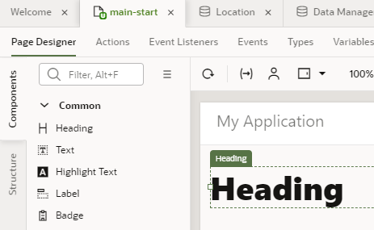

4.  Click **Properties** to open the Heading's properties pane, then enter `Departments` in the **Text** field.

    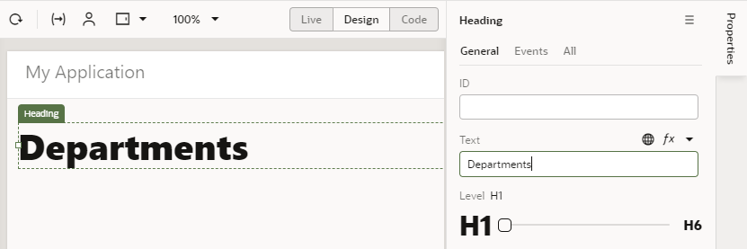

5.  In the Components palette, scroll down to Collection and drag a **Table** component onto the page below the heading. A table with some sample data is added to the page. We'll use this table to display three columns that map to the department business object's id, name, and location fields.
6.  Select the table if necessary, then click **Add Data** in the Properties pane to open the Add Data Quick Start.

    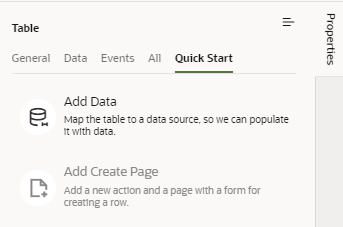

    Quick Starts walk you through complex processes and help build the basics of your application quickly; in this step, we'll use the Add Data Quick Start to connect your table to the Department business object's data. The Quick Start wizard will prompt you to select your data source, select the fields from the business object that you want to show in your table, and filter data (which we won't do here).

7.  On the Quick Start's Locate Data page, select the **Department** business object, then click **Next**.  

    

8.  On the Bind Data page, under item\[i\], select **id** and **name** (in that order). These two fields will show as columns in your Departments table.  

    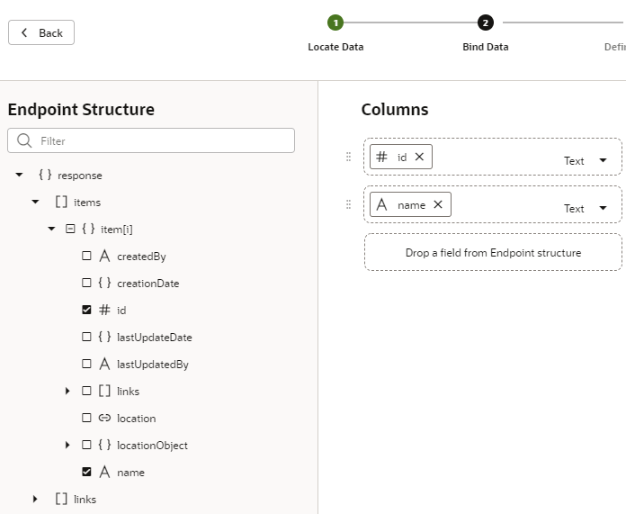

9.  Expand the **locationObject** and **items** nodes (expand **item\[i\]** if it isn't already expanded) and select **name** to enable the location name to appear as another column in the table. Because we created a reference from the Department business object to the Location business object in the previous tutorial, the location's name field is now available to us through the locationObject accessor, which lets us traverse relationships between the two objects. Click **Next**.

    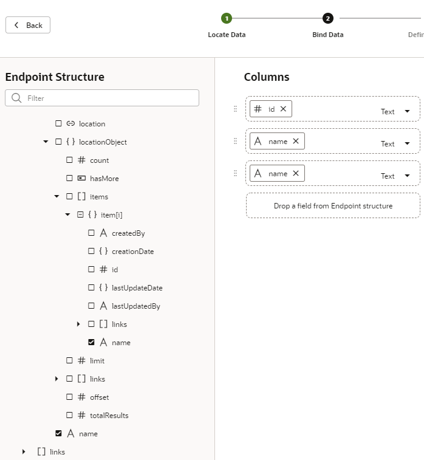

10.  On the Define Query page, click **Finish**.  

    A Departments table with three empty columns is displayed on the main-start page. Notice that the second Name column (which maps to the location name field) shows simply as Name because that's what we set for the Display Field when we created the Location reference.

    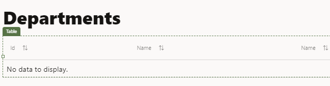

11.  To make the location name column descriptive, click the **Data** tab in the Properties pane. Under **Table Columns**, click  **Column Detail** next to Name (locationObject). You won't see the icon until you hover the mouse next to the field.  

    

12.  In the **Columns, Header Text** field, change `Name` to `Location`, then click  **Table** to return to the main **Data** tab.  

    

The main-start page now has a table with three columns: Id, Name, and Location. You won't see any records in your table because we are yet to import data for the Department business object.

## **TASK 2:** Add a Create Page for the Department Business Object

Now that we have a way to show departments, we'll add a Create page that lets users create new departments. With the help of the Add Create Page Quick Start, we'll connect to our data source, the Department business object, and select the fields that we want the user to provide values for.

1.  With the Departments table on the main-start page selected, click **Quick Start**, then click **Add Create Page**.
2.  On the Select Endpoint page, select the **Department** business object (if necessary) and click **Next**.
3.  On the Page Detail page, select **location** (**name** is already selected because it's a required field). Name and Location are the only fields the user needs to specify to create a department.
4.  Leave the Button label and other fields set to their default values. Click **Finish**.

    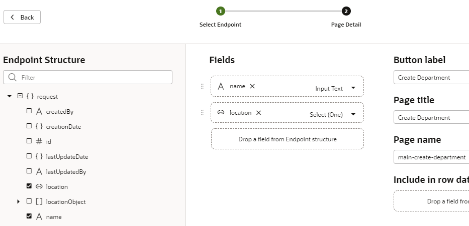

    A **Create Department** button appears in a Toolbar component above the table on the main-start page. (Click next to the button to see the Toolbar component.) Click the **Web Applications** tab to see the main-create-department page created in the pages list under Flows and main.

    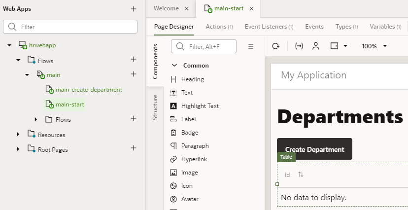

5.  Let's quickly test whether we can create departments. In the Web App's tree, click the **main-create-department** page to open it in the Page Designer.

    The page has a form for you to enter the fields you specified. It also has two buttons: Cancel and Save.

6.  In the Page Designer toolbar, click **Live** to make the form active. (Click **Properties** if you need to make room for the form.)

    To indicate that you are in Live view, the **Live** button now has a green background, and a green line appears around the page.

7.  Enter `Administration` in the **Name** field, and select **Floor 1** from the **Location** list.

    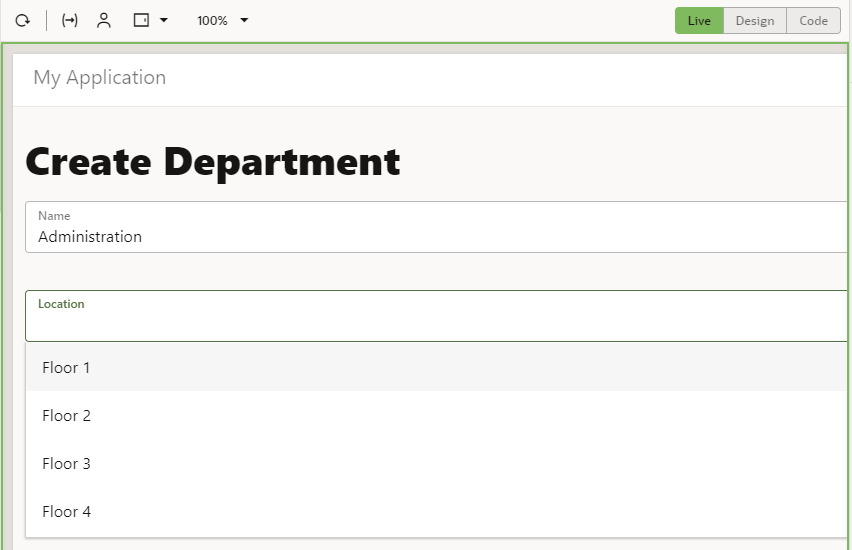

    Click **Save**. A message appears briefly, and you are taken to the application's main page flow, where you see that the main-start page points to the main-create-department page. The arrow means that you can navigate from one page to the other.

    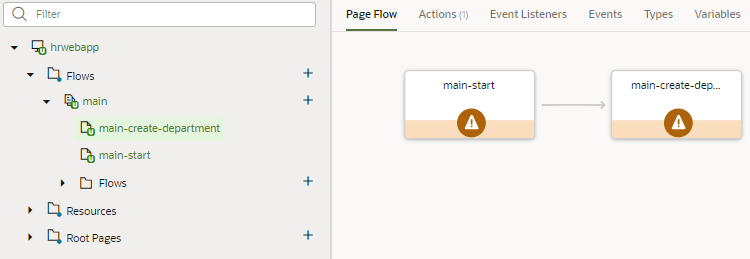

    By convention, a page name has its flow name as a prefix. This simple application uses only the main flow. More complex applications can have more than one flow.

    **Tip:** A page that's marked with a warning triangle usually indicates that the page's code has issues that you might want to review. For example, the warning for the main-start page here relates to a translation issue, which you can safely ignore. If you want, click **Audits** at the bottom of the screen to review and resolve issues in the Audits pane. You can also select messages that you don't want to be flagged and disable reporting for those messages in Code view. Pages without any issues appear with a green check mark in Page Flow.

8.  Open the **main-start** page (you can either click the main-start tab just below the header or click the page in the Web Apps pane), then click **Reload page**  to see the table row you created.

    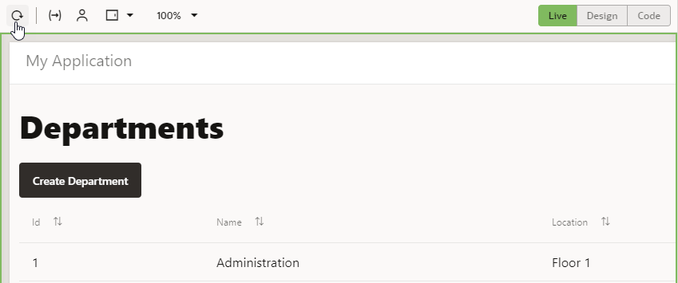

9.  Click **Design** to return to Design view.

## **TASK 3:** Add a Page to Display Employees

In this step, you'll create a page to display employees, similar to the one you created for departments.

1.  In the Web Apps tree, under **hrwebapp** and **Flows**, click **+** (Create Page) next to the **main** node.

    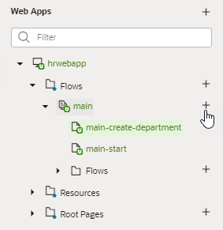

2.  In the Create Page dialog box, enter `employees` in the **Page ID** field after the `main-` prefix and click **Create**. The main-employees page opens in the Page Designer.

    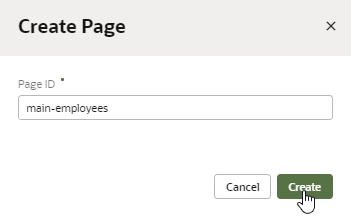

3.  In the Components palette, locate the **Heading** component under Common and drag it onto the page.
4.  Click **Properties**, then in the heading's property pane, enter `Employees` in the **Text** field.
5.  In the Components palette, scroll down to Collection and drag a **Table** component onto the page.
6.  Click **Add Data**.
7.  On the Locate Data page, select the **Employee** business object and click **Next**.
8.  On the Bind Data page, select **id**, **name**, **hireDate**, and **email** under item\[i\]. The columns appear in the order selected; if you want to change the order, drag a **Handle**  icon to reorder the columns as desired.

    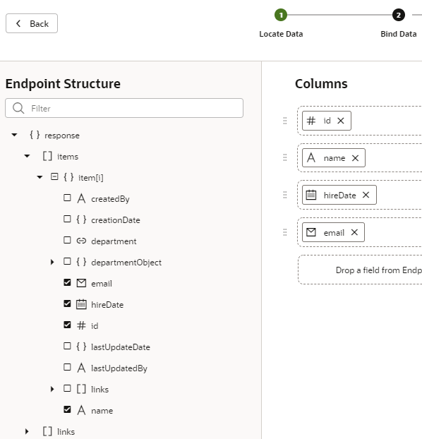

9.  Expand the **departmentObject** and **items** nodes (expand **item\[i\]** if it isn't already expanded) and select **name**, then click **Next**.

    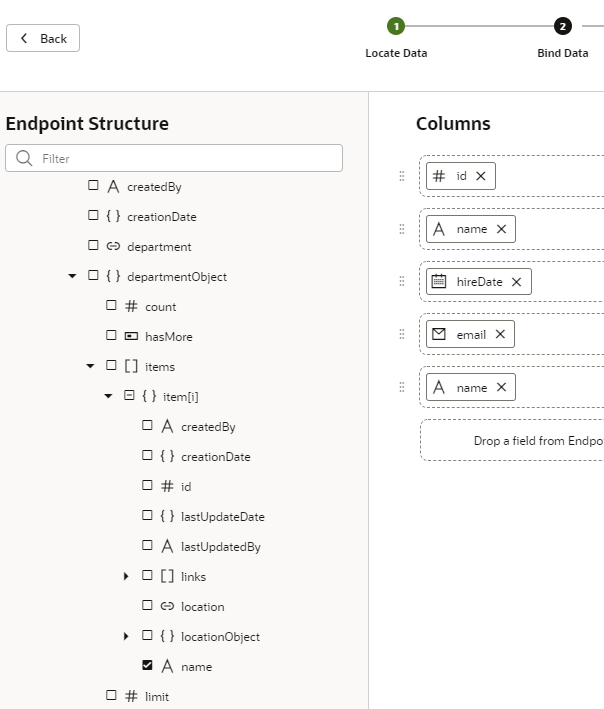

10.  On the Define Query page, click **Finish**.

    An empty Employees table is displayed.

11.  To make the second Name column (which refers to the Department name field) descriptive, click **Data** in the Table's properties pane. Under **Table Columns**, click  **Column Detail** next to Name  (departmentObject).

    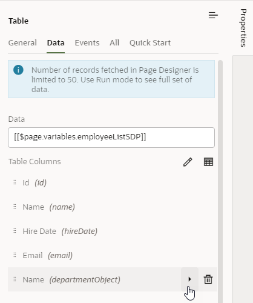

12.  In the **Columns, Header Text** field, change `Name` to `Department`, then click  **Table** to return to the main **Data** tab.

    The main-employees page now has a table with five columns: Id, Name, Hire Date, Email, and Department. You won't see any information in the table until we import data for the Employee business object in a later tutorial.

    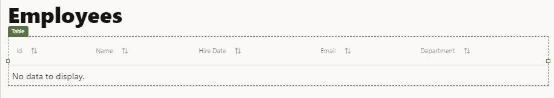

## **TASK 4:** Add a Create Page for the Employee Business Object

Add a Create page that lets your users create new employees.

1.  Click **Quick Start**, then click **Add Create Page**.
2.  On the Select Endpoint page, select the **Employee** business object (if necessary) and click **Next**.
3.  On the Page Detail page, select **hireDate**, **email**, and **department**, in that order (**name** is already selected because it's a required field).
4.  Leave the Button label field and other fields set to their default values. Click **Finish**.

    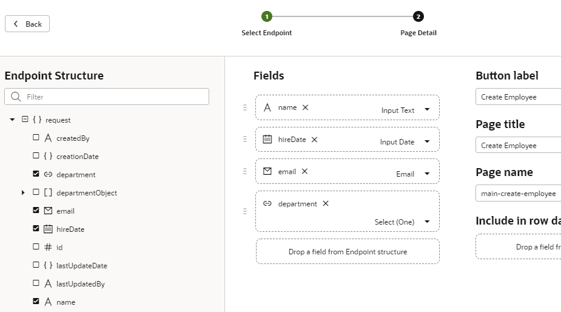

    A **Create Employee** button appears above the table, and the main-create-employee page appears in the pages list.

5.  In the pages list, click the **main-create-employee** page to open it in the Page Designer.
6.  Click within the form on the page but outside of a component (that is, in the Form Layout component on the page). In the **General** tab of the Form Layout's properties, set the **Max Columns** value to **2**.

    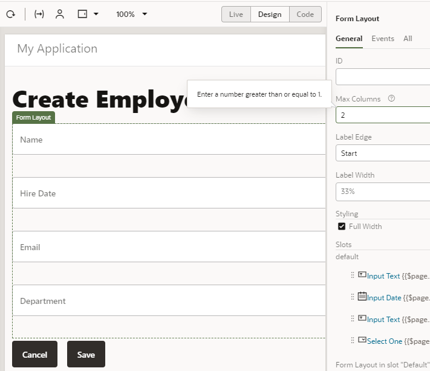

    The fields now appear in two columns.

7.  Click **Live** to make the form active. (To make more room, click **Properties**.) Enter `Leslie Smith` in the **Name** field. Select today's date from the **Hire Date** calendar, and enter `lsmith@example.com` in the **Email** field. Select `Administration` (the only choice) from the **Department** list. (You can use other data if you wish, except for Department, because you have only one department.) Click **Save**.  

    VB Studio briefly displays a message and then places you in the main page flow of your application. As with the departments pages, you can navigate from the main-employees page to the main-create-employee page. But there is no connection between the Employee page flow and the Department page flow.

    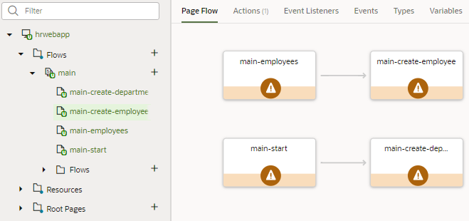

8.  Return to the main-employees page. (You can double-click the page in the page flow, in addition to using other navigation mechanisms.) Click **Reload page**  to display the row you created.
9.  Click **Code** (next to **Design** in the Page Designer toolbar) to view the HTML code for the main-employees page. You can see the code for the heading, the toolbar, and the table within `div` elements. You could edit this code to create a customized user interface. The components and classes all begin with `oj-`, indicating that they are Oracle JavaScript Extension Toolkit (JET) components.  

    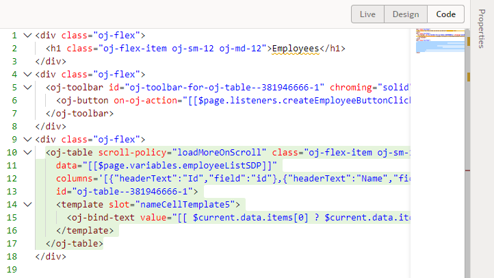

10.  Click **Design** to return to the main-employees page, then click **Structure** to view the component structure on the page.

    

11.  Click **Structure** again.

## **TASK 5:** Change the Name of the main-start Page

It makes sense at this point to change the name of the main-start page to main-departments, to match the name of the main-employees page.

1.  In the Web Apps pane, right-click the **main-start** page and select **Rename**.

    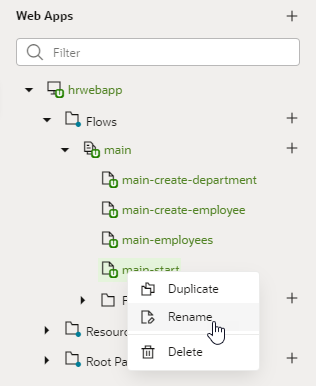

2.  In the Rename dialog box, replace `start` with `departments` in the **ID** field and click **Rename**.
3.  Click **main**. The Page Flow shows the renamed page along with the others.

    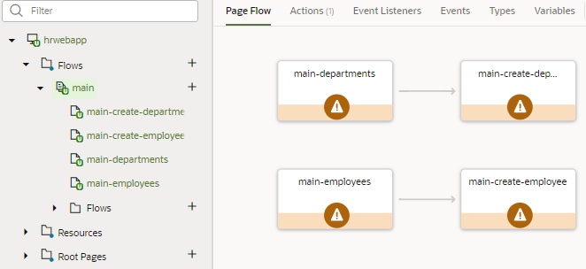

4.  Double-click **main-departments** to go to that page again.
5.  Although you have changed its name, the main-departments page will continue to be the page where your application starts when you run it. To find out why, click **Source View**  in the navigator and expand the **webApps**, **hrwebapp**, **flows**, and **main** nodes. Then click **main-flow.json** to open it.

    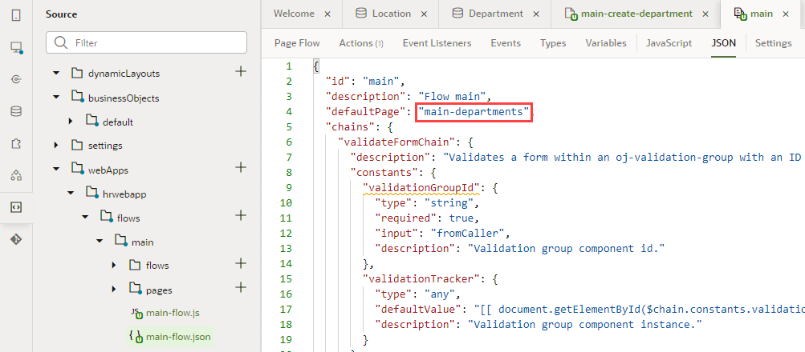

    You can see that the `defaultPage` property has been set to the value `main-departments`, making it the starting page for the web application flow. (If we'd looked before, it would have been set to `main-start`.)

## Learn More
* [Quick Starts: Add Data to a Table or List](https://docs-uat.us.oracle.com/en/cloud/paas/visual-builder/visualbuilder-building-applications/develop-applications.html#GUID-B28F1DC5-711F-4BA0-9B44-3DC0A1EA3E12)
* [Quick Starts: Add a Create Page](https://docs-uat.us.oracle.com/en/cloud/paas/visual-builder/visualbuilder-building-applications/develop-applications.html#GUID-41301557-B15E-46C5-A532-7DF5E3F127C9)

## Acknowledgements
* **Author** - Sheryl Manoharan, VB Studio User Assistance
* **Last Updated By/Date** - August 2021
