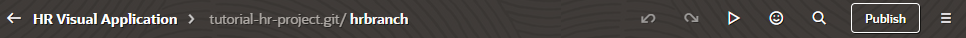
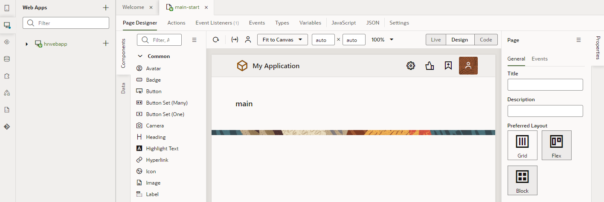
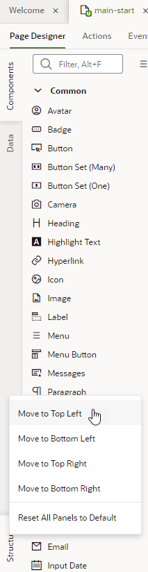
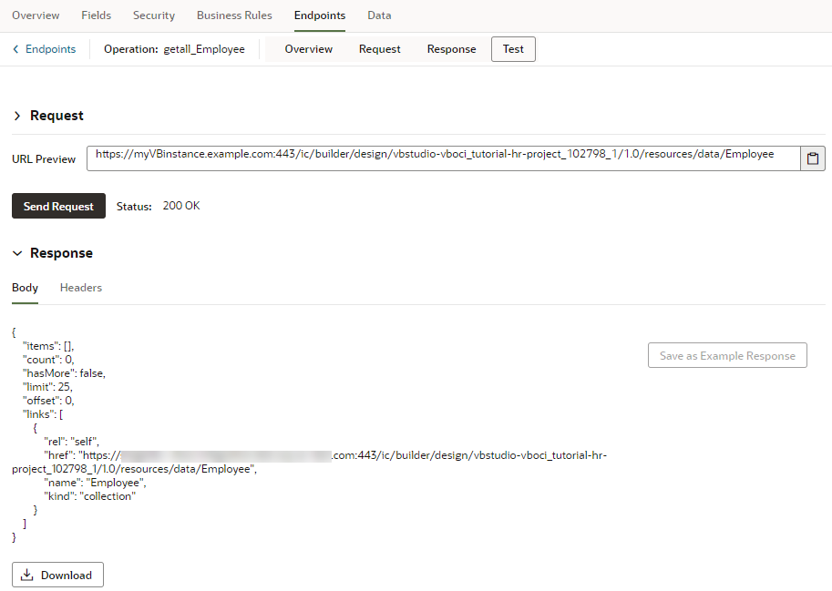

# Create a Web App in a Visual Application

## Introduction

This lab shows you how to create a web app in your visual application project and add business objects to store your web app's data.

Estimated Time: 15 minutes

### About this Lab
Web and mobile applications in VB Studio take shape within the _Designer_, a rich graphical user interface that lets you design and develop your application by dragging and dropping components on a page. Each component depends on a _business object_ for its data. A business object is just a resource—like a purchase order or invoice—that has fields to hold your application's data. It is similar to a database table, as it provides the structure for your data; in fact, business objects are stored in a database. Your application accesses the data in these business objects through REST endpoints that VB Studio generates for you.

In this lab, you'll create the Employee, Department, and Location business objects for the HR web application. Each business object has its own set of fields as shown here:

Once you have your business objects, you'll use them to build the HR web application in which every employee belongs to a department, and every department has a location.

**Note:** Although this lab shows how to build an application using a business object, you can also build applications based on REST services or on databases like Oracle Database Cloud Service. The basic principles of creating an application are the same, no matter what form your data takes.

### Objectives
In this lab, you will:
* Create a web app in your visual application
* Create reusable business objects to store data
* Create a diagram to visualize relationships between your business objects

### Prerequisites

This lab assumes you have:
* A Chrome browser
* All previous labs successfully completed

## Task 1: Create a web app

Add your first web app to the HR visual application that you've just created. A visual application is a container for all your web and mobile applications. In this task, you add a single web app to your visual application, but you can have more than one, even both web and mobile apps in the same visual application.

1.  On the Project Home page, click **HR Visual Application** under Workspaces.

    The visual application opens on the Designer's Welcome page.

    

    The Welcome page contains a set of tiles in three groups: **Connect to Data**, **Create Apps**, and **Add Artifacts**.

    On the far left are icons representing Mobile Applications, Web Applications, Services, Business Objects, Components, Processes, Source, and Git.

    Take note of the header elements:

    

    On the left is the name of your current workspace, **HR Visual Application**; next to it is the project's Git repository (**tutorial-hr-project.git**) and the branch currently associated with your workspace (**hrbranch**). Click each option to see other actions that you can perform from here. Clicking  will take you back to the Project Home page.

    Elements on the right let you perform various other actions. For example, you can undo your most recent change, redo a change after clicking Undo, or search the Git repository for a file. This workshop primarily demonstrates the options to preview your app and publish changes.

2.  We want to create a web application, so under **Create Apps**, let's click the **Web Apps** tile.

    The Web Apps pane opens in the navigator.

    

3.  Click **\+ Web Application** (or click the **+** sign at the top of the pane).
4.  In the Create Web Application window, enter `hrwebapp` as the **Application Name**. (You can specify uppercase as well as lowercase characters in the application name, but the name is converted to lowercase.) Leave the **Navigation Style** set to the default, **None**, and click **Create**.

    The application opens on the `main-start` page, which is the default name of your application's  home page, created automatically for you. By convention, a page name has its flow name as a prefix. This simple application uses only the `main` flow. More complex applications can have more than one flow. (You can ignore the **This dot says that you have made some changes** dialog that appears in the header for now; we'll explore Git changes in a later lab.)

    

    What you see under the `main-start` tab is your application's main work area. Just under `main-start` are several other tabs: Page Designer, Actions, Event Listeners, and so on. Each tab provides editors to help you examine and modify artifacts used in the page. By default, the page opens in the Page Designer, showing the Components palette, the Data palette, and the Structure view on the left edge of the work area. To design your pages, you'll drag components from the Components palette to the canvas. Once you add components, the Structure view provides a structural view of the components on the canvas.

    On the far right is the Properties pane, which lets you view or edit a component's properties. When the entire page is selected (as it is now), the Properties pane shows the Page view, where you can choose a preferred page layout. Click **Properties** (the vertical tab located along the right-most edge of your browser) to hide the Properties pane and expand your work area.

    You can also move different panes to customize your work area. For example, right-click **Structure** at the bottom of your work area, then select **Move to Top Left** to move the Structure view right under **Components** and **Data**.

    

    Finally, expand the **hrwebapp** and **main** nodes in the Web Apps pane to get a tree view of your web application.

## Task 2: Create a Location business object and import data

Let's create your first business object and add data to it by importing a CSV file. Every business object needs data associated with it, and there are many ways to do that, as you'll see. 

1.  Click **Business Objects**  in the navigator.
2.  Click **\+ Business Object**.
3.  In the New Business Object dialog box, enter `Location` in the **Label** field. `Location` is also filled in automatically as the Name value. Click **Create**.
4.  Click **Fields** for the new Location business object. Every business object you create has five default fields: an id, plus fields that provide information on who created and updated the object and when.

    

5.  Click **\+** and select **Field** to add a field specific to this business object. This is a very simple business object, so we'll only add one new field.
6.  In the pop-up box, enter:

    -   **Label**: `Name`
    -   **Field Name**: `name` (automatically populated)
    -   **Type**: **String**  (selected by default)

    Click **Create Field**.

    

7.  In the **Name** field's properties, select **Required** under Constraints.

    

    A check mark is displayed in the Required column for the Name field.

8.  Click [this link](https://objectstorage.us-ashburn-1.oraclecloud.com/p/CSv7IOyvydHG3smC6R5EGtI3gc1vA3t-68MnKgq99ivKAbwNf8BVnXVQ2V3H2ZnM/n/c4u04/b/livelabsfiles/o/solutions-library/Location.csv) to download the `Location.csv` file to your file system. This file contains four locations and provides the data for the Location business object.
9.  In the Business Objects pane, click **Menu**  and select **Data Manager**. The Data Manager is what you use to import data from a variety of sources.

    

10.  Click **Import from File**.

    

11.  In the Import Data dialog box, click the upload box, browse to select `Location.csv`, and click **Import**. When the import succeeds, click **Close**.  

    

12.  In the Business Objects pane, click **Location**, then **Data** to view the locations that were added.  

    

    In the next task, we'll associate these locations with the departments that are located on these floors.

## Task 3: Create a Department business object

Create the Department business object, which will have fields to show a department's name and location. In this task, you'll set up the department's Location field to pull in data from the Location business object you created in the previous task, but you won't actually add data to the Department business object just yet.

1.  In the Business Objects pane, click the **+** sign, then select **Business Object**.

    

2.  In the New Business Object dialog box, enter `Department` in the **Label** field and click **Create**. `Department` is also filled in automatically as the Name value.
3.  Click **Fields**, then **\+** and select **Field**.
4.  In the pop-up box, enter:

    -   **Label**: `Name`
    -   **Field Name**: `name` (automatically populated)
    -   **Type**: **String**  (selected by default)

    Click **Create Field**.

5.  In the **Name** field's properties, select **Required** under Constraints.

    A check mark is displayed in the Required column for the Name field.

6.  Click **\+** and select **Field** again. In the pop-up box, enter or select:

    -   **Label**: `Location`
    -   **Field Name**: `location` (automatically populated)
    -   **Type**: **Reference** 
    -   **Referenced Business Object**: `Location`
    -   **Display Field**: `Name` (automatically populated)

    Click **Create Field**.

    

    A Reference Type field refers to the key (the Id field) of another business object and links two business objects together. When you create a department now, you'll now be able to select its Location (one of the floors). The Display Field indicates that the referenced object's Name field will be displayed instead of the Id.

## Task 4: Create an Employee business object

In this task, you'll create the last business object we need, the Employee object, containing  employee names and identifying data. In this case, the Employee has a Reference type field to refer to the Department business object.

1.  In the Business Objects pane, click the **+** sign and select **Business Object**.
2.  In the New Business Object dialog box, enter `Employee` in the **Label** field and click **Create**. `Employee` is also filled in automatically as the Name value.
3.  Click **Fields**, then **\+** and select **Field**.
4.  In the pop-up box, enter:

    -   **Label**: `Name`
    -   **Field Name**: `name` (automatically populated)
    -   **Type**: **String**  (selected by default)

    Click **Create Field**.

5.  In the **Name** field's properties, select **Required** under Constraints.
6.  Click **\+** and select **Field** again, then enter or select:

    -   **Label**: `Department`
    -   **Field Name**: `department` (automatically populated)
    -   **Type**: **Reference** 
    -   **Referenced Business Object**: `Department`
    -   **Display Field**: `Name` (automatically populated)

    Click **Create Field**.

7.  Click **\+** and select **Field** again, then enter or select:

    -   **Label**: `Hire Date`
    -   **Field Name**: `hireDate` (automatically populated)
    -   **Type**: **Date** 

    Click **Create Field**.

8.  Click **\+** and select **Field** again, then enter or select:

    -   **Label**: `Email`
    -   **Field Name**: `email` (automatically populated)
    -   **Type**: **Email** 

    Click **Create Field**.

9.  Now that we've created the fields we need, click **Endpoints** to view the Resource APIs and REST endpoints created for the Employee business object. Because Employee refers to Department, you'll see endpoints for both objects if you expand the **departmentObject** node.

    

10.  Click the **Get Many** endpoint under Employee (**getall\_Employee**) to see an endpoint viewer, where you can perform operations on the endpoint. For example, you can use the Test tab to send a request and view the response.

    

    Click  **Endpoints** to return to the main Endpoints page.

## Task 5: Create a business object diagram

Now that you have your business objects, create a diagram that visualizes the business objects and their relationships.

1.  In the Business Objects pane, click **Diagrams**, then **\+ Business Object Diagram**.

    

2.  In the Create Business Object Diagram dialog box, enter `HRDiagram` in the **Diagram name** field and click **Create**.

    An empty diagram page opens.

3.  In the Properties pane, click **Select All** to see the three business objects you created and their relationships.

    

    The diagram looks just like the graphic in the About this Lab section.

    You may **proceed to the next lab**.

## Acknowledgements
* **Author** - Sheryl Manoharan, VB Studio User Assistance, November 2021
* **Last Updated By/Date** - Sheryl Manoharan, May 2022
