# Create a Project for a New Visual Application

## Introduction

This lab walks you through the steps to create a project for a new visual application, which serves as the foundation to build a web application in Oracle Visual Builder Studio.

Estimated Lab Time: 15 minutes

### Background

Visual Builder Studio (VB Studio) is a development platform that helps you plan and manage your application's lifecycle, from design and build right through test and deploy. It lets you create engaging web and mobile applications using a _visual application_ template, which provides everything you need to develop a visual web or mobile application.

In this workshop, you'll build a simple Human Resources visual application, using a _project_ as a starting point. Every project in VB Studio is devoted to a discrete software effort, and the project you create in this lab is exclusive to the HR visual application. The project brings together all the tools you need to create your application, such as a Git repository to store your source code, a pipeline to provide continuous integration and delivery, an issue tracking system, and more.

As part of your project, you'll also create a _workspace_, a completely private area for you to work on your visual application. All your work within this space is stored in a clone of the project's Git repository, and is not visible to others until you share or publish your changes. A workspace also connects you to the development environment where you plan to host your application, which must be a separate Visual Builder instance.

### Prerequisites

This lab assumes you have:
* A Chrome browser
* All previous labs successfully completed

## **TASK 1:** Create a Project for a Visual Application

As someone who creates a project, you'll automatically become the project's owner, responsible for project management. For the purposes of this tutorial, we'll assume that you're also the developer who will create the HR web application.

1.  In the web browser, log in to VB Studio. If you're logging in for the first time, you'll see a Welcome screen with a link to an introductory video, along with a news feed of additional screens. You can dismiss the news feed at any time, or keep it around.  

  You are on the Organization page, which has a list of the projects you own or are a member of. Click **\+ Create**.

    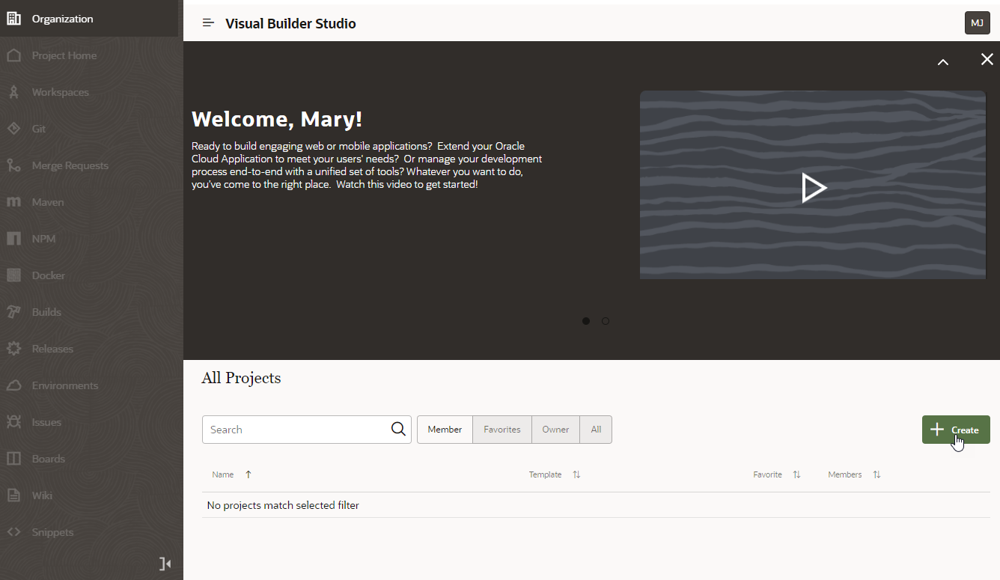

2.  On the Details page of the New Project wizard, enter:

    -   **Project Name**: `Tutorial HR Project` (you may want to add your name to the project name if you're in a large organization)
    -   **Description**: `Tutorial project`
    -   **Security**: **Private** (the default)
    -   **Preferred Language**: the language of your choice

    Click **Next**.

3.  On the Template page, select **Visual Application** and click **Next**.

4.  On the Properties page, click **Select an instance** to choose the Visual Builder development instance where you plan to deploy your application. If only one Visual Builder instance is associated with your VB Studio instance, it is automatically selected as your development instance.

5.  Change the **Workspace Name** from the default `Workspace1` to `HR Visual Application`. Also change the **Working Branch Name** from `branch1` to `hrbranch`.

6.  Leave other fields to their default settings and click **Finish**.

    Wait for the project to be provisioned. Once provisioning completes, you'll see the Project Home page, which serves as a window to the Designer, as well as to your environments, repositories, and a recent activities feed. On the left are a series of tabs showing all the project components that are available.

    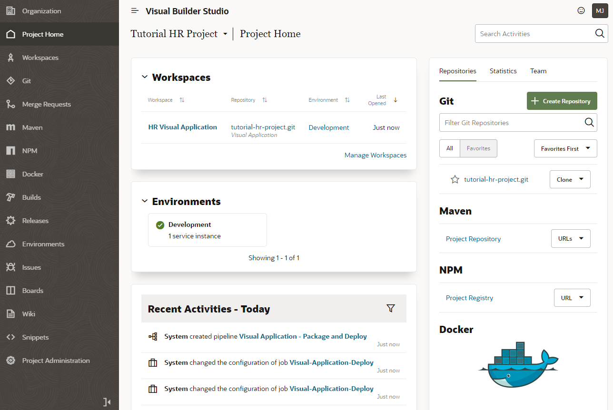

## **TASK 2:** Explore the Project Environment

Everything you need to start building a visual application is now created for you in this project. Let's step through some key components to better understand your project environment.

1.  On the Project Home page, you'll see the **tutorial-hr-project.git** repository on the right in the Repositories tab. This Git repository stores your visual application's source files and is also known as the project's _remote_ repository. Click the **tutorial-hr-project.git** link to see your project's remote branches, master and hrbranch, created with initial content for your visual application.  

    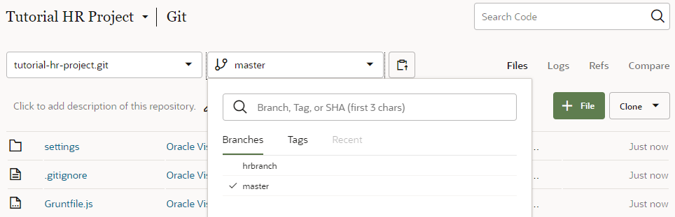

2.  In the left navigation, click **Workspaces**to view the **HR Visual Application** workspace. This workspace contains your working branch, hrbranch, and serves as your _local_ repository. The hrbranch initially has the same set of source files as the master branch, but as you work with your visual application, it will include the changes you make. Your changes can't be seen by others until you save them from the local branch to a remote branch.

    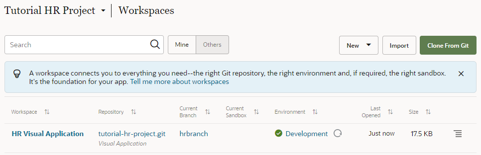

3.  Click **Environments**  in the left navigation to view the Development environment that points to your Visual Builder instance. Here, you can view details of your Development instance and the applications that you deploy to this instance.  

    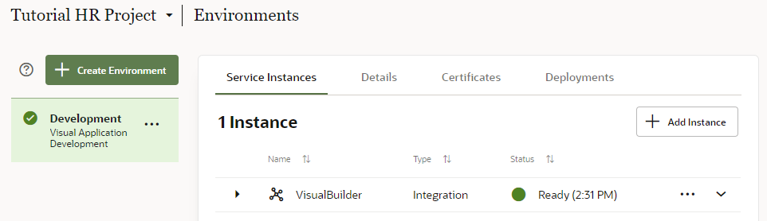

4.  Click **Builds**  in the left navigation to view two build jobs that package and deploy your visual application to the Development instance. The Visual-Application-Package job generates the visual application's artifact files. The Visual-Application-Deploy job deploys the artifact files to the Development instance.

    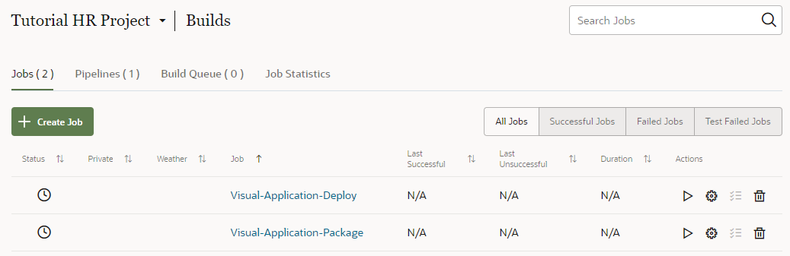

5.  On the Builds page, click **Pipelines** to view the sequence of build jobs that package and deploy your application to your Development environment.

    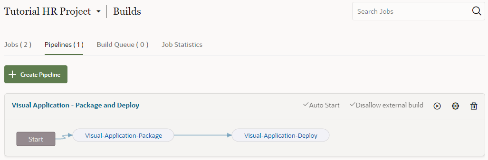

## **TASK 3:** Add Credentials to Deploy the Visual Application

Now that your project is provisioned, let's set up the credentials that VB Studio will use to deploy your visual application to the Visual Builder Development instance.

1.  Click **Jobs** on the Builds page, then click **Configure**  for the Visual-Application-Deploy job.

    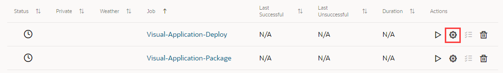

2.  On the Job Configuration page, click **Steps**.

3.  In the **Username** and **Password** fields, enter the credentials of a user who can deploy to the Visual Builder Development instance. Click **Save**.

    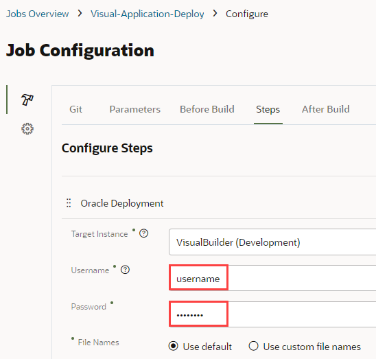

## **TASK 4:** Add Team Members

For the purposes of this tutorial, let's assume that other members of your team will work with you on this visual application--which means you'll need to add them to this project. As the project owner, you can restrict what others can do in this project by granting them membership as a Developer Full Access, Developer Limited Access, or Contributor.

1.  Click **Project Home**  in the left navigation.

2.  On the Project Home page, click **Team**, then **\+ Add Member**.

    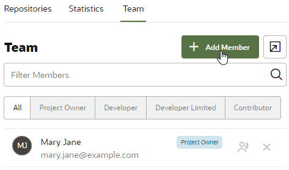

3.  In the Add Member dialog box, select the new user's membership, enter the username of a teammate, and click **Add**. For demonstration purposes, this tutorial adds Clara Coder with the Developer Limited Access role, which lets her access most project components but limits management actions.

    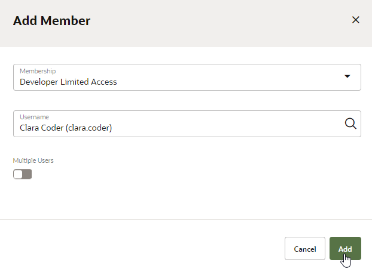

    An email containing project details is sent to Clara Coder. Your recent activities feed is also updated.

## Acknowledgements
* **Author** - Sheryl Manoharan, VB Studio User Assistance
* **Last Updated By/Date** - August 2021
