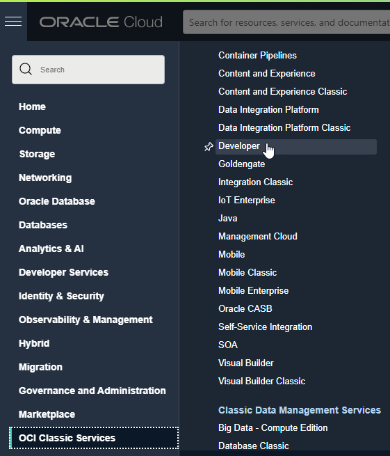
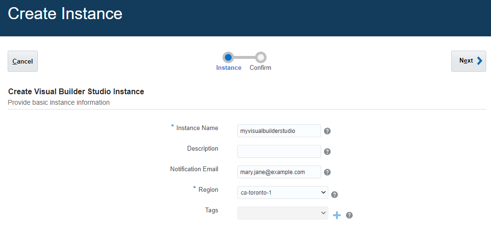
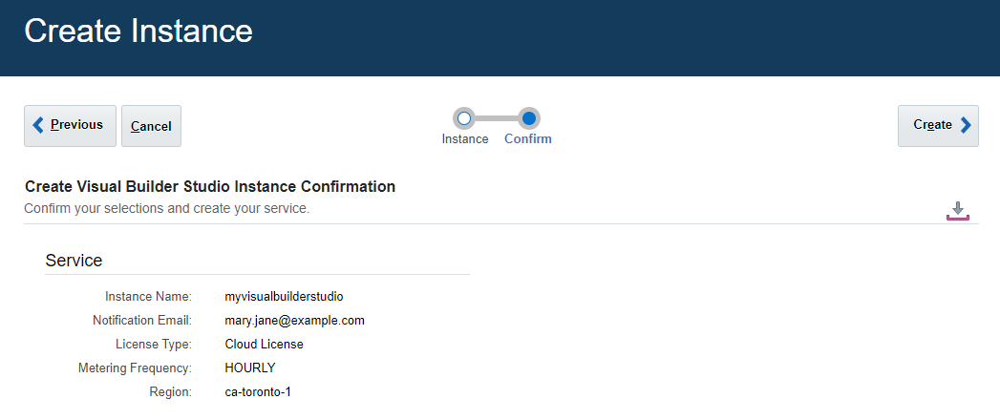
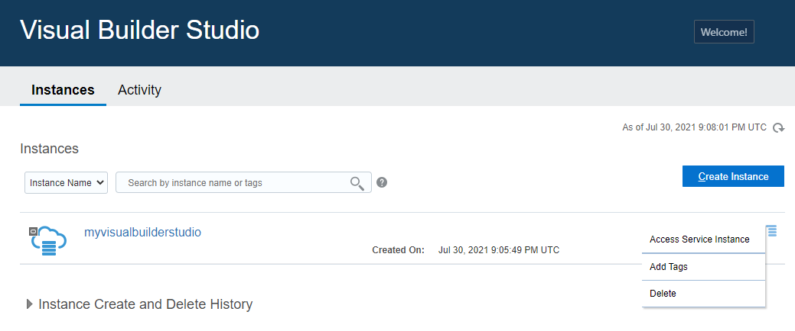
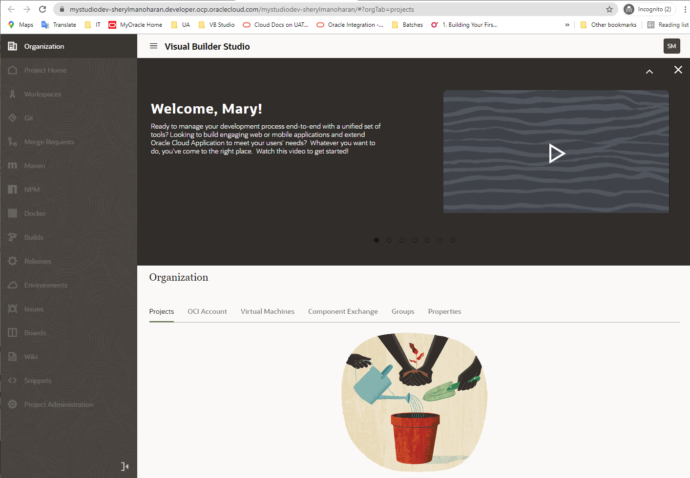
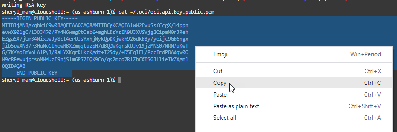
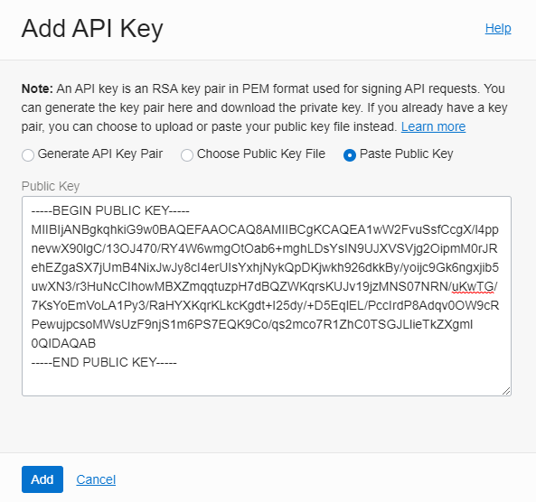
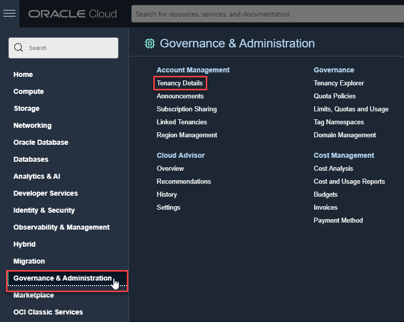
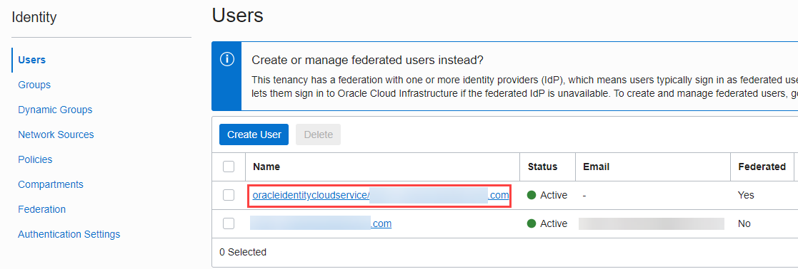
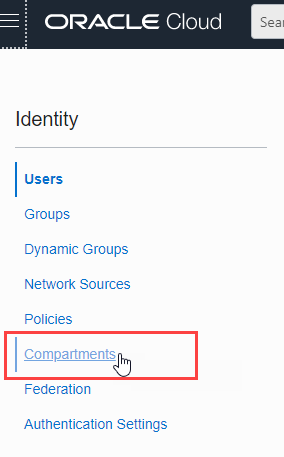

# Provision Instances

## Introduction

This lab walks you through the process of provisioning a Visual Builder Studio instance and a separate Visual Builder instance, assuming you don't already have both available to you. If you do, you can skip this lab and move on to the next one.


Estimated Lab Time: 10 minutes

### Background
If you just created a new Cloud account following the instructions in Getting Started, you must wait at least 30 minutes before you attempt to create an instance of Visual Builder and Visual Builder Studio. (It could take anywhere between 10 and 30 minutes for a new user account to be fully provisioned and for the navigation menu to show.) If you already have a Cloud account, you don't need to wait. Either way, make sure you've signed in to the Oracle Cloud as an Oracle Identity Cloud Service user before proceeding. *Note: If you log in using an Oracle Cloud Infrastructure account, the navigation menu to Visual Builder won't show.*

## **TASK 1**: Create an Instance of Visual Builder
Provision a service instance of Visual Builder to deploy and host apps created in Visual Builder Studio. The Visual Builder instance serves as the runtime environment for the web app that you will create in Visual Builder Studio.

1.  On the Oracle Cloud Get Started page, click the menu in the upper left corner to display the services you can provision:

    

2.  Click **OCI Classic Services**, then select **Visual Builder**:

    

3.  On the Instances tab, click **Create Instance**:

    


4.  On the Create Instance page, fill in the information required. Give your instance a unique name, one that is unlikely to be chosen by another user.  Be sure to select the Region nearest to your location.  Click **Next**.

    

    When the instance has finished provisioning, you'll receive an email.  

5. From the Action menu on the Instances page, click **Open Visual Builder Home Page**.

   

## **TASK 2:** Create an Instance of Visual Builder Studio
Provision a service instance of Visual Builder Studio to design and develop your web app. You can create only one Visual Builder Studio instance in an Oracle Cloud account. Before you attempt to create an instance, make sure there's no existing Visual Builder Studio instance in your account.

1. Navigate back to your Cloud Console and click the menu in the upper left corner, click **OCI Classic Services**, then select **Developer**.

   

2. On the Instances tab, click **Create Instance**:

    

3. On the Create Instance page, fill in the required information. Give your instance a unique name, then select the Region nearest to your location. Click **Next**.

   

3. Review your information and click **Create**.

   

4. Once your service instance is created (you'll receive email that your instance is available), click the Action menu icon on the Instances page and select **Access Service Instance**.

   

   The Visual Builder Studio console opens in a new browser tab. When you first log in, you see the Welcome page with a link to an introductory video, along with a news feed of additional screens. Close **X** to dismiss the news feed and expand your work area.
   

   You are on the Organization page in the Projects tab, but before you can create a project, you'll need to connect your VB Studio instance to an OCI account.

## **TASK 3:** Set Up the OCI Account

VB Studio requires access to Oracle Cloud Infrastructure (OCI) resources such as VMs for builds and storage buckets for project data, so you'll need to set up an OCI account with a dedicated compartment and a separate Identity and Access Management (IAM) user. This allows you to organize VB Studio resources better because they aren't mixed with your other resources.

1. Return to your Oracle Cloud console and click the menu in the upper left corner.

2. Create a separate compartment to host VB Studio resources:

       a. Select **Identity & Security**, then under **Identity**, select **Compartments**.
       

       b. Click **Create Compartment**.
       

       c. Enter the required information and click **Create Compartment**.
       

3. Create a local user to access the compartment you've created.

      a. From the navigation menu, select **Identity & Security**, then under **Identity**, select **Users**.
      

      b. Click **Create User**.
      

      c. Select the IAM user type, enter the user's details and click **Create**.
      

4. On your computer, generate a private-public key pair in the PEM format.

    a. In the Console header, click the Cloud Shell icon. Note that the OCI CLI running in the Cloud Shell will execute commands against the region selected in the Console's Region selection menu when the Cloud Shell was started.
    

    b. Run the following commands in the cloudshell to generate a public and private key pair.

    ```
    <copy>
    mkdir ~/.oci
    openssl genrsa -out ~/.oci/oci.api.key.pem 2048
    chmod go-rwx ~/.oci/oci.api.key.pem
    openssl rsa -pubout -in ~/.oci/oci.api.key.pem -out ~/.oci/oci.api.key.public.pem
    </copy>
    ```
    Here are the steps for reference:
    

    c. Run the following command to **copy the generated _public_ key** and paste it in a text editor like notepad, we will need it for the next step.
    ```
    <copy>
    cat ~/.oci/oci.api.key.public.pem
    </copy>
    ```
    d. Make sure to include ----BEGIN PUBLIC KEY---- and ----END PUBLIC KEY----

    

    e. Run the following command to **copy the generated _private_ key** and paste it in a notepad, we will need it later on.
    ```
    <copy>
    cat ~/.oci/oci.api.key.pem
    </copy>
    ```
    f. Make sure to include ----BEGIN RSA PRIVATE KEY---- and ----END RSA PRIVATE KEY----

    

    g. Click **X** to exit the cloudshell.

5. Upload the public key to the user's details page.

    a. On the Users page, click **vbstudiouser**.
       

    b. Scroll down and click **API Keys**, then click **Add Public Key**.
       

    c. Click **Paste Public Key** and paste the **oci.api.key.public.pem** that you copied. Click **Add**, then **Close**.
       

## **TASK 3:** Get OCI Credentials

Before you can connect VB Studio to OCI, you need the unique Oracle Cloud Identifiers (OCIDs) of the VB Studio compartment and user, as well as other details of your environment—all of which you can get from the Oracle Cloud console.

1. First, let's retrieve the **Tenancy OCID**, **Home Region**, and **Storage Namespace**. In the Oracle Cloud menu, select **Governance & Administration**, then under **Account Management**, select **Tenancy Details**.

   

2. In a notepad, copy and paste the Tenancy OCID from the **OCID**, Home Region from the **Home Region**, and the Storage Namespace from the **Object Storage Namespace**.

   

   Now, let's retrieve the **User OCID** and **Fingerprint**.

3. Click the navigation menu again and select **Identity & Security**. Under **Identity**, select **Users**.

   

4. On the Users page, click the **vbstudiouser** you created.

   

5. On the User Details page, copy the User OCID from **OCID** and paste it in notepad.

   

6. To retrieve the fingerprint of the public key associated with the `vbstudiouser` account, scroll down to the Resources section, select API Keys, and copy the fingerprint value.

   

7. Now let's get the Compartment OCID. In the left navigation menu, select **Identity & Security**, then **Compartments** under **Identity**.
   

8. On the Compartments page, click **VBStudioCompartment**.
   

8. Copy and paste the compartment's OCID to your notepad.
   

9. Finally, check for the private key. The private key file was generated and saved on your computer when you created the private-public key pair in the PEM format. As you recall, we copied the private key at the beginning of this lab and pasted it into a notepad. You'll now need this for the next task.

## **TASK 3:** Connect the OCI Account
With all the necessary information copied, connect your VB Studio instance to the OCI account.

1. Return to the VB Studio console, then on the Organization page, select **OCI Account** and click **Connect**.

   

2. Use the information you've copied to fill out the Configure OCI Account page.

   You can leave the Passphrase field empty because we generated the private-public key without a passphrase.

3. Select the Visual Builder Studio Requirements box, click **Validate**, then **Save**.

You are now ready to create a project and run builds in VB Studio.


## Acknowledgements
**Author** - Sheryl Manoharan, Visual Builder User Assistance

**Last Updated** - August 2021
