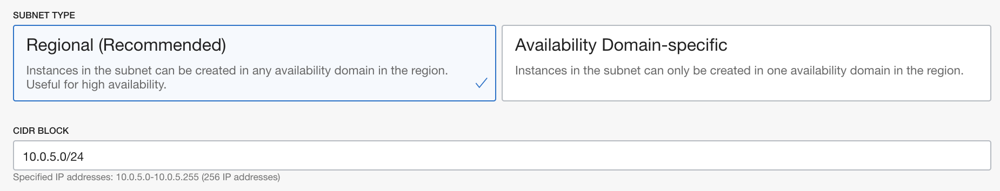

# Provision the Application Autonomous Database on OCI

## Introduction

This lab with guide you through provisioning a Application Database using Autonomous Transaction Processing Database.

Estimated Lab Time: 30-35 min including ~25-30 min provisioning time.

### Objectives

In this lab you will:

- Create a Network Security Group with proper ports open
- Create a private subnet for the Application Database
- Provision the Application Autonomous Database.

## **STEP 1:** Create a Network Security Group (NSG) for the database subnet

Before we can provision the Application Database, we need to provision a **private subnet** for the **Database System** with appropriate **Network Security Group** to open up the required port 1522 for the database.

In this section we will create a Network Security Group for the WebLogic subnet to be able to reach the Database subnet on port 1522 (the Oracle Autonomous Database default port).

1. Go to **Networking -> Virtual Cloud Network** in the compartment where WebLogic was provisioned.

  

2. Click the VCN that was created by the stack, which would be called `nonjrf-wls` if you used the same naming conventions.

  

3. Click **Network Security Groups** on the left-side menu

  

4. Click **Create Network Security Group**

  

5. **Name** the security group `ATP-NSG` and the compartment where the WLS stack was deployed, then click **Next**

  

6. Select:

    - **Source Type**: **CIDR**
    - **Source CIDR**: **10.0.0.0/16**
    - **IP Protocol**: **TCP**
    - **Destination Port Range**: **1522**

  

  Then click **Create**

  


## **STEP 2:** Create the database subnet

1. Click **Subnets** on the left-side menu

  

2. Click **Create Subnet**

  

3. **Name** the subnet `nonjrf-db-subnet`

  

4. Keep the defaults for the **Subnet Type** and enter a CIDR block of `10.0.5.0/24`

  

5. **Select** the `Default Routing Table for nonjrf-wls` for the **Routing Table**

  

6. Select **Private Subnet**

  

7. Keep the defaults for the DNS resolution and label and select `Default DHCP Options for nonjrf-wls` for **DHCP Options**

  

8. **Select** the `Default Security List for nonjrf-wls` for the **Security List**

  

9. and click **Create Subnet**

  

## **STEP 3:** Provision the Autonomous Database system

1. Go to **Database -> Autonomous Transaction Processing**

  

2. Click **Create Autonomous Database**

  

3. Make sure you are in the **Compartment** where you created the DB subnet, and name your **Database System** **WLSATPDB** or a name of your choice

  

4. Select **Workload Type** to be **Transaction Processing**.

  

5. Keep the defaults for **Deployment Type** to **Shared Infrastructure**

  

6. Keep the defaults for **Database Version**, **OCPU count**, **Storage** and **Auto Scaling**

  

7. Enter and confirm the **Admin Database password** as it is on-premises: 

    ```
    <copy>
    YpdCNR6nua4nahj8__
    </copy>
    ```

  

8. Choose **Network Access** to be **Virtual Cloud Network**

  

9. Then select the **Virtual Cloud Network** as **nonjrf-wls**

  

9. Select the **Subnet** as **nonjrf-db-subnet**

  

10. Select the **db hostname** as **db**

  

9. Select the **Network Security Group** created earlier **ATP-NSG**

  

11. Click **Create Autonomous Database**

  

To save some time, you can proceed to starting the DB migration lab while the DB is provisioning if you wish, however you will need the DB fully provisioned and you will need to gather the DB information before you can finish the migration.

You may proceed to the next lab.

## Acknowledgements

 - **Author** - Emmanuel Leroy, May 2020
 - **Last Updated By/Date** - Emmanuel Leroy, October 2020

## Need Help?
Please submit feedback or ask for help using our [LiveLabs Support Forum](https://community.oracle.com/tech/developers/categories/livelabsdiscussions). Please click the **Log In** button and login using your Oracle Account. Click the **Ask A Question** button to the left to start a *New Discussion* or *Ask a Question*.  Please include your workshop name and lab name.  You can also include screenshots and attach files.  Engage directly with the author of the workshop.

If you do not have an Oracle Account, click [here](https://profile.oracle.com/myprofile/account/create-account.jspx) to create one.
