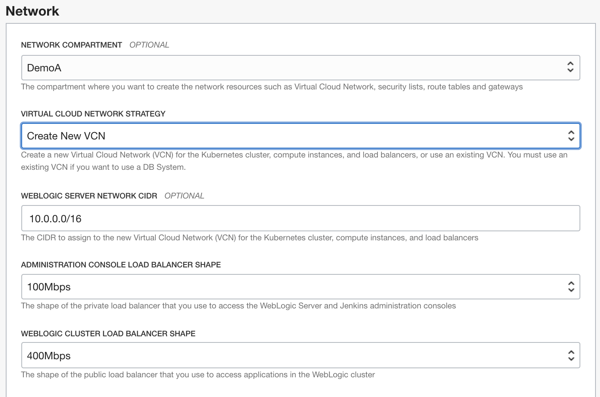
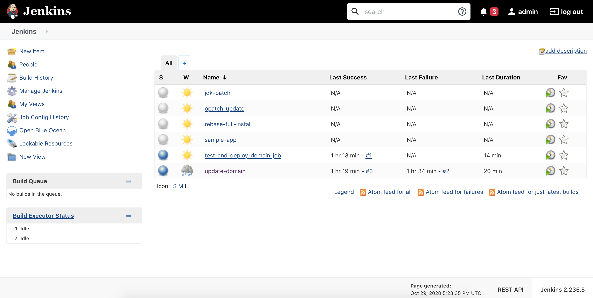

# Provision WebLogic on Oracle Kubernetes Engine

## Introduction

This lab walks you through provisioning the WebLogic Infrastructure on OKE by leveraging the OCI Marketplace.

Estimated Lab Time: 30 minutes

### Objectives

In this lab you will:

- Provision WebLogic Server on Oracle Kubernetes Engine via the Marketplace offering
- Gather information for further steps

### Prerequisites

For this lab, you need to have prepared the OCI tenancy with:

- A Vault
- A Key
- A Secret for the WebLogic Admin password
- A Secret for the OCI Registry Auth Token


## **STEP 1:** Provision the stack through the Marketplace

1. Go to **Solutions and Platforms**

  

2. In the search input, type "`weblogic`". For this lab, we'll use the **WebLogic Enterprise Edition on OKE UCM**

   

3. Make sure you are in the **Compartment** you want to use, use the **default WebLogic version** available, accept the License agreement and click **Launch the Stack**

   

4. **Name** the stack and click **Next**

   

5. **Enter** a **Resource Name Prefix**.

  It will be used to prefix the name of all the resources (domain, managed servers, admin server, cluster, machines...)

  The next steps in this workshop assumes the resource name prefix is `nonjrf`, so it is highly recommended to use this name.

  

6. **SSH key**

   To connect to the WebLogic servers via SSH, you need to provide a public key the server will use to identify your computer. 
   
   *Since the various commands will be ran from inside the 'on-premises' environment (either the workshop compute instance or the local docker containers), you will need to provide the key generated in the 'on-premises' environment.*

  

   To output the public key information, use the following command from inside the 'on-premises' environment as the `oracle` user.
    ```
    <copy>
    cat ~/.ssh/id_rsa.pub
    </copy>
    ```
    Copy the output of the command (the whole multi-line output) and paste it in the form field for SSH key in the form

    the output will look something like this:

    ```bash
    ssh-rsa AAAAB3NzaC1yc2EAAAADAQABAAABAQDlkF23qLyfimJ9Vp4D9psp7bDOB8JvtY/pfYzFxIA2E4v6or+XhvMW5RDhX9Ba54zQNNDLvwUhStdXKkiMXJtEQJarFn45pGy/lyUQKFJolAdHBrXJsg5XWn4DxCFeQUQe1szVfmwDLAktAS14r5g76h3CcA8Kk/cNVqevxVChyejuuOdtAMoriIC8uKV+535qPs/GMiu0zR9aW4w1VodL5eHnXjqdgp8Fr21dVUVQ6of+s/ws0zlQUwghrNguDUqlggzG2mpLBHExypxCrJYmsb05uYjjqVlC3YCatj4nJTIHKLCFiYVY/b8AFkqwXV9EYlja5bjTmunM847dcR8H oracle@ad753161734c
    ```
    **Note:** Do not use the example above as the key: it is a different public key which is useless without the corresponding private key, and you will not be able to access your resources on OCI)

7. Keep the default of *2* for **Managed Server Count** 

8. Use the standard *weblogic* for **Administration User Name**

  

9. **Paste** the **OCID** of the **Secret** generated previously for the **Secret OCID for Administration Password**

  

10. Click the **WebLogic Advanced Configuration** and enter the name **nonjrf_domain** for the domain name

  

11. Under **WebLogic Cluster (OKE) Configuration**, the Kubernetes version is default and select a **Shape** you have available in your tenancy.

   In a real world situation, choose a shape appropriate to handle the load of a single managed server. Since we're using a trial account, choose the **VM.Standard.E2.1** shape, the **VM.Standard.E2.2** shape or a suitable shape that is available in your tenancy.

   

   To check shape availability, you can go to **Governance -> Limits and Quotas** in another tab, and verify you have a specific shape available

12. Select the **Number of Nodes in the WebLogic Pool** to 1 for now 

   

13. Select a shape and number of nodes for the non-WebLogic pool (for infra services like Jenkins)

   

14. Keep the **CIDR** block the default

   

15. Under **Container Cluster (OKE) Administration Instances**, select an **Availability Domain** and shapes for the **Administration Server Compute Shape** and **Bastion Instance Shape**

   

16. Under **Network**, select **Create New VCN** and keep the other defaults

   

17. For **Database**, select **No Database**. This is only needed for a JRF domain. We will provision the application database separately.

   

18. Select an **Availability Domain** for the **File System**

   

19. Under Registry (OCIR) enter your full **Username**, which you find under you **User icon**

   

20. and enter the **OCID** of the Secret for the **OCI Registry Auth Token**

   

21. and then click **Create**

  

22. The stack will get provisioned using the **Resource Manager**. This may take 7-15min.

  

Once the stack is provisioned, you can find the information regarding the URL and IP of the WebLogic Admin server in the logs, or in the **Outputs** left-side menu.

## **STEP 2:** Gather deployment information

1. Go to **Outputs** (or you can find the same information at the bottom of the logs)

  You should see something like the following:

  

  - Make a note of the **WebLogic Admin Server Private IP address** from the **WebLogic Admin Server Console URL** for later use.

  - Make a note of the **Load Balancer IP** for later use.

  - Make a note of the Bastion Instance **Public IP address** for later use.

  To access the WebLogic Admin console, you will need to create a tunnel through the bastion host to your local machine.

  We'll need to setup a tunnel through the Bastion Instance, with a dynamic port to connect to the Admin Console and the Jenkins UI with the browser.

## **STEP 3:** Setup connectivity

1. Extract the SSH key from the 'on-premises' environment:

  In the *Docker* environment, the key pair (`id_rsa` and `id_rsa.pub`) is exported for you in the `weblogic-to-oci/ssh/` folder

  If your used the Marketplace demo image, you need to extract the key to your local machine.

  Since we only have SSH access with the `opc` user, the key first needs to be moved to the opc user home and then exported.

  In the 'on-premises' VM, as the oracle user

    ```bash
    <copy>
    sudo cp ~/.ssh/id_rsa /home/opc/
    </copy>
    ```

  Then exit the oracle user shell, and exit the VM, by typing `exit` twice

  Then on your local machine shell:

    ```bash
    <copy>
    mkdir ssh
    scp opc@<DEMO_ENV_IP>:~/id_rsa ./ssh/
    </copy>
    ```

  The key `id_rsa` will now be in your local folder

2. Create a dynamic port tunnel through the Bastion Instance

  Use the following command to create a tunnel from the WLS admin server to your local machine.

    ```bash
    <copy>
    ssh -i ./ssh/id_rsa -C -D 1088 opc@$<BASTION_IP>
    </copy>
    ```

  Using Putty:
  - Create a new Session to `opc@<BASTION_IP>` with port 22
  - In **Host Keys**, locate the `id_rsa` private key obtained earlier
  - In **Connections -> SSH -> Tunnels**, click **Dynamic**
  - Enter **Source Port: 1088** then **Add**
  - Click **Open** to open the tunnel connection

3. Setup Socksv5 Proxy in Firefox

  In Firefox browser, go to **Preferences**

  - Search for **Proxy**

    

  - Click **Settings**
  - Click **Manual Proxy** setup
  - Enter **localhost** and port **1088**

    

## **Step 4:** Check the deployment

1. Find the private load balancer IP under **Core Infrastructure -> Networking -> Load Balancers**

2. Find the load balancer marked *Private* and note the IP address

  

3. In Firefox, go to *http://`PRIVATE_LOAD_BALANCER_IP`/console* to find the WebLogic Admin console

  

  You should find the deployment list is empty under **Deployments**

4. Go to *http://`PRIVATE_LOAD_BALANCER_IP`/jenkins* to get to the Jenkins Console

  You will be prompted to create a default admin user, and then you can see the Jenkins UI and pipelines

  


You can proceed to the next lab

## Acknowledgements

 - **Author** - Emmanuel Leroy, May 2020
 - **Last Updated By/Date** - Emmanuel Leroy, October 2020

## Need Help?
Please submit feedback or ask for help using our [LiveLabs Support Forum](https://community.oracle.com/tech/developers/categories/Weblogic). Please click the **Log In** button and login using your Oracle Account. Click the **Ask A Question** button to the left to start a *New Discussion* or *Ask a Question*.  Please include your workshop name and lab name.  You can also include screenshots and attach files.  Engage directly with the author of the workshop.

If you do not have an Oracle Account, click [here](https://profile.oracle.com/myprofile/account/create-account.jspx) to create one.
