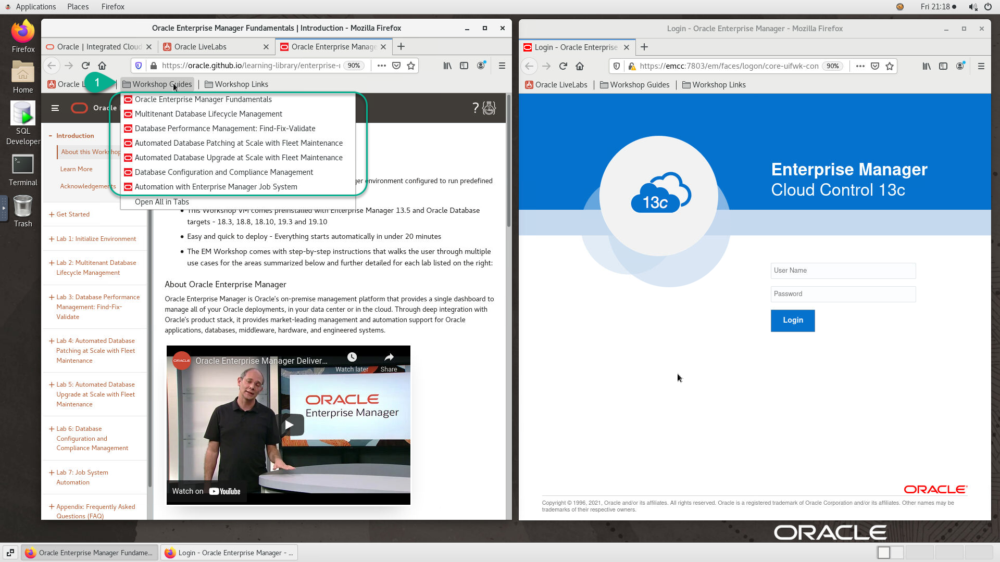

# Introduction

## About this Workshop
This Workshop VM is a fully functional Oracle Enterprise Manager environment configured to run predefined use cases against multiple Oracle Database targets.

### About Oracle Enterprise Manager
Oracle Enterprise Manager is Oracle’s on-premise management platform that provides a single dashboard to manage all of your Oracle deployments, in your data center or in the cloud.

### Objectives
  - Select the correct guide for your workshop

## **STEP 1:** Open the Workshop Guide

This VM supports multiple workshops. As a result, it's important that you open the correct guide needed to perform the labs assigned to your workshop.

1. Open the *Workshop Guides* folder from the *Firefox* toolbar area above and select the correct guide for your workshop

  

2. Confirm that the opened guide matches your workshop.

  e.g. The example below is borrowed from the *Automation with Enterprise Manager Job System* workshop.

  
  

## Learn More
- [oracle.com/enterprisemanager](https://www.oracle.com/enterprise-manager/)

## Acknowledgements
  - **Author** - Rene Fontcha, LiveLabs Platform Lead, NA Technology
  - **Contributors** - Dave Le Roy, Pankaj Chandiramani, Shefali Bhargava, Björn Bolltoft, Harish Niddagatta - Enterprise Manager Product Management
  - **Last Updated By/Date** - Rene Fontcha, LiveLabs Platform Lead, NA Technology, July 2021
