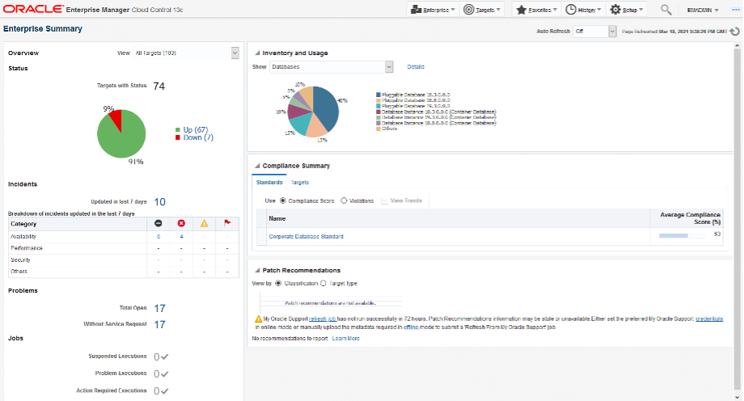
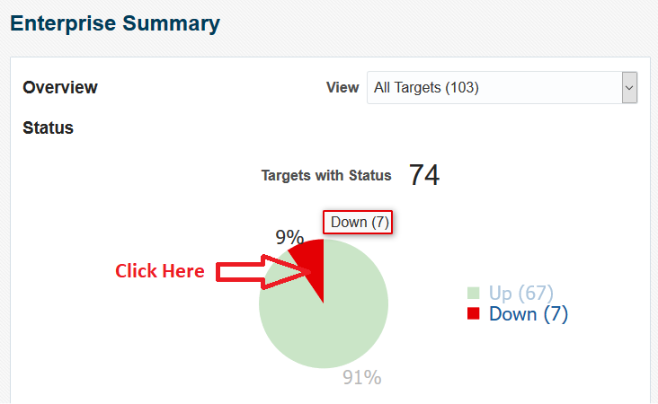
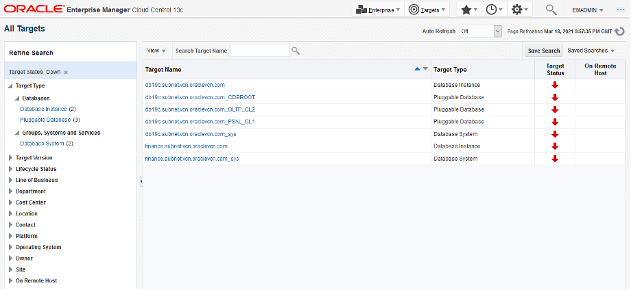
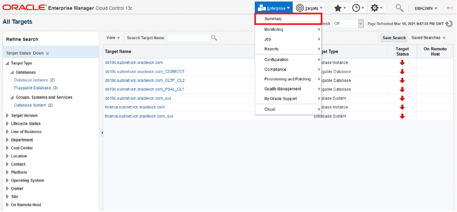
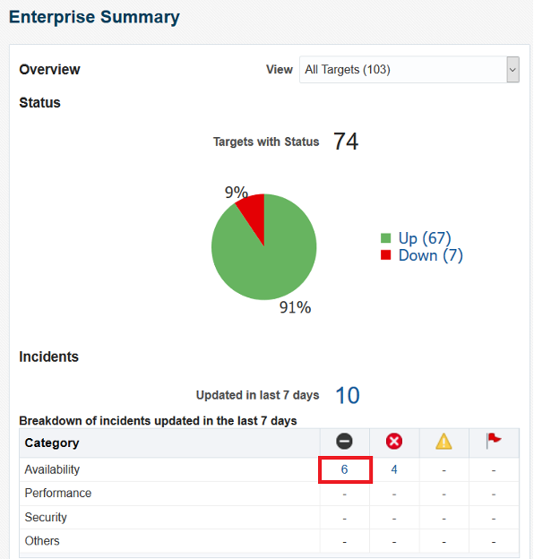
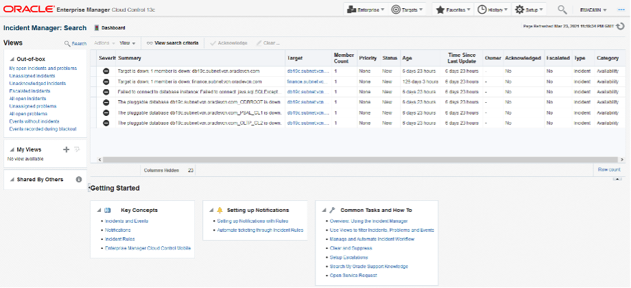
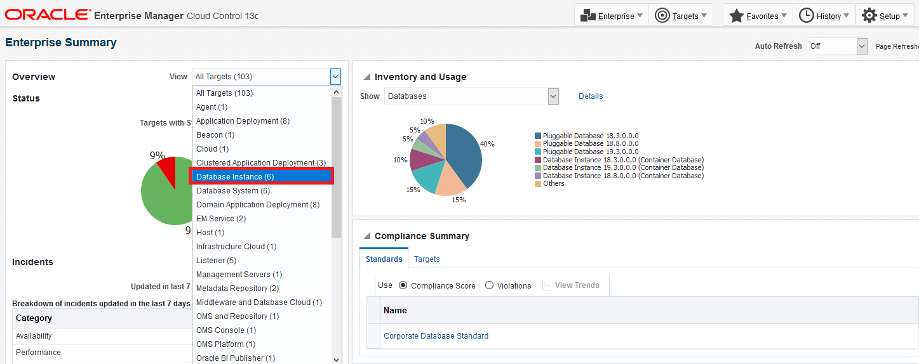
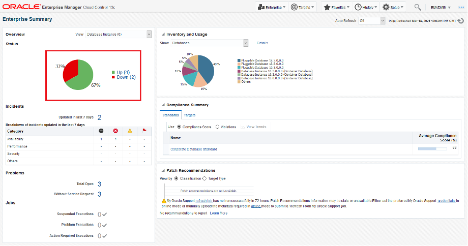
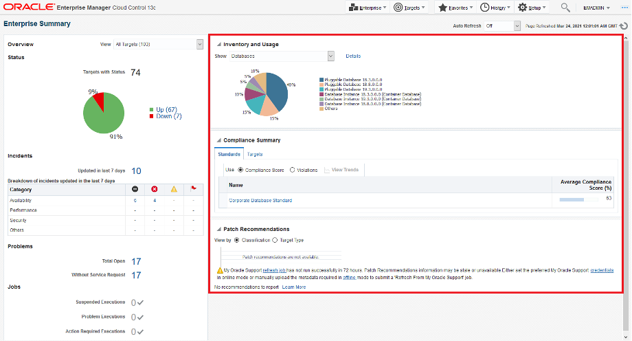

# EM Monitoring Overview
## Introduction
Oracle Enterprise Manager enables you to get complete monitoring visibility into your IT infrastructure, applications stack and applications that are critical to running your business.

- Single pane of glass monitoring for on-premises, hybrid, and Oracle Cloud Platform

- Comprehensive set of predefined performance and health metrics that enables lights-out monitoring of critical components in your environment, such as applications, application servers, databases, as well as the back-end components on which they rely, such as hosts and storage.

- Rich set of alerting, incident management and notification capabilities to notify IT staff and integrate with your corporate ticketing systems.

- Corrective Actions to auto-correct alerts and minimize service disruption

- Metric Extensions to monitor conditions specific to your environment

### Objectives
The objective of this lab is to become familiar with Enterprise Monitoring capabilities using Oracle Enterprise Manager Cloud Control 13c.

*Estimated Lab Time*: 60 minutes

### Prerequisites
- A Free Tier, Paid or LiveLabs Oracle Cloud account
- You have completed:
    - Lab: Generate SSH Keys
    - Lab: Environment Setup
- SSH Private Key to access the host via SSH
- OMS super-user Credentials:
    - Username: **emadmin**
    - password: **welcome1**
- EM13c Host Public IP address
- OMS Console URL:
  ````
  <copy>https://<EM13c Host Public IP address>:7803/em</copy>
  e.g: https://111.888.111.888:7803/em
  ````

  ### Lab Timing (Estimated)

  | **Step No.** | **Feature**                                   | **Approx. Time** | **Details**                                                                                                                                                                                                                    | **Value proposition**                                                                                                                                                                                                                                                                                                                                                                                                                                                                                                                                                      |
  |--------|-----------------------------------------------|------------------|--------------------------------------------------------------------------------------------------------------------------------------------------------------------------------------------------------------------------------|-----------------------------------------------------------------------------------------------------------------------------------------------------------------------------------------------------------------------------------------------------------------------------------------------------------------------------------------------------------------------------------------------------------------------------------------------------------------------------------------------------------------------------------------------------------------------------|
  | **1**  | Enterprise Summary                              | 5 minutes       | Explore Enterprise Summary page and drill down to see a list of down targets. View the list of critical incidents created for the down targets. Filter the Status pane to display a list of Database Instance targets.                         | Enterprise Summary enables you to get complete visibility into the overall status and health of your managed environment.                                                                                                                                                                                                                                            |
  | **2**  | Incident Manager                                | 10 minutes       | Triage unassigned incidents from Incident Manager and acknowledge then assign an incident                                                 | Incident Manager enables IT Staff to manage, track, and resolve actionable incidents in a collaborative way.                                                                                                                                                                                                                                                                                                                                                  |
  | **3**  | Metric and Collection Settings                         | 10 minutes       | Change the Warning and Critical threshold of a metric from Metric and Collection Settings page. Go to All Metrics page and update the same metric back to its original Warning and Critical thresholds.                                                                                                           | Enterprise Manager provides out-of-box monitoring and alert thresholds for managed targets.  You can still customize these monitoring settings based on your requirements.                                                                                                                                                                                                                                                                                                                                 |
  | **4**  | Corrective Actions                          | 10 minutes       | Create a new Corrective Action and associate it with a metric. | Corrective actions allow you to specify automated responses to metric alerts, saving administrators time and ensuring issues are dealt with before they noticeably impact users.  A corrective action can also be used to gather diagnostic information for an alert.                                                                                                                                                                                                                                                                                                                                                                                                                                                      |
  | **5**  | Metric Extensions                          | 10 minutes       | Test a Metric Extension on a target to see the results then deploy the same Metric Extension to multiple targets. | Metric Extensions let you extend Enterprise Manager's monitoring capabilities to cover conditions specific to your IT environment, thus enabling you to rely on Enterprise Manager as your single monitoring solution.                                                                                                                                                                                                                                                                                                                                                                                                                                                      |
  | **6**  | Monitoring Templates                          | 10 minutes       | Create a Monitoring Template from a Database Instance target. Deploy the Monitoring Template to other Database Instance targets to standardize monitoring settings across the enterprise. | Monitoring Templates enable you to define and implement monitoring standards across all targets in your environment.                                                                                                                                                                                                                                                                                                                                                                                                                                                       |
  | **7**  | Administration Groups and Template Collections                          | 10 minutes       | View the hierarchy of an existing Administrator Group. Update the target property for a new target so it can automatically be added to an Administration Group and inherit monitoring settings from that group. | Administration Groups and Template Collections enable you to enforce monitoring standards and automate monitoring setup in a scalable way.                                                                                                                                                                                                                                                                                                                                                                                                                                                       |
  | **8**  | Incident Rules                          | 10 minutes       | Review out-of-the-box incident rules shipped with Enterprise Manager. View an example of an incident compression rule set. Create a simple incident rule set to email DBA when there is a critical DB alert. | Incident Rules enable you to automate common incident management and notification actions such as creation of incidents based on events, sending email to IT Staff, opening tickets, auto-assigning incidents, escalating incidents, etc.                                                                                                                                                                                                                                                                                                                                                                                                                                                        |

  ## **Step 0:** Running your Workload
  ### Login to Host using SSH Key based authentication
  Refer to *Lab 2* for detailed instructions relevant to your SSH client type (e.g. Putty on Windows or Native such as terminal on Mac OS):
    - Authentication OS User - “*opc*”
    - Authentication method - *SSH RSA Key*
    - Oracle EM and DB Software OS User – “*oracle*”. First login as “*opc*”, then sudo to “*oracle*”. E.g.
    ````
    <copy>sudo su - oracle</copy>
    ````

## **STEP 1:** Enterprise Summary
  1.	Log into an Enterprise Manager VM (using provided IP). The Enterprise Manager credentials are “emadmin/welcome1”.
     

  2.  Navigate to “Enterprise >> Summary”.
     

  3.	Enterprise Summary presents a single pane of glass view of the health of your Enterprise assets.

   The Overview pane shows the Target Status of your IT estate. The Status section shows aggregated target availability so you can get a sense of what percentage is UP vs DOWN at a quick glance. The Green slice of the pie are your targets that are up. The Red slice of the pie are the targets that are down. Targets in red may be down due to unscheduled outages. Let’s drill down and take a look at them.
      

  4.  Click on the Red slice of the pie in the “Status” section.
        

  5.	In Enterprise Manager we have an “All Targets” page, which shows all of the targets being monitored by EM. When we clicked on the Red slice of the pie, we essentially placed a filter on the All Targets page to display only Down targets. From here, you can click on the individual target to go to the Target Home Page and take necessary actions such as starting up a Database System or Database Instance.
      

  6.	Click on “Enterprise >> Summary” to go back to the Enterprise Summary page.
        

  7.	Any Incidents, Problems, and Jobs requiring attention is displayed on the Enterprise Summary page with the ability to drill down into them. Click on the critical incidents link for Availability.
        

  8.	A list of critical incidents is displayed in Incident Manager. You can manage the incidents by acknowledging, assigning ownership, changing the priority or status, and more.
        

  9.	Click on “Enterprise >> Summary” to go back to the Enterprise Summary page.

  10.	You can also filter the view based on the target type. Click on the View dropdown in the “Overview” pane and select “Database Instance” to look at the database status.
        

  11.	The Status pane is filtered for Database Instance targets and displays a breakdown of the database statuses.
        

  12.	The right hand pane of the Enterprise Summary page also has Inventory and Usage, Compliance Summary, and Patch Recommendations sections. Inventory and Usage shows a breakdown of database inventory by release. Compliance Summary shows the compliance score for the selected targets as well as security recommendations. Patch Recommendations links to MOS and shows the recommended patches for your targets.
        

## **STEP 2:** Incident Manager
Incident Manager provides in one location the ability to search, view, manage, and resolve events, incidents and problems impacting your environment.
1.	Log into an Enterprise Manager VM (using provided IP). The Enterprise Manager credentials are “emadmin/welcome1”.
     

2.	Navigate to “Enterprise >> Monitoring >> Incident Manager”.
     

3.	In Incident Manager, the Views section contains out-of-box views that comes shipped with Enterprise Manager. You can create your own views and share with others as well. By default, “All open incidents” view is displayed.
     

4.	We will triage unassigned incidents and then acknowledge and assign an incident to an owner. Highlight the first incident. Details of the incident will be displayed in the bottom pane.
     

5.	Click on “Open in new tab” link to open the incident on a separate tab. You may need to temporarily allow popups in the browser.
     

6.	The General tab of an incident contains 3 sections.
- Incident Details contains information about the incident such as target name, creation date, type, and summary.
- Tracking provides the priority, status, and ability to manage the incident.
- Guided Resolution contains recommendations for incident resolution and provides the ability to diagnose and take action to resolve the incident.
     

7.	Click on “Acknowledge” in the Tracking section to acknowledge the incident. This will automatically assign the incident to the user acknowledging the incident.
     

     

8.	Click on “Manage”.
     

9.	Update the Status, Priority, and Escalation fields. Add a short comment and click OK
     

10.	A confirmation is displayed with the Tracking section updated.
     

11.	Close the Incident Details tab and go back to the Incident Manager tab.

12.	Click on the Dashboard button next to “Incident Manager: All open incidents”.
     

13.	Incident Dashboard provides a holistic view of your incidents. It contains 3 sections.

- Summary: Instant count of incidents that are open, fatal, escalated, unassigned, and unacknowledged. These are the incidents that need to be triaged or worked on immediately. Fatal and Escalated count are highlighted in Red by default.
- Charts: Provides an easy-to-understand look at the current incident distribution and management status for each incident. Drill down capability with stackable filters to slice and dice data any way you like. Customize to add/update/remove charts to provide a personalized view in Incident Manager.
- Incident List: Shows the open incidents listed in reverse chronological order by last updated time stamp. From this list, you can perform requisite incident lifecycle actions such as escalating, prioritizing, acknowledging, assigning owners, and adding comments to the incident. The incident list will reflect any filters applied.

     

14.	Click on the “Fatal” link to drill down into these incidents.
     
