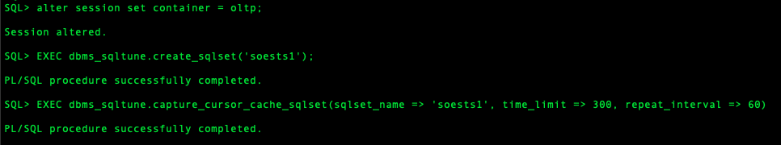
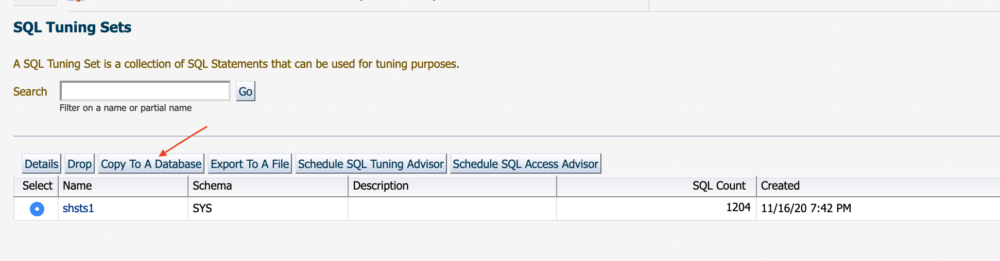

# Real Application Testing : SQL Performance Analyzer and Database Replay
## Introduction
Oracle Real Application Testing option enables you to perform real-world testing of Oracle Database. By capturing production workloads and assessing the impact of system changes on these workloads before production deployment, Oracle Real Application Testing minimizes the risk of instabilities associated with system changes.

### Objectives
The objective of this lab is to become familiar with the basic usage of SQL Performance Analyzer and Database Replay.


*Estimated Lab Time*: 55 minutes

### Prerequisites
- A Free Tier, Paid or LiveLabs Oracle Cloud account
- You have completed:
    - Lab: Generate SSH Keys
    - Lab: Environment Setup
- SSH Private Key to access the host via SSH
- OMS super-user Credentials:
    - Username: **sysman**
    - password: **welcome1**
- EM13c Host Public IP address
- OMS Console URL:
  ````
  <copy>https://<EM13c Host Public IP address>:7803/em</copy>
  e.g: https://111.888.111.888:7803/em
  ````

*Note*: This lab environment is setup with Enterprise Manager Cloud Control Release 13.4 Release Update 5 and Database 19.3 as Oracle Management Repository. Workshop activities included in this lab will be executed both locally on the instance using Enterprise Manager Command Line Interface (EMCLI) or Database PLSQL APIs, and the Enterprise Manager console (browser). The use of SQL Performance Analyzer and Database Replay requires the Oracle Real Application Testing licensing option. For more information, see Oracle Database Licensing Information User Manual.

### Lab Timing (Estimated)

| **Step No.** | **Feature**                                   | **Approx. Time** | **Details**                                                                                                                                                                                                                    | **Value proposition**                                                                                                                                                                                                                                                                                                                                                                                                                                                                                                                                                       |
|--------|-----------------------------------------------|------------------|--------------------------------------------------------------------------------------------------------------------------------------------------------------------------------------------------------------------------------|-----------------------------------------------------------------------------------------------------------------------------------------------------------------------------------------------------------------------------------------------------------------------------------------------------------------------------------------------------------------------------------------------------------------------------------------------------------------------------------------------------------------------------------------------------------------------------|
| **1**  | SQL Performance Analyzer - API                              | 15 minutes       | The objective of this activity is to demonstrate and use the SQL Performance Analyzer functionality of Real Application Testing capabilities using API PLSQL mode.                                                                        | **Scenario:**    You've been asked to validate SQL performance before upgrade Database from 18.3 to 19.3. How each SQLs in the application's workload (Order Entry) performs in new 19.3 upgrade.                                                                                                                                                                                                                                           |
| **2**  | SQL Performance Analyzer - EM UI       | 10 minutes       | The objective of this activity is to demonstrate and use the SQL Performance Analyzer functionality of Real Application Testing capabilities using Enterprise Manager UI.                                                 | **Scenario:**    You've been asked to validate SQL performance before upgrade Database from 18.3 to 19.3. How each SQLs in the application's workload (Sales History) performs in new 19.3 upgrade.                                                                                                                                                                                                                                                                                                                                                  |
| **3**  | Database Workload Replay - API                         | 10 minutes       | The objective of this activity is to demonstrate and use the Database Replay functionality of Real Application Testing capabilities using API PLSQL mode.                                                                                                           | **Scenario:**    You've been asked to validate Database performance before upgrade Database from 18.3 to 19.3. How the application's workload (Order Entry) performs in new 19.3 upgrade. Database Replay enables realistic testing of system changes by essentially re-creating the production workload environment on a test system.                                                                                                                                                                                                                                                                                                                                 |
| **4**  | Database Replay - Consolidation Replay (EM) | 10 minutes       | The objective of this activity is to demonstrate and use the Consolidation Database Replay using Enterprise Manager UI. | **Scenario:**    You've been asked to validate Database performance before upgrade Database from 18.3 to 19.3. The plan is also consolidation a couple of application workload from 2 different Database Captures (Order Entry and Sales History) from 18.3 into a single Database Replay in 19.3.                                                                                                                                                                                                                                                                                                                                                                                                                                                                                                    |


## **STEP 1:** SQL Performance Analyzer - API
### Login to Host using SSH Key based authentication
1. Running Swingbench's Order Entry workload for 5 minutes. Refer to *Lab 2* for detailed instructions relevant to your SSH client type (e.g. Putty on Windows or Native such as terminal on Mac OS):
#### SSH Session 1
    - Authentication OS User - “*opc*”
    - Authentication method - *SSH RSA Key*
    - Oracle EM and DB Software OS User – “*oracle*”. First login as “*opc*”, then sudo to “*oracle*”.
    - Change directory to **cd scripts/swingbench/swingbench**
    - Execute the script **bin/charbench -c /home/oracle/scripts/swingbench/swingbench/configs/SOE_Client_Side_2.xml**
    - The Swingbench will be running for 5 minutes. Do not need to wait until Swingbench workload to finish to continue to Step 2.

    ````
    <copy>sudo su - oracle
    cd scripts/swingbench/swingbench
    bin/charbench -c /home/oracle/scripts/swingbench/swingbench/configs/SOE_Client_Side_2.xml</copy>
    ````

    

2.  Capture STS (SQL Tuning Set)
#### SSH Session 2
    - Authentication OS User - “*opc*”
    - Authentication method - *SSH RSA Key*
    - Oracle EM and DB Software OS User – “*oracle*”. First login as “*opc*”, then sudo to “*oracle*”.
    - Set Environment variables for sales database **. SALESENV**
    - Execute STS API to create STS and capture from cursor cache for 5 minutes in sqlplus
    - Continue to Step 3 after PL/SQL procedure successfully completed.
    ````
    <copy>sudo su - oracle
    . SALESENV
    sqlplus '/ as sysdba'
    SQL> alter session set container = oltp;
    SQL> EXEC dbms_sqltune.create_sqlset('soests1');
    SQL> EXEC dbms_sqltune.capture_cursor_cache_sqlset(sqlset_name => 'soests1', time_limit => 300, repeat_interval => 60,basic_filter => 'parsing_schema_name in (''SOE'')')</copy>
    ````

    

    

3.  Move STS (SQL Tuning Set) to 19.3 Cloned oltp Database
    - Create STS staging table in source 18.3 sales-oltp PDB
    - Export STS staging table
    ````
    <copy>sudo su - oracle
    . SALESENV
    sqlplus '/ as sysdba'
    SQL> alter session set container = oltp;
    SQL> exec  DBMS_SQLTUNE.create_stgtab_sqlset(table_name => 'SQLSET_TAB', schema_name => 'SYSTEM', tablespace_name => 'USERS');
    SQL> exec DBMS_SQLTUNE.pack_stgtab_sqlset(sqlset_name => 'soests1', sqlset_owner => 'SYS', staging_table_name => 'SQLSET_TAB', staging_schema_owner => 'SYSTEM');
    SQL> create or replace directory dpdir as '/home/oracle/scripts/exp';
    SQL> exit
    emrep:oracle@emcc:~> expdp system/welcome1@oltp directory=DPDIR dumpfile=soests1.dmp tables=sqlset_tab</copy>
    ````

    

    

    - Import STS staging table
    - Unpack STS in target 19.3 clone sales-oltp PDB
    ````
    <copy>sudo su - oracle
    . 19c.env
    sqlplus system/welcome1@//emcc/oltp_cl2.subnet.vcn.oraclevcn.com
    SQL> create  or replace directory dpdir as '/home/oracle/scripts/exp';
    SQL> exit
    emrep:oracle@emcc:~> impdp system/welcome1@//emcc/oltp_cl2.subnet.vcn.oraclevcn.com directory=DPDIR dumpfile=soests1.dmp

    emrep:oracle@emcc:~> sqlplus '/ as sysdba'
    SQL> alter session set container = OLTP_CL2;
    SQL> exec DBMS_SQLTUNE.unpack_stgtab_sqlset(sqlset_name => 'soests1', sqlset_owner => 'SYS', staging_table_name => 'SQLSET_TAB',replace => TRUE, staging_schema_owner => 'SYSTEM');</copy>
    ````

    

    


4.  Create and run SPA task
    - Create Database Link from target to source
    ````
    <copy>
    . 19c.env
    sqlplus '/ as sysdba'
    SQL> alter session set container = OLTP_CL2;
    SQL> create public database link oltp connect to system identified by welcome1 using '(DESCRIPTION = (ADDRESS = (PROTOCOL = TCP)(HOST = emcc.marketplace.com)(PORT = 1523)) (CONNECT_DATA = (SERVER = DEDICATED) (SERVICE_NAME = oltp.subnet.vcn.oraclevcn.com)))';
    </copy>
    ````

    

    - Create SPA task
    ````
    <copy>
    SQL> var atname varchar2(30);
    SQL> exec :atname := 'SPA_TEST_API';
    SQL> begin
        :atname := DBMS_SQLPA.CREATE_ANALYSIS_TASK (sqlset_owner => 'SYS',sqlset_name => 'soests1', task_name => :atname);
        end;
        /
    </copy>    
    ````

    

    - Run SPA task test-execute to source 18c via dblink
    ````
    <copy>
    SQL> begin
        DBMS_SQLPA.EXECUTE_ANALYSIS_TASK(
        task_name => 'SPA_TEST_API',
        execution_type => 'TEST EXECUTE',
        execution_name => 'oltp18c',
        execution_params => dbms_advisor.arglist('DATABASE_LINK', 'OLTP.SUBNET.VCN.ORACLEVCN.COM'));
        end;
        /
    </copy>  
    ````

    

    - Run SPA task test-execute in target 19c
    ````
    <copy>
    SQL> begin
        DBMS_SQLPA.EXECUTE_ANALYSIS_TASK(
        task_name => 'SPA_TEST_API',
        execution_type => 'TEST EXECUTE',
        execution_name => 'oltp19c');
        end;
        /
    </copy>  
    ````

    


5.  Run SPA Analyze Compare and generate SPA report
    - Run SPA Compare Analysis based on elapse time
    ````
    <copy>
    SQL> begin
      DBMS_SQLPA.EXECUTE_ANALYSIS_TASK(
      task_name => 'SPA_TEST_API',
      execution_type => 'COMPARE',
      execution_name => 'oltp18cvs19c_elapsetime',
      execution_params => dbms_advisor.arglist(
          'comparison_metric',
          'elapsed_time'));
      end;
      /
    </copy>  
    ````

    

    - Generate SPA report
    ````
    <copy>
    SQL> set long 10000000 longchunksize 10000000 linesize 200 head off feedback off echo off
    SQL> spool /tmp/spaapirep.html
    SQL> SELECT dbms_sqlpa.report_analysis_task(task_name => 'SPA_TEST_API', type => 'html', section => 'ALL') FROM dual;
    SQL> spool off
    SQL> exit
    emrep:oracle@emcc:~> chmod 777 /tmp/spaapirep.html
    </copy>
    ````
    - Use a scp client tp copy file to your local machine


## **STEP 2:** SQL Performance Analyzer - EM UI

1. Log into an Enterprise Manager VM (using provided IP). The Enterprise Manager credentials are “sysman/welcome1”.

    

2. **Click** on the Targets, then Databases. You will be directed to the list of Databases in EM.

    

3. Here you will notice different databases listed, such as SALES, HR etc., we will work in pluggable database psales inside the sales container database. **Expand** the Sales database from the list, and **Click** sales.subnet.vcn.oraclevcn.com_PSALES

    

4. Go to SQL Tuning Set page by **Click** on Performance menu -> SQL -> SQL Tuning Set. And use SYS_SALES credential name from the database login screen

    

    

5. Pick SQL Tuning Set 'shsts1' and **Click** Copy To A Database button

    

6. Enter Copy SQL Tuning Set
    - Pick **db19c.subnet.vcn.oraclevcn.com_PSAL_CL1** for Destination Database
    - Pick **STSCOPY** for Directory Object
    - Pick **ORACLE** for both Source and Destination Credentials and **SYS_SALES** for Destination Database Credential
    - **Click** Ok

    

    

    

    - View on job page to check status of the Copy STS job

7. After the COPY STS job successfully finished, **Click** Target - Database
    - **Click** db19c.subnet.vcn.oraclevcn.com - PDB **PSAL_CLone1**
    - **Click** on menu Performance - SQL - SQL Performance Analyzer

    

    

    

8. 
## **STEP 3:** Tuning a SQL in a PDB

1. Log into an Enterprise Manager VM (using provided IP). The Enterprise Manager credentials are “sysman/welcome1”.

    

2.  Once logged into Enterprise Manager, **Select** Targets, then Databases . **Click** on the expand icon on the left and click on the database **sales.subnet.vcn.oraclevcn.com**

    

3.  You should now see the Database Home page.

    

4.  From the Performance Menu **Click** on Performance Hub, then ASH Analytics.

    

5.  In the bottom left of the page, **Click** on the activity bar for the SQL showing highest activity.

    

6.  Now schedule the SQL Tuning Advisor by **Clicking** on the **Tune SQL** button.

    

7.  Accept the default and **Submit** the SQL tuning Job.

    

    

8.  Once the job completes. You should see the recommendations for either creating a profile or an index.

    

9.  Implement the SQL Profile recommendation. SQL Profiles are a great way of tuning a SQL without creating any new objects or making any code changes.

10. At this point let’s now turn off the load: Change directory to scripts and execute the script ***1-db\_lab\_stop.sh*** as shown below

    

    >Alternatively you can use the Enterprise Manager Job Scheduler capability to stop the job.

11. Navigate to Enterprise, then Job, then to Library

    

12. Select the job *1-DB\_LAB\_STOP*

    

13. And then Submit the job

    

14. When the job is completed, the workload stops

    

This concludes the Database Performance Management lab activity. You can now move on to Real Application Testing lab activity.

## **STEP 4:** SQL Performance Analyzer Optimizer Statistics

In this activity we need to configure the database to set up optimizer statistics to be stale. So the first step is to create and submit a job that will configure the statistics to be stale.

1.  Execute SPA task using optimizer statistics - Login using username and password **sysman/ welcome1**

    

2.  Navigate to the Job library, from **Enterprise**, to **Job**, to **Library**

    

3.  Select SPA\_STAT\_SETUP and **Click** the **Submit** button

    

4. Select OS Command in the Create library Job drop down list **Click** Go

    

5. **Click** the **Submit** button

    

6. The job then runs and completes

    

7. The job is now running. Continue with configuring SPA Quick Check. Navigate to ***Databases >> Targets >> Databases***

    

8. Expand the *sales.subnet.vcn.oraclevcn.com* database. **Click** on *sales.subnet.vcn.oraclevcn.com\_HR* pluggable database.

    

9. In ***sales.subnet.vcn.oraclevcn.com\_HR*** database Navigate to ***Performance >> SQL >> SQL Performance Analyzer Quick Check Setup***

    

10.  This is the page where you configure SPA Quick Check. Make sure that the selected SQL Tuning Set includes as many SQL statements as possible. If the application has specific workloads that are executed during End of Month, End of Year or even certain period during the day, then make sure to collect the workload in separate SQL Tuning Sets and merge them into a “Total Workload Tuning set”

11. In this example we are working with a SQL Tuning Set called PENDING\_STATS\_WKLD. Select: SQL Tuning Set: PENDING\_STATS\_WKLD. Select “Comparison Metric”: Buffer Gets **Click** Save.

    

12.  Navigate ***Performance >> SQL >> Optimizer Statistics***

      

13.  **Click** “Gather”

      

14.  Select “Schema”. Check “Validate the impact of statistics on…..” **Click**  “Next”

      

15.  **Click**  “Add”

      

16.  **Click**  “Search”. **Select:** STAT1, STAT2 **Click**  “OK”

      

17.  **Click**  “Next”

      

18.  **Click**  “Next”

      

19.  **Click**  “Submit”

      

20. In the confirmation section on top, click on the SQL Performance Analyzer Task that was started. If you accidentally closed or lost this page, navigate to **DB Target** , then **Performance Menu** ,  then **SQL Performance Analyzer Home** , then **Select** the latest SPA task you just created at the bottom of the page.

    

21. You now have now a running SQL Performance Analyzer task. Wait until its Last Run Status is Completed. **Click**  on “Name”

    

22.  As you can see there have been four SQL trials executed. The first two have identified SQL statements with plan changes. In the last two trials it is only statements with plan changes that have been executed. This will reduce the amount of time and resources used in a production system. **Click** on the eyeglasses icon for the second report.

      

23.  As we can see the majority of our statements had unchanged performance. We have a significant improvement but most important to notice is that we have no regression. If there had been regression then we have the ability to tune the regressed statement or use SQL Plan Baselines to remediate the identified regressions. Note you can also use SQL Tuning Advisor to remediate regressions by implementing SQL Profile recommendations

      

24.  Since this application has used stale statistics for a long period, then it would be good to have new statistics implemented. **Click** on “Publish Object Statistics”

      

25. We can now change statistics for all tables where we have pending statistics. For the scope of this exercise we will only change statistics for schema STAT1. **Click** the Checkbox for schema STAT1 **Click** Publish

    

26. **Click** “Yes”

    

    

You have now learned how to work with SPA. As you can see there are Guided Workflows that will help you during your analysis and verify that you can implement new changes in production with confidence.

Details about newly published statistics can be found if you navigate **Schema** , to **Database Object** , to **Tables** , and Select tables for schema ‘STAT1’

## **STEP 5:** Database Workload Replay

1. Create a Replay Task
You need to open two SSH sessions to your dedicated VM host as user "opc" using the provided SSH key.  

    ````
    <copy>sudo su - oracle</copy>
    ````

#### SSH Session 1

2. Set Environment variables for sales database

    ````
    <copy>. ./sales.env</copy>
    ````

3. Connect to sales database and create indexes. (indexes are already created, just need to make them visible)

    ````
    <copy>sqlplus system/welcome1@oltp <<EOF
    alter index dwh_test.DESIGN_DEPT_TAB2_IDX1 visible;
    alter index dwh_test.DISTRIBUTION_DEPT_TAB2_IDX visible;
    alter index dwh_test.OUTLETS_TAB3_IT_IDX visible;
    EOF</copy>
    ````

4. We have already performed the capture and stored it in

    /home/oracle/scripts/dbpack/RAT\_CAPTURE/DBReplayWorkload\_OLTP\_CAP\_1 RAT\_REPLAY
    The capture directory should be copied to a Replay directory. In a normal situation replay is performed against a test server. This test environment is limited so we will only copy the directory to a replay path instead

    ````
    <copy>cd scripts/dbpack
    cp -r RAT_CAPTURE/DBReplayWorkload_OLTP_CAP_1 RAT_REPLAY
    cd RAT_REPLAY/DBReplayWorkload_OLTP_CAP_1</copy>
    ````

5. Connect to as sysdba and grant become user to system on all containers

    ````
    <copy>sqlplus sys/welcome1 as sysdba <<EOF
    grant become user to system container=all;
    EOF</copy>
    ````

6. Connect to system create a directory object to locate the capture and preprocess the capture

    ````
    <copy>connect system/welcome1
    CREATE DIRECTORY DBR_REPLAY AS '/home/oracle/scripts/dbpack/RAT_REPLAY/DBReplayWorkload_OLTP_CAP_1';
    exec DBMS_WORKLOAD_REPLAY.PROCESS_CAPTURE (capture_dir => 'DBR_REPLAY');</copy>
    ````

7. We can now start to replay the workload. Initialize replay will load replay metadata created during preprocessing

    ````
    <copy>exec DBMS_WORKLOAD_REPLAY.INITIALIZE_REPLAY (replay_name => 'REPLAY_1', replay_dir => 'DBR_REPLAY');</copy>
    ````

8. If the replay environment uses different connect strings compared to the capture environment then we need to remap connections. Check connect strings.

    ````
    <copy>select * from DBA_WORKLOAD_CONNECTION_MAP;</copy>
    ````

9. Next, remap connections

    ````
    <copy>exec DBMS_WORKLOAD_REPLAY.REMAP_CONNECTION (connection_id => 1, replay_connection => 'HR');
    exec DBMS_WORKLOAD_REPLAY.REMAP_CONNECTION (connection_id => 2, replay_connection => 'OLTP');
    exec DBMS_WORKLOAD_REPLAY.REMAP_CONNECTION (connection_id => 3, replay_connection => 'SALES');
    exec DBMS_WORKLOAD_REPLAY.REMAP_CONNECTION (connection_id => 4, replay_connection => 'SALES');
    exec DBMS_WORKLOAD_REPLAY.REMAP_CONNECTION (connection_id => 5, replay_connection => 'PSALES');
    exec DBMS_WORKLOAD_REPLAY.REMAP_CONNECTION (connection_id => 6, replay_connection=> 'SALES');</copy>
    ````

10. Now check new settings for connect strings

    ````
    <copy>select * from DBA_WORKLOAD_CONNECTION_MAP;</copy>
    ````

11. Prepare the replay by setting replay options. This replay will use default synchronization which is time-based synchronization. With this setting we honor timing for each individual call the best as possible. If a session has slow SQL statements then other sessions will still honor timing but they will not wait for the slow session. This can cause higher divergence. If divergence is less than 10 % then it should be considered as a good replay.

    ````
    <copy>exec DBMS_WORKLOAD_REPLAY.PREPARE_REPLAY (synchronization => 'TIME');</copy>
    ````

Now switch to session 2. You should already be connected as user oracle

#### SSH Session 2

12. Set Environment variables for sales database and change to the replay directory

    ````
    <copy>. ./sales.env
    cd scripts/dbpack/RAT_REPLAY/DBReplayWorkload_OLTP_CAP_1</copy>
    ````

13. Calibrate the replay and validate how many replay clients that are needed to replay the workload.

    ````
    <copy>wrc mode=calibrate replaydir=/home/oracle/scripts/dbpack/RAT_REPLAY/DBReplayWorkload_OLTP_CAP_1</copy>
    ````

**Note**: Replay clients are the application tier and should not be co-allocated with the database due to resource usage. Our recommendation is to place replay clients close to the database to avoid delays between database and replay clients. This is regardless if the application tier is located far away. The reason is that the replay clients communicate with the database to know when a certain database call should be replayed and if replay clients are located far away it will delay the call and create artificial delays during the replay.

##### Calibrate output

>Workload Replay Client: Release 18.0.0.0.0 - Production on Tue Nov 5 09:43:45 2019 Copyright (c) 1982, 2018, Oracle and/or its affiliates. All rights reserved.
>Report for Workload in: /home/oracle/scripts/dbpack/RAT\_REPLAY/DBReplayWorkload\_OLTP\_CAP\_1
>
>Recommendation: consider using at least 1 client divided among 1 CPU(s). You will need at least 112 MB of memory per client process. If your machine(s) cannot match that number, consider using more clients.

>Workload Characteristics:
- max concurrency: 30 sessions
- total number of sessions: 534
>
Assumptions:
- 1 client process per 100 concurrent sessions
- 4 client processes per CPU
- 256 KB of memory cache per concurrent session
- think time scale = 100
- connect time scale = 100
- synchronization = TRUE

14. The workload is relatively small and it needs only one replay client so we will start it from this session

    ````
    <copy>wrc system/welcome1@sales mode=replay replaydir=/home/oracle/scripts/dbpack/RAT_REPLAY/DBReplayWorkload_OLTP_CAP_1</copy>
    ````

Now switch back to session 1. You should already be connected as user oracle

#### SSH Session 1

15. You should still be connected in the SQL*Plus session as used before. From this window start the replay

    ````
    <copy>Exec DBMS_WORKLOAD_REPLAY.START_REPLAY ();</copy>
    ````

16.	Monitor the replay in session 2 and when the replay has finished the generate replay reports from session 1

17.	When replay has finished import capture AWR data. First create a common user as staging schema

    ````
    <copy>Create user C##CAP_AWR;
    Grant DBA to C##CAP_AWR;
    SELECT DBMS_WORKLOAD_CAPTURE.IMPORT_AWR (capture_id => 11,staging_schema => 'C##CAP_AWR') from dual;</copy>
    ````

18.	Generate replay report as a text report. This report can also be generated in HTML or XML format.

    ````
    <copy>Set long 500000
    Set linesize 200
    Set pagesize 0

    Spool replay_report.txt
    select dbms_workload_replay.report (replay_id => 1, format=> 'TEXT') from dual;
    spool off</copy>
    ````

19.	Please open the text report with a Linux editor of your choice such as vi and look at replay details.

    ````
    <copy>!vi replay_report.txt</copy>
    ````

20.	Can you see if the replay uses more or less database time than the capture? Exit the report in vi use “ZZ” and you will return back to SQL*plus

21.	Generate compare period report as HTML report.

    ````
    <copy>spool compare_period_report.html

    VAR v_clob CLOB
    BEGIN dbms_workload_replay.compare_period_report(replay_id1 => 1, replay_id2 => null, format => DBMS_WORKLOAD_REPLAY.TYPE_HTML, result => :v_clob);
    END;
    /

    print v_clob;
    spool off
    exit</copy>
    ````

23.	To be able to read the report it needs to be downloaded change file permissions and copy the file to

    ````
    <copy>chmod 777 compare_period_report.html
    cp compare_period_report.html /tmp</copy>
    ````

24.	Use a scp client to copy the file to your local machine. Open the file in a text editor and remove initial lines before first row starting with

    ````
    <copy>“< html lang="en">”</copy>
    ````

    And trailing lines after last row ending with

    ````
    <copy>“<b> End of Report. </b>
      </body>
    </html> “</copy>
    ````

27.	You can now open the report in a browser and look at SQL statement with performance improvements and regression.

  We have seen how you can use Real Application Testing Database Replay to validate changes that may impact performance on both SQL statements and DML statements. We have also seen the extensive reporting that will help you find and analyze bottlenecks or peaks during certain workloads.

This completes the Lab

Thank You!

## Want to Learn More?

  - [Oracle Enterprise Manager](https://www.oracle.com/enterprise-manager/)
  - [Enterprise Manager Documentation Library](https://docs.oracle.com/en/enterprise-manager/index.html)
  - [Database Lifecycle Management](https://docs.oracle.com/en/enterprise-manager/cloud-control/enterprise-manager-cloud-control/13.4/lifecycle.html)

## Acknowledgements
- **Author** - Björn Bolltoft, Oracle Enterprise Manager Product Management
- **Adapted for Cloud by** -  Rene Fontcha, Master Principal Solutions Architect, NA Technology
- **Last Updated By/Date** - Shefali Bhargava - Enterprise Manager Product Management, October 2020

## Need Help?
Please submit feedback or ask for help using our [LiveLabs Support Forum](https://community.oracle.com/tech/developers/categories/livelabsdiscussions). Please click the Log In button and login using your Oracle Account. Click the **Ask A Question** button to the left to start a *New Discussion* or *Ask a Question*. Please include your workshop name and lab name. You can also include screenshots and attach files. Engage directly with the author of the workshop.
If you do not have an Oracle Account, click [here](https://profile.oracle.com/myprofile/account/create-account.jspx) to create one.
