# Environment Setup

## Introduction
This lab will show you how to setup a Resource Manager stack that will generate the Oracle Cloud objects needed to run this workshop.  This workshop requires a compute instance running Enterprise Manager 13c with monitored database targets and a Virtual Cloud Network (VCN).

*Estimated Lab Time*: 30 minutes

### About Terraform and Oracle Cloud Resource Manager
For more information about Terraform and Resource Manager, please see the appendix below.

### Objectives
-   Create Compute + Networking Resource Manager Stack
-   Connect to compute instance

### Prerequisites
This lab assumes you have:
- An Oracle Free Tier or Paid Cloud account (Always Free is not supported)
- SSH Keys

### Video Preview
Watch the end-to-end demonstration:

[](youtube:ghbSbMElPFc)

*Note: Interfaces in this video may look different from the interfaces you will see. For updated information, please see steps below.*

## **Step 1A**: Create Stack:  Compute + Networking
If you already have a VCN setup, proceed to *Step 1B*.

1.  Click on the link below to download the Resource Manager zip file you need to build your environment.  
    - [emcc-mkplc-13.4-RU5-freetier.zip](https://objectstorage.us-ashburn-1.oraclecloud.com/p/fsWp1EI_Wr4KJfvHilXQUSU7GtmmO1puCA_PM9Rh1zjkLMwHegvgAIvTNhHlPl5J/n/natdsecurity/b/stack/o/emcc-mkplc-13.4-RU5-freetier.zip)
    - Packaged terraform instance creation script for creating network and instance running the Oracle Marketplace Image

2.  Save in your downloads folder.
3.  Open up the hamburger menu in the left hand corner.  Choose the compartment in which you would like to install. In this example we choose *EmWorkshop*.  Choose **Resource Manager > Stacks**.  

  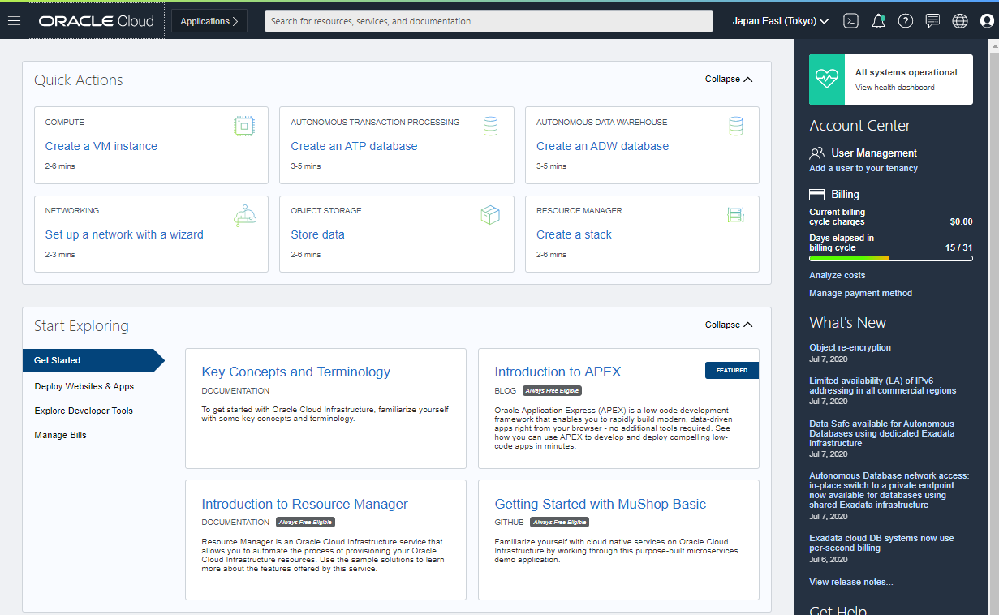

  

  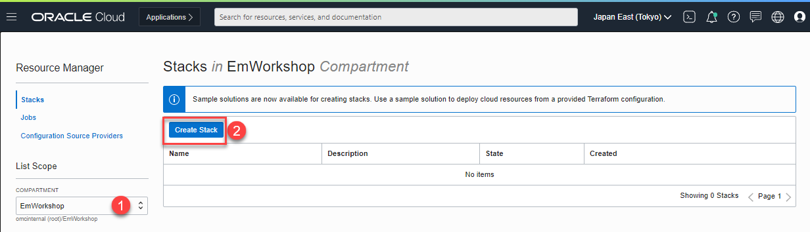

4.  Select **My Configuration**, Click the **Browse** link and select the zip file ([emcc-mkplc-v3-freetier.zip) that you downloaded. Click **Select**.

  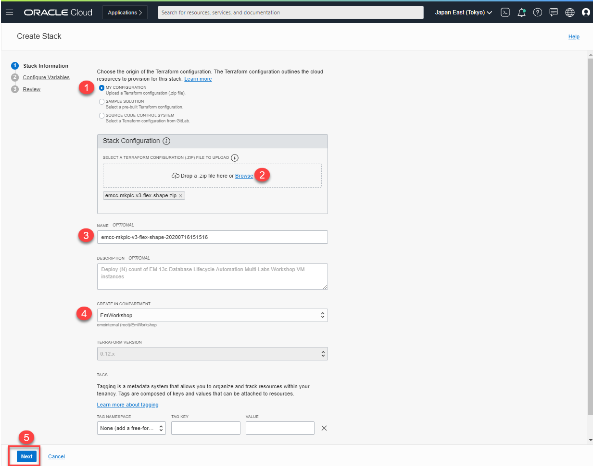

Enter the following information:
  - **Name**:  Enter a name  or keep the prefilled default (*DO NOT ENTER ANY SPECIAL CHARACTERS HERE*, including periods, underscores, exclamation etc, it will mess up the configuration and you will get an error during the apply process)
  - **Description**:  Same as above
  - **Create in compartment**:  Select the correct compartment if not already selected

*Note: If this is a newly provisioned tenant such as freetier with no user created compartment, stop here and first create it before proceeding.*

5.  Click **Next**.

  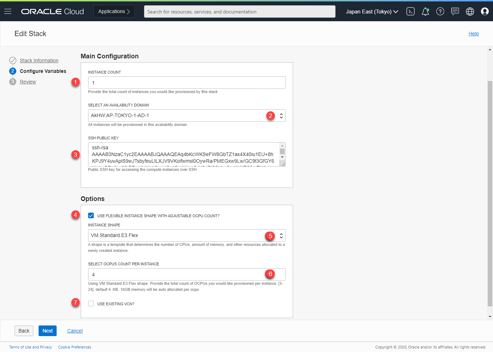

Enter or select the following:
  - **Instance Count:** Keep the default to **1** to create only one instance. You may also choose to a higher number if you need more than one instance created.
  - **Select Availability Domain:** Select an availability domain from the dropdown list.
  - **SSH Public Key**:  Paste the public key you created in the earlier lab

  *Note: If you used the Oracle Cloud Shell to create your key, make sure you paste the pub file in a notepad, remove any hard returns.  The file should be one line or you will not be able to login to your compute instance*

  - **Use Flexible Instance Shape with Adjustable OCPU Count?:** Keep the default by leaving checked to use ***VM.Standard.E3.Flex*** shape. If you prefer shapes of fixed OCPUs types, then check to select and use the default shown (***VM.Standard.E2.4***) or select the desired shape from the dropdown menu.
  - **Instance OCPUS:** Keep the default to **4** to provision ***VM.Standard.E3.Flex*** shape with 4 OCPU's.

*Note: Instance OCPUS only applies to Flex Shapes and won't be displayed if you elect to use shapes of fixed OCPUs types*

  - **Use Existing VCN?:** Keep the default by leaving unchecked to create a new VCN.

  - Click **Next step**.

6. Review and click **Create**.

  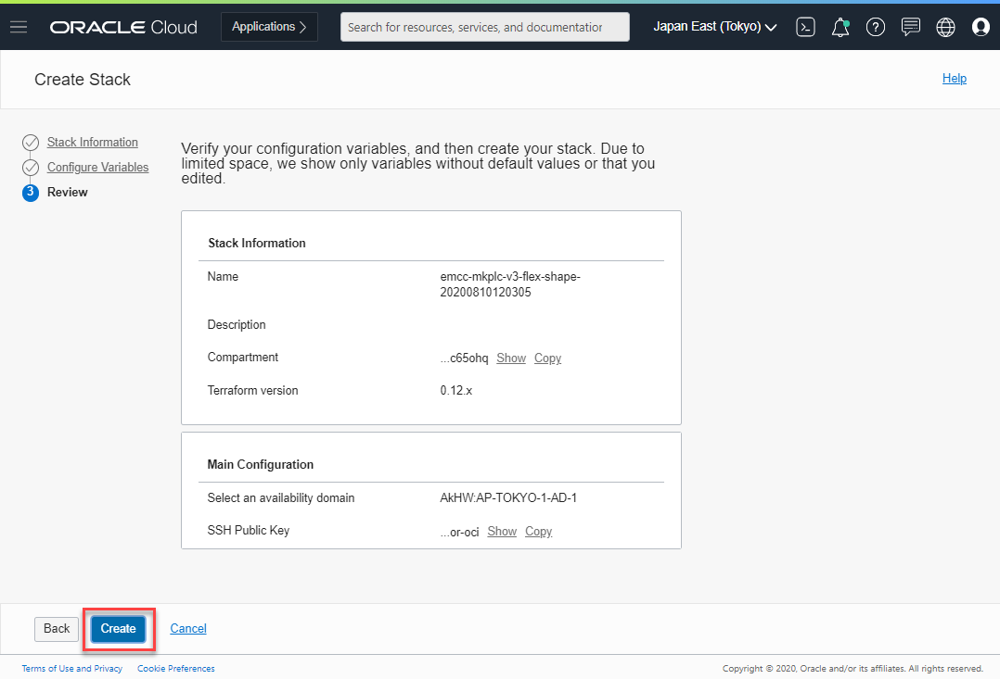

7. Your stack has now been created!  

  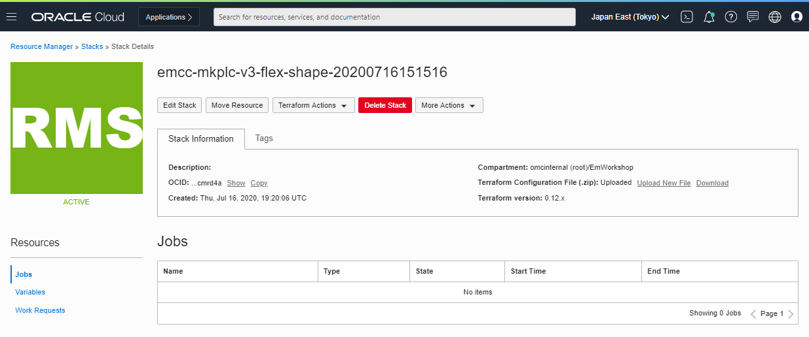

You may now proceed to Step 2 (skip Step 1B).

## **Step 1B**: Create Stack:  Compute only
If you just completed Step 1A, please proceed to Step 2.  If you have an existing VCN and are comfortable updating VCN configurations, please ensure your VCN meets the minimum requirements.  
- Egress rules for the following ports:  9851, 7803, 22          

1. Click on the link below to download the Resource Manager zip file you need to build your environment.  
  - [emcc-mkplc-v3-freetier.zip](https://objectstorage.us-ashburn-1.oraclecloud.com/p/9pLAit-dYlCGrpnHDDXoXGbfrYsiH7AsyJPLjBRrH48/n/omcinternal/b/workshop-labs-files/o/emcc-mkplc-v3-freetier.zip)
  - Packaged terraform instance creation script for creating network and instance running the Oracle Marketplace Image

2. Save in your downloads folder.
3. Open up the hamburger menu in the left hand corner.  Choose the compartment in which you would like to install. In this example we choose *EmWorkshop*.  Choose **Resource Manager > Stacks**.  

  

  

  

4. Select **My Configuration**, Click the **Browse** link and select the zip file ([emcc-mkplc-v3-freetier.zip) that you downloaded. Click **Select**.

  

Enter the following information:
  - **Name**:  Enter a name  or keep the prefilled default (*DO NOT ENTER ANY SPECIAL CHARACTERS HERE*, including periods, underscores, exclamation etc, it will mess up the configuration and you will get an error during the apply process)
  - **Description**:  Same as above
  - **Create in compartment**:  Select the correct compartment if not already selected

*Note: If this is a newly provisioned tenant such as freetier with no user created compartment, stop here and first create it before proceeding.*

5. Click **Next**.

    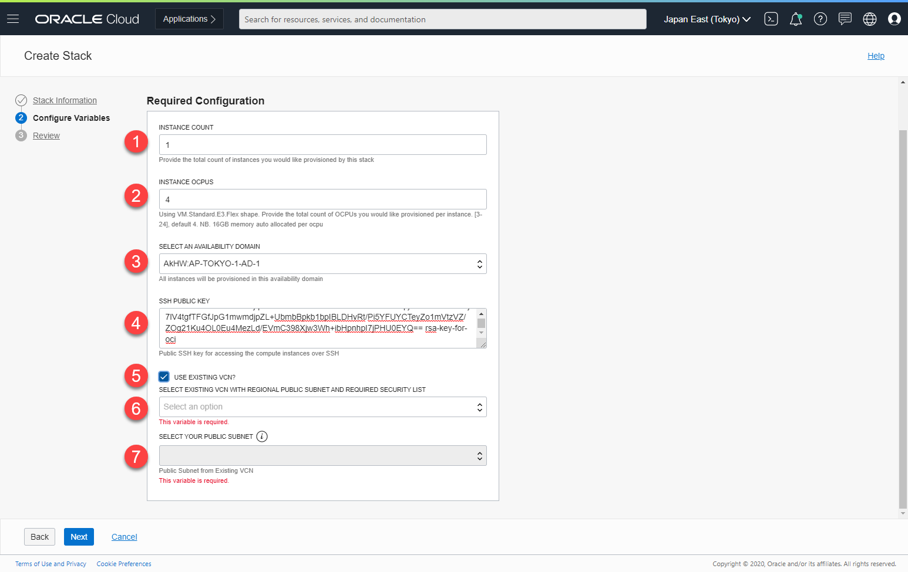

Enter or select the following:
  - **Instance Count:** Keep the default to **1** to create only one instance. You may also choose to a higher number if you need more than one instance created.
  - **Select Availability Domain:** Select an availability domain from the dropdown list.
  - **SSH Public Key**:  Paste the public key you created in the earlier lab

  *Note: If you used the Oracle Cloud Shell to create your key, make sure you paste the pub file in a notepad, remove any hard returns.  The file should be one line or you will not be able to login to your compute instance*

  - **Use Flexible Instance Shape with Adjustable OCPU Count?:** Keep the default by leaving checked to use ***VM.Standard.E3.Flex*** shape. If you prefer shapes of fixed OCPUs types, then check to select and use the default shown (***VM.Standard.E2.4***) or select the desired shape from the dropdown menu.
  - **Instance OCPUS:** Keep the default to **4** to provision ***VM.Standard.E3.Flex*** shape with 4 OCPU's.

*Note: Instance OCPUS only applies to Flex Shapes and won't be displayed if you elect to use shapes of fixed OCPUs types*

  - **Use Existing VCN?:** Check to select.

    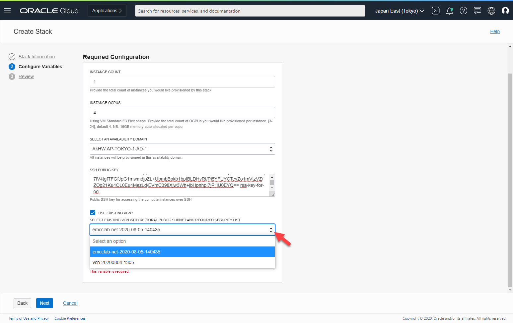

  - **Select Existing VCN?:** Select existing VCN with regional public subnet and required security list.

    

  - **Select Public Subnet:** Select existing public subnet from above VCN.

*Note: For an existing VCN Option to be used successful, review the details at the bottom of this section*

6. Review and click **Create**.

    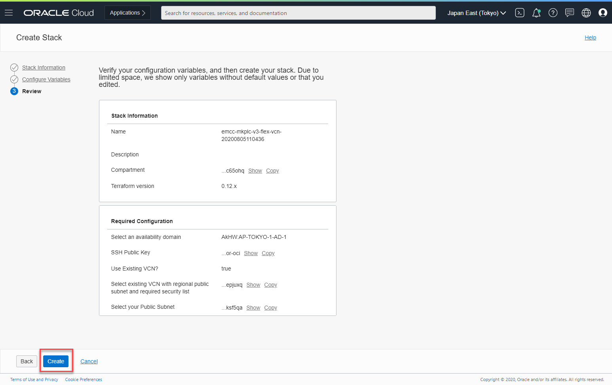

7. Your stack has now been created!  

    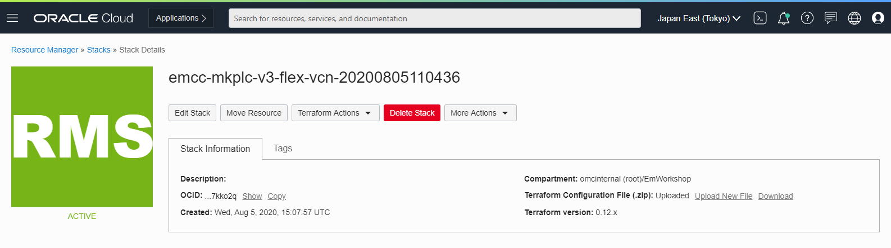

## **Step 2:** Terraform Plan (OPTIONAL)
When using Resource Manager to deploy an environment, execute a terraform **plan** to verify the configuration. You may skip to Step 3.

1.  **[OPTIONAL]** Click **Terraform Actions** -> **Plan** to validate your configuration.  This takes about a minute, please be patient.

    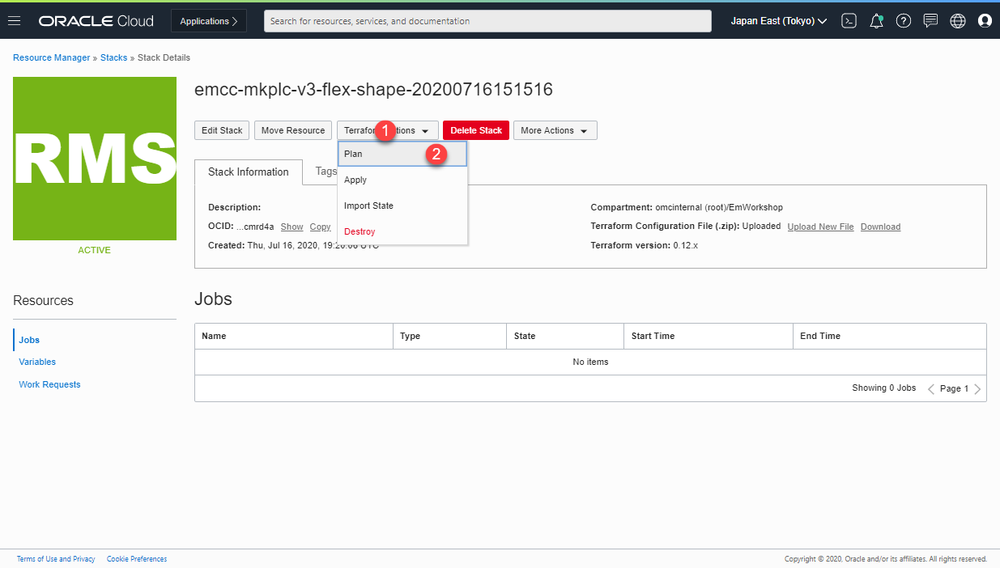

    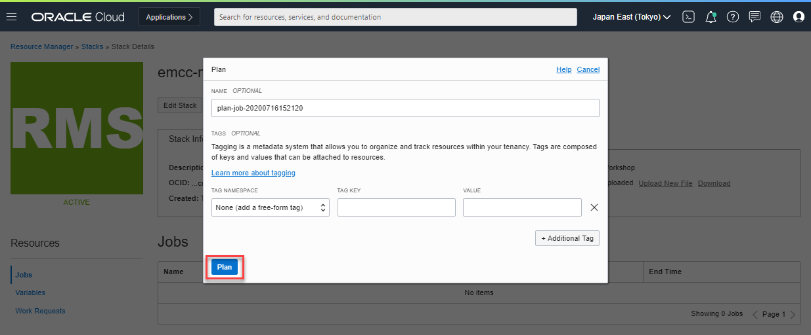

    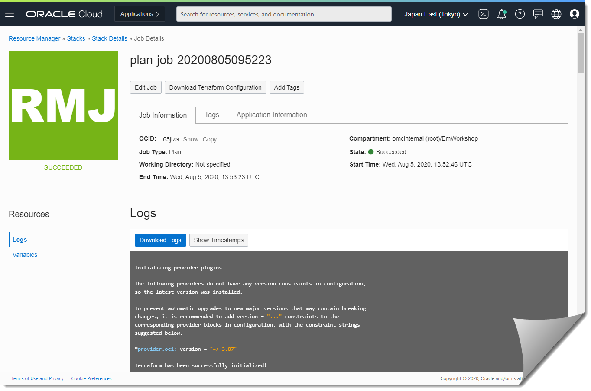

    

    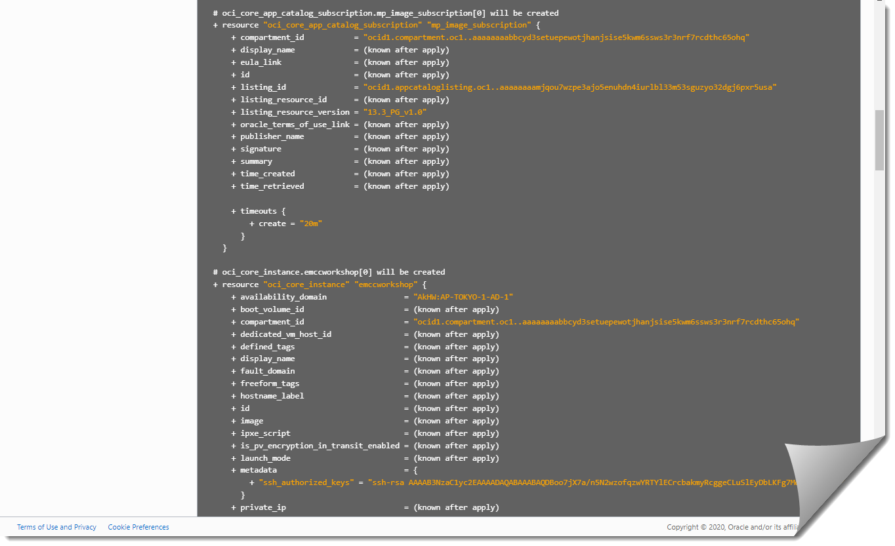

    

## **Step 3:** Terraform Apply
When using Resource Manager to deploy an environment, execute a terraform **plan** and **apply**.  Let's do that now.

1.  At the top of your page, click on **Stack Details**.  Click the button, **Terraform Actions** -> **Apply**.  This will create your network (unless you opted to use and existing VCN) and instance(s) containing a pre-configured Enterprise Manager 13c with running database targets.

    

    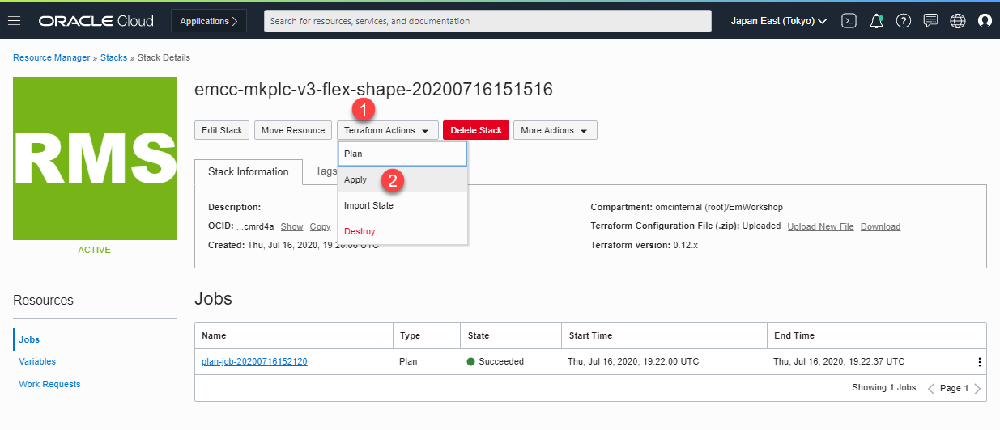

    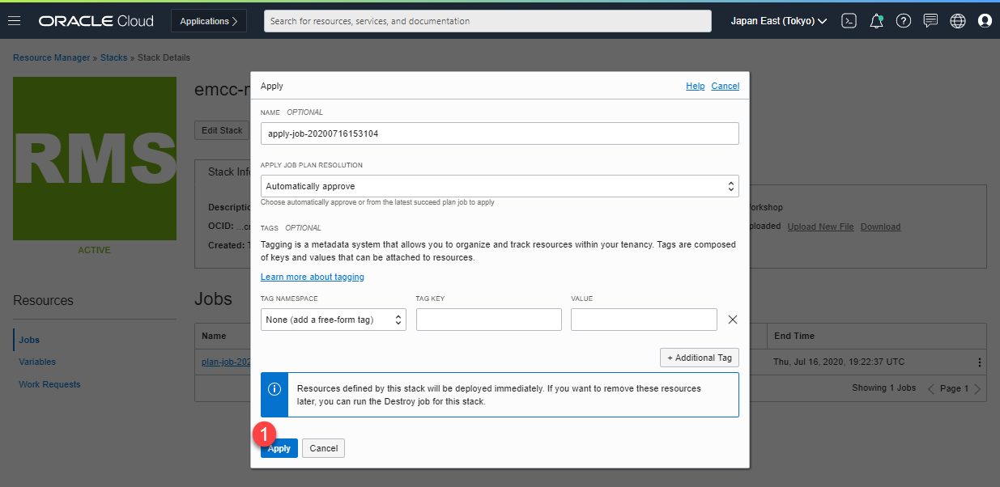

2.  Once this job succeeds, you will get an apply complete notification from Terraform.  Examine it closely, 8 resources have been added (3 only if using an existing VCN).  Congratulations, your environment is created!  Time to login to your instance and validate before getting started on labs.

    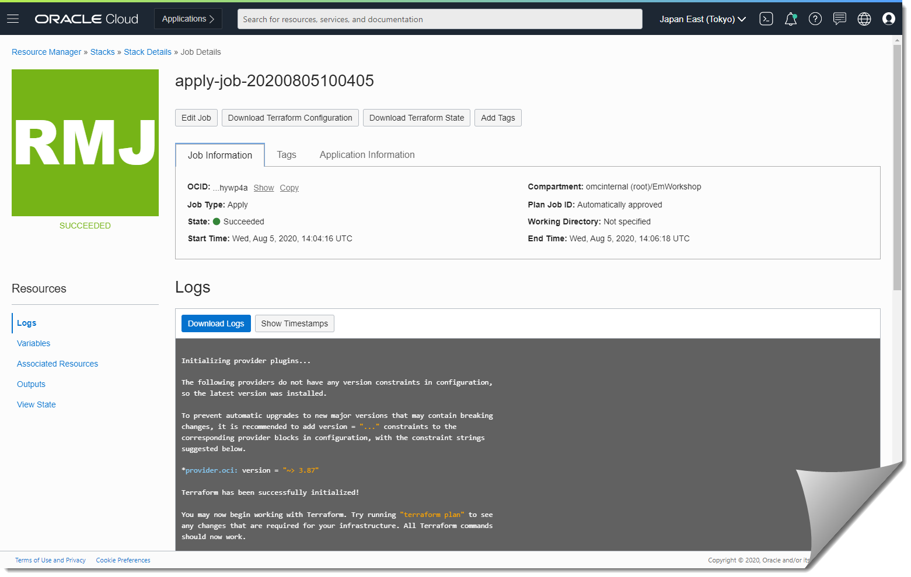

    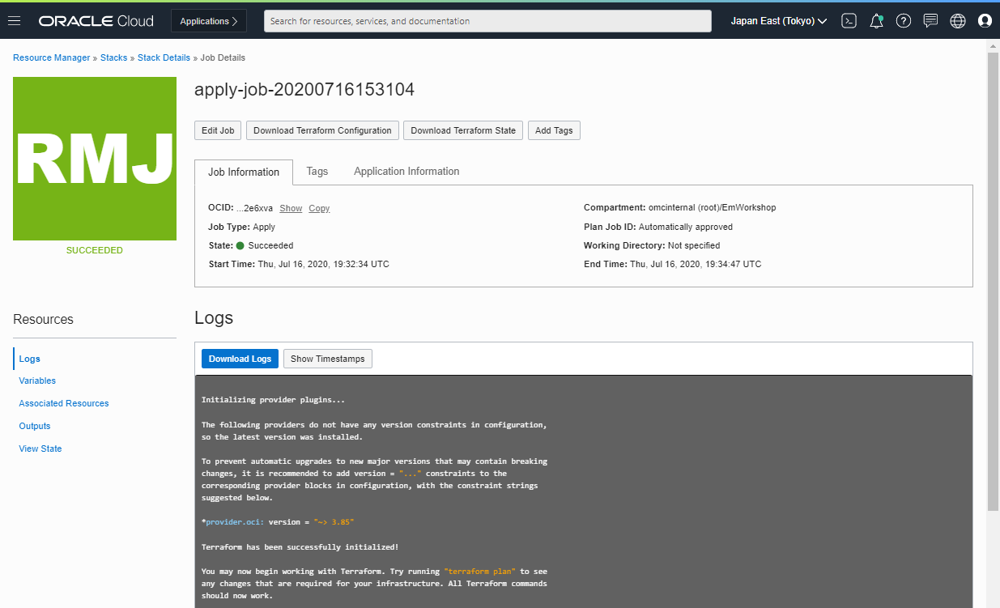

    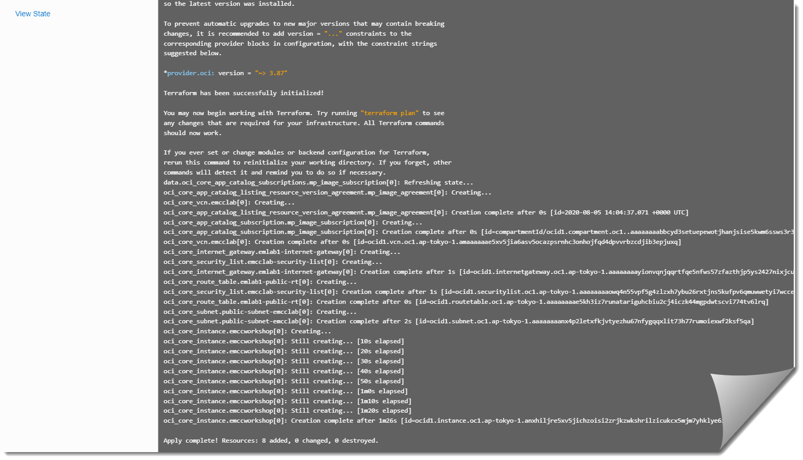

    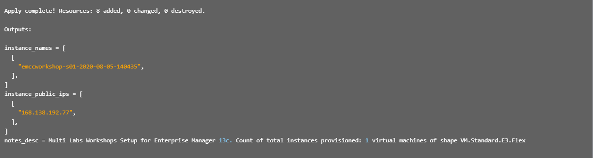

## **Step 4:** Connect to your instance

Choose the environment where you created your ssh-key in the previous lab (Generate SSH Keys)
  - *NOTE 1:  If you are using your laptop to connect your corporate VPN may prevent you from logging in.*
  - *NOTE 2: The ssh-daemon is disabled for the up to 5 minutes or so while the instance is processing.  If you are unable to connect and sure you have a valid key, wait a few minutes and try again.*
  - *NOTE 3: It takes about 30 minutes for all Enterprise Manager processes and monitored databases to fully start upon instance creation before you can access the EM console*

### Oracle Cloud Shell

1. To re-start the Oracle Cloud shell, go to your Cloud console and click the cloud shell icon to the right of the region.  *Note: Make sure you are in the region you were assigned*

    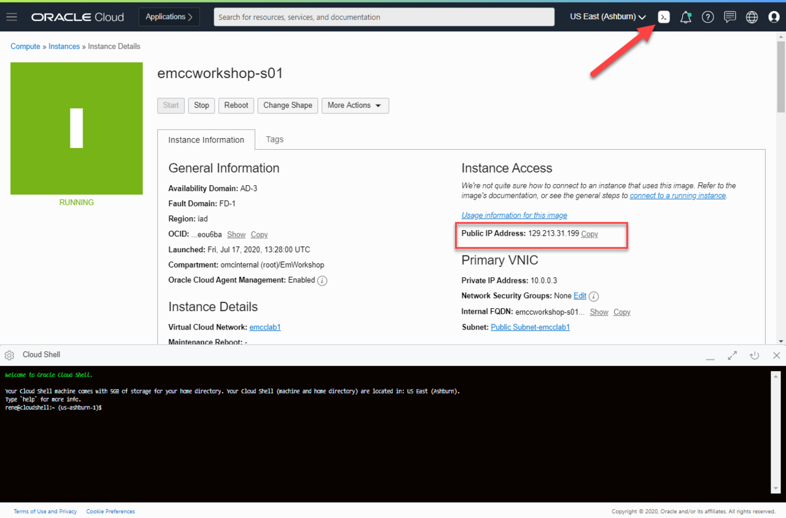

2.  Go to **Compute** -> **Instance** and select the instance you created (make sure you choose the correct compartment)
3.  On the instance homepage, find the Public IP address for your instance.
4.  Enter the command below to login to your instance.    
    ````
    ssh -i ~/.ssh/<sshkeyname> opc@<Your Compute Instance Public IP Address>
    ````

    

If you used the default RSA key name of **id_rsa** then use the following to connect as there's no need to explicitly specify the key.

````
ssh  opc@<Your Compute Instance Public IP Address>
````

5.  When prompted, answer **yes** to continue connecting.
6.  Continue to Step 5 on the left hand menu.

### MAC or Windows CYGWIN Emulator
1.  Go to **Compute** -> **Instance** and select the instance you created (make sure you choose the correct compartment)
2.  On the instance homepage, find the Public IP address for your instance.
3.  Open up a terminal (MAC) or cygwin emulator as the opc user.  Enter yes when prompted.

    ````
    ssh -i ~/.ssh/<sshkeyname> opc@<Your Compute Instance Public IP Address>
    ````
    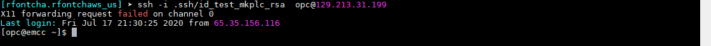

4.  After successfully logging in, proceed to Step 5.

### Windows using Putty

On Windows, you can use PuTTY as an SSH client. PuTTY enables Windows users to connect to remote systems over the internet using SSH and Telnet. SSH is supported in PuTTY, provides for a secure shell, and encrypts information before it's transferred.

1.  Download and install PuTTY. [http://www.putty.org](http://www.putty.org)
2.  Run the PuTTY program. On your computer, go to **All Programs > PuTTY > PuTTY**
3.  Select or enter the following information:
    - Category: _Session_
    - IP address: _Your service instance’s public IP address_
    - Port: _22_
    - Connection type: _SSH_

    

#### **Configuring Automatic Login**

1.  In the category section, **Click** Connection and then **Select** Data.

2.  Enter your auto-login username. Enter **opc**.

    

#### **Adding Your Private Key**

1.  In the category section, **Click** Auth.
2.  **Click** browse and find the private key file that matches your VM’s public key. This private key should have a .ppk extension for PuTTy to work.

    

To save all your settings:

1.  In the category section, **Click** session.
2.  In the saved sessions section, name your session, for example ( EM13C-ABC ) and **Click** Save.

You may now *proceed to the next lab*.

## Appendix:  Teraform and Resource Manager
Terraform is a tool for building, changing, and versioning infrastructure safely and efficiently.  Configuration files describe to Terraform the components needed to run a single application or your entire datacenter.  In this lab a configuration file has been created for you to build network and compute components.  The compute component you will build creates an image out of Oracle's Cloud Marketplace.  This image is running Oracle Linux 7.

Resource Manager is an Oracle Cloud Infrastructure service that allows you to automate the process of provisioning your Oracle Cloud Infrastructure resources. Using Terraform, Resource Manager helps you install, configure, and manage resources through the "infrastructure-as-code" model. To learn more about OCI Resource Manager, take a watch the video below.

[](youtube:udJdVCz5HYs)

### Oracle Cloud Marketplace
The Oracle Cloud Marketplace is a catalog of solutions that extends Oracle Cloud services.  It offers multiple consumption modes and deployment modes.  In this lab we will be deploying the free Oracle Enterprise Manager 13c Workshop marketplace image.

[Link to OCI Marketplace](https://www.oracle.com/cloud/marketplace/)

## Appendix:  Adding Security Rules to an Existing VCN
This workshop requires a certain number of ports to be available.

1.  Go to Networking -> Virtual Cloud Networks
2.  Choose your network
3.  Under Resources, select Security Lists
4.  Click on Default Security Lists under the Create Security List button
5.  Click Add Ingress Rule button
6.  Enter the following:  
    - Source CIDR: 0.0.0.0/0
    - Destination Port Range: 9851, 7803, 22
7.  Click the Add Ingress Rules button

## Appendix: Troubleshooting Tips

If you encountered any issues during the lab, follow the steps below to resolve them.  If you are unable to resolve, please skip to the **Need Help** section to submit your issue via our  support forum.
- Availability Domain Mismatch
- Limits Exceeded
- Invalid public key
- Flex Shape Not Found

### Issue 1: Availability Domain Mismatch


#### Issue #1 Description
When creating a stack and using an existing VCN, the availability domain and the subnet must match otherwise the stack errors.  

#### Fix for Issue #1
1.  Click on **Stack**-> **Edit Stack** -> **Configure Variables**.
2.  Scroll down to the network definition.
3.  Make sure the Availability Domain number matches the subnet number.  E.g. If you choose AD-1, you must also choose subnet #1.
4.  Click **Next**
5.  Click **Save Changes**
6.  Click **Terraform Actions** -> **Apply**

### Issue 2: Invalid public key


#### Issue #2 Description
When creating your SSH Key, if the key is invalid the compute instance stack creation will throw an error.

#### Tips for fixing for Issue #2
- Go back to the instructions and ensure you create and **copy/paste** your key into the stack correctly.
- Copying keys from Cloud Shell may put the key string on two lines.  Make sure you remove the hard return and ensure the key is all one line.
- Ensure you pasted the *.pub file into the window.
1.  Click on **Stack**-> **Edit Stack** -> **Configure Variables**.
2.  Repaste the correctly formatted key
3.  Click **Next**
4.  Click **Save Changes**
5.  Click **Terraform Actions** -> **Apply**

### Issue 3: Flex Shape Not Found


#### Issue #3 Description
When creating a stack your ability to create an instance is based on the capacity you have available for your tenancy.

#### Fix for Issue #3
If you have other compute instances you are not using, you can go to those instances and delete them.  If you are using them, follow the instructions to check your available usage and adjust your variables.
1. Click on the Hamburger menu, go to **Governance** -> **Limits, Quotas and Usage**
2. Select **Compute**
3. These labs use the following compute types.  Check your limit, your usage and the amount you have available in each availability domain (click Scope to change Availablity Domain)
4. Look for Standard.E2, Standard.E3.Flex and Standard2
4.  Click on the hamburger menu -> **Resource Manager** -> **Stacks**
5.  Click on the stack you created previously
6.  Click **Edit Stack** -> **Configure Variables**.
7.  Scroll down to Options
8.  Change the shape based on the availability you have in your system
9.  Click **Next**
10. Click **Save Changes**
11. Click **Terraform Actions** -> **Apply**

### Issue 4: Limits Exceeded


#### Issue #4 Description
When creating a stack your ability to create an instance is based on the capacity you have available for your tenancy.

#### Fix for Issue #4
If you have other compute instances you are not using, you can go to those instances and delete them.  If you are using them, follow the instructions to check your available usage and adjust your variables.

1. Click on the Hamburger menu, go to **Governance** -> **Limits, Quotas and Usage**
2. Select **Compute**
3. These labs use the following compute types.  Check your limit, your usage and the amount you have available in each availability domain (click Scope to change Availablity Domain)
4. Look for Standard.E2, Standard.E3.Flex and Standard2
5. This workshop requires at least 4 OCPU and a minimum of 30GB of memory.  If you do not have that available you may request a service limit increase at the top of this screen.  If you have located capacity, please continue to the next step.
6.  Click on the Hamburger menu -> **Resource Manager** -> **Stacks**
7.  Click on the stack you created previously
8.  Click **Edit Stack** -> **Configure Variables**.
9.  Scroll down to Options
10. Change the shape based on the availability you have in your system
11. Click **Next**
12. Click **Save Changes**
13. Click **Terraform Actions** -> **Apply**

## Acknowledgements
- **Author** - Rene Fontcha, Master Principal Solutions Architect, NA Technology
- **Contributors** - Kay Malcolm, Product Manager, Database Product Management
- **Last Updated By/Date** - Kay Malcolm, Product Manager, Database Product Management, August 2020

## Need Help?
Please submit feedback or ask for help using our [LiveLabs Support Forum](https://community.oracle.com/tech/developers/categories/enterprise-manager). Please click the **Log In** button and login using your Oracle Account. Click the **Ask A Question** button to the left to start a *New Discussion* or *Ask a Question*.  Please include your workshop name and lab name.  You can also include screenshots and attach files.  Engage directly with the author of the workshop.

If you do not have an Oracle Account, click [here](https://profile.oracle.com/myprofile/account/create-account.jspx) to create one.
