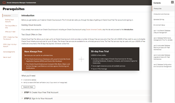

# Oracle Enterprise Manager Github

Oracle Enterprise Manager is Oracle’s on-premise management platform that provides a single dashboard to manage all of your Oracle deployments, in your data center or in the cloud. Through deep integration with Oracle’s product stack, it provides market-leading management and automation support for Oracle applications, databases, middleware, hardware, and engineered systems.  

## Workshops
Click on one of the options below to access the content.

    

- [I have a Freetier or Oracle Cloud account](https://oracle.github.io/learning-library/enterprise-manageability-library/enterprise_manager/freetier/index.html)
- [I have an account on LiveLabs](https://oracle.github.io/learning-library/enterprise-manageability-library/enterprise_manager/livelabs/index.html)

## Get an Oracle Cloud Trial Account for Free!
If you don't have an Oracle Cloud account then you can quickly and easily sign up for a free trial account that provides:
- $300 of free credits good for up to 3500 hours of Oracle Cloud usage
- Credits can be used on all eligible Cloud Platform and Infrastructure services for the next 30 days
- Your credit card will only be used for verification purposes and will not be charged unless you 'Upgrade to Paid' in My Services

Click here to request your trial account: [https://www.oracle.com/cloud/free](https://www.oracle.com/cloud/free)

## Product Pages
- [Oracle Enterprise Manager](https://www.oracle.com/enterprise-manager/)
- [Oracle Database 19c](https://www.oracle.com/database/)

## Documentation
- [Enterprise Manager Documentation Library](https://docs.oracle.com/en/enterprise-manager/index.html)
- [Database Lifecycle Management](https://docs.oracle.com/en/enterprise-manager/cloud-control/enterprise-manager-cloud-control/13.4/lifecycle.html)
- [Database Performance and Change Management](https://docs.oracle.com/en/enterprise-manager/cloud-control/enterprise-manager-cloud-control/13.4/performance.html)
- [Database Cloud Management](https://docs.oracle.com/en/enterprise-manager/cloud-control/enterprise-manager-cloud-control/13.4/cloud.html)

## Videos
- [Oracle Enterprise Videos](https://docs.oracle.com/en/enterprise-manager/cloud-control/enterprise-manager-cloud-control/13.4/videos.html)

### Issues?
Please submit an issue on our [issues](https://github.com/oracle/learning-library/issues) page.  We review it regularly.

-- Oracle Enterprise Manager Product Management
