 

**DATABASE PERFORMANCE MANAGEMENT OF ON-PREMISES & ORACLE CLOUD INFRASTRUCTURE USER MANAGED SYSTEMS using Oracle Enterprise Manager** 
================================================================

The objective is to become familiar with on-premise and Oracle Cloud Database performance management (Virtual Machine/Bare Metal/Exadata Cloud Service) capabilities using Oracle Enterprise Manager Cloud. 

============================================================

### Contents

- **Activity 1:** Performance Hub

- **Activity 2:** Real-time database operation monitoring

- **Activity 3:** Tuning a SQL in a PDB

- **Activity 4:** SQL Performance Analyzer Optimizer Statistics

- **Activity 5:** Database Workload Replay (optional, time permitting)

Estimated time to complete all activities is 60 minutes.

| **No** | **Feature**                                   | **Approx. Time** | **Details**                                                                                                                                                                                                                    | **Value proposition**                                                                                                                                                                                                                                                                                                                                                                                                                                                                                                                                                       |
|--------|-----------------------------------------------|------------------|--------------------------------------------------------------------------------------------------------------------------------------------------------------------------------------------------------------------------------|-----------------------------------------------------------------------------------------------------------------------------------------------------------------------------------------------------------------------------------------------------------------------------------------------------------------------------------------------------------------------------------------------------------------------------------------------------------------------------------------------------------------------------------------------------------------------------|
| **1**  | Performance Hub                               | 15 minutes       | Oracle Enterprise Manager 13c includes a new Jet based unified Performance Hub Jet interface for performance monitoring.                                                                                           | Performance Hub is a single pane of glass view of database performance with access to Active Session History (ASH) Analytics, Real-time SQL Monitoring and SQL Tuning together. The time picker allows the administrator to switch between Real-Time and Historical views of database performance.                                                                                                                                                                                                                                                                      |
| **2**  | Real-time database operation monitoring       | 10 minutes       | Real-Time Database Operations Monitoring, introduced in Oracle Database 12c, enables an administrator to monitor long running database tasks as a composite business operation.                                                | Developers and DBAs can define business operations for monitoring by explicitly specifying the start and end of an operation or implicitly with tags that identify the operation.                                                                                                                                                                                                                                                                                                                                                                                              |
| **3**  | Tuning a SQL in a Pluggable Database (PDB)                         | 10 minutes       | In this activity see how a pluggable database administrator can tune queries in a PDB.                                                                                                                                        | The DBA for the PDB will not have access to the Container so their view is restricted to the queries running in the PDB assigned to them. This activity identifies a Top SQL in a PDB and then tune it using SQL Tuning Advisor.                                                                                                                                                                                                                                                                                                                                  |
| **4**  | SQL Performance Analyzer Optimizer Statistics | 10 minutes       | The objective of this activity is to demonstrate and use the SQL Performance Analyzer functionality of Real Application Testing capabilities in Oracle Enterprise Manager Cloud Control 13c with Oracle Database 18c. | SQL Performance Analyzer gathers Oracle Database Optimizer statistics for validation                                                                                                                                                                                                                                                                                                                                                                                                                                                                                                             |
| **5**  | Database Workload Replay                      | 10 minutes       | The objective of this activity is to is to demonstrate and use the Database Replay functionality of Real Application Testing capabilities in Oracle Enterprise Manager Cloud Control 13c and Oracle Database 18c.                | **Scenario:** You've been asked to add three new indexes for an application, but before adding, you want proof that database performance is improved. Use of SQL Performance Analyzer (SPA) isn't enough becuase there is also the cost of maintaining the indexes. Replay will be performed against the **Sales** Container Database and changes need to be performed in the OLTP Container against the **DWH_TEST** schema. The database version is 18c so the capture and replay are performed using a CDB. |

_____________________________________
### **Running your Workload**

Option 1:
1. Log into an Enterprise Manager VM (using provided IP). The Enterprise Manager credentials are “sysman/welcome1”.

2. From the upper left, navigate from **Enterprise** to **Job** to then **Library**
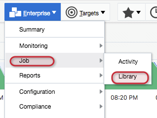
3. Locate and select the job name **1-DB_LAB_START**, and Click the Submit  button.

4. Then Click the Submit button in the upper right of your window.
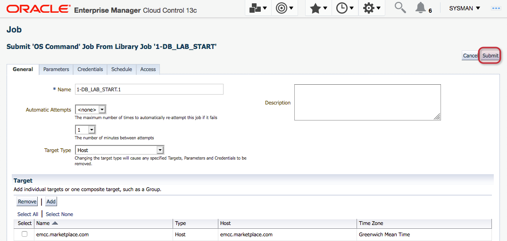

5. The workload is now started and takes a few minutes to ramp up.
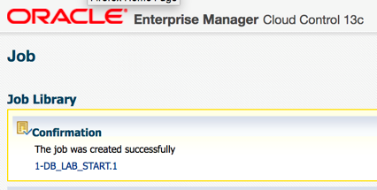

Option 2:

- •	$ sudo su - oracle

- •	Change directory to scripts

- •	$ cd scripts

- •	Set the environment for the database by runnings

- •	$ source SALESENV

- •	Execute the script 1-db_lab_start.sh as shown below
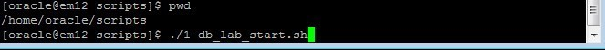

# *Database Performance Management*

 **Activity 1: Performance Hub**
======================================================================

1.  Log into an Enterprise Manager VM (using provided IP). The Enterprise Manager credentials are “sysman/welcome1”.

2.  **Click** on the Targets, then Databases. You will be directed to the list of
    Databases in EM.

3. Here you will notice different databases listed, such as SALES, HR etc., we will work the sales container database. **Select** the Sales database from the list, this will take you to the DB home page
    for this database

4.  **Click** on the Containers tab. It is located at the upper right-hand corner of
    the page, underneath the Performance tile. This will show the list of
    pluggable databases in the CDB and their activity

5.  Notice that the PSALES database is the busiest. We focus our attention to this
PDB. Let us now navigate to Performance Hub. **Select** Performance Hub from the Performance Menu and **Click** on ASH Analytics
    and use the sales_system credential name from the database login screen

6. Make sure to slide the time picker on an area of high usage (e.g., CPU, IO or
Waits). Notice how the corresponding selected time window also changes in the
summary section. You can also resize the slider to entirely cover the time period of your interest. 

    Notice the graph at bottom, it is providing more detailed view of the time window you selected. By Default the wait class dimension is selected. On the right hand side of the graph you have a list of wait classes for the time window you selected (blue for user I/O, green for CPU etc.). Notice how the color changes if you hover over either the menu or the graph to highlight the particular wait class. 
    
    Wait class isn’t the only dimension you can drill into the performance issue by. Let’s say you wanted to identify the SQL that was causing the biggest
performance impact. You can do that by **Clicking** the drop down list and changing
the top dimension from wait class to SQL ID.

7.  **Select** the SQL ID dimension from the list of available dimensions (Under Top
    Dimensions) using the dropdown box that is currently displaying Wait Class.
    Top Dimensions SQL ID

8. **Hover** your mouse on top of the SQL (one at the bottom) and you will be able
to see how much activity is consumed by this SQL. Now using the same list of filters select the PDB dimension. Session
Identifiers PDB

9. What do you see? The chart changes to activity by the different pluggable databases created
in this Container database. **Click** on the ‘PSALES” pluggable database on the
list to add it to the filter by list and drilldown to activity by this PDB
on the same page.

10.  **Click** on the SQL Monitoring Tab

11. You can see all the executed SQL during that time along with different
attributes like ‘user’,’Start’,’Ended’ etc. The test next to the \@ sign
indicates the name of the PDB. **Click** on any SQL of your choice (e.g.
6kd5jj7kr8swv)

12. It will navigate you to show the details of this particular query. You can see
the plan, parallelism and activity of the query. “Plan Statistics” tab is
selected by default. You can see the plan of this query in graphical mode. In some cases, the Monitored SQL may have aged out and no rows are displayed, in
this case try using the time-picker and pick last 24 hrs. time period to
identify the historical SQL that was monitored. 

13. **Select** “Parallel” tab. This will give details about parallel coordinator and parallel slaves.

14. **Click** on the SQL Text tab. You can see the query text which got executed.

15. **Click** on the activity tab to understand about the activity breakdown for this SQL
    
16. **Click** on “Save” button on top right corner of the page. This will help you
    to save this monitored execution in “.html” format, which you can use it to
    share or to diagnose offline.

 **Activity 2: Real-Time Database Operations Monitorings**
======================================================================

**Start the Database Operation.**

The DBOP script is started through a job in Enterprise manager and includes content such as

-   Create Table SH2.CUSTOMER_NEW

-   Insert /\*+APPEND \*/ into SH2.CUSTOMER_NEW

-   Add Primary key to SH2.CUSTOMER_NEW

-   Create table SH2.CUSTOMER_TARGET

-   Merge into SH2.CUSTOMER_TARGET using SH2.CUSTOMER_NEW

-   PL/SQL block performing two SQL statements

-   Select statement on SH2.SALES

**Before any of these statements are executed then we tag the operation with**

    var eid number

    exec :eid := dbms_sql_monitor.begin_operation(dbop_name =\> 'DBOP_DEMO');

    **When the operation has ended we end the tagging with exec**

    dbms_sql_monitor.end_operation('DBOP_DEMO',:eid);

    **This makes it possible to monitor the complete operation as one unit in
    SQL monitoring**

**Now execute the Database Operation job**

1.  Go to Enterprise \> Job \> Library

    

2.  Select job RUN_DATABASE_OPERATIONS

    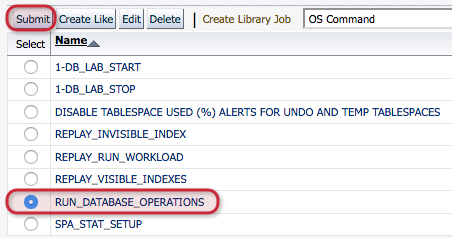

3.  Click Submit button

    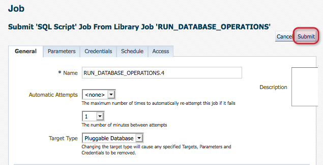

4.  The workload has started.

    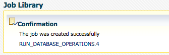

5.  Now go to the Sales database by select Targets \> Databases

    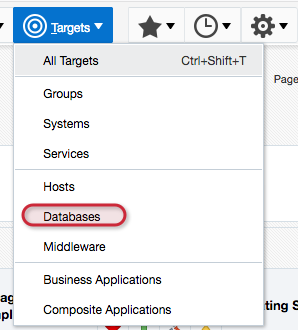

6.  Right click on Sales database to take a shortcut directly to SQL Monitoring

    Hover over **Performance** then **Performance Hub** , Click on SQL Monitor

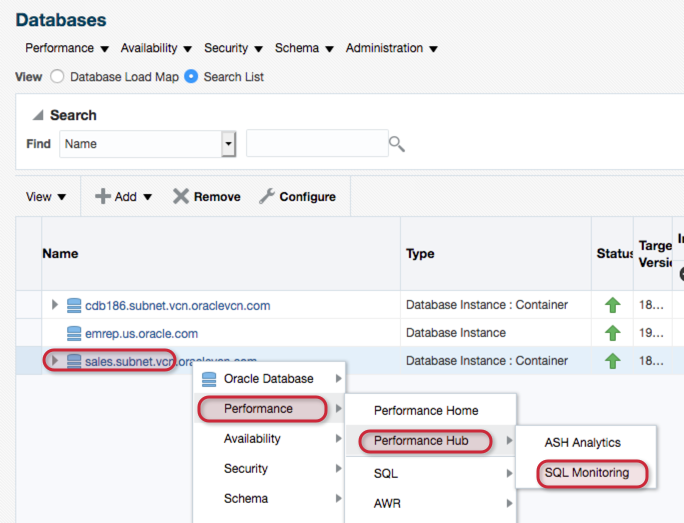

7.  Select the Monitored SQL tab.

    Review the list of currently executing SQLs are visible click on the
    DBOP_DEMO name. This will open the DBOP named DBOP_DEMO.

>   Note: You may need to scroll down or select “Database operations” from the
>   type dropdown

8. Review the details of the Database Operations.

9.  Click on the Activity tab. You will see all the activity for this operation.

 **Activity 3: Tuning a SQL in a PDB**
======================================================================

1. Log into an Enterprise Manager VM (using provided IP). The Enterprise Manager credentials are “sysman/welcome1”.

2.  Once logged into Enterprise Manager, **Select** Targets, then Databases . **Click** on
    the expand icon on the left and click on the database
    **sales.subnet.vcn.oraclevcn.com**

3.  You should now see the Database Home page.

4.  From the Performance Menu **Click** on Performance Hub, then ASH Analytics.

5.  In the bootm left of the page, **Click** on the activity bar for the SQL showing highest activity.

6.  Now schedule the SQL Tuning Advisor by **Clicking** on the **Tune SQL** button.

7.  Accept the default and **Submit** the SQL tuning Job.

8.  Once the job completes. You should see the recommendations for either creating a profile or an index.

9.  Implement the SQL Profile recommendation. SQL Profiles are a great way of tuning a SQL without creating any new objects or making any code changes. 

10. At this point let’s now turn off the load: Change directory to scripts and execute the script *1-db_lab_stop.sh* as shown below

>Alternatively you can use the Enterprise Manager Job Scheduler capability to stop the job.

11. Navigate to Enterprise, then Job, then to Library

12. Select the job *1-DB_LAB_STOP*

13. And then Submit the job

14. When the job is completed, the workload stops

This concludes the Database Performance Management lab activity. You can now move on to Real Application Testing lab activity.

 **Activity 4: SQL Performance Analyzer Optimizer Statistics**
======================================================================

In this activity we need to configure the database to set up optimizer statistics to be stale. So the first step is to create and submit a job that will configure the statistics to be stale.

1.  Execute SPA task using optimizer statistics - Login using username and password **sysman/ welcome1**

2.  Navigate to the Job library, from **Enterprise**, to **Job**, to **Library**

3.  Select SPA_STAT_SETUP and **Click** the **Submit** button

4. Select OS Command in the Create library Job drop down list **Click** Go

5. **Click** the **Submit** button 

6. The job then runs and completes

7. The job is now running. Continue with configuring SPA Quick Check. Navigate to Databases: from the menu, **Targets**, then **Databases**

8. Expand the sales.subnet.vcn.oraclevcn.com database. **Click** on “sales.subnet.vcn.oraclevcn.com_HR” pluggable database.

9. In sales.subnet.vcn.oraclevcn.com_HR database Navigate to **Performance**, to **SQL**, to **SQL Performance Analyzer Quick Check Setup**

10.  This is the page where you configure SPA Quick Check. Make sure that the selected SQL Tuning Set includes as many SQL statements as possible. If the application has specific workloads that are executed during End of Month, End of Year or even certain period during the day, then make sure to collect the workload in separate SQL Tuning Sets and merge them into a “Total Workload Tuning set”

11. In this example we are working with a SQL Tuning Set called PENDING_STATS_WKLD. Select: SQL Tuning Set: PENDING_STATS_WKLD. Select “Comparision Metric”: Buffer Gets **Click** Save.

12.  Navigate To **Performance** , to **SQL** , to **Optimizer Statistics**

13.  **Click** “Gather”

14.  Select “Schema”. Check “Validate the impact of statistics on…..” **Click**  “Next”

15.  **Click**  “Add”

16.  **Click**  “Search”. **Select:** STAT1, STAT2 **Click**  “OK”

17.  **Click**  “Next”

18.  **Click**  “Next”

19.  **Click**  “Submit”

20. In the confirmation section on top, click on the SQL Performance Analyzer
    Task that was started. If you accidentally closed or lost this page, navigate to **DB Target** , then **Performance Menu** ,  then **SQL Performance Analyzer Home** , then **Select** the latest SPA task you just
created at the bottom of the page.

21. You now have now a running SQL Performance Analyzer task. Wait until its Last
    Run Status is Completed. **Click**  on “Name”

22.  As you can see there have been four SQL trials executed. The first two have
    identified SQL statements with plan changes. In the last two trials it is
    only statements with plan changes that have been executed. This will reduce
    the amount of time and resources used in a production system. **Click** on the eyeglasses icon for the second report.

23.  As we can see the majority of our statements had unchanged performance. We
    have a significant improvement but most important to notice is that we have
    no regression. If there had been regression then we have the ability to tune the regressed
statement or use SQL Plan Baselines to remediate the identified regressions.
Note you can also use SQL Tuning Advisor to remediate regressions by
implementing SQL Profile recommendations

24.  Since this application has used stale statistics for a long period, then it would be good to have new statistics implemented. **Click** on “Publish Object Statistics”

25. We can now change statistics for all tables where we have pending
    statistics. For the scope of this exercise we will only change statistics
    for schema STAT1. **Click** the Checkbox for schema STAT1 **Click** Publish

26. **Click** “Yes”

You have now learned how to work with SPA. As you can see there are Guided Workflows that will help you during your analysis and verify that you can implement new changes in production with confidence.

Details about newly published statistics can be found if you navigate **Schema** , to **Database Object** , to **Tables** , and Select tables for schema ‘STAT1’

 **Activity 5: Database Workload Replay** 
======================================================================

We have already created a capture and we have created a Replay task where we have preprocessed the capture and created a draft replay to minimize input errors.

1. From the **Enterprise** menu, navigate to **Quality Management** then **Database Replay** 

    

2.  Select the Tab Replay Task

3.  Click on **Workshop_REPLAY_BB1**

    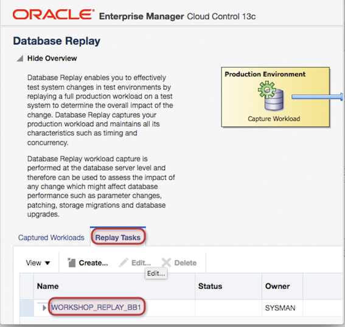

4.  Select **BB_REPLAY_1** and click **Create Like**

    

5.  Provide an unique replay name

    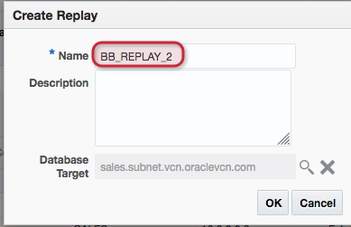

6.  Click on **Replay Workload**

    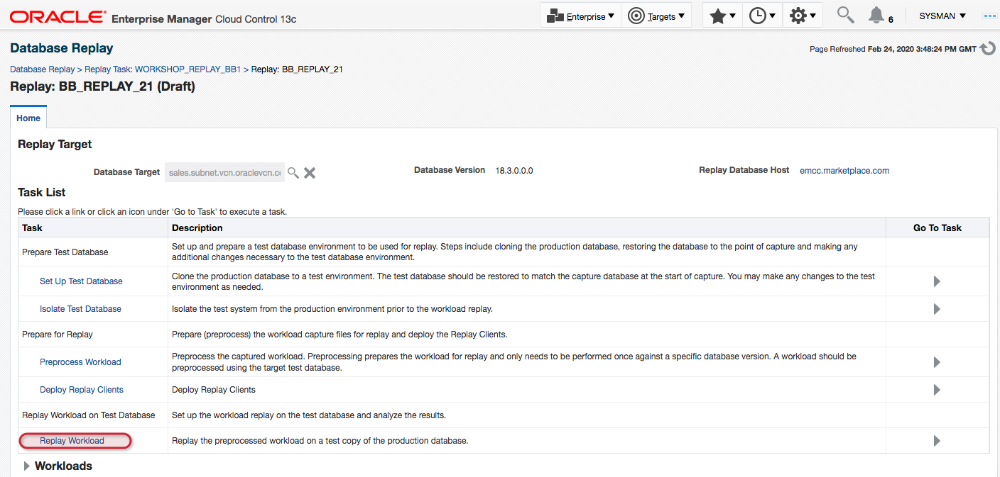

7.  Since this is a Create Like it will remember all settings from previous
    replay. On this page we provide Oracle Database credentials and Oracle
    Database host credentials, then Click the **Next** button.

    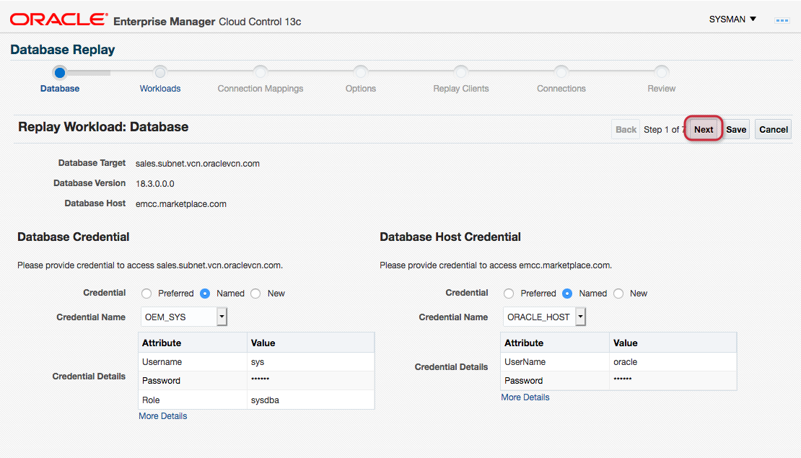

8.  This page contains information about the replay directory storage location,and directory object used. Click the **Next** button.

    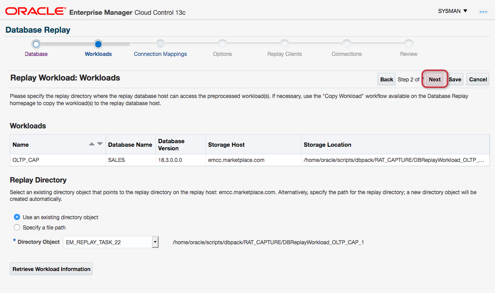

9.  The check validates we have been preprocessing against the same version we
    have been replaying against, but identifies it may not work on all versions
    due to changed behavior in the RDBMS code. So we will allow to override this
    check. In this case we have preprocessed against same Oracle Database so we
    know that versions are same. Preprocess reports 18.0 while database version
    is 18.3. Click the **OK** button.

    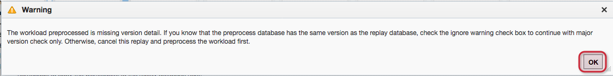

10.  A new row appears with Ignore Preprocess warning and continue to check only
    major database version. Check the **Check** box and click the **Next** button.

    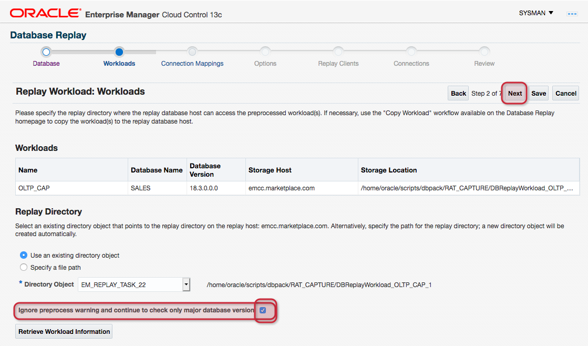

11.  The remap connection page allow us to remap any connections from the production connect string to the test connect string. From Enterprise Manager there are three different methods. Provide a single connect descriptor for all connections. Use a single TNS net service name or separate connect descriptors. In this case we have captured the workload from all PDB’s in a CDB and cannot use single connect descriptors. Each connect descriptor needs to be mapped to its own descriptor. Click the **Next** button.
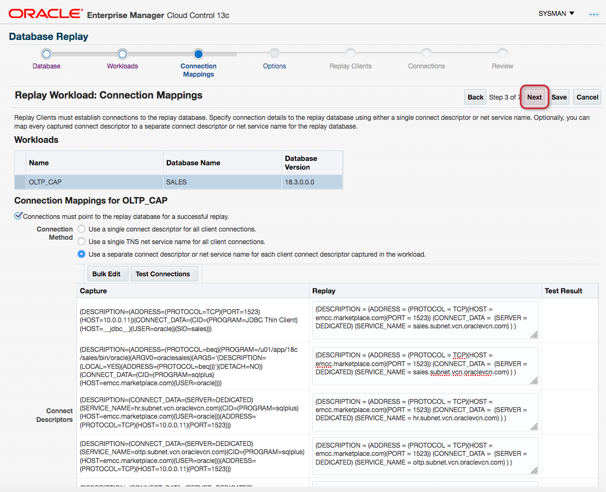

12.  The replay option screen provides the ability to change characteristics of the replay. Enterprise Manager provides three synchronization modes for backward compatibilities. Object ID is deprecated and functionality has been incorporated into SCN synchronization. Off which is used for this replay, is for later release changed to Time. 
With Synchronization = Time each session tries to replay each call according to the timing it was captured. If there are delays if will just impact the delayed session. This may increase the divergence since some sessions may execute SQL/DML statements on data that has either been changed or not been changed by delayed sessions. Click the **OK** button.
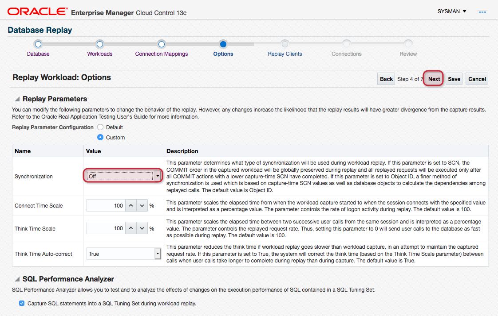

13.  This is the page where we provide information about replay clients. Replay client are the drivers of the workload and consumes CPU, Memory and I/O. When replaying a production workload with several thousands of connections it is not uncommon to start 50 – 100 or even more replay clients. The calculation is that you can run 50 concurrent sessions on a replay client and you can start 4 replay clients/CPU thread so in reality if you have 1000 concurrent sessions then we will consume about 5 CPU threads in a system. We do not want to put this load on the database host since it will reduce the capacity for the database. Replay client should always be located on one or more separate servers. In this exercise we are limited to one server and will therefore start replay clients from same machine. Click the **Edit** tab.
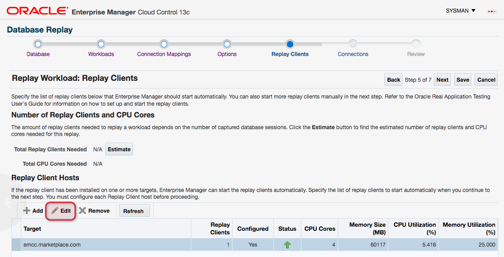

14.  Normal inputs are the hostname and host credentials, replay client Oracle Home directory, client replay directory (this is the path to the replay directory from where replay clients can find the replay files and connect descriptor for how replay clients access the database and login credentials to the database. Click the **OK** button.
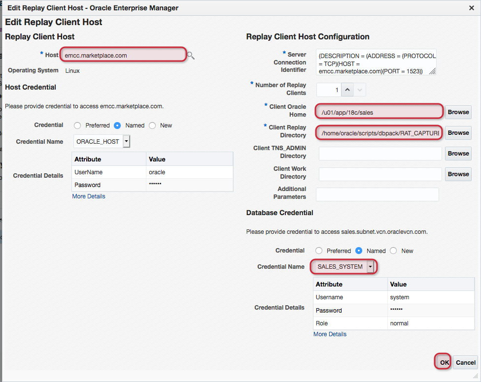

15.  Click the **Next** button.
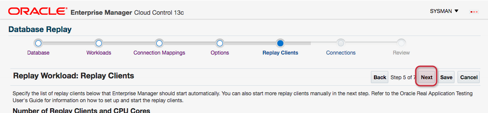

16.  Then click **Start Clients**

17.  Wait until the popup box displays a *Completed Successfully* message, then
    click its **Close** button

18.  Click the **Next** button.
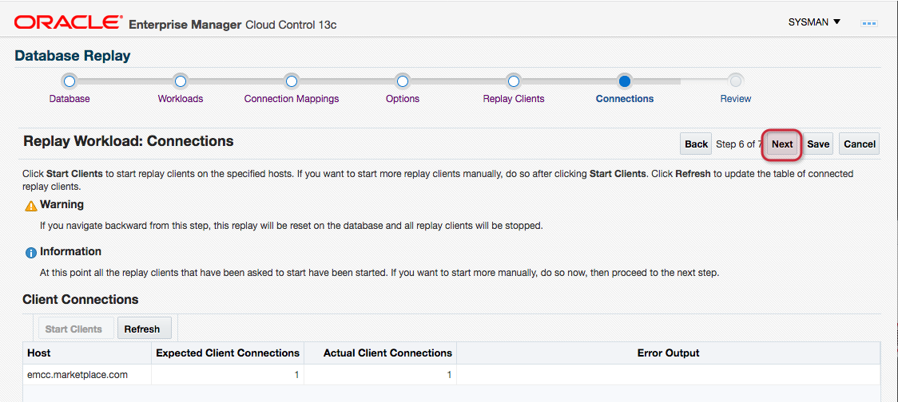

19.  Review and click the **Submit** button.
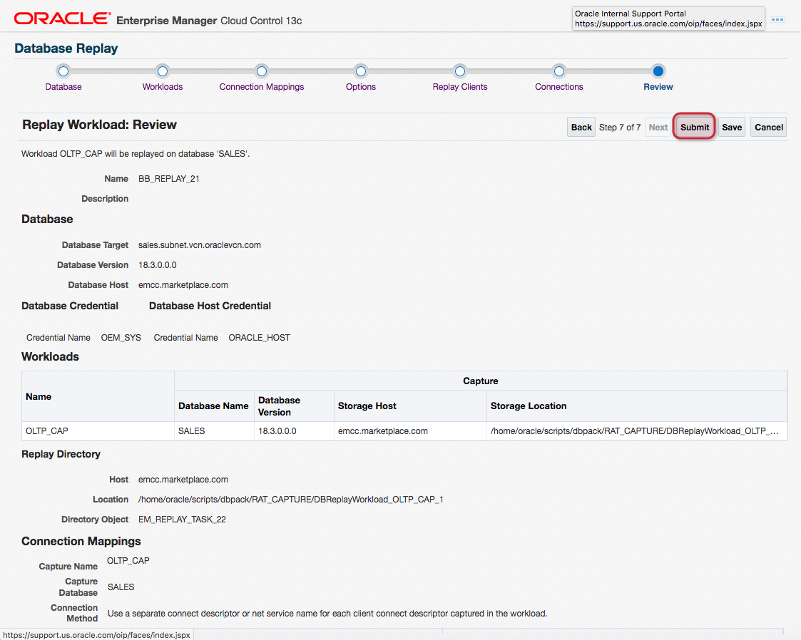

20.  The replay is now running and the progress can be viewed by refreshing the page. The data is only refreshed once a minute from the server so you don’t have to update the page too often. The replay will take about 12 minutes to finish and after there are a few background jobs that will generate the reports. From the **Replay** page we can see that the replay was successful and that the replay used less database time than the capture. This is promising and so it should be possible to implement the new indexes. Click on the **Reports** tab.

21.  There are several different reports that provide further details of the replay. The Database Replay Report provides similar information as the Replay home page you viewed, but this report can be distributed to stakeholders who doesn’t have access to Enterprise Manager.
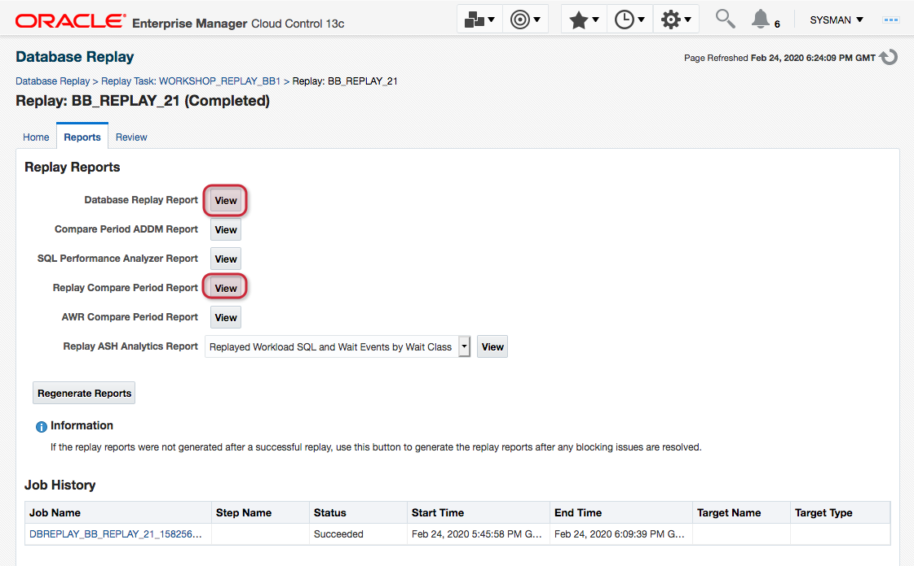
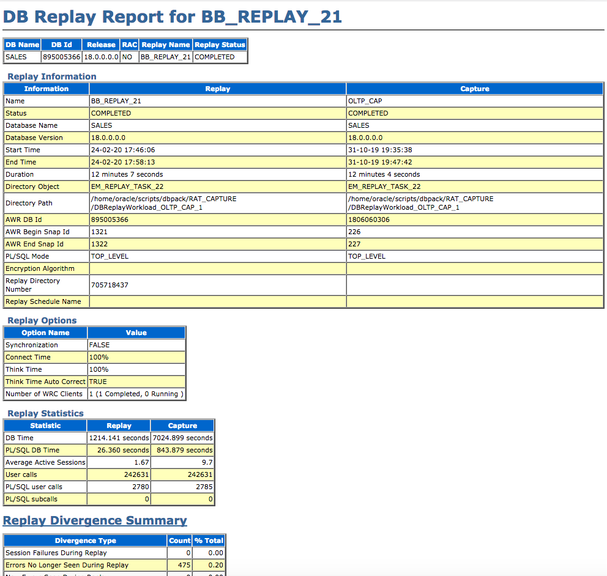

22.  The Compare Period Report Capture vs. Replay provides detailed information about the replay on how the database handles top SQL Statements and if there are any gains on using the new indexes. You can see that top queries improved from 1940 s of DBtime to 40 s of DBtime. 
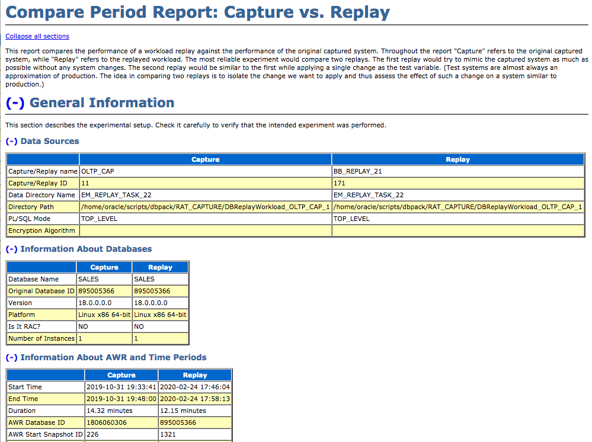
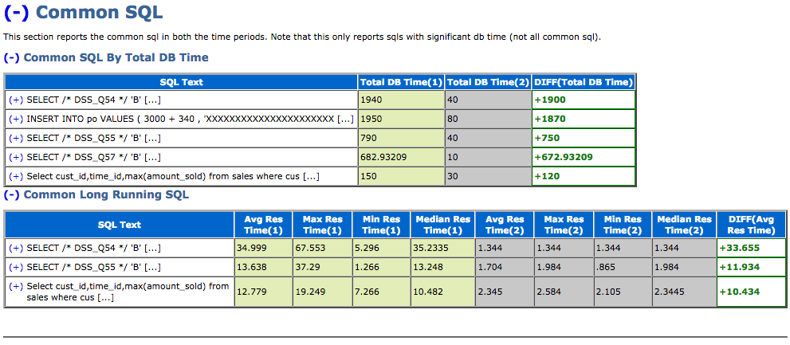

Further familiarize yourself with the different reports including the AWR compare period report which provides a detailed analysis of waits, time models, operating system statics and SQL comparisons on different metrics to identify and pinpoint performance issues.

You have learned how Real Application Testing Database Replay can be used to validate changes that may impact performance on both SQL statements and DML statements and seen its reporting functionality that helps you find and analyze workload bottlenecks, peaks or trends.

That concludes this HOL activities.

>   [Return back to top menu listing all available labs](../readme.md)