# Purpose 

Database Fleet Maintenance is an end-to-end automated solution for patching and
upgrade of Oracle Database. Fleet Maintenance enables DBAs to automate patching
of wide range of DB Configurations including Oracle RAC environments with Data
Guard Standby.

This document provides an overview of features and enhancements included in
release . It is intended solely to help you assess the business benefits of
upgrading to and to plan your I.T. projects.

# Content
**Workshop Activity 1:** Detect Configuration Pollution

**Workshop Activity 2:** Oracle Database Upgrade with Fleet Maintenance

The estimated time to complete the workshop is 75 minutes

| Workshop Activity No | Feature                                                   | Approx Time | Details                                                                                                              | Value Proposition |
|----------------------|-----------------------------------------------------------|-------------|----------------------------------------------------------------------------------------------------------------------|-------------------|
| 1                    | Detect Configuration Pollution                            | 10 minutes  | Analyze the database estate using Software Standardization.                                                          |                   |
| 2                    | Oracle Database Upgrade with Fleet Maintenance | 1hr 5 min   | Upgrade your Oracle DB Software at scale with minimal downtime using Oracle Enterprise Manager 13c Fleet Maintenance |                   |

# Introduction

Database Fleet Maintenance is an end-to-end automated solution for patching and
upgrade of Oracle Database. Fleet Maintenance enables DBAs to automate patching
of wide range of DB Configurations including Oracle RAC environments with Data
Guard Standby.

Benefits with Fleet Maintenance:

-   Minimum Downtime with Out of Place patching

-   Enterprise Scale with Enterprise Manger Deployment Procedures Framework

-   Single pane of glass for monitoring and managing entire patching and upgrade
    operations

-   Ability to schedule/retry/suspend/resume.

-   Database patching across different infrastructure including engineered
    systems like Exadata

For more details refer to [Fleet Maintenance](https://www.oracle.com/manageability/enterprise-manager/technologies/fleet-maintenance.html) documentation

# Know Your Environment

## Environment Details

This lab environment is setup with Enterprise Manager Cloud Control Release 13.3
and Database 19.3 as Oracle Management Repository.

Workshop activities included in this lab will be executed both locally on the
instance using Enterprise Manager Command Line Interface (EMCLI) or Rest APIs,
and the Enterprise Manager console (browser)

## Prerequisites

Prior to starting, you will:

-   SSH Private Key to access the host via SSH

-   Instance Public IP address

# Getting started 

## Access

-   Login to Host using SSH Key based authentication

    Refer to [Frequently Asked Questions](https://github.com/oracle/learning-library/blob/master/enterprise-manageability-library/enterprise_manager/OCIMarketplaceEM-FAQ.md) 
    doc for detailed instructions relevant to your SSH client type (e.g. Putty on Windows or Native such as terminal on Mac OS):

    -   Authentication OS User - “opc”

    -   Authentication method - SSH RSA Key

    -   Oracle EM and DB Software OS User – “oracle”.

    First login as “opc”, then sudo to “oracle”. E.g. “sudo su - oracle"

-   OMS URL: and Credentials:

    -   Username: **sysman**

    -   password: **welcome1**

    You may see an error on the browser while accessing the Web Console - “*Your
    connection is not secure*”, add exception and proceed. Access this URL and
    ensure that you are able to access Enterprise Manager Web Console.

## Update the Named Credentials with your SSH Key

1.  Log into your Enterprise Manager VM using the Public IP of your EM instance.
    The Enterprise Manager credentials are “**sysman/welcome1**”.

2.  Navigate to “Setup menu \> Security\> Named Credential and Select ROOT
    credential; Click Edit. Replace the existing entry with your SSH Private Key
    and Click on Test and Save.

    

# Fleet Maintenance Login to EMCLI 

Upon login as user “oracle” via sudo from user “opc”, the following are
performed automatically for your convenience:

-   OMS environment variables set

-   emcli session is established

While connected as “oracle” your emcli session may expire at some point due to
inactivity. Should that occur run “**emcli login -username=sysman
-password=welcome1**” or simply exit and login again to reestablish a new
session.

1.  Exit terminal session as “oracle” back to “opc”  
    [oracle\@emcc \~]\$ exit

2.  Sudo to oracle  
    [opc\@emcc \~]\$ sudo su - oracle

# Steps Completed in Advance

In the interest of simplifying the setup and save time, the following steps were
completed in advance for part \#2 covered in this lab:

-   We have created a pre-patched Oracle Home with 18.10 release using which we will create the gold image
    [/u01/app/oracle/product/18/db_home_src,
    Orasidb18c_home1_2020_05_13_04_10_9_emcc.marketplace.com_3192]

-   We have created a pre-patched Oracle Home with 19.7 release using which we will create the gold image
    [/u01/app/oracle/product/19/db_home_src,
    Orasidb19c_home1_2020_05_13_04_24_10_emcc.marketplace.com_2953]

-   Creation of the first version of “Tier\#1” Gold Image

-   Subscription of “finance.subnet.vcn.oraclevcn.com” Database to above image

-   Patching of “finance.subnet.vcn.oraclevcn.com” Database from 18.8 to 18.10
    using Fleet Maintenance

We recommend that you read through each of the steps, review the emcli command,
its verbs and deployment procedures to get an understanding of what it takes to
do it from scratch. For a full end-to-end hands-on execution of “patching” lab,
we highly recommend part \#1

To ensure smooth execution of the intended use cases, we have pre-hosted the
scripts to be used later at /home/oracle/fleet

# Workshop Activity 1: Detect Configuration Pollution

This exercise enables us to analyze the database estate using Software
Standardization.

## Software Standardization Advisor

Software Standardization Advisor enables administrators to understand various
database configurations prevailing in their environment. Each deployment with a
unique platform, release and patch level is identified as a distinct
configuration. This provides the administrators a view of the configuration
pollution in their estate. It also analyzes and provides a recommendation to
standardize the environment and reduce the number of configurations required for
managing the database estate.

1.  Log on to Enterprise Manager Console as sysman

2.  Click on Targets \> Databases.

    

3.  In the Databases targets page, click on Administration \> Click Software
    Standardization Advisor

    

4.  Software Standardization Advisor shows two graphs depicting current
    configuration and recommended configuration.

    

A Software Configuration is identified by Database Release, Platform and set of
Patches installed on the target.

The Software Configuration Advisor run shows that there are 5 Unique Software
Configurations in the environment as shown in the pie chart labelled as “Current
Unique Software Configurations” and recommendation is to maintain 2 Software
Configurations as shown in the pie chart labelled as “Recommended Software
Configurations”.

Let us see details of the reports in next steps.

5.  Click on Generate Report.

6.  Click on Current Configurations to open the Excel report

    

    When opening the downloaded Excel Spreadsheet report, a warning on XLS format
    and file extension mismatch may pop up (see below). Simply click on “Yes” to
    ignore the warning and open the file.

    

    Current Configuration shows five different Oracle home software versions

    

7.  Next, click on Recommended Configurations to open the Excel Report

    

    The EM Recommended Configuration report recommends reducing 5 configurations and
    standardizing the database estate on 2 configurations, one based on 18c and the
    other based on 19c. This means All Oracle Homes of Release 18c should uptake the
    corresponding 18c configuration and the 19c homes will use the one based on
    Release 19c

    

    Recommendation is based on union of all bugs included in the Patches in all OHs
    and based on configuration type.

## Summary

This completes the “[Detect Configuration
Pollution](#workshop-activity-1-detect-configuration-pollution)” exercise. In
this section, you learned how to perform the following:

-   Access the Database Software Standardization Advisor

-   View Configuration summary

-   Generate and download current and recommended configuration reports

In the next section we will follow these recommendations to perform the
following using Enterprise Manager 13c Fleet Maintenance.

-   Patch database “finance.subnet.vcn.oraclevcn.com” from 18.8 to 18.10
    [READ-ONLY– This step has already been implemented]

-   Upgrade “finance.subnet.vcn.oraclevcn.com” from 18.10 to 19.7

# Workshop Activity 2: Oracle Database Upgrade with Fleet Maintenance

## Database Fleet Maintenance 

Enterprise Manager Database Fleet Maintenance is a Gold Image Target
subscription based out of place patching solution. Gold Image(s) are software
library entities storing archive of an upgraded software home. Targets, to be
upgraded, subscribe to a relevant Gold Image. Target subscription persists
through the lifecycle of the Target or Gold Image unless modified by an
administrator. We will go through the following steps for this Fleet Maintenance Exercise.

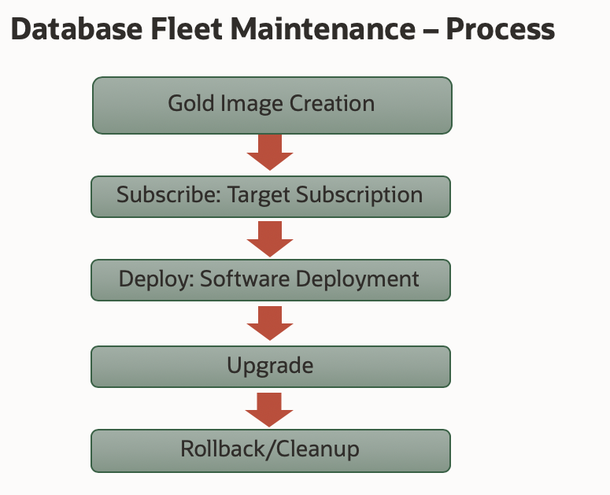

## Upgrading with Fleet Maintenance

We will go through steps for upgrading database target
**finance.subnet.vcn.oraclevcn.com,** a Single Instance Database currently at
18.10.0.0.0 version that was previously patched from 18.8.0.0.0 using Fleet
Maintenance. The goal is to upgrade this target to 19.7.0.0.0.

1.  Log on to Enterprise Manager Console and review the status and version of DB
    Target.

    

    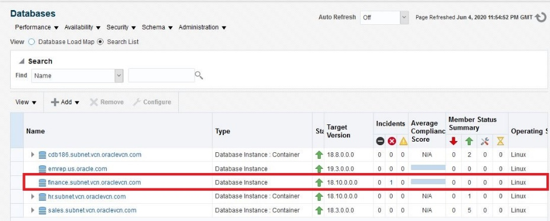

    You will see finance.subnet.vcn.oraclevcn.com. If target status is ‘DOWN’, start
    the target (using /home/oracle/start_db_finance.sh).

    The next [READ ONLY] blocks are fully covered by the Patching lab (Part \#1) and
    are listed here for your information only.

### Create Gold Image [READ-ONLY– This step has already been implemented]

2.  Review as prescribed

    Gold Image represents a software end state. An Enterprise Manager Software
    Library Gold Image is a software archive created from a patched oracle home
    uploaded to EM Software Library. Steps in this section are already implemented
    and are available here for review.

    a) Reference Home Setup

    In order to create a Gold Image of the ‘recommended patch configuration’, you
    need to manually create such an Oracle Home as a pre-requisite step.

    As the goal of this lab is to upgrade Database target from 18.10 to 19.7, a
    reference Oracle home fully patched to 18.10
    [Orasidb18c_home1_2020_05_13_04_10_9_emcc.marketplace.com_3192,
    /u01/app/oracle/product/18/db_home_src] was created and used to create the
    initial version of the Gold Image as further described in the next steps.

    This reference Oracle Home is discovered in Enterprise Manager as shown below
    and will be used for Gold Image Creation.

    Navigate to “Targets \> All Targets” and type in
    “Orasidb18c_home1_2020_05_13_04_10_9_emcc.marketplace.com_3192” in the “Search
    Target Name” box.

    

    b) Review “Create New Gold Image” from ssh terminal using the following emcli
    command

    [oracle\@emcc \~]\$ cd fleet

    [oracle\@emcc \~]\$ cat create_image_Tier1_sidb_x64.sh

    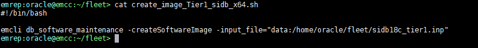

3.  List Available Gold Images

    a) Execute the following commands in ssh terminal to see the list of Gold
    Images available for deployment, locate ‘Tier \#1 SI DB Linux64*’* in the
    emcli command output:

    [oracle\@emcc \~]\$ emcli db_software_maintenance -getImages

    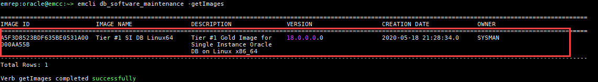

    IMAGE ID retrieved from the output of above command is used in further
    operations like Target Subscription.

    b) After retrieving a list of the available images, one can view a list of
    versions available for a specific image with the following command:

    [oracle\@emcc \~]\$ emcli db_software_maintenance -getVersions
    -image_id=A5F3D8523BDF635BE0531A00000AA55B

    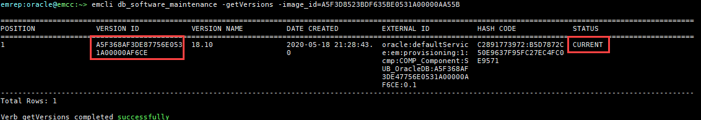

    When a Gold Image is created for the first time, its first version is
    created as per the input and marked as current

    Whenever we run a DEPLOY operation for a target, Gold Image version marked
    as CURRENT is used to deploy the new Oracle Home.

4.  Verify if Gold Image is Applicable

    This step verifies if the image can be used to patch a specified database
    target. This is done by comparing the bug fixes available in the current
    Oracle home of the database target and the image. In effect this check is
    run to identify patch conflicts.

    a) Review and execute below emcli command:  
    [oracle\@emcc \~]\$ emcli db_software_maintenance -checkApplicability
    -image_id="A5F3D8523BDF635BE0531A00000AA55B"
    -target_list=finance.subnet.vcn.oraclevcn.com -target_type=oracle_database

    

    This command can show one of the following results:

    -   Applicable: The image and database target contain the same set of bug fixes.
        The image can be applied on the specified target.

    -   Applicable and Image has more bug fixes: The image contains more bug fixes
        than those applied on the database. The list of extra bugs is displayed. The
        image can be applied on the specified target.

    -   Not Applicable: The database contains more bug fixes than those included in
        the image. The list of missing bugs is displayed. The administrator has to
        create a new version of the image that includes the missing bugs before the
        database can uptake the same.

### Subscribe Database - [READ ONLY – This step has already been implemented]

5.  Review steps

    a) emcli command

       [oracle\@emcc \~]\$ emcli db_software_maintenance -subscribeTarget
       -target_name=finance.subnet.vcn.oraclevcn.com
       -target_type=oracle_database
       -image_id="A5F3D8523BDF635BE0531A00000AA55B"

       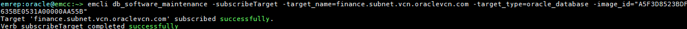

       Where:

       -   target_name – Name of the Database target which needs to be patched

       -   target_type – type of target to be patched. This should be oracle_database
           in this case
 
       -   image_id – ID of the Gold Image to which the target should be patched

### Deploy Image - [READ ONLY – This step has already been implemented]

6.  Review steps

    a) emcli command

    [oracle\@emcc \~]\$ cat deploy1810_finance.sh

    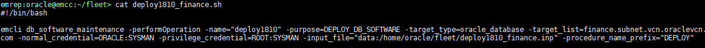

### Migrate Listener - [READ ONLY – This step has already been implemented]

7.  Review steps

    a) emcli command

    [oracle\@emcc \~]\$ cat migrate_listener_finance_update.sh

    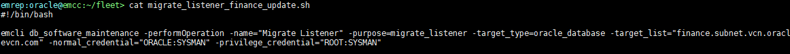

### Update Database – Patch to 18.10 - [READ ONLY – This step has already been implemented]

8.  Review steps

    a) emcli command

    [oracle\@emcc \~]\$ cat update_finance.sh

    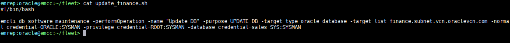

### Create New Image Version

9.  Add Image version 19.7 to Gold Image Tier1 SIDB Linux-x64

    a) Reference Home Setup [READ-ONLY– This step has already been implemented]

    Just as it was done for the first version of this image, a reference 19.7 Oracle
    Home is needed to create a new version of the image and was setup in advance. [
    /u01/app/oracle/product/19/db_home_src].

    This reference Oracle Home is discovered in Enterprise Manager as shown below
    and will be used to create and new version of the Gold Image.

    Navigate to “Targets \> All Targets” and type in
    “Orasidb19c_home1_2020_05_13_04_24_10_emcc.marketplace.com_2953” in the “Search
    Target Name” box.

    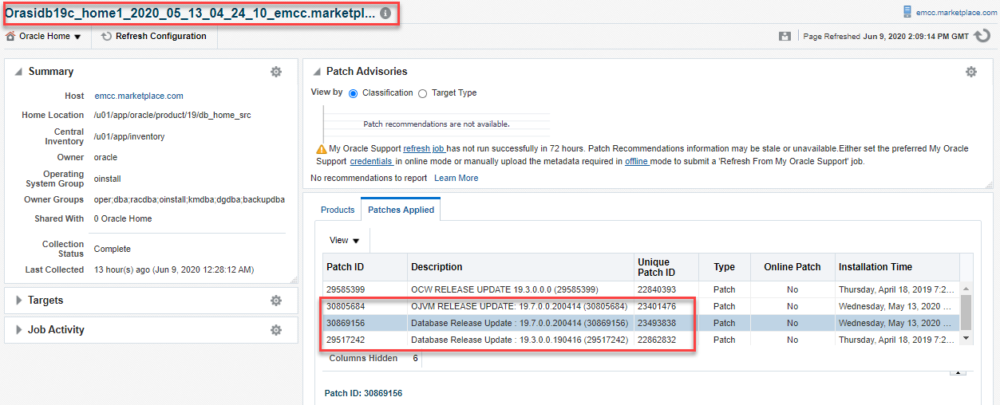

    b) Review and execute the following command to add Image version 19.7 to Tier1
    SIDB Linux-x64

    [oracle\@emcc \~]\$ emcli db_software_maintenance -createSoftwareImage
    -input_file="data:/home/oracle/fleet/sidb19c_tier1.inp"

    **OR**  
    [oracle\@emcc \~]\$ sh add_image_version197_tier1_sidb_x64.sh

    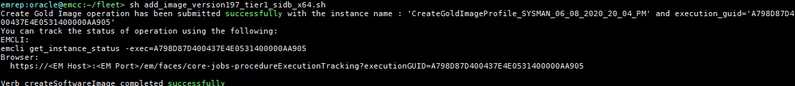

    c) Navigate to Enterprise \> Provisioning and Patching \> Procedure Activity to
    Review Execution Details of this operation via Enterprise Manager Console.
    Click on ‘CreateGoldImage\*’ run

    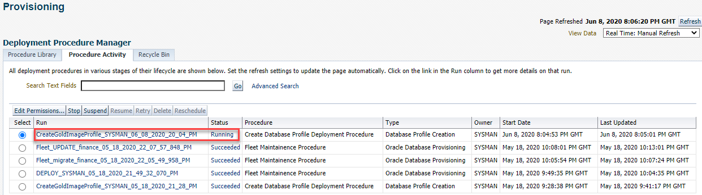

    d) Review the Procedure Activity steps performed.

    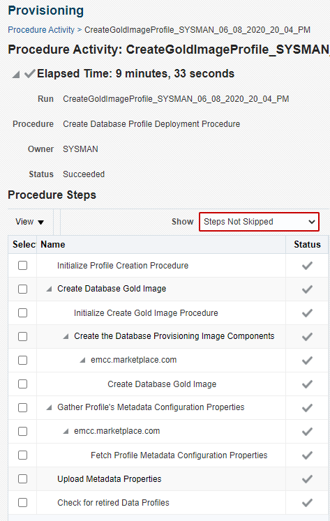

10. Set Version 19.7 to Status Current

    a) View a list of versions available for a specific image with the following command:

    [oracle\@emcc \~]\$ emcli db_software_maintenance -getVersions
    -image_id=A5F3D8523BDF635BE0531A00000AA55B      

    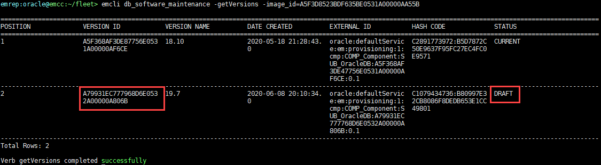

    b) Using the VERSION ID from Step above, review and execute the following
    command to set Version Name 19.7 to Status Current

    [oracle\@emcc \~]\$ emcli db_software_maintenance -updateVersionStatus
    -status=CURRENT -version_id=A79931EC777968D6E0532A00000A806B

    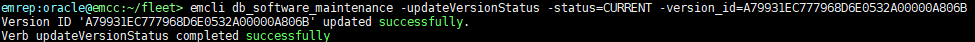

### Deploy New Image Version

11. Gold Image Deployment

    a) A new Oracle Home is deployed on the host where DB target is running with
    the below commands.

    [oracle\@emcc \~]\$ emcli db_software_maintenance -performOperation
    -name="deploy197" -purpose=DEPLOY_DB_SOFTWARE -target_type=oracle_database
    -target_list=finance.subnet.vcn.oraclevcn.com
    -normal_credential=ORACLE:SYSMAN -privilege_credential=ROOT:SYSMAN
    -input_file="data:/home/oracle/fleet/deploy197_finance.inp"
    -procedure_name_prefix="DEPLOY"  
    **OR**  
    [oracle\@emcc \~]\$ sh deploy197_finance.sh  
    Where:

    NEW_ORACLE_HOME_LIST = Absolute path to the File System location where new
    Oracle Home will be deployed.

    procedure_name_prefix = optional, prefix for the deployment procedure instance
    name

    name = Name of the operation. This is a logical name and should be kept unique

    purpose = There are standard purposes defined which can be performed by Fleet
    Operations. “DEPLOY_DB_SOFTWARE” is one of them. These are predefined and should
    not be changed. Admin shall select one of the below mentioned purposes as and
    when needed.

    target_type = The type of target being provided in this operation.

    target_list =
       1. This is a comma separated list of targets which need to be patched.
        
       2. Targets of homogenous types are supported in a single fleet operation.
        
       3. The system will calculate the unique list of hosts based on this target list
       and start stage of Oracle home software on those hosts.
       
       4. If targets running from same Oracle home are provided in this list, the
       stage and deploy operation will be triggered only once and not for all
       targets.

    normal_credential = This should be provided in the format \<Named
    Credential: Credential Owner\>.

    privilege_credential = This should be provided in the format \<Named
    Credential: Credential Owner\>

    start_schedule = Schedule when the stage and deploy should start if that
    needs to be done in future. Format: “start_time:yyyy/mm/dd HH:mm”. It is an
    optional parameter, if not provided, operation will start immediately

    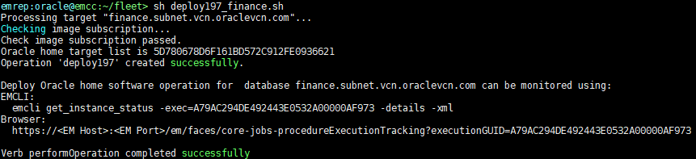

    b) Navigate to Enterprise \> Provisioning and Patching \> Procedure Activity to
    Review Execution Details of this operation via Enterprise Manager Console.
    Click on ‘DEPLOY_SYSMAN_\*’ run

    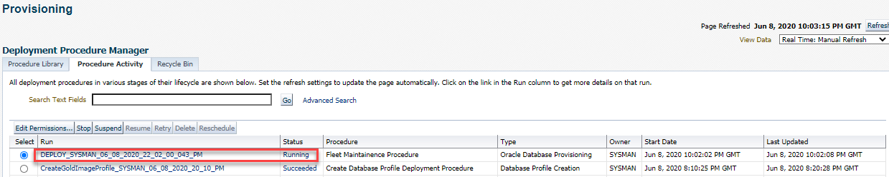

    c) Review the Procedure Activity steps performed.

    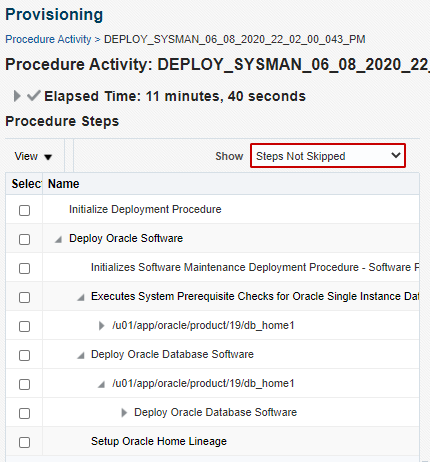

### Migrate Listener to New Upgraded Home

12. Migrate Listener

    a) Review and execute the following command to Migrate the Listener

    [oracle\@emcc \~]\$ emcli db_software_maintenance -performOperation
    -name="Migrate Listener" -purpose=migrate_listener
    -target_type=oracle_database -target_list="finance.subnet.vcn.oraclevcn.com"
    -normal_credential="ORACLE:SYSMAN" -privilege_credential="ROOT:SYSMAN"  
    OR  
    [oracle\@emcc \~]\$ sh migrate_listener_finance_update.sh

    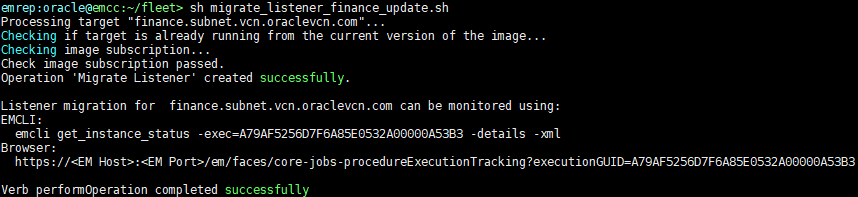

    b) Navigate to Enterprise \> Provisioning and Patching \> Procedure Activity to
    Review Execution Details of this operation via Enterprise Manager Console.
    Click on ‘Fleet_migrate_\*’ run

    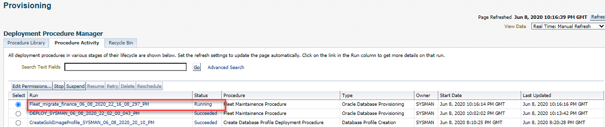

    c) Review the Procedure Activity steps performed.

    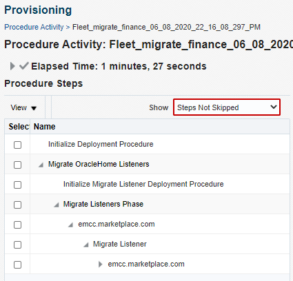

### Update Database – Upgrade to 19.7

13. Database Update

    Once the deploy operation completes successfully. We are ready to run the
    final UPDATE operation which upgrades the database by switching it to the
    newly deployed home.

    a) Review and execute below command to update DB Target
    finance.subnet.vcn.oraclevcn.com

    [oracle\@emcc \~]\$ emcli db_software_maintenance -performOperation
    -name="Update DB" -purpose=UPDATE_DB -target_type=oracle_database
    -target_list=finance.subnet.vcn.oraclevcn.com
    -normal_credential=ORACLE:SYSMAN -privilege_credential=ROOT:SYSMAN
    -database_credential=sales_SYS:SYSMAN  
    **OR**

    [oracle\@emcc \~]\$ sh update_finance.sh

    Where:

    Name – Name of the operation. This is a logical name and should be kept
    unique  
    Purpose – There are standard purposes defined which can be performed by
    Fleet Operations. “UPDATE_DB” is one of them.

    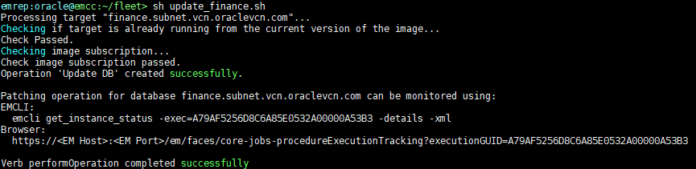

    b) Navigate to the Procedure Activity Page and monitor the progress of this
    operation with ‘Fleet_UPDATE_...’ deployment procedure instance.

    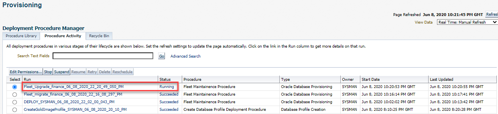

    c) Review the Procedure Activity steps performed

    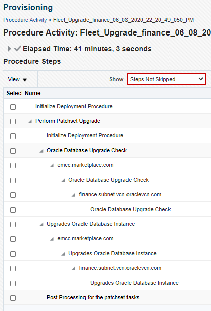

    d) Verify the Upgraded target by going to Targets-\>Databases as shown below.
    Operation above will take \~40 minutes to complete.

    

### Cleanup Old Homes

14. Clean up Database Finance

    a) Review and execute the following command to cleanup finance in reportOnly
    mode  
    [oracle\@emcc \~]\$ emcli db_software_maintenance -performOperation
    -name="Cleanup old oracle homes" -purpose=CLEANUP_SOFTWARE
    -target_type=oracle_database -normal_credential=ORACLE:SYSMAN
    -privilege_credential=ROOT:SYSMAN
    -target_list=finance.subnet.vcn.oraclevcn.com -workDir=/tmp -reportOnly=true  
    OR

    [oracle\@emcc \~]\$ sh cleanup_finance_report.sh

    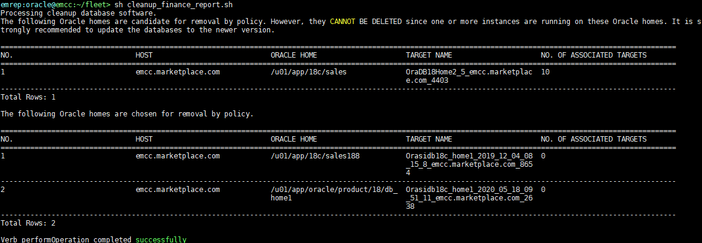

    b) Review and execute the following command to cleanup finance  
    [oracle\@emcc \~]\$ emcli db_software_maintenance -performOperation
    -name="Cleanup old oracle homes" -purpose=CLEANUP_SOFTWARE
    -target_type=oracle_database -normal_credential=ORACLE:SYSMAN
    -privilege_credential=ROOT:SYSMAN
    -target_list=finance.subnet.vcn.oraclevcn.com -workDir=/tmp  
    **OR**

    [oracle\@emcc \~]\$ sh cleanup_finance.sh

    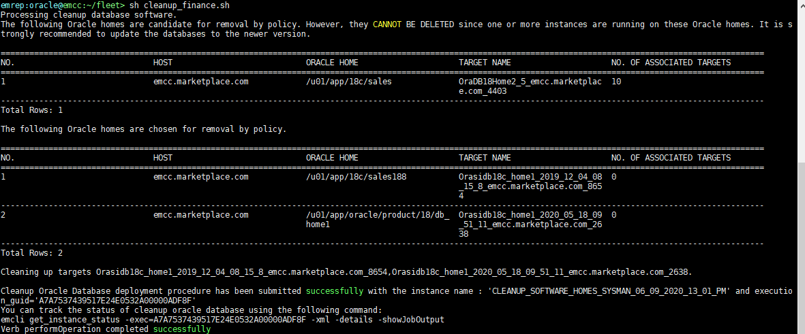

    c) Navigate to the Procedure Activity Page and monitor the progress of this
    operation with ‘CLEANUP_SOFTWARE_...’ deployment procedure instance.

    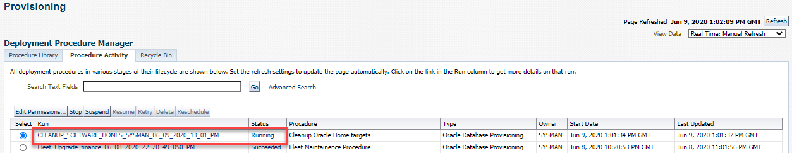

    d) Review the Procedure Activity steps performed

    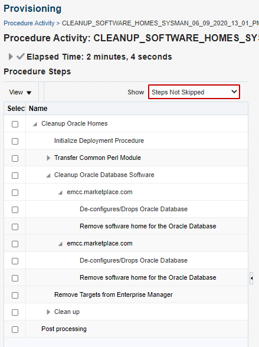

    e) Verify to confirm that the two old Oracle Homes reported have been removed

    [oracle\@emcc \~]\$ ls -l /u01/app/18c/sales188
    /u01/app/oracle/product/18/db_home1

    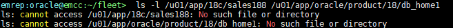

    f) As part of the cleanup operation, LISTENER_1525 which support
    “finance.subnet.oraclevcn.com” is shutdown. Set your environment by passing
    “finance” to “oraenv” when prompted and start the listener back up.

    [oracle\@emcc \~]\$ . oraenv \# Type in “finance” when prompted for the SID

    [oracle\@emcc \~]\$ lsnrctl start LISTENER_1525

    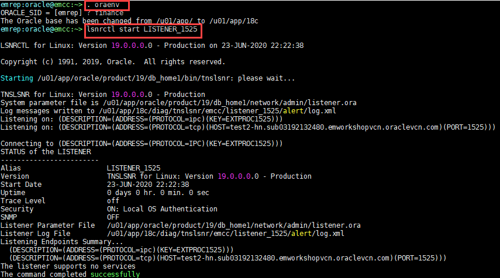

    g) Force Listener registration and confirm that it is now servicing
    “**finance.subnet.vcn.oraclevcn.com**”

    [oracle\@emcc \~]\$ sqlplus '/as sysdba'

    SQL\> alter system register;

    SQL\> exit

    [oracle\@emcc \~]\$ lsnrctl status LISTENER_1525

    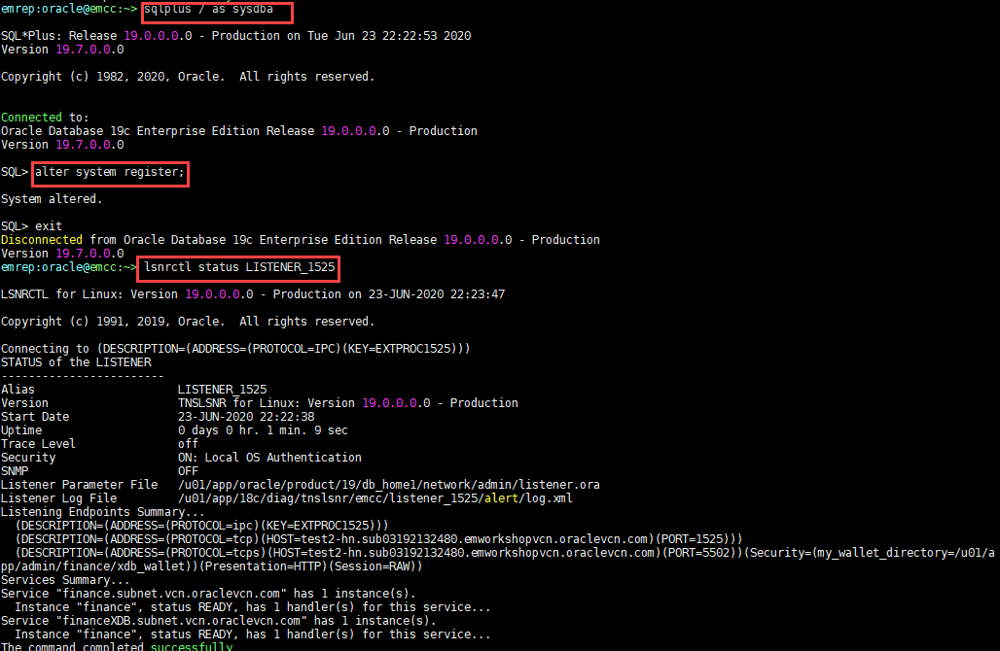

## Summary

This completes the “[Standalone Database Server Upgrade with Fleet
maintenance](#workshop-activity-2-standalone-database-server-upgrade-with-fleet-maintenance)”
exercise. In this section, you learned how to perform the following:

-   Create Oracle Database Software Gold Image

-   Subscribe Database to Gold Image

-   Deploy Gold Image to Database Host

-   Migrate Oracle Database Listener from old Oracle Home to newly Deployed
    Oracle Home

-   Update (Patch) Database from 18.8 to 18.10

-   Add new Version to an Existing Oracle Database Software Gold Image

-   Deploy new Gold Image Version to Database Host

-   Update (Upgrade) Database from 18.10 to 19.7

-   Clean up old Oracle Homes

Thank you!
