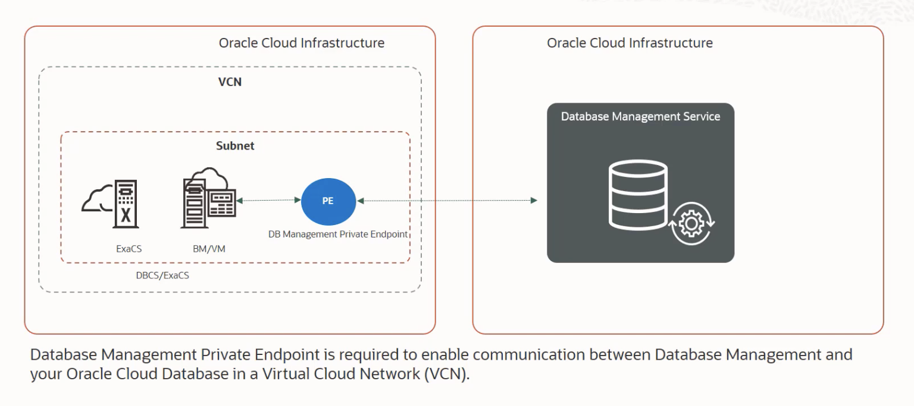
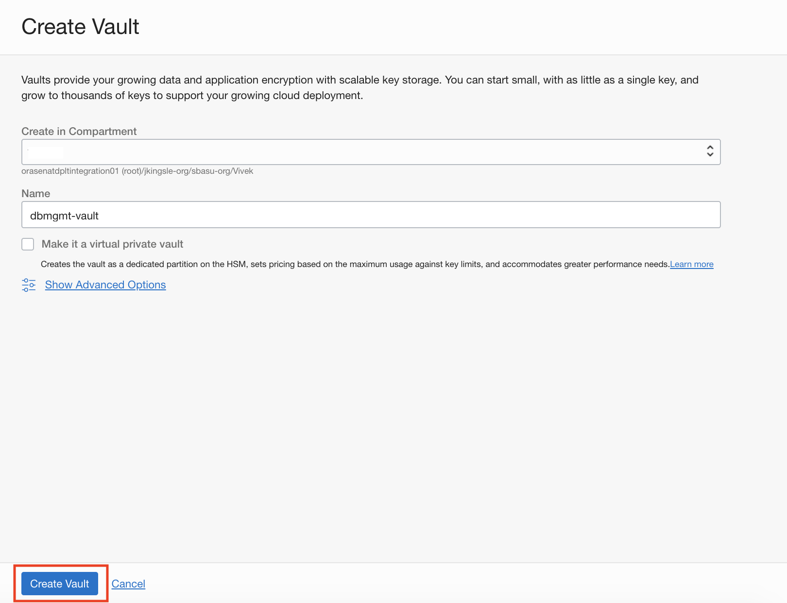
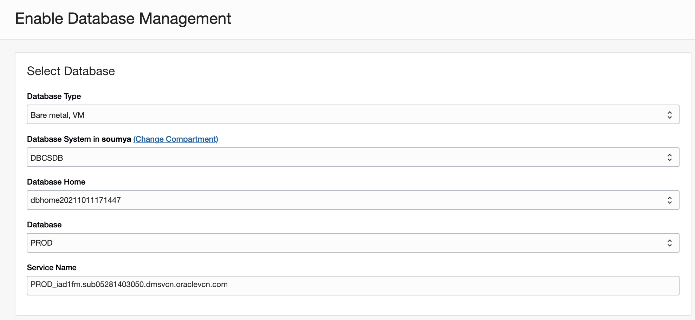

# Setup Database Management for Oracle Cloud Databases

## Introduction

In this lab, you will go through the steps to setup Database Management for Oracle Cloud Databases.



Estimated Time: 50 minutes

### Objectives

Setup Database Management to monitor and manage Oracle Databases on the following Co-managed Oracle Database Cloud solutions:

-   Bare Metal and Virtual Machine DB Systems
    
-   Exadata Cloud Service

### Prerequisites

This lab assumes you have completed the following labs:
* Oracle Database running on DBCS

## Task 1: Oracle Cloud Database-related Prerequisite Tasks

1. Set database monitoring user credentials in the Oracle Cloud Database. You must grant a database user, for example, DBSNMP, the privileges required to monitor and manage the Oracle Cloud Database.

    Connect to DBCS database as **SYSDBA** and execute the following :

    ```
    <copy>
    GRANT CREATE PROCEDURE TO dbsnmp;
    GRANT SELECT ANY DICTIONARY, SELECT_CATALOG_ROLE TO dbsnmp;
    GRANT ALTER SYSTEM TO dbsnmp;
    GRANT ADVISOR TO dbsnmp;
    GRANT EXECUTE ON DBMS_WORKLOAD_REPOSITORY TO dbsnmp;
    alter user dbsnmp account unlock;
    alter user dbsnmp identified by "<password>";
    </copy>
    ```

    Password length must be between 14 to 127 characters.
    Password must have at least one lowercase, one uppercase, one digit, and one special character.

     

## Task 2: Create OCI Vault

1.  From the Oracle Cloud Console **Navigation menu** (aka hamburger menu) located in the upper left, click **Identity & Security** and click **Vault**.

     

2.  On the OCI Vaults page click **Create Vault**.

    

3.  Select "Create in Compartment" and enter "Name" : dgmgmt-vault

    

    Click **Create Vault**.

4.  Click on the vault **dgmgmt-vault**.

    

## Task 3: Create Key

1. On the **Vault Details** page click **Create Key**. On the **Create Key** page select all defaults and enter "Name" : dbmgmt-key.

    

    Click **Create Key**.

2. On the **Vault Details** page confirm the State of key is "Enabled". From the left navigation pane click **Secrets**.

    

## Task 4: Create Secret

1. Click **Create Secret**. On the **Create Secret** page enter following :

    

     **Create in Compartment:** Select Compartment Name

     **Name:** dbmgmt-secret
     
     **Description:** Monitoring user password
     
     **Encryption Key:** Select **dbmgmt-key**
     
     **Secret Type Template:** Select default
     
     **Secret Contents:** Enter the DBSNMP user password

    Click **Create Secret**.

2. Confirm the **Status** of **dbmgmt-secret** is **Active**.

    

## Task 5: Create a Database Management private endpoint

1.  From the Oracle Cloud Console **Navigation menu** (aka hamburger menu) located in the upper left, click **Observability & Management**. Under **Database Management**, click **Administration**.

    

2.  On the left pane on the **Administration** page, click **Private Endpoint** and select the compartment in which you want to create the private endpoint.

    

3.  On the **Private Endpoints** page, click **Create Private Endpoint**.

4. In the **Create Private Endpoint** dialog:

    

     **Name:** dbmgmtpe

     **Description:** Database Management Private Endpoint

     **Choose Compartment:** Select the compartment in which you want the private endpoint to reside.

     **Use this private endpoint for RAC databases:** Select this check box if you want to create a Database Management private endpoint for RAC Oracle Cloud Databases in the Virtual Machine DB system and Exadata Cloud service. The Database Management private endpoint for RAC Oracle Cloud Databases is a limited resource and you can create only one such private endpoint in your tenancy. Leave this unchecked.

     **Virtual Cloud Network :** Select the VCN in which the Oracle Cloud Database can be accessed. Select labVCN.

     **Subnet :** Select a subnet within the selected VCN. Select lab-public-subnet1.

     **Network Security Group:** Optionally, select an NSG added to the Bare Metal or Virtual Machine DB system or the Exadata VM cluster. You can also click + Another Security Group to select another NSG. Leave as default.

     Click **Create Private Endpoint**.

5.  To view details of the private endpoint, click its name.

    

## Task 6: Add security rules to enable communication

Add the following stateful security rules to the Security List:

Ingress rule for the Virtual Machine DB system's VCN: The Virtual Machine DB system's VCN (on port 1521) can receive incoming traffic from the Database Management private IP address (10.0.0.69/32) from any port.

Egress rule for the Database Management private endpoint: The Database Management private IP address (from any port) can send requests to the Virtual Machine DB system's VCN (10.0.0.0/16) on port 1521.

1.  From the Oracle Cloud Console **Navigation menu** (aka hamburger menu) located in the upper left, click **Oracle Database** and then **Bare Metal, VM and Exadata**.

    

2.  Click on DB System **DBCS**.

    

3.  On the **DB System Details** page click **labVCN**.

    

4.  **Virtual Cloud Network Details** page has a list of subnets present under this VCN. Click **lab-public-subnet1** subnet.

    

5.  On the **Subnet Details** page, click **Default Security List for labVCN** to go to **Security List Details** page which will have a list of Security List Ingress and Egress Rules.

    

6.  Click **Add Ingress Rules** to add a Ingress rule for the Virtual Machine DB system's VCN. The Virtual Machine DB system's VCN (on port 1521) can receive incoming traffic from the Database Management private IP address (10.0.0.69/32) from any port.

     **Source Type:** Select **CIDR**

     **Source CIDR:** 10.0.0.69/32

     **IP Protocol:** Select **TCP**

     **Source Port Range:** Leave blank

     **Destination Port Range:** 1521

     **Description:** Connection from DB Management Private Endpoint

     Click on **Add Ingress Rules**.

    

7.  From the Oracle Cloud Console **Navigation menu** (aka hamburger menu) located in the upper left, click **Observability & Management**. Under **Database Management**, click **Administration**.

    

2.  On the left pane on the **Administration** page, click **Private Endpoint** and click **dbmgmtpe** under Private Endpoints.

3.  On the **Private Endpoint Details** page, click **lab-public-subnet1**.

    

4.  On the **Subnet Details** page, click **Default Security List for labVCN** to go to **Security List Details** page which will have a list of Security List Ingress and Egress Rules.

    

5.  Click **Egress Rules** on the left navigation pane and then click **Add Egress Rules**. Enter following details:

     **Source Type:** Select **CIDR**

     **Source CIDR:** 10.0.0.0/16

     **IP Protocol:** Select **TCP**

     **Source Port Range:** Leave blank

     **Destination Port Range:** 1521

     **Description:** Egress from DB Management PE to DBCS

     Click on **Add Egress Rules**.

    


## Task 7: Enable Database Management for Oracle Cloud Databases

1.  From the Oracle Cloud Console **Navigation menu** (aka hamburger menu) located in the upper left, click **Observability & Management**. Under **Database Management**, click **Administration**.

    

2.  On the **Managed Databases** page, click **Enable Database Management**.

    

3.  On the **Enable Database Management** dialog:

    

     **Database Type:** Select **Bare metal, VM**

     **Database System:** DBCSDB

     **Database Home:** Select default.
     
     **Database:** Select default.

     **Service Name:** Select default.

    

     **Database User Name:** DBSNMP

     **Use existing secret or Create new secret:** Select **Use existing secret**.

     **Database User Password Secret:** Select **dbmgmt-secret**.

     **Private Endpoint:** Select **dbmgmtpe**

     **Management Options:** Select **Full Management**

     Click **Enable Database Management**.

4.  A confirmation message with a link to the Oracle Cloud Database's Work Requests page is displayed. Click the link to monitor the progress of the work request.

    

5.  You can verify if Database Management is successfully enabled on the following pages:

* Database Management Administration page: Select the appropriate option in the Deployment Type drop-down list. After Database Management is enabled, the Oracle Cloud Database is listed as a Managed Database. Click Database Name **PROD** to view **Managed Database Details**.

    

    

* Database Details page of the Oracle Cloud Database: **Database Management** is set to **Full**. Select **Metrics** on the left pane under Resources and check if the database metrics are displayed.

    

    

    For ASH Analytics, SQL Monitoring, and Blocking Session, click on **Performance Hub** on the Database Details page.

        

## Acknowledgements

- **Author** - Vivek Verma, Principal Cloud Architect, North America Cloud Engineering
- **Contributors** - Vivek Verma, Sriram Vrinda, Pratima Chennupati
- **Last Updated By/Date** - Vivek Verma, September 2021
