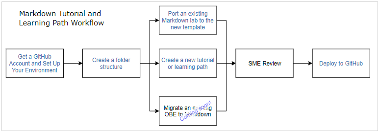

# About this Tutorial
## Before You Begin

This tutorial walks you through the steps to create a Hands-on lab (HOL) content such as tutorials and learning paths.

HOL content is created using Markdown, stored in a central GitHub repository, and can include text, images, and videos. Multiple tutorials can be combined to create a learning path.

### Background

This tutorial is intended to UA Developers who are creating tutorials and/or learning paths for the first time.

This tutorial consists of the following labs:
* Lab 01 - Getting Started with GitHub
* Lab 02 - Creating the Structure of Markdown Labs
* Lab 03 - Using Markdown Templates

### What Do You Need?

* GitHub user account and the [GitHub Desktop](https://desktop.github.com/) application
* Markdown-aware text editor or the [Tutorial Creator tool](https://oracle.github.io/learning-library/common/tutorial_creator/index.html) for WYSIWYG editing
* Markdown rendering engine (such as [Atom.io](https://atom.io/)) on a local web server for real-time builds and WYSIWYG editing

## Development Workflow

The following image shows the workflow for developing tutorials and learning paths.

1. Set up a GitHub user account and your GitHub development environment.
2. Create a folder structure for your project.
3. Create tutorial content from scratch or start by porting an existing project.
   If you have multiple tutorials, combine them into a single learning path.
4. Send tutorial content for SME review.
5. Deploy your project to GitHub.

## Want to Learn More?

* [Confluence: Developing Tutorials, Learning Paths and Hands-on Labs using Markdown](https://confluence.oraclecorp.com/confluence/display/DBIDDP/Developing+Tutorials%2C+Learning+Paths+and+Hands-on+Labs+Using+Markdown)
* [Oracle Learning Library Git Repo](https://github.com/oracle/learning-library)
