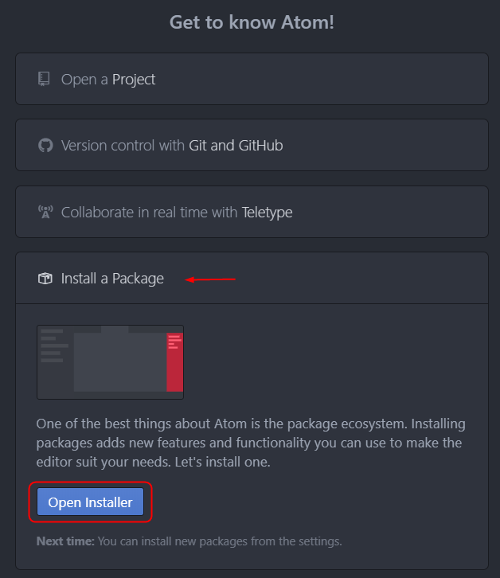
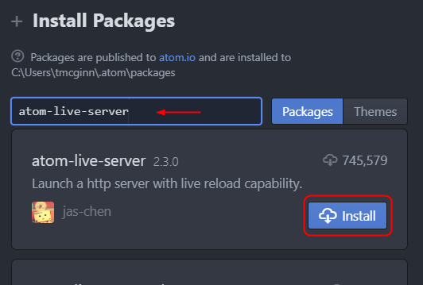
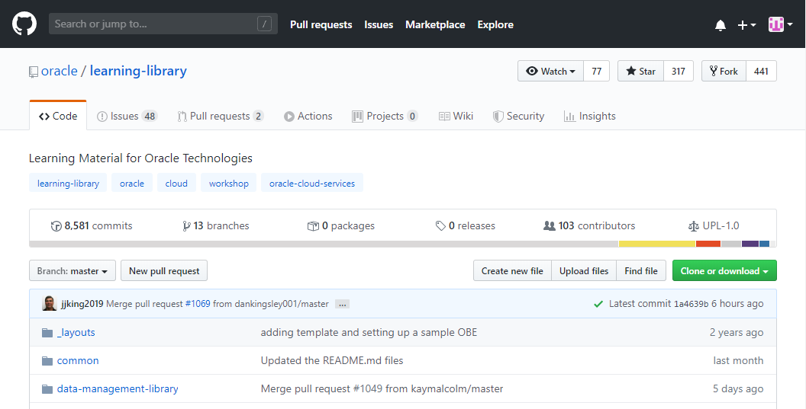
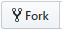
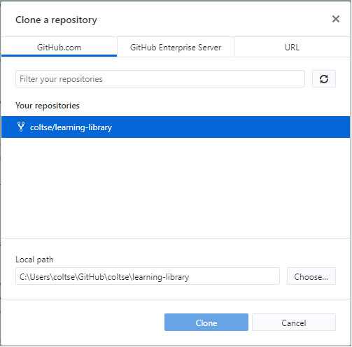
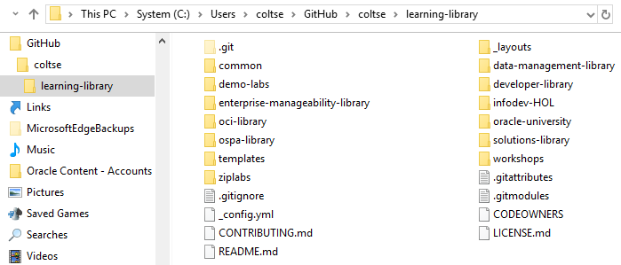

# Getting Started with GitHub
## Before You Begin

This lab walks you through the steps of setting up a GitHub user account and a GitHub development environment.

### Background

GitHub is a cloud-based version control system used for storing and managing Markdown and other source files for Hands-on lab (HOL) content.

GitHub is organized by projects, each with its own repository that is accessed through a unique URL.

The Oracle Learning Library is located at [https://github.com/oracle/learning-library](https://github.com/oracle/learning-library).

### What Do You Need?

* [GitHub Desktop](https://desktop.github.com/)
* GitHub user account created using your Oracle email address.

## Installation and Tools Setup

Setting up your GitHub development environment includes installing GitHub Desktop, an application that allows you to interact with GitHub repositories via a graphical user interface, creating a GitHub user account, and installing Atom, an IDE for WYSIWYG editing and real-time builds via a local web sever.

1. Download and install [GitHub Desktop](https://desktop.github.com/).

2. Create a GitHub user account with your Oracle email address if you do not already have one.

3. Install [Atom.io](https://atom.io/), a third-party IDE, and the atom-live-server plugin package:

   1.  After installing Atom.io, click **Help** > **Welcome Guide**.

   2. In the Welcome Guide screen, click **Install a Package** > **Open Installer**.

      

   3. In the Install Package window, enter "atom-live-server" and click **Install**.

      **Note:** You must be disconnected from VPN when installing the package.

      

      When the installation is complete, atom-live-server will appear under the **Packages** menu.

## Fork the oracle/learning-library Repository

Once you access the oracle/learning-library repository, you need to create a duplicate copy of the repository to your GitHub account.

It is important to note the difference: **_`<your account>`_**/learning-library vs. **_oracle_**/learning-library

1. Log into your GitHub account in your web browser.

2. Go to the **oracle/learning-library** repository at [https://github.com/oracle/learning-library](https://github.com/oracle/learning-library).

   

3. Click the **Fork** button  at the top of the page.

## Clone the Forked Repository

To begin creating HOL content, you need to clone your forked repository to your system so that you can edit files locally.  

Make sure your select your forked repository and not the oracle/learning-library repository.

**Note:** You must be disconnected from VPN to clone repositories.

1. Open GitHub Desktop and log in to your GitHub account.

2. Click **File** > **Clone Repository**.

3. In the **GitHub.com** tab, select '<your account>'/learning-library' as your repository, specify a target location on your system where you want the repository files to be copied to, and click **Clone**.  

   

4. After the repository is cloned, ensure that the files were successfully copied to your system by checking the target location.

   

## Want to Learn More?

* [Confluence: Getting Started with GitHub Development](https://confluence.oraclecorp.com/confluence/display/DBIDDP/Getting+Started+with+GitHub+Development)
* [Confluence: Use live-server to develop and test Markdown content](https://confluence.oraclecorp.com/confluence/display/DBIDDP/Use+live-server+to+develop+and+test+Markdown+content)
