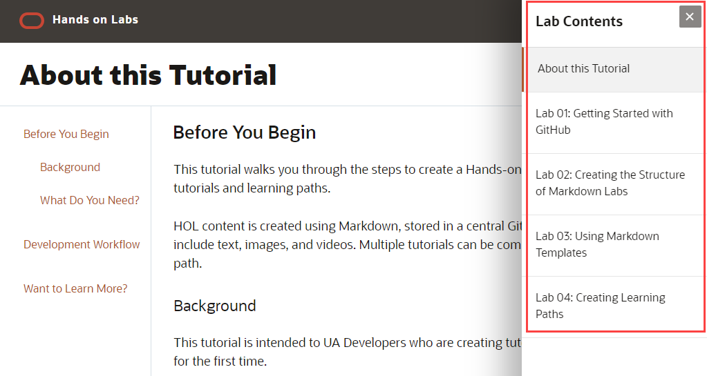

# Creating Learning Paths Today
## Before You Begin

This lab walks you through the steps of combining multiple tutorials to form a learning path.

### Background
If your tutorial has multiple labs, you can present them together as part of a learning path through the **Lab Contents** navigation pane.

To close the navigation pane, click the Close button  at the top of the pane.

To open the pane once it is closed, click the Open Menu button  in the banner of the page.



The structure and contents of the navigation pane is defined by the `manifest.json` file.

Each entry in `mainfest.json` represents an item in the navigation pane. The navigation pane appears only if there are multiple entries in `manifest.json`.

The following `manifest.json` file reflects the contents of the navigation pane shown above.

```
<copy>{
    "tutorials": [
        {
            "title": "About this Tutorial",
            "description": "This tutorial walks you through the steps of creating a hands on lab(HOL).",
            "partnumber": "E12345_01",
            "publisheddate": "02/24/2020",
            "contentid": "123456",
            "filename": "about-this-lab/content.md"
        },
        {
            "title": "Lab 01: Getting Started with GitHub",
            "description": "This tutorial walks you through the steps of setting up a GitHub development environment.",
            "partnumber": "E12345_01",
            "publisheddate": "02/24/2020",
            "contentid": "123456",
            "filename": "getting-started-with-github/content.md"
        },
        {
            "title": "Lab 02: Creating the Structure of Markdown Labs",
            "description": "This tutorial walks you through the steps of creating project folders and files.",
            "partnumber": "E12345_01",
            "publisheddate": "02/24/2020",
            "contentid": "123456",
            "filename": "structure-of-markdown-labs/content.md"
        },
        {
            "title": "Lab 03: Using Markdown Templates",
            "description": "This tutorial walks you through the steps of using the content.md template.",
            "partnumber": "E12345_01",
            "publisheddate": "02/24/2020",
            "contentid": "123456",
            "filename": "using-markdown-templates/content.md"
        },
        {
            "title": "Lab 04: Creating Learning Paths",
            "description": "This tutorial walks you through the steps of combining multiple tutorials to form a learning path.",
            "partnumber": "E12345_01",
            "publisheddate": "02/24/2020",
            "contentid": "123456",
            "filename": "learning-paths/content.md"
        }
    ]
}</copy>
```

### What Do You Need?

* `manifest.json` file
* [Atom.io](http://atom.io) or the [Tutorial Creator tool](https://oracle.github.io/learning-library/common/tutorial_creator/index.html)

## Editing manifest.json

`manifest.json` defines the layout of the HOL and **Lab Contents** navigation pane.

1. Locate your `manifest.json` file.

2. Ordered list item 2 with image and link to the text description below. The `sample1.txt` file must be added to the `files` folder.

    

3. Ordered list item 3 with the same image but no link to the text description below.

    

4. Example with inline navigation icon  click **Navigation**.

5. One example with bold **text**.

   If you add another paragraph, add 3 spaces before the line.

Section conclusion can come here.

## Section 2 title

1. List item 1.

2. List item 2.

    ```
    Adding code examples
	Indentation is important for the code example to appear inside the step
    Multiple lines of code
	<copy>Enclose the text you want to copy in &lt;copy&gt;&lt;/copy&gt;.</copy>
    ```

3. List item 3. To add a video, follow the following format:

	```
	<copy>[](youtube:&lt;video_id&gt;)</copy>
	For example:
	[](youtube:zNKxJjkq0Pw)
    ```

    [](youtube:zNKxJjkq0Pw)

Conclusion of section 2 here.

## Want to Learn More?

* [URL text 1](http://docs.oracle.com)
* [URL text 2](http://docs.oracle.com)
