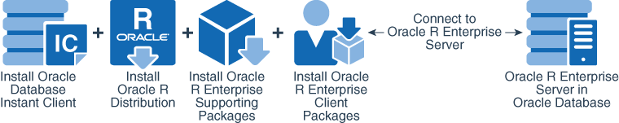
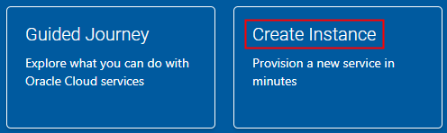
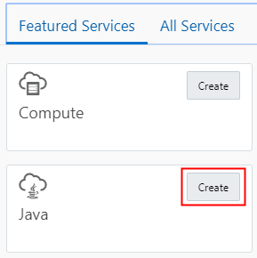
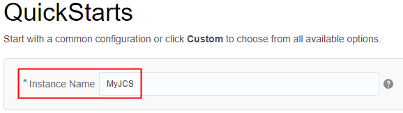
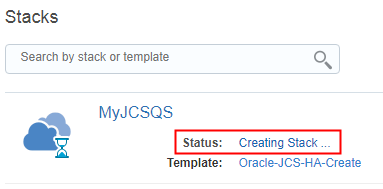

# Getting Started with Oracle Java Cloud Service by Using a QuickStart Template
## Before You Begin

This tutorial shows you how to create an Oracle Java Cloud Service instance and supporting database by using a QuickStart template. This tutorial takes approximately 10 minutes to complete. The typical wait time to provision your new instance is 30 to 60 minutes.

~~Strikethough~~

<p style="color:red"><strong>Raw HTML:</strong> paragraph with red font color applied.</p>

For other resources, see [Want to Learn More? (internal xref to anchor)](index.html#want-to-learn-more)

---

### Background
With Oracle Java Cloud Service, you can quickly create and manage a Java Platform, Enterprise Edition (Java EE) application environment in the cloud, without installing and configuring any software yourself. The environment is based on Oracle WebLogic Server and Oracle Database.

#### Oracle R Enterprise Client

The Oracle R Enterprise client components enable you to connect an R engine on your Windows PC to the Oracle R Enterprise server in an Oracle Database instance.

##### Key Components

In this tutorial, you create a folder on your Windows PC, download the Oracle Database Instant Client, Oracle R Distribution, and the Oracle R Enterprise client component installer files, extract the contents, and configure your system to use them. You also install the Oracle R Enterprise client and supporting packages.

###### Illustration

Finally, you test the installation by connecting your local R engine to the Oracle R Enterprise server in a remote Oracle Database instance.



[Description of the illustration ore_components.png (image at body paragraph level)](images/ore_components.txt)

The above image is for illustration and testing purposes. It is not part of the original tutorial content.

## What Do You Need?
To get started, you need valid credentials for an Oracle Cloud account that has an active subscription to Oracle Java Cloud Service. See [How to Begin with Oracle Java Cloud Service Subscriptions (lookup URL)](http://www.oracle.com/pls/topic/lookup?ctx=cloud&id=JSCUG-GUID-8408EA3E-8058-470A-A414-DB9A840320D4).

Nested UL (4 levels):

- [x] 64-bit Microsoft Windows and the Administrator privilege.
  - [x] Access to the internet.
  - [ ] A remote instance of Oracle R Enterprise server installed.
    - [ ] The RQSYS schema created in your remote Oracle Database instance.
      - [ ] A user schema and password in the remote database instance.
- [ ] The Oracle SID and host name of the remote database instance, and the TCP port number that the database uses.

Nested OL (4 levels):

1. 64-bit Microsoft Windows and the Administrator privilege.

   1. Access to the internet.

   2. A remote instance of Oracle R Enterprise server installed.

	  1. The RQSYS schema created in your remote Oracle Database instance.

         1. A user schema and password in the remote database instance.

			Additional step information.

		 2. A valid password.

	  2. The Oracle Database documentation.	 

2. The Oracle SID and host name of the remote database instance.

3. The TCP port number that the database uses.

# Access the Service Console

Follow these steps to create an **_ASP.NET_** Core Web Project in Visual Studio.

1. Sign in to [Oracle Cloud](https://cloud.oracle.com/en_US/sign-in).

2. On the Dashboard, click **Create Instance**.

    

	[Description of the illustration dashboard-create.png](images/dashboard-create.txt)

3. Below **Featured Services**, next to **Java**, click **Create**.

   

   [Description of the illustration dashboard-create-java.png](images/dashboard-create-java.txt)

   If the QuickStart feature is not available in your account, follow this tutorial instead: [Creating a Custom Oracle Java Cloud Service Instance (web link)](https://apexapps.oracle.com/pls/apex/f?p=44785:112:0:::112:P112_CONTENT_ID:10021).

# Create a QuickStart Instance

Nested UL within OL and code blocks:

1. Enter an **Instance Name**. For this tutorial, enter `MyJCS`.

   

   [Description of the illustration quick-start-name.png](images/quick-start-name.txt)

2. Below one of the available templates, click **Create**:

   * Simple Java Web App (2 OCPUs)

   * Multi-Tier Java EE App with High Availability (5 OCPUs)

   * Highly Available Java EE App with Caching (6 OCPUs)

   For help choosing a template, see the documentation.

3. Click **Download**. Save the archive file to your machine. It contains:

   1. The username and password that you use to administer Oracle WebLogic Server:

      * username: Guest\__username_ (escaped "_" character)

	  * password: guest123

   2. The system password that you use to administer Oracle Database

   3. SSH keys that you use to access the VMs that host your service instances

4. Click **Create**. The Cloud Stack Console is displayed (standalone codeph).

   To execute a JAR file containing class and resource files for the application, specify `-jar` option followed by a JAR file name to be called:

   `java [options] -jar file.jar [arguments]`

5. Get the key's fingerprint (long, fenced codeblock).

   ```
   openssl rsa -pubout -outform DER -in ~/.oci/oci_api_key.pem -passin stdin | openssl md5 –c
   ```

   **Note:** On UNIX-like systems, omit `-passin stdin` from the command.

   Enter the passphrase, and wait for the fingerprint to be generated and displayed (multi-line, fenced codeblock).

   ```
   writing RSA key
   (stdin)= 17:65:02:91:a0:d8:20:60:ac:72:74:82:47:0e:91:b9
   (stdin)= 17:65:02:91:a0:d8:20:60:ac:72:74:82:47:0e:91:g8
   (stdin)= 17:65:02:91:a0:d8:20:60:ac:72:74:82:47:0e:91:z4
   ```

6. Replace the argument values in the following expression with the values for your database, user schema, and password (multi-line, indented, fenced codeblock).

   ```
   > ore.connect(user="RQUSER", sid="orcl", host="myhost",
                 password="RQUSERpsw", port=1521, all=TRUE)
   ```

# Monitor the Instance Creation

1. Verify that the status of your **MyJCSQS** cloud stack is `Waiting or Creating Service`. A cloud stack is a group of Oracle Cloud resources that are created as a single unit.

   

   [Description of the illustration stack-in-progress.png](images/stack-in-progress.txt)

2. Click the stack name, **MyJCSQS**.

3. Periodically, click **Refresh**  on the right side of the page until the status of the MyJCS instance is no longer `Waiting or Creating Service`.

   

   [Description of the illustration stack-details-completed.png](images/stack-details-completed.txt)

4. Click **MyJCS** to view and manage your new Oracle Java Cloud Service instance.

   **Tip:** To return to the cloud stack at a later time, click the **Dashboard** menu , and then select **Cloud Stack**.

Any application that Java HotSpotVM runs can be run on GraalVM Enterprise. In the same way as GraalVM Enterprise can execute programs written in JVM-based languages, it can load and run the Truffle Language Implementation framework (henceforth Truffle framework), which is itself a Java program – a collection of jar files.

**Table with misaligned cells**

| Command | Description |
| --- | --- |
| `git status` | List all **_new \| modified_** files (escaped "\|"character) |
| `git diff` | Show file differences that *haven't* _been_ staged |

**Table with aligned cells and cell alignment**

| Left-aligned | Center-aligned | Right-aligned |
| :---         |     :---:      |          ---: |
| git status   | git status     | git status    |
| git diff     | git diff       | git diff      |

# Want to Learn More?

* [Product tour video](https://apexapps.oracle.com/pls/apex/f?p=44785:265:0::::P265_CONTENT_ID:10027)
   * [QuickStart documentation](http://www.oracle.com/pls/topic/lookup?ctx=cloud&id=JSCUG-GUID-CE7CA098-F8D4-4BE2-AC7B-3D2D3AECD68D)
      * [QuickStart documentation](http://www.oracle.com/pls/topic/lookup?ctx=cloud&id=JSCUG-GUID-CE7CA098-F8D4-4BE2-AC7B-3D2D3AECD68D)
      * [Tutorial: Deploy an application](http://apexapps.oracle.com/pls/apex/f?p=44785:112:0:::112:P112_CONTENT_ID:10014)
   * [Tutorial: Deploy an application](http://apexapps.oracle.com/pls/apex/f?p=44785:112:0:::112:P112_CONTENT_ID:10014)
* [Tutorial: Create a custom service instance](http://apexapps.oracle.com/pls/apex/f?p=44785:112:0:::112:P112_CONTENT_ID:10021)
* [More tutorials](http://www.oracle.com/pls/topic/lookup?ctx=cloud&id=jcstutorials)
