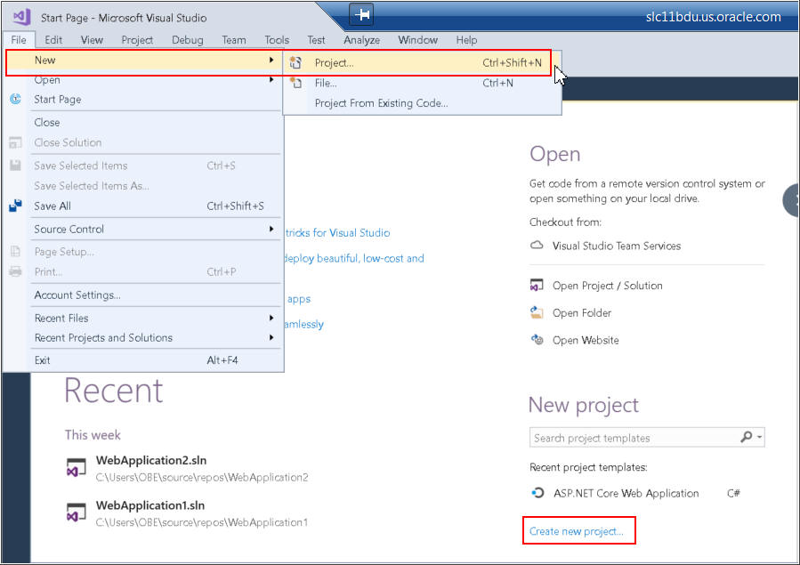
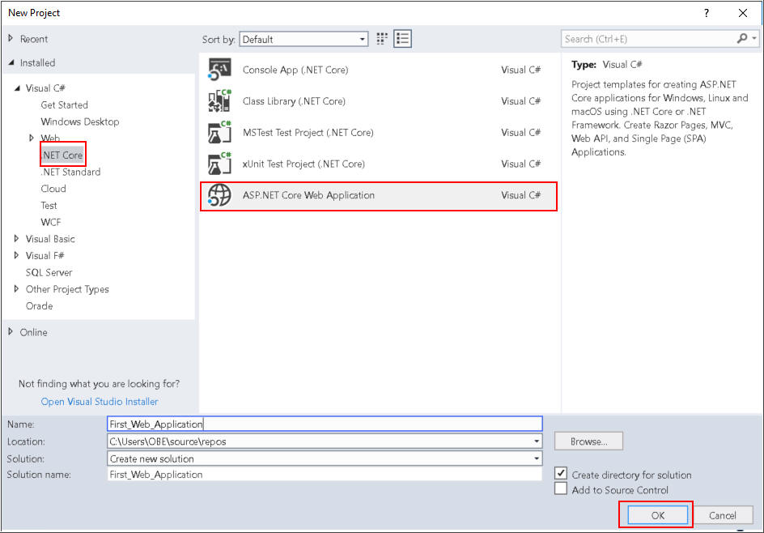
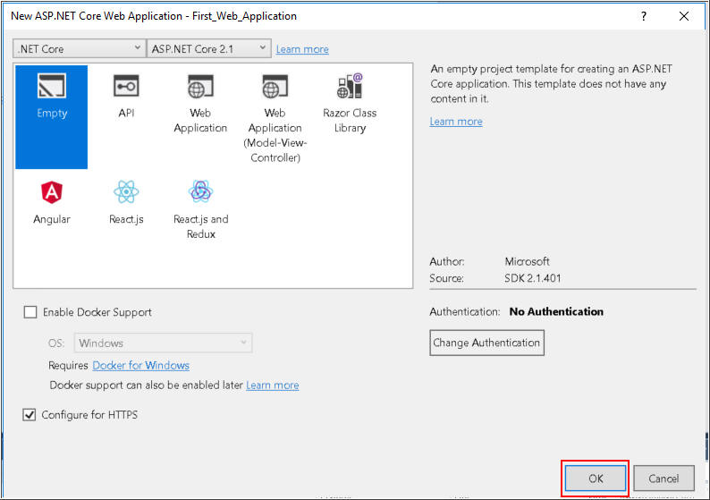
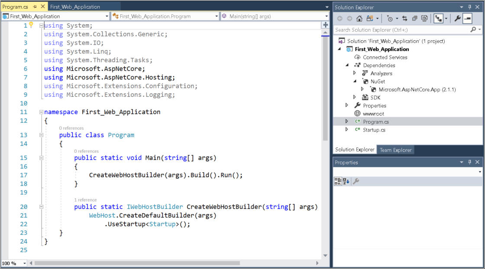
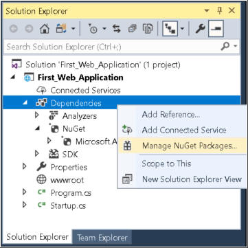
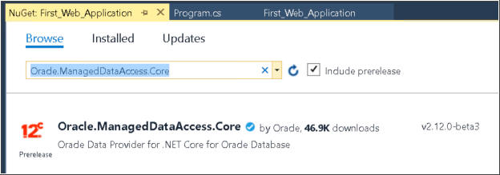
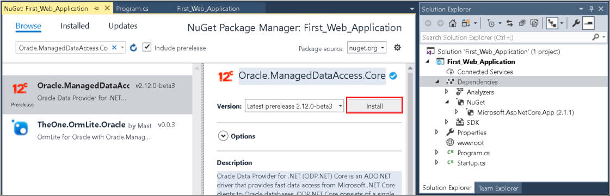

# Getting Started with ODP.NET Core
## Before You Begin

This 15-minute tutorial shows you how to create a basic .NET Core web application that retrieves data from the Oracle Database with Oracle Data Provider for .NET (ODP.NET) Core.

### Background
ODP.NET Core is an ADO.NET driver that provides fast data access from Microsoft .NET Core clients to Oracle databases. It runs on both Windows and Linux. ODP.NET consists of a single 100% managed code dynamic-link library, `Oracle.ManagedDataAccess.dll`, available through the NuGet deployment.

In this tutorial, you will learn how to create an ASP.NET Core Web application, download ODP.NET Core from nuget.org, configureODP.NET using the `OracleConfiguration` class, and connect to the Oracle Database.

### What Do You Need?
Before starting this tutorial, you should perform the following tasks:

* Install Microsoft Visual Studio 2017 or later
* Install Oracle Database 12c or later

## Create ASP.NET Core Web Project in Visual Studio

Follow these steps to create an ASP.NET Core Web Project in Visual Studio.

1. Open Visual Studio. Click **File** in the File Menu. Select **New**, then **Project**.
   

2. Select Visual **C#>.NETCore> ASP.NET Core Web Application**. Rename the Web Application as **First\_Web\_Application** and click **OK**.

    

3. Select **Empty** Project template and click **OK**.

    

4. After the project **First\_Web\_Application** is created, you can explore the structure of the project in the **Solution Explorer**.

    

## Download ODP.NET Core from Nuget.org
In this section, you will download the ODP.NET Core NuGet package into the application.

1. Right Click on **Dependencies** in the **Solution Explorer** and **Select Manage NuGet packages**.

   

2. Select **Browse** and search for **Oracle.ManagedDataAccess.Core**.

   

3. Select **Oracle.ManagedDataAccess.Core** and click **Install**.

      
