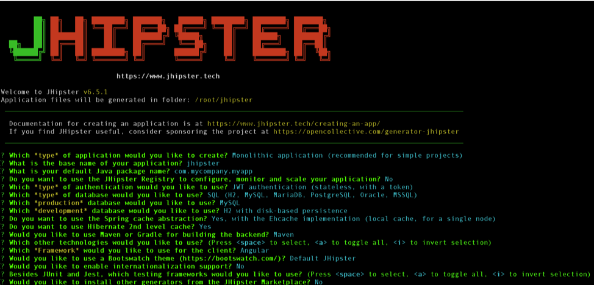
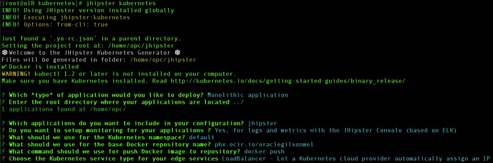
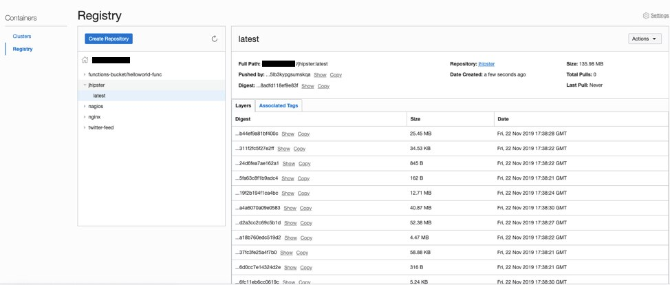
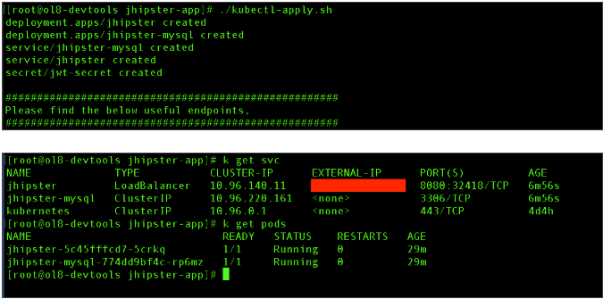
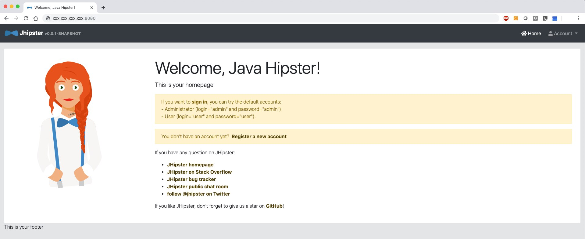

# Developing Modern Web Applications and Microservices with JHipster on Container Engine for Kubernetes


[Description of the image jhipster.jpg](files/jhipster.txt)

[JHipster](https://www.jhipster.tech/) (Java Hipster) is a free and open source application generator that you can use to quickly develop modern web apps and microservices by using Angular or React (JavaScript library) and the Spring Framework. JHipster combines the following elements to generate a complete, modern web app or microservice architecture:

* A high-performance, server-side Java stack with Spring Boot
* A mobile-first front end with Angular, React, and Bootstrap
* A microservice architecture with JHipster Registry, Netflix OSS, the Elastic Stack, and Docker
* A workflow for building an application with Yeoman, Webpack, and Maven/Gradle

This post explains how to install and provision a JHipster container on [Oracle Cloud Managed Container Engine for Kubernetes](https://docs.cloud.oracle.com/iaas/Content/ContEng/Concepts/contengoverview.htm) (sometimes referred to as OKE).

## Getting Started 
First, let's explore the components that you need to build and deploy a JHipster container on Container Engine for Kubernetes.

* An [Oracle Container Engine for Kubernetes cluster](https://docs.cloud.oracle.com/iaas/Content/ContEng/Tasks/contengcreatingclusterusingoke.htm) that is up and running
* An Oracle Linux 8 Compute VM with the following components:
  * [Oracle Cloud Infrastructure (oci)](https://docs.cloud.oracle.com/iaas/Content/API/SDKDocs/cliinstall.htm) and [kubectl](https://docs.cloud.oracle.com/iaas/Content/ContEng/Tasks/contengaccessingclusterkubectl.htm) command lines installed and configured 
  * Additional rpm packages: npm, git, java-11-openjdk, and docker-ce
  * Docker enabled and running
* CIDR/ports for Kubernetes pods open in the local virtual cloud network (VCN) [security list](https://docs.cloud.oracle.com/iaas/Content/Network/Concepts/securitylists.htm)
* JHipster public port 8080 included in the VCN security list ingress rule to allow public communication

## Deployment Process
Connect to your Oracle Linux 8 Compute VM as opc and run perform the following steps:

1. Create a local folder call `jhipster` and go to it:

   ```mkdir jhipster && cd jhipster```

2. Run `npm install` and choose the default values to generate an application:

   ```npm install -g generator-jhipster```
   
   
  
   [Description of the image install.png](files/install.txt)
   
3. Now, for the Kubernetes configuration files, create a folder called `kubernetes` and go to it:

   ```mkdir kubernetes && cd kubernetes```
   
4. Run the following command:

   ```jhipster kubernetes```
   
   
   
   [Description of the image kubernetes.jpg](files/kubernetes.txt)

5. Verify that Docker is installed and running.

6. Switch back to the JHipster application folder to generate the missing Docker image, and run the embedded Maven wrapper to create it:

   ```
   cd /home/opc/jhipster
   ./mvnw package -Pprod verify jib:dockerBuild
   ```

   This process takes a couple of minutes. After it’s finished, the next steps are to connect to the [Oracle Cloud Infrastructure Registry](https://docs.cloud.oracle.com/iaas/Content/Registry/Concepts/registryoverview.htm) (referred to as OCIR) and then tag and push the new image.

7. Log in to the Registry using the Docker CLI. This example uses the Phoenix data center. Additional region names and codes are available in the [documentation](https://docs.cloud.oracle.com/iaas/Content/Registry/Concepts/registryprerequisites.htm).

   ```docker login -u oci_tenancy_name/username_admin phx.ocir.io```
   
8. After the login command has successfully run, ensure that the `jhipster/jhipster-deployment.yaml` file contains the `:latest` build info in the `jhipster` image line:

   ````
   …
   name: jhipster
        image: phx.ocir.io/tenancy_name/jhipster:latest
   …
   ```
   
9. Now, tag and push the new JHipster app container into the Registry:

   ```
   docker image tag jhipster phx.ocir.io/tenancy_name/jhipster
   docker push phx.ocir.io/tenancy_name/jhipster
   ```

10. Check your tenancy’s Registry and verify you have a new repo called `jhipster`.

    

    [Description of the image repo.jpg](files/repo.txt)
   
11. Finally, to provision the Docker image in the Oracle Kubernetes cluster, run the apply command created in the folder that you generated in your Kubernetes configuration previously.

    ```./kubectl-apply.sh```

    

    [Description of the image apply.png](files/apply.txt)  
 
That's it! After a few seconds, the new containers and services are ready. The JHipster container portal in Container Engine for Kubernetes should be available and accessible through the load balancer public IP address that was created during the container provisioning process (`http://public_IP_address:8080`). Ensure that port 8080 is open for public communication.
    


[Description of the image browser.jpg](files/browser.txt)  

## Conclusion

JHipster makes Java and JavaScript development easier by combining [several frameworks for the front end and back end](https://www.jhipster.tech/tech-stack/), and by providing capabilities like validation, security, responsive website, and database versioning to let users generate a complete, modern web application without the installation overhead. Combine JHipster with Oracle Container Engine for Kubernetes, and you will have a robust and scalable development platform ready for production.

