# File Storage Service
  
## Table of Contents

[Overview](#overview)

[Prerequisites](#Prerequisites)

[Practice-1: Configuring VCN Security List Rules for File Storage](#practice-1-configuring-vcn-security-list-rules-for-file-storage)

[Practice-2: Creating a File System](#practice-2-creating-a-file-system)

[Practice-3: Mounting a File System](#practice-3-mounting-a-file-system)

**Note:** *Some of the UIs might look a little different than the screen shots included in the instructions, but you can still use the instructions to complete the hands-on labs.*

## Overview

Oracle Cloud Infrastructure File Storage service provides a durable, scalable, distributed, enterprise-grade network file system. You can connect to a File Storage service file system from any bare metal, virtual machine, or container instance in your Virtual Cloud Network (VCN). You can also access a file system from outside the VCN using Oracle Cloud Infrastructure FastConnect and Internet Protocol security (IPSec) virtual private network (VPN). The File Storage service supports the Network File System version 3.0 (NFSv3) protocol. The service supports the Network Lock Manager (NLM) protocol for file locking functionality.


## Prerequisites

- Oracle Cloud Infrastructure account credentials (User, Password, and Tenant) 
- To sign in to the Console, you need the following:
  -  Tenant, User name and Password
  -  URL for the Console: [https://cloud.oracle.com/](https://cloud.oracle.com/)
  -  Oracle Cloud Infrastructure supports the latest versions of Google Chrome, Firefox and Internet Explorer 11

## Practice-1: Configuring VCN Security List Rules for File Storage

When you create a VCN, a default security list is also created. Rules in the security list are used to allow or deny traffic to a subnet. Before you can mount a file system, you must configure security list rules to allow traffic to the mount target subnet. File Storage requires stateful ingress to TCP ports 111, 2048, 2049, and 2050 and stateful ingress to UDP ports 111 and 2048.

1. Open the navigation menu. Under **Core Infrastructure**, go to **Networking** and click **Virtual Cloud Networks**.
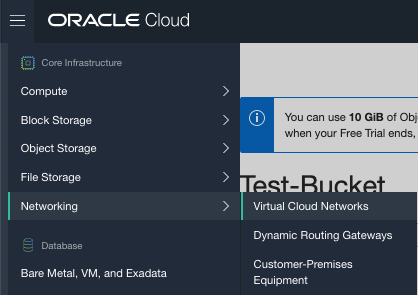

2. In the **List Scope** section, select the compartment that contains the subnet to be associated with your file system and click the cloud network to be associated with your file system.
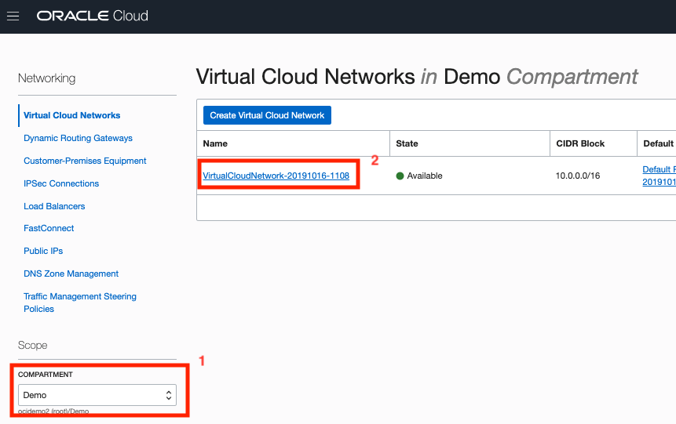
   
3. On the details page for the cloud network, click **Security Lists**, and then click on the security list used by the subnet to be associated with your file system. On the details page of the security list, click **Edit All Rules**.
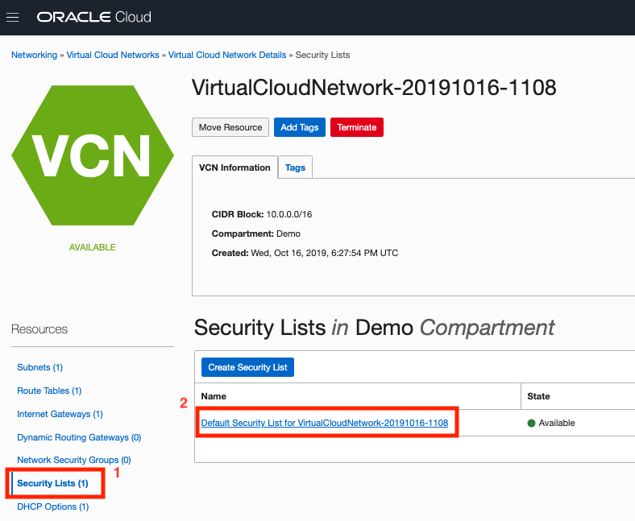

4. On the details page of the security list, select the **Ingress Rules** link under the **Resources** section. The click the Add Ingress Rule button. click **Edit All Rules**.
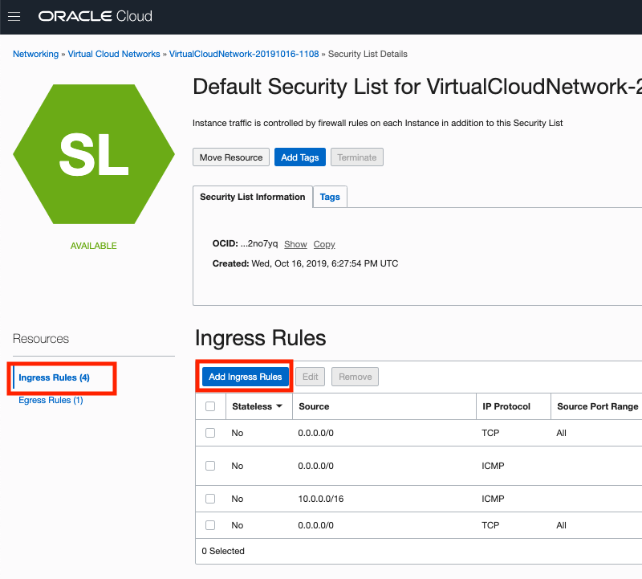

5. Add the following ingress rule allowing TCP traffic:
   
   - **Source CIDR:** 10.0.0.0/16
   - **IP Protocol:** TCP
   - **Source Port Range:** All
   - **Destination Port Range:** 2048-2050
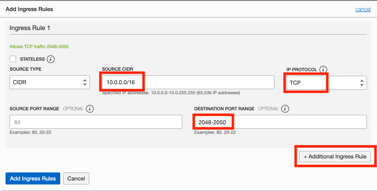

6. Click **+ Another Ingress Rule** to add more rules.

7. Add the following ingress rule allowing UDP traffic:
   
   - **Source CIDR:** 10.0.0.0/16
   - **IP Protocol:** UDP
   - **Source Port Range:** All
   - **Destination Port Range:** 2048
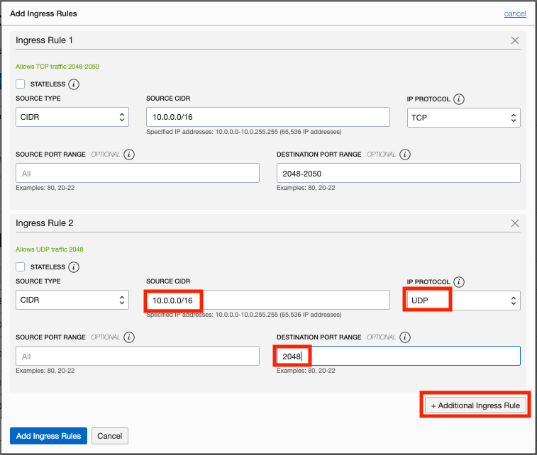

8. Create a third ingress rule allowing traffic to a **Destination Port Range** of **111** for the NFS rpcbind utility.
   
   - **Source CIDR:** 10.0.0.0/16
   - **IP Protocol:** TCP
   - **Source Port Range:** All
   - **Destination Port Range:** 111
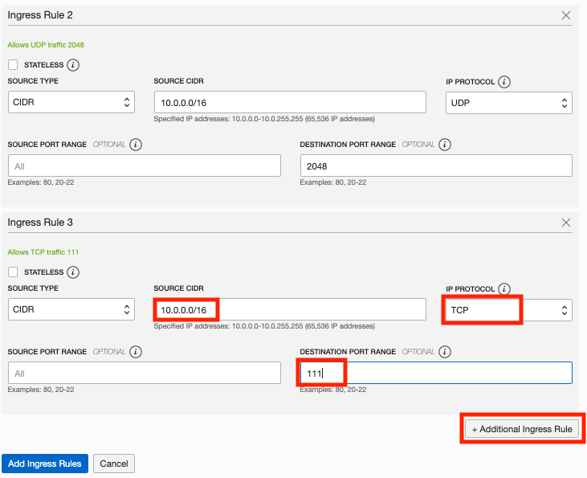

9. Click **+ Another Ingress Rule** to add more rules.

10. Create a fourth ingress rule allowing traffic to a **Destination Port Range** of **111** for the NFS rpcbind utility with UDP
   
   - **Source CIDR:** 10.0.0.0/16
   - **IP Protocol:** UDP
   - **Source Port Range:** 111
   - **Destination Port Range:** All
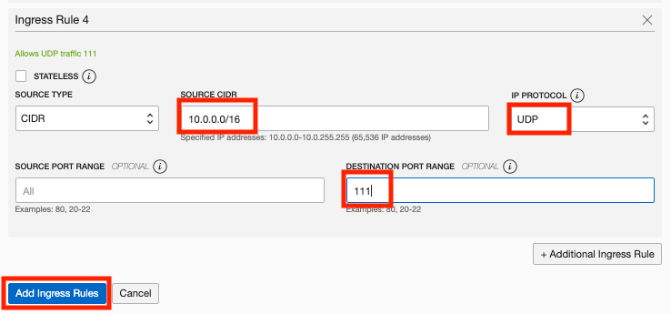

11. When you're done, click the **Add Ingress Rules** button.

## Practice-2: Creating a File System
You can create a shared file system in the cloud using the File Storage service. When you use the Console, creating a file system also creates a mount target that your Compute instances use to access and write to the file system. Once a mount target is created, multiple file systems can be associated with it. Using the API or the Command Line Interface (CLI), you can create file systems and mount targets independently of each other.

1. Open the navigation menu. Under **Core Infrastructure**, click **File Storage -> File Systems**
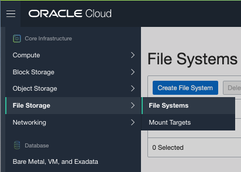

2. Click the **Create File System** button.

3. In the **Create File System** dialog, under **File System Information**, click on **Edit Details** 
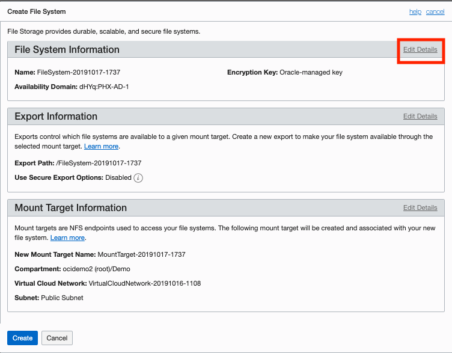

4. Enter the following:

   - **Name:** FSS-Storage
   - **Avaiability Domain:** Select the same availability domain where you created your compute instance.

    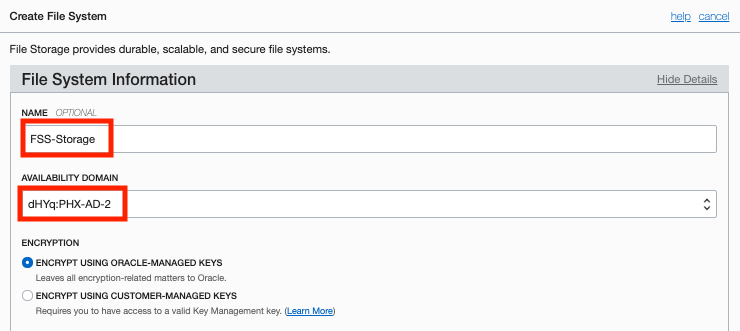

5. Under **Mount Target Information** click on **Edit Details**
    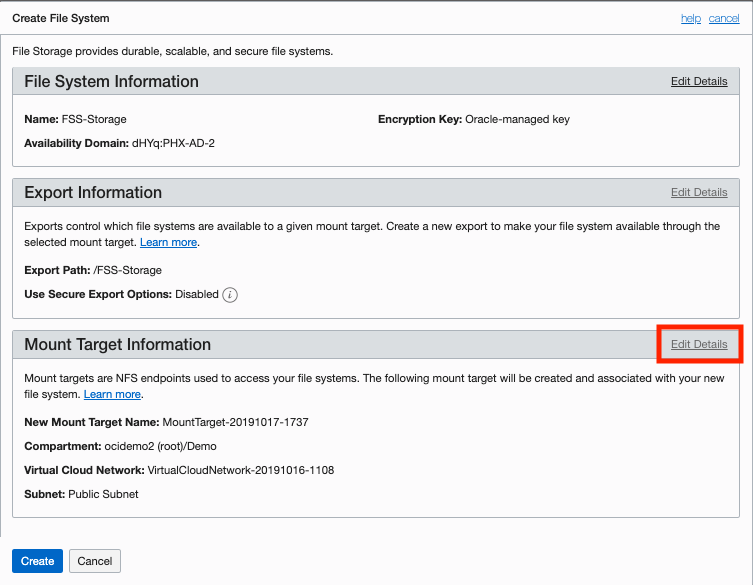

6. Enter the following:

   - **Name:** FSS-Mount
   - **Virtual Cloud Network:** Select your VCN
   - **Subnet:** select a subnet for the mount target
  
    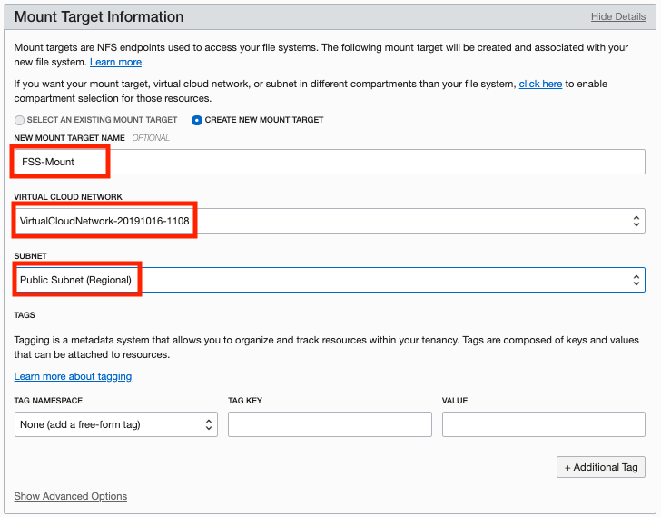

7. Click the **Create** button. You will see the Details screen for your new file storage.

    

## Practice-3: Mounting a File System

Users of Ubuntu and Linux operating systems can use the command line to connect to a file system and write files. Mount targets serve as file system network access points. After your mount target is assigned an IP address, you can use it to mount the file system. On the instance from which you want to mount the file system, you need to install an NFS client and create a mount point. When you mount the file system, the mount point effectively represents the root directory of the File Storage file system, allowing you to write files to the file system from the instance

1. Connect to the instance, you can use ‘Terminal’ if you are using MAC or Gitbash if you are using Windows. Use the following SSH command:
  
    **Note:** For Oracle Linux VMs, the default username is **opc**

    ```
    # ssh opc@PublicIP_Address
    ```
2. You can see the correct mount commands for your file system by clicking on the file system you just created:
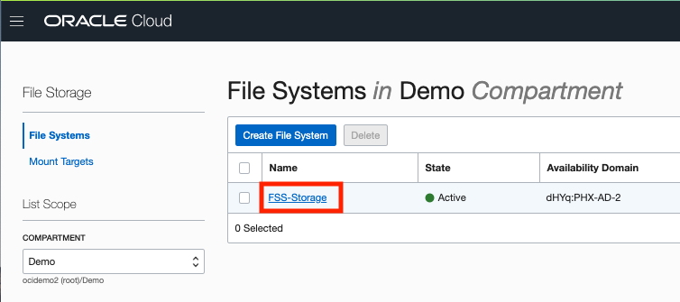

3. Then click on the storage link:
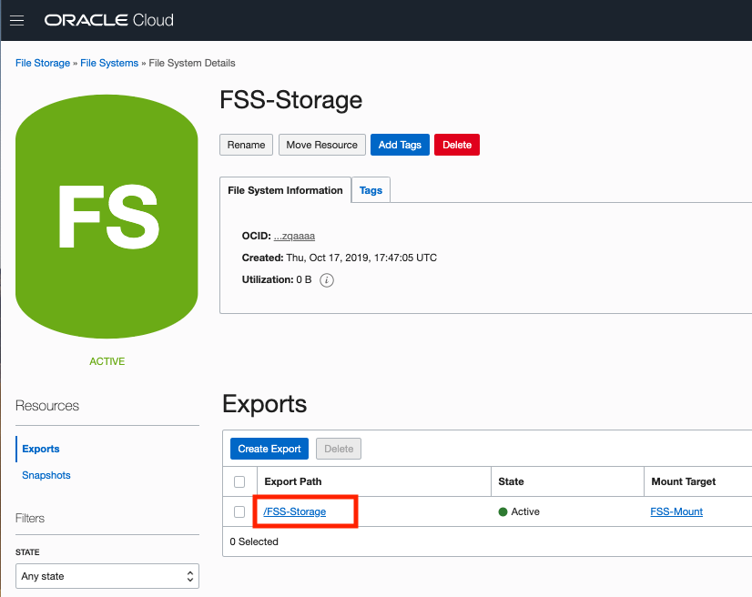

4. Now you can click on the **Mount Commands** button to get the literal commands you need to run in a terminal window on your compute instance:
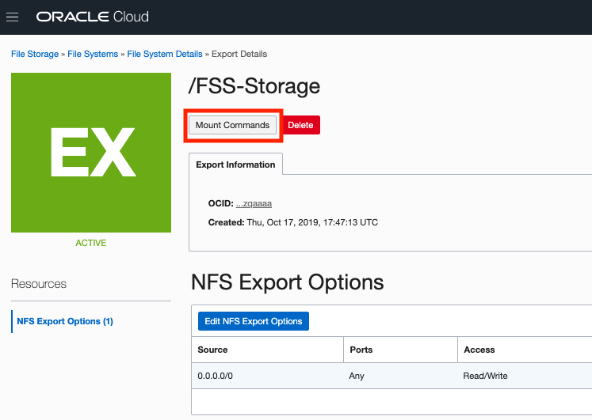

5. Open a terminal window to your compute instrance and copy and paste each of the commands in order.
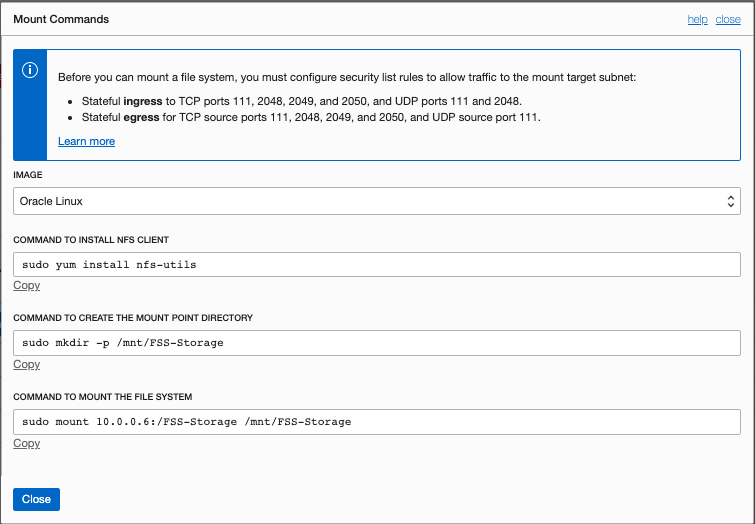

    **Note:** You can mount FSS File System in multiples nodes in different Availability Domains at the same time.
