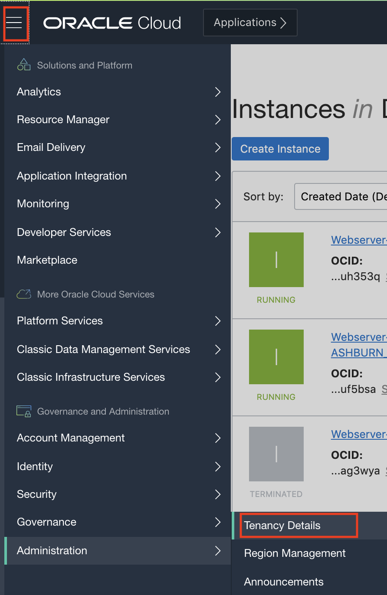
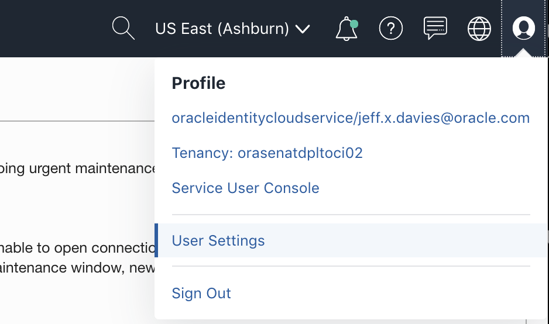
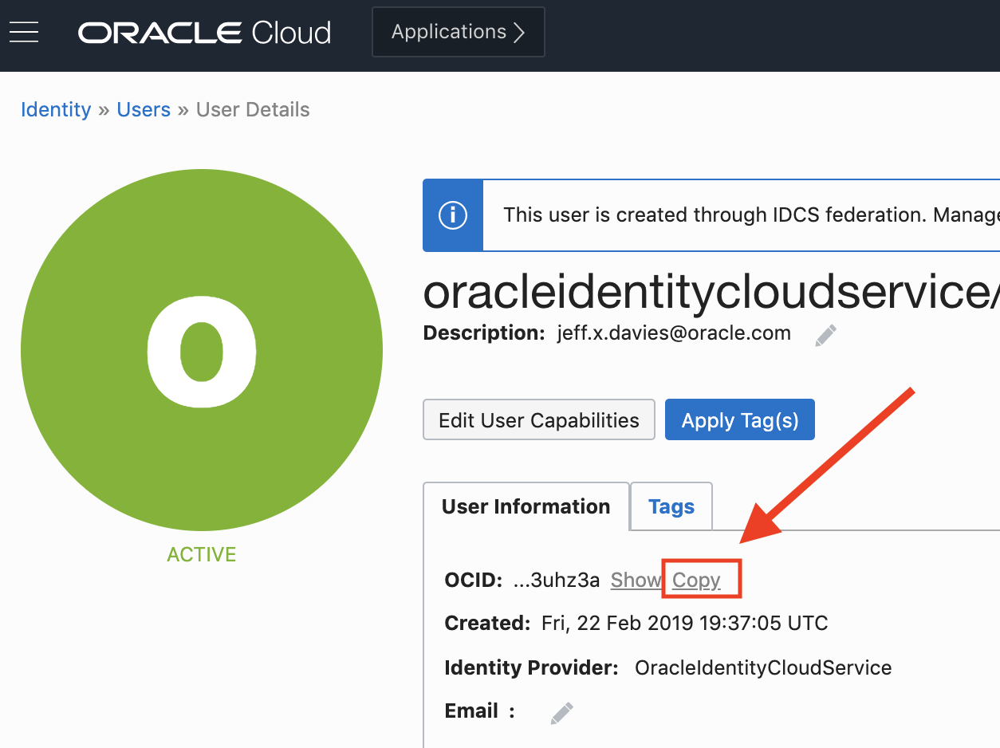
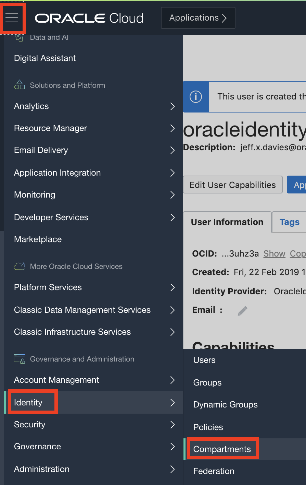

# Terraform Lab

[Overview](#overview)

[Pre-Requisites](#pre-requisites)

[Install Terraform](#install-terraform)

**Note:** *Some of the UIs might look a little different than the screen shots included in the instructions, but you can still use the instructions to complete the hands-on labs.*

## Overview

Terraform is a cloud-neutral scripting language. It works not only with te Oracle cloud, but also AWS, Azure and others. Here is an example of the types of cloud tasks that you can script using Terraform:

1. Create a single asset, like a compute instance or a load balancer
2. Create a fully defined solution, incuding the Virtual Cloud Network (VCN), compute instances, load balancers, secruity rules, provision users, etc.
3. Script the startup or shutdown of any of your cloud assets. For example, you may want to shutdown your entire development and test environments each night at a certain time. You would create a second script to start the dev and test environments in the morning.

In this lab, you will create a script that essentially does all of the work defined in the other Lab-100 labs.

## Pre-Requisites

- Oracle Cloud Infrastructure account credentials (User, Password, and Tenant)
- To sign in to the Console, you need the following:
  - Tenant, User name and Password
  - URL for the Console: [https://cloud.oracle.com/](https://cloud.oracle.com/)
  - Oracle Cloud Infrastructure supports the latest versions of Google Chrome, Firefox and Internet Explorer 11. Please do not use the Microsoft Edge browser as it is incompatible.

## Install Terraform

Terraform needs to be installed on an OCI compute instance. We wil refer to this instance as the *Bastion-Server*

### Create the Demo Cmpartment

TODO

### Create the Bastion-Server

1. Log into OCI. If you are unsure how to do this, refer to the [Identity](https://github.com/jdavies/learning-library/blob/master/oci-library/L100-LAB/Identity_Access_Management/IAM_HOL.md) lab.

2. Using the "hamburger" menu in the upr left corner of your browser window, click on the `Compute -> Instances` menu item.

3. Click on the `Create Instance` button. Name the instance `Bastion-Server` and ensure it has a public IP address. You may need to specifiy a public RSA key ***ToDo***

### SSH into the Compute Instance

1. Open a terminal window and *ssh* into your *Bastion-Server* instance using the following command template:

```shell
ssh -i <full path to your private key> opc@<your public IP address>
```

for example:

```shell
ssh -i ~/.ssh/id_rsa opc@129.0.12.34
```

2. When your ssh session starts, you will be in the *home* folder of the `opc` user. Use `mkdr lab` command to create a `lab/` folder. The change into that directory with the `cd lab` command.

### Create the env-vars file

1. You need to create an env-vars flle that contains the variables specific to your cloud instance. Execute the following command to download the template `env-vars` file into the `lab/` folder

```shell
curl -L -o env-vars https://raw.githubusercontent.com/jdavies/learning-library/master/oci-library/L100-LAB/Terraform/env-vars
```

Alternatively, you can copy the file contents from the sample below:

```shell
export TF_VAR_tenancy_ocid=<tenancy_OCID>
export TF_VAR_user_ocid=<user_OCID>
export TF_VAR_compartment_ocid=<Compartment_OCID>
export TF_VAR_fingerprint=$(cat ~/.oci/oci_api_key_fingerprint)
export TF_VAR_private_key_path=~/.oci/oci_api_key.pem
export TF_VAR_ssh_public_key=$(cat ~/.ssh/id_rsa.pub)
export TF_VAR_ssh_private_key=$(cat ~/.ssh/id_rsa)
export TF_VAR_region=<region id>
export TF_VAR_region_name=<region name>
```

2. Open the env-vars file for editing with this command:

```shell
vi env-vars
```

3. Switch back to your browser that is logged into OCI. You will need to copy the OCID for the tenancy into the appripriate area of the `env-vars` script. To find and copy the Tenancy OCID, use the *hamburger* menu to navigate to the `Administration -> Tenancy Details` menu.


4. Click on the *Copy* link next to the OCID to copy it's value to your clipboard.


5. Back in the *vi* editor, replace the placeholder text with the actual Tenancy OCID you just copied.

> Note: If you are unfamiliar with using the vi editor, please refer to the [cheatsheet](https://www.thegeekdiary.com/basic-vi-commands-cheat-sheet/) or ask your instructor for help.
Copy the OCIDs You Will Need

6. Next you need to find your user OCID (te OCID for the account you use to log in). To fnd this, click on the *profile* icon in the upper right and select ***User Settings*** from the dropdown menu.



7. On your settings page, click the *copy* link to copy the OCID to the clipboard.



8. Back in the *vi* editor, replace the place-holder text with your real OCI by pastng it in.

9. Now you need to get the OCID for your compartment. I recommned usng the *Demo* compartment for this. To find that OCID, use the main menu to navigate to ***Security -> Compartments***.



10. Set the TF_VAR_region field to be `us-ashburn-1` if your home region is `US East (Ashburn)` or `us-phoenix-1` if your home region is `US West (Phoenix)`. If your home region is set to a different region, please consult [Regions anbd Avalability Domains](https://docs.cloud.oracle.com/en-us/iaas/Content/General/Concepts/regions.htm) to find the correct code for your region.

11. Set the region name to the short name for the region (ie `ashburn` or `phoenix"` in most cases).

Your file should now look likethe following (with different OCIDs, of course)

```shell
export TF_VAR_tenancy_ocid=ocid1.tenancy.oc1..aaaaaaaa5txfxrudc53ir3ujznw6b3l6sqvkzddepsfu4es2i4x2xyeia
export TF_VAR_user_ocid=ocid1.user.oc1..aaaaaaaarpxca7prls2r34erbzjcnjaig6ni66xcozuvwju243uhz3a
export TF_VAR_compartment_ocid=ocid1.compartment.oc1..aaaaaaaayxq54izzfiurg29r38489zluttisbuigx65lqxkncb7dzo3q
export TF_VAR_fingerprint=$(cat ~/.oci/oci_api_key_fingerprint)
export TF_VAR_private_key_path=~/.oci/oci_api_key.pem
export TF_VAR_ssh_public_key=$(cat ~/.ssh/id_rsa.pub)
export TF_VAR_ssh_private_key=$(cat ~/.ssh/id_rsa)
export TF_VAR_region=us-ashburn-1
export TF_VAR_region_name=ashburn
```

12. Save the *env-vars* file and quit the *vi* editor so you are back at the command line in your *ssh* session.

## Run the Terraform Script

Next you need to download the terrform script into the *lab/* folder. Use the following cmmand to do this:

```shell
curl -L -o environment.tf https://raw.githubusercontent.com/jdavies/learning-library/master/oci-library/L100-LAB/Terraform/environment.tf
```

Execute the cmmands:
```shell
terraform init
terraform plan
terraform apply
```

## Conclusion

Conclusion here.

> Notes Ths lab was heavily based on the [Medium article by Jamal Arif](https://medium.com/@j.jamalarif/oracle-cloud-infrastructure-automation-with-terraform-f920df259504)
