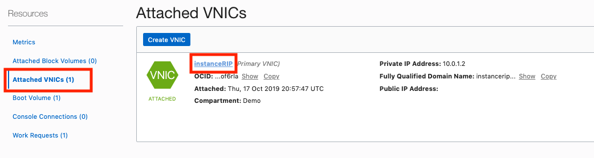
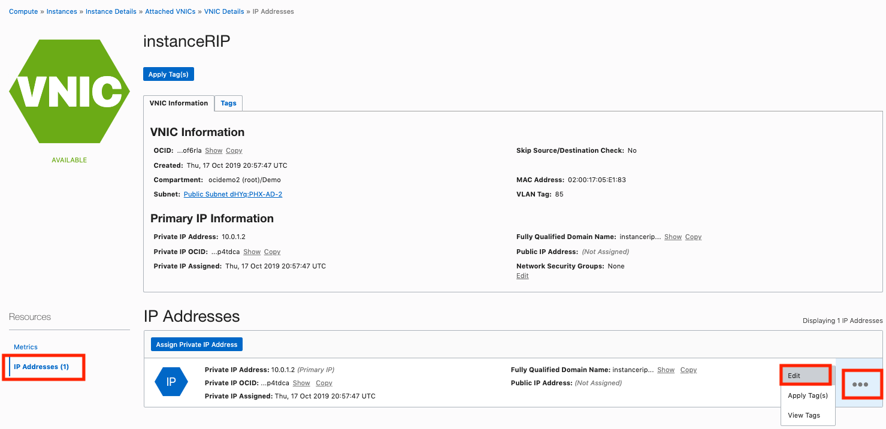
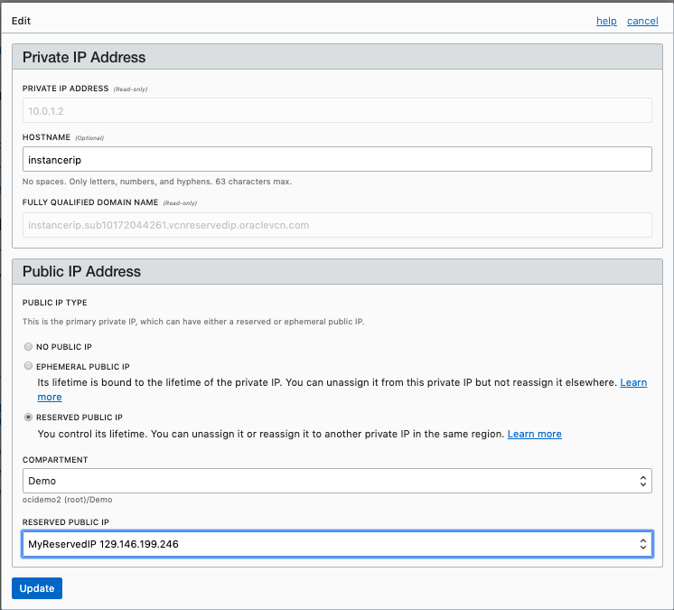
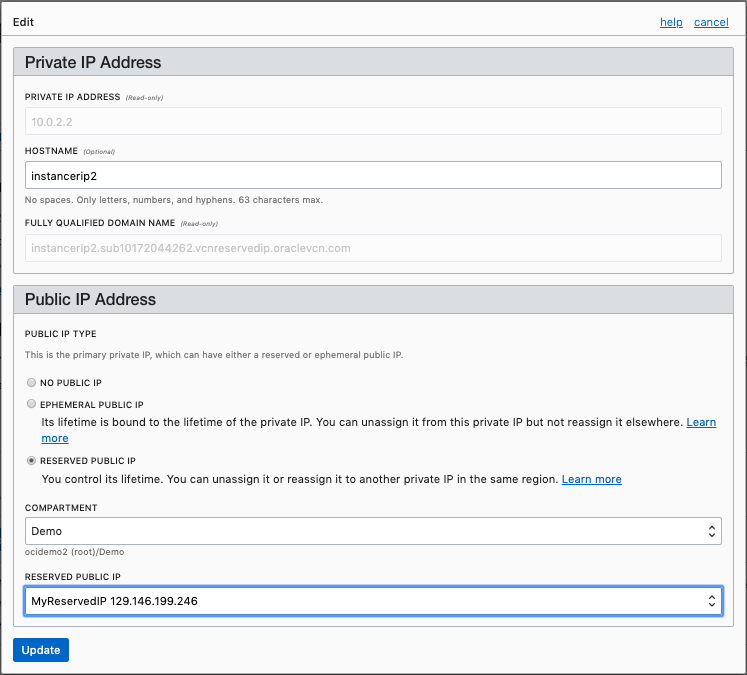
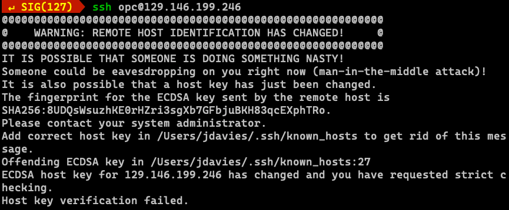
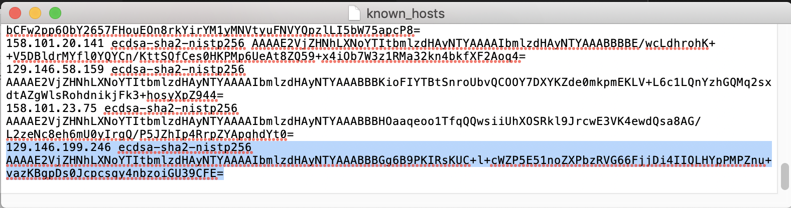

# ReservedIP Practice - Using Reserved Public IP 
  
## Table of Contents

[Overview](#overview)

[Prerequisites](#Prerequisites)# ReservedIP Practice - Using Reserved Public IP 
  
## Table of Contents

[Overview](#overview)

[Prerequisites](#Prerequisites)

[Practice 1: Sign in to OCI Console and create reserved public IP](#practice-1-sign-in-to-oci-console-and-create-reserved-public-ip)

[Practice 2: Assign reserved public IP to first compute instance](#practice-2-assign-reserved-public-ip-to-first-compute-instance)

[Practice 3: ssh to compute instance using Reserved Public IP](#practice-3-ssh-to-compute-instance-using-reserved-public-ip)

[Practice 4: Un assign Reserved Public IP](#practice-4-un-assign-reserved-public-ip)

[Practice 5: Create a second compute instance and assign the same Reserved Public IP](#practice-5-create-a-second-compute-instance-and-assign-the-same-reserved-public-ip)

[Practice 6: Delete the resources](#practice-6-delete-the-resources)

## Overview

A public IP address is an IPv4 address that is reachable from the internet. If a resource in your tenancy needs to be directly reachable from the internet, it must have a public IP address. Depending on the type of resource, there might be other requirements.

Certain types of resources in your tenancy are designed to be directly reachable from the internet and therefore automatically come with a public IP address. For example: a NAT gateway or a public load balancer. Other types of resources are directly reachable only if you configure them to be.

## Prerequisites

- Oracle Cloud Infrastructure account credentials (User, Password, Tenant, and Compartment)  

## Practice-1: Sign in to OCI console and create reserved Public IP


**Note:** OCI UI is being updated thus some screenshots in the instructions might be different than actual UI

**Before You Begin**

- We recommend using Chrome or Edge as the broswer. Also set your browser zoom to 80%

1. Sign in using your tenant name, user name and password.

2. Once signed in select the compartment assigned to you from drop down menu on left part of the screen

3. From the OCI Services menu,click **Virtual Cloud Network** under Networking and click **Create Virtual Cloud Network**

**NOTE:** Ensure the correct Compartment is selected under COMPARTMENT list


4. Fill out the dialog box:

- **Create in Compartment:** Has the correct compartment

- **Name:** Set the name to *VCN-ReservedIP*

- **Create Virtual Cloud Network Plus Related Resources:** Select this option.

- Click **Create Virtual Cloud Network**

- Click **Close**

**NOTE:** The option to "Create Virtual Cloud Network Plus Related Resources" may not be a selectable option in more recent versions of the UI. If this option is not available, create a subnet with parameters as specified in the picture below after you create this VCN. You will need the subnet when creating the Compute instance.


5. From **Networking** screen click **Public IPs** , then **Create Reserved Public IP** and Fill out the dialog box:

- **COMPARTMENT:** Ensure correct compartment is selected
- **NAME:** *MyReservedIP*

- Click **Create Reserved Public IP**


## Practice 2: Assign reserved public IP to first compute instance

1. Switch to the OCI console. From OCI servies menu, Click **Instances** under **Compute** 

2. Click Create Instance. Fill out the dialog box:

- **Name:** *instanceRIP* 

- Click on the *Show Shape, Network and Storage Options* link.

- **Availability Domain:** The default should be fine.

- **Image Operating System:** For the image, we recommend using the Latest Oracle Linux available.

- **Choose Instance Type:** Select Virtual Machine

- **Choose Instance Shape:** Select VM.Standard.E.2.1.Micro

- **Configure Boot Volume:** Leave the default

- **Virtual Cloud Network Compartment:** Choose your compartment

- **Virtual Cloud Network:** *VCN-ReservedIP

- **Subnet Compartment:** Choose your compartment. 

- **Subnet:** Choose the first Subnet

- Click on *Assign a public IP address*

- **Add SSH Keys:** Use the SSH key *id_rsa.pub* that you created earlier in this set of labs.

10. Click **Create**


11. Wait for the instance to be in the Running state

12. In the instance detail page Click **Attached VNICs** and then VNIC name



13. In VNIC detail page Click Action icon and then **Edit**



14. In the dialog box under Public IP Address choose
RESERVED PUBLIC IP, from the drop down list select
the Reserved Public IP created earlier. Click **Update**


15. Note down the Public IP address.

***We have successfully assigned a Reserved Public IP address to the compute instance***

## Practice 3: ssh to compute instance using Reserved Public IP

1. Open a terminal window and use the following command to shh into your instance:
```
ssh opc@<your-reserved-IP>
```
 
2. Verify *opc@instancerip1* appears on the prompt

***We successfully connected to the compute instance using ssh and the reserved public IP. Next we will use the same Public IP and assign it to a different Compute instance***

## Practice 4: Un assign Reserved Public IP

1. From OCI services menu, Click **Instances** under Compute, Click your instance name

2. In the instance detail page Click **Attached VNICs** and then click on the *instanceRIP* name/link.


3. In VNIC detail page, click the *IP Addresses* link on the left side of the screen. Click the *Action* icon and then **Edit**


4. In the dialog box under Public IP Address choose 
**NO PUBLIC IP** (Note the Warning message indicating
Reserved Public IP will be unassigned) . Click **Update**


***Reserved Public IP has now been un-assigned from this compute instance. Next we will create a new compute instance and assign this same Public IP to it.***

## Practice 5: Create a second compute instance and assign the same Reserved Public IP

1. From OCI servies menu, Click **Instances** under *Compute* 

2. Click the *Create Instance* button. Fill out the dialog box as done earlier to create second compute instance. Set the **Name** to *instanceRIP2* for clarity's sake.

3. Once the instance is in Running state, click Instance name

4. In the instance detail page Click **Attached VNICs**, and then VNIC name

5. In VNIC detail page Click the *IP Addresses* link nder the Resources sectionm on the left side of the page. Click the Action icon and then **Edit**

6. In the dialog box under Public IP Address choose *RESERVED PUBLIC IP*, from the drop down list select the Reserved Public IP created earlier. Click **Update**


7. Be sure that you disconnected your ssh session from earlier in this lab.

8. Open a terminal and SSH into the public IP address (it is proabbley still in your terminal's command history if you haven't closed your terminal.
```
ssh opc@<your public IP>
```

**NOTE**
You may get an error like the following:

This is cause by the fact that ssh maintains a file called *known_hosts* to keep track of its prior ssh connections.

If you get this error, edit the known_hosts file in your .ssh directory and remove the line that has the same IP address as your reserved IP address:


9. Verify opc@<COMPUTE_INSTANCE_NAME> 
(reserved-ip-instance2 in this case) appears at the prompt

## Practice 6: Delete the resources

1. Switch to  OCI console window

2. If your Compute instance is not displayed, From OCI services menu Click *Instances* under *Compute*

3. Locate first compute instance, Click Action icon and then **Terminat** 


4. Make sure Permanently delete the attached Boot Volume is checked, Click Terminate Instance. Wait for instance to fully Terminate


5. Repeat steps to delete the second compute instance

6. From OCI services menu Click **Virtual Cloud Networks** under Networking, list of all VCNs will appear.

7. Locate your VCN , Click Action icon and then **Terminate**. Click **Delete All** in the Confirmation window. Click **Close** once VCN is deleted


8. From OCI services menu Click **Networking**, then **Public IPs**, locate the Reserved Public IP you created. Click Action icon and then **Terminate**


**NOTE**
You may get error messages about not being able to delete a VCN due to its reliance on a subnet. If that happens, simply look at the subnets within a VNC and delete them first, then you can delete the entire VCN.

***Congratulations! You have successfully completed Using Reserved Public IP address lab. In this lab you created a VCN, Reserved a Public IP, Created 2 compute instances and assigned the same Public IP to both the instance one at a time.  This lab demonstrated the option of using one IP to ssh or point to different compute instance***
