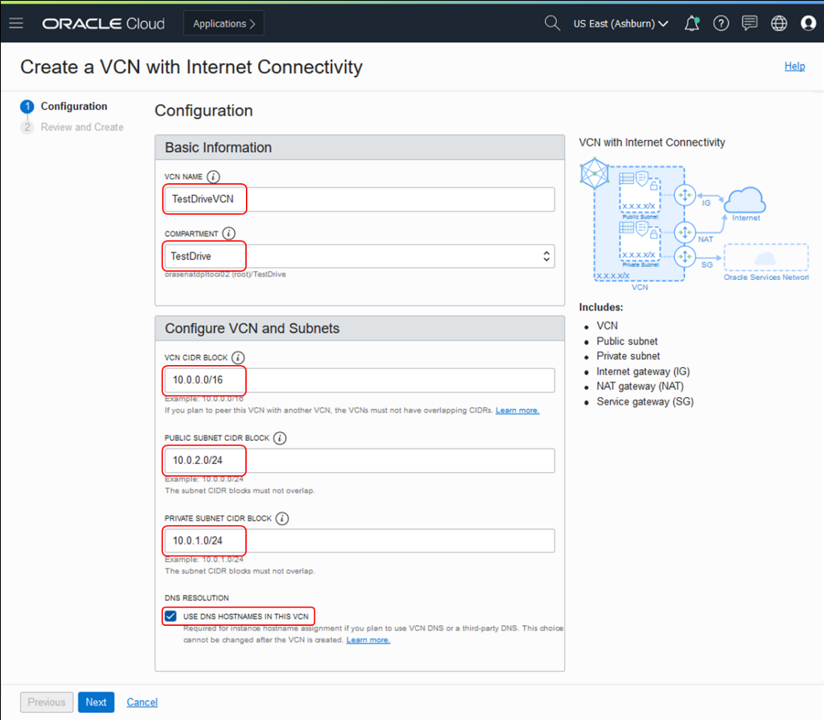

# Virtual Cloud Network

## Table of Contents

[Overview](#overview)

[Pre-Requisites](#pre-requisites)

[Create Your VCN](#create-your-vcn)

[Summary](#summary)

**Note:** *Some of the UIs might look a little different than the screen shots included in the instructions, but you can still use the instructions to complete the hands-on labs.*

## Overview

Oracle Cloud Infrastructure Compute lets you create multiple Virtual Cloud Networs (VCNs). These VCNs will contain the security lists, cmpute nstances, load balancers and many other types of network assets.

Be sure to review [Overview of Networking](https://docs.cloud.oracle.com/iaas/Content/Network/Concepts/overview.htm) to gina full understanding of the netwrk components and their relationships.

## Pre-Requisites

- Oracle Cloud Infrastructure account credentials (User, Password, and Tenant)
- To sign in to the Console, you need the following:
  - Tenant, User name and Password
  - URL for the Console: [https://console.us-ashburn-1.oraclecloud.com/](https://console.us-ashburn-1.oraclecloud.com/)
  - Oracle Cloud Infrastructure supports the latest versions of Google Chrome, Firefox and Internet Explorer 11

## Create Your VCN

To create a VCN on Oracle Cloud Infrastructure:

1. On the Oracle Cloud Infrastructure Console Home page, under the Quick Actions header, click on Set up a network with a wizard.

    

2. Select **VCN with Internet Connectivity**, and then click **Start Workflow**.

    

3. Complete the following fields:

    |                  **Field**              |    **Vaue**  |
    |----------------------------------------|:------------:|
    |VCN NAME |   OCIHOLVCN (screenshot is different)   |
    |COMPARTMENT |  Choose the ***Demo*** cmpartment you created in the [Identity Lab](../Identity_Access_Management/IAM_HOL.md)
    |VCN CIDR BLOCK|10.0.0.0/16|
    |PUBLIC SUNBET CIDR BLOCK|10.0.2.0/24|
    |PRIVATE SUBNET CIDR BLOCK|10.0.1.0/24
    |USE DNS HOSTNAMES IN THIS VCN| Checked|

    Your screen should look similar to the following:

    

4. On the “Review and Create” page, click on the  button.

5. On the “Created Virtual Cloud Network” page wait until you see the following graphic.

    

    Then click on 

## Summary

This VCN will contain all of the other assets that you will create during this set of labs. In real-world situations, you would crete multiple VCNs based on their need for access (which ports to open) and who can access them. Both of these concepts are covered in the next lab [Compute](../Compute_Services/Compute_HOL.md)