# Run Mushop with Rancher on Oracle Cloud Infrastructure Container Engine for Kubernetes

## Overview

In this lab you will experiment how to install and run Mushop application using Rancher to control a Kubernetes cluster based on OCI Container for Kubernetes (OKE) service. 
Rancher will run on an OCI Compute Instance and will transparently control OKE cluster.

[MuShop](https://github.com/oracle-quickstart/oci-cloudnative) is an opensource application the implements an e-commerce platform built as a set of micro-services and is built to showcase of several Oracle Cloud Infrastructure services in a unified reference application.

[Rancher](https://rancher.com/) is an enterprise Kubernetes management platform that works across any infrastructure.


> _**NOTE**_
>- All screen shots are examples ONLY. Screen shots can be enlarged by Clicking on them
>
>- OCI UI is being updated frequently thus some screenshots in the instructions might be different than actual UI
>
>- Do NOT use compartment name and other data from screen shots.
>
>- Login credentials are provided later in the guide (scroll down). Every User MUST keep these 
credentials handy.

Replace the below credentials with your own (seek instructors for assistance)

## Pre-requisites 

To run the lab the below pre-requisites are required:

- OCI Tenancy and Compartment name
- Tenancy, Compartment and User OCIDs
- The tenancy's root compartment must include a policy to allow Container Engine for Kubernetes to perform operations in the tenancy.
- OCI User within a group allowed to manage network and compute resources in the given compartment


## Sign in to OCI Console and create VCN

1. Sign in using your tenant name, user name and password.  

2. From the OCI Services menu, Click **Virtual Cloud Network**.  
   Select the compartment assigned to you from drop down menu on left part of the screen under Networking and Click **Create Virtual Cloud Network**


>**NOTE:** Ensure the correct Compartment is selected under COMPARTMENT list

3. Click **VCN with Internet Connectivity** and click **Start Workflow**
   
4. Fill out the dialog box:

   - **VCN NAME**: Provide a name
   - **COMPARTMENT**: Ensure your compartment is selected
   - **VCN CIDR BLOCK**: Provide a CIDR block (10.0.0.0/16)
   - **PUBLIC SUBNET CIDR BLOCK**: Provide a CIDR block (10.0.1.0/24)
   - **PRIVATE SUBNET CIDR BLOCK**: Provide a CIDR block (10.0.2.0/24)  
- Click **Next**

5. Verify all the information and  Click **Create**

6. This will create a VCN with followig components.

_**VCN**, **Public subnet**, **Private subnet**, **Internet gateway (IG)**, **NAT gateway (NAT)**, **Service gateway (SG)**_

7. Click **View Virtual Cloud Network** to display your VCN details.

8. We need to open the ports 80 and 443 to provide http/https access to the Rancher console.  
   Click Network Security Groups and then **Create Network Security Group**
   
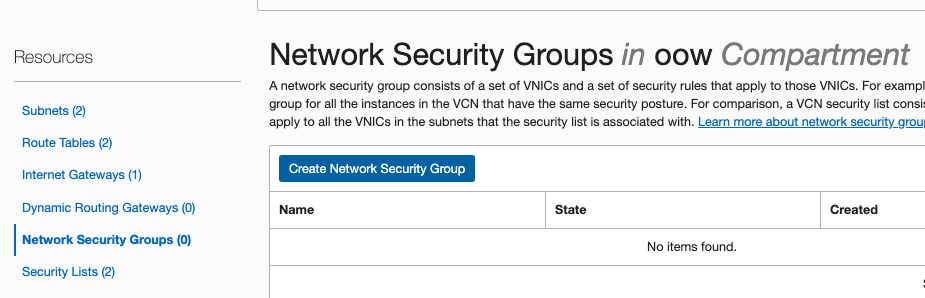

9. Fill out the dialog box:
    - **NAME**: Provide a name
    - **COMPARTMENT**: Ensure your compartment is selected
- Click **Next**

10. Add the below rule:  

    - **STATELESS**: Make sure the flag is un-checked
    - **DIRECTION**: Ingress
    - **SOURCE TYPE**: CIDR
    - **SOURCE**: 0.0.0.0/0
    - **IP PROTOCOL**: TCP
    - **SOURCE PORT RANGE**: ALL
    - **DESTINATION PORT RANGE**: 80  
  
  - Click **+ Another Rule** to add a new rule. Fill out the dialog box:  
  
    - **STATELESS**: Make sure the flag is un-checked
    - **DIRECTION**: Ingress
    - **SOURCE TYPE**: CIDR
    - **SOURCE**: 0.0.0.0/0
    - **IP PROTOCOL**: TCP
    - **SOURCE PORT RANGE**: ALL
    - **DESTINATION PORT RANGE**: 443  

## Prepar SSH Keypair

1. Open your preferred terminal. Git-Bash is suggested for MS Windows users 

2. Enter command `ssh-keygen`

3. Press Enter When asked for _'Enter File in which to save the key'_, _'Created Directory, 'Enter passphrase'_, and _'Enter Passphrase again_.


6. You should now have the Public and Private keys:

* ~/.ssh/id_rsa (Private Key)

* ~/.ssh/id_rsa.pub (Public Key)

>**NOTE:** id_rsa.pub will be used during the provisioning of the Compute instance and id_rsa to connect via SSH into compute instance.

7. In the terminal enter command  `cat ~/.ssh/id_rsa.pub`, highlight the key and copy it.

## Configure Rancher instance

We are going to create a compute instance to run Rancher

1. From OCI services menu, Click **Instances** under **Compute** 

2. Click **Create Instance**. Fill out the dialog box:

- **Name your instance**: Enter a name 
- **Choose an operating system or image source**: Select CentOS 7
- **Availability Domain**: Select availability domain
- **Instance Type**: Select Virtual Machine 
- **Instance Shape**: Select VM shape (1 or 2 OCPUs are enough)

Under _Configure Networking_  

- **Virtual cloud network compartment**: Select your compartment
- **Virtual cloud network**: Choose your VCN 
- **Subnet Compartment:** Choose your compartment. 
- **Subnet:** Choose your subnet under ***Public Subnets*** 
- **Use network security groups to control traffic** :  Check this option
- **Network security group**: Choose your network security group
- **Assign a public IP address**: Check this option
- **Boot Volume:** Leave the default
- **Add SSH Keys:** Choose 'Paste SSH Keys' and paste your public key.

1. Click  **Show Advanced Options**, select **Under Management** tab.

Under **User Data**, choose '*Paste cloud-init script*' and paste the below script.

``` SHELL
#!/bin/sh
sudo systemctl stop firewalld
sudo systemctl disable firewalld
cat <<EOF > /etc/yum.repos.d/kubernetes.repo
[kubernetes]
name=Kubernetes
baseurl=https://packages.cloud.google.com/yum/repos/kubernetes-el7-x86_64
enabled=1
gpgcheck=1
repo_gpgcheck=1
gpgkey=https://packages.cloud.google.com/yum/doc/yum-key.gpg https://packages.cloud.google.com/yum/doc/rpm-package-key.gpg
EOF
sudo yum-config-manager --add-repo https://download.docker.com/linux/centos/docker-ce.repo
sudo yum install -y docker-ce kubectl git
sudo systemctl start docker
sudo systemctl enable docker
sudo setenforce 0
sudo docker run -d -p 80:80 -p 443:443 --restart=unless-stopped rancher/rancher:latest
```

> _**Note**_: Cloud-init script will be executed at the first boot only to configure the instance.

4.  Click **Create**

>***NOTE:*** If 'Service limit' error is displayed choose a different shape such as VM.Standard.E2.2 OR VM.Standard2.2 OR choose a different AD

5. Wait for Instance to be in **Running** state. 

6. In the instance detail page, locate  **Public IP Address** under _Primary VNIC Information_ and copy the IP address.

7. Paste the above IP address in your browser. Click procees under advanced if a warning message _The connection is not private_ is shown.
   
8. Set a password to be used for Rancher and click **Continue**.
   
   

9.  Make sure the Server Rancher URL is set to the Public IP address above. Click **Save URL**.

10. Select Tools from the menu and click **Drivers**  
    
    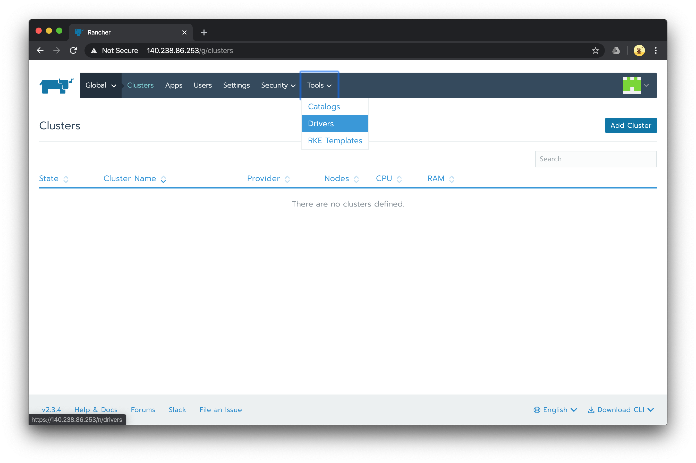

11. Click **Add Cluster Driver**. Fill the dialog box.

- **Download URL**: https://github.com/rancher-plugins/kontainer-engine-driver-oke/releases/download/v1.1.1/kontainer-engine-driver-oke-linux
-  **Custom UI URL**: https://cdn.jsdelivr.net/gh/rancher-plugins/ui-cluster-driver-oke@v1.2.0-rc/dist/component.js
- Click **Add Domain**, insert: _*.github.com_
- Click **Add Domain**, insert: _*.jsdelivr.net_

Click **Create**. Wait for the OKE cluster driver to be active.  
   
   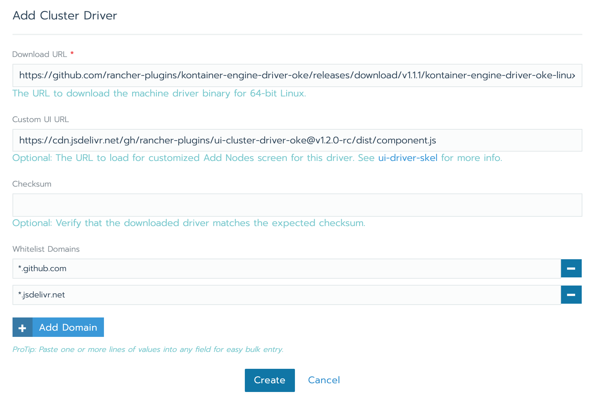

12.  Select **Clusters** from menu. Click **Add Cluster**.
13.  Under _With a hosted Kubernetes provider_ select **OKE**.
   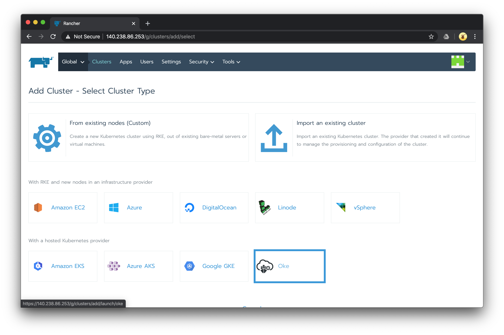
14. Fill the dialog box  
    
- **Cluster Name**: Provide a name  
- **Tenancy OCID**: Your tenancy OCID  
- **Compartment OCID**: Your compartment OCID  
- **Region**: Select your region  
- **User OCID**: Your user OCID  
- **User fingerprint**: Your user API Public Key fingerprint  
- **User Private Key**: Your API private key  
  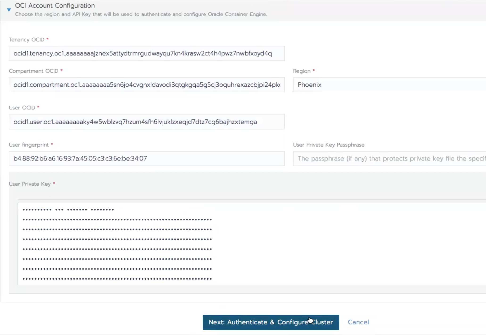

15.  Click **Next: Authenticate & Configure Cluster**.
16.  Click **Next: Configure Virtual Cloud Network**. Check **Quick Create**.
17.  Click **Next: Configure Node Instances**. Fill the dialog box.
- **Instance Shape**: choose the instance shape to be used for your nodes. Make sure the selected shape has at least 2 OCPUs (i.e. VM.Standard.E2.2).
- **Operating System**: Oracle-Linux-7.6
- **SSH public key for nodes**: your SSH public key (optional)  

Click **Create**. Wait for the cluster state to be _Active_ and the node number > 0 (it will take up to 15 minutes).
   
18. Click on your cluster name.
19. The Dashboard shows the info obtained by Kube State Metrics.
   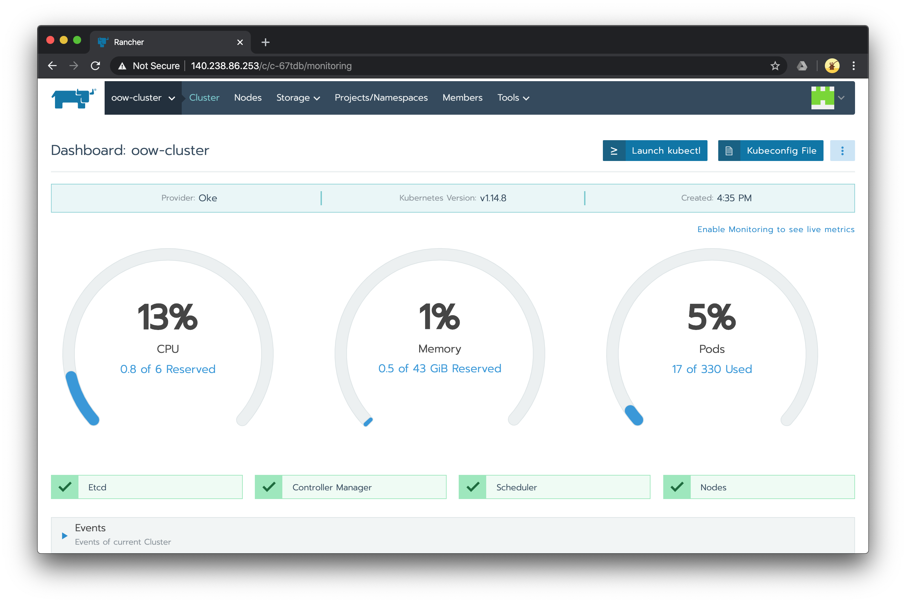

### Setup Monitoring  

1. Select **Tools** in the menu. Click **Monitoring**

  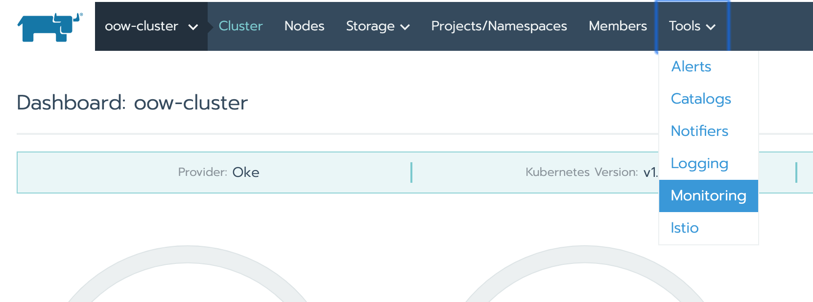

2. Click **Enable**, then click **Save**. Click **Cluster** in the menu to go back to your cluster. The monitor is shown as additional round layer in the dashboard.

  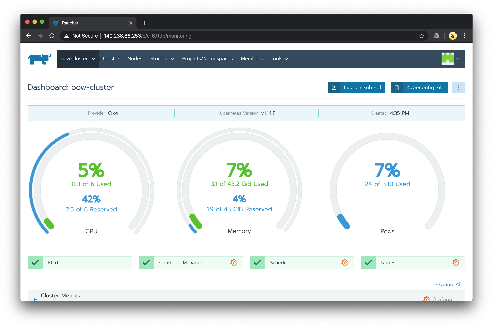

### Setup Istio 

1. Select Tools from the menu and click **Istio**
2. Under _Group Access_, check **Allow all authenticated members to access Kiali and Jaeger UI**.
3. Under _Ingress gateway_ 
   - **Enable Ingress Gateway**:  True
   - **Service Type of Ingress Gateway**: LoadBalancer

   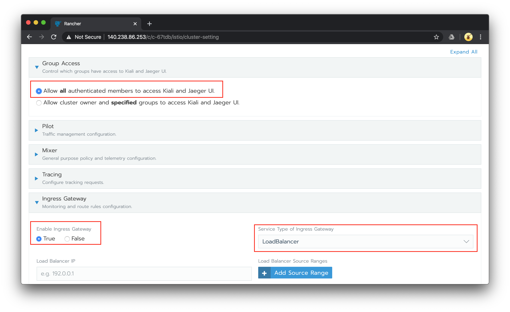

4. Click **Enable** and wait for Istio to be up and running.
   
   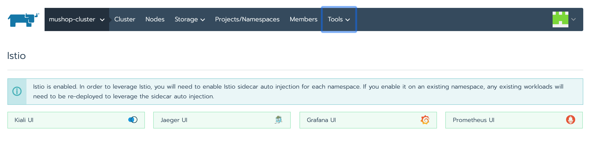

5. Click **Cluster** in the menu to go back to your cluster
   

## Install Mushop

1. Click **Kubeconfig File** to view the kubeconfig content.
   
   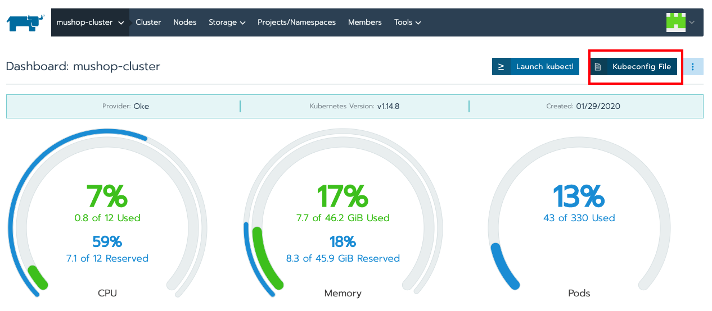

2. Click **Copy to Clipboard**  
3. Connect to the Rancher instance via SSH from the terminal console.
    ``` 
    $ ssh -i ~/.ssh/id_rsa opc@<Public_IP_Address> 
    ```  

4. Create the kubeconfig file and install Helm.  
   ```
    $ mkdir .kube
    $ nano .kube/config
    # paste the clipboard content

    #install helm
    curl -fsSL -o get_helm.sh https://raw.githubusercontent.com
    helm/helm/master/scripts/get-helm-3
    chmod 700 get_helm.sh
    ./get_helm.sh
   ```  

5. Run  
   
   ```
   $ kubectl label namespace default istio-injection=enabled
   ```  

   This will inject Istio sidecar proxy for all the containers in the _default_ namespace. 

6. Install Mushop running the below into the SSH terminal  
   
   ```
   $ git clone https://github.com/oracle-quickstart/oci-cloudnative
   $ cd oci-cloudnative/deploy/complete/helm-chart/
   $ helm install --set global.mock.service=all mymushop mushop
   ```

7. Now you have to create a gateway for Mushop and expose _edge.default.svc.cluster.local_.  
   Copy the below yaml file.

    ```
    apiVersion: networking.istio.io/v1alpha3
    kind: Gateway
    metadata:
      name:  mushop-gateway
    spec:
      selector:
        istio: ingressgateway # use istio default controller
      servers:
      - port:
          number: 80
          name: http
          protocol: HTTP
        hosts:
        - "*"
    ---
    apiVersion: networking.istio.io/v1alpha3
    kind: VirtualService
    metadata:
      name: mushop
    spec:
      hosts:
      - "*"
      gateways:
      - mushop-gateway
      http:
      - route:
        - destination:
            host: edge.default.svc.cluster.local
            port:
              number: 80
    ```
   > _NOTE_: to avoid issue with YAML indenting you can download the gateway.yaml file [here](gateway.yaml)

   In the SSH terminal

   ```
   $ cd
   $ nano gateway.yaml
   # paste the clipboard content

   $ kubectl apply -f gateway.yaml
   ```
   Mushop is now up and running!

## Test the setup

1. Retrive the OCI Load Balancer public IP, that has been automatically created by the OCI Container for Kubernetes (OKE).  
 In the SSH terminal run `kubectl get svc istio-ingressgateway -n istio-system` and copy the public IP address.  

   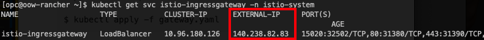

2. In the browser, open the page http://_external_IP_ to access the Mushop portal

   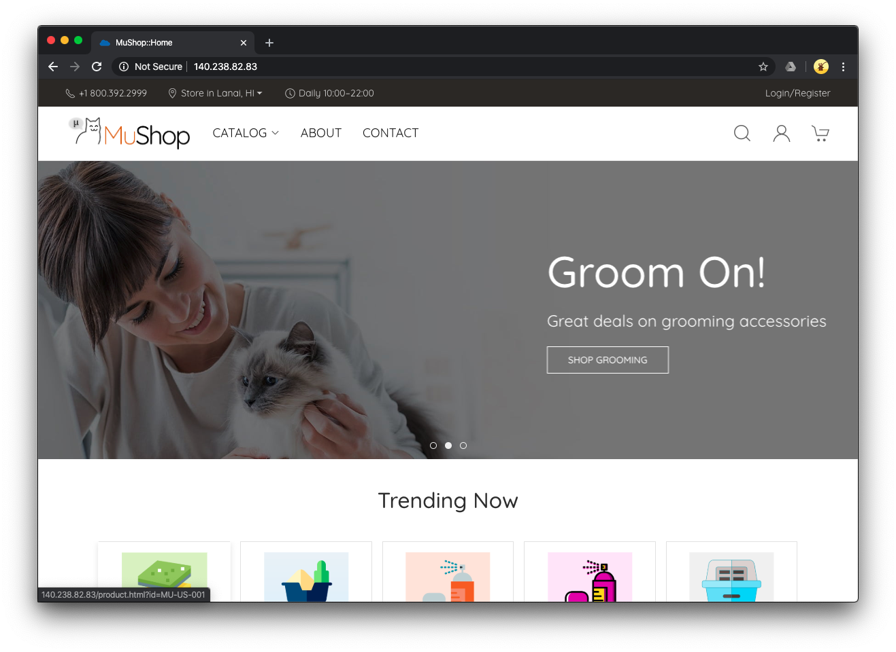

***Congratulations! You have successfully completed the lab.***