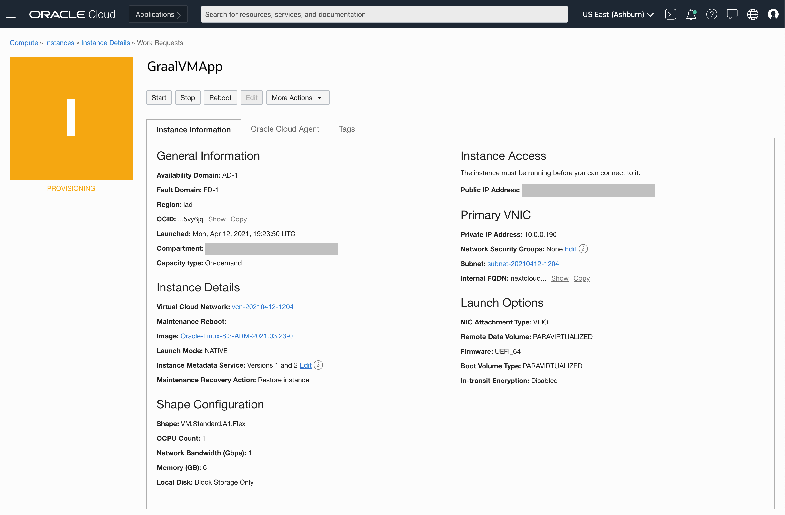

# Setup Cloud Environment

## Introduction

You will take on the persona of an Operations Engineer. You will initiate the Oracle cloud environment that will be used to create and deploy your Java EE application. This environment will be contained within a cloud Compartment, and communication within the Compartment will be via a Virtual Cloud Network (VCN). The Compartment and VCN will isolate and secure the overall environment. You will deploy the Oracle Cloud Infrastructure Arm A1 compute instance to host a Java EE application using the Tomcat 9.0 and MySQL server containers.

Estimated time: 10 minutes

### Objectives

- Log into OCI Tenancy.
- Setup Oracle Cloud Infrastructure (OCI) components.  

***We recommend that you create a notes page to write down all of the credentials you will need.***

### Prerequisites

- Your Oracle Cloud Trial Account
- You have already applied for and received your Oracle Cloud Free Tier Account.

## **STEP 1:** Log into OCI Tenancy

   Log in to your OCI dashboard and retrieve information required to create resources.

1. Once you log in you will see a page similar to the one below. Click on "Infrastructure Dashboard."

  

## **STEP 2:** Basic OCI Infrastructure Setup

1. Open the navigation menu. Under Governance and Administration, go to **Identity** and click **Compartments**. From this screen, you will see a list of compartments, click **Create Compartment**.

   

   

1. Enter the following:
      - Name: Enter **"AppDev".**
      - Description: Enter a description (required), for example: "AppDev compartment for the getting started tutorial". Avoid entering confidential information.
      - Parent Compartment: Select the compartment you want this compartment to reside in. Defaults to the root compartment (or tenancy).
      - Click **Create Compartment**.
      - Your compartment is displayed in the list.

  

Now you are ready to move on to Step 3.

## **STEP 3:** Create OCI Arm A1 compute instance

1. To create an A1 compute instance, open up the hamburger button in the top-left corner of the Console and go to **Compute** >   **Instances**.

   

1. Open the  instance creation flow.
   1. Verify you are in the **AppDev** Compartment 
   1. Click **Create Instance**.

   

1. In the create instance page you will create the new instance along with the new network resources such as Virtual Cloud Network (VCN), Internet Gateway (IG)and more. 
   1. Name the instance  **JavaApp** 
   1. Click the **Change Shape** button to see the available compute shapes.
   1. Click the **Change Image** button to see the available compute images. Choose the Oracle Linux 7.9 image

   
   
1. Configure the resources for your instance. 
   1. Choose the Ampere Arm based processor in the choice for shape series. 
   1. Choose the `VM.Standard.A1.Flex` shape from the list of shapes with Ampere Arm based processors. OCI Arm A1 shapes are flexible and you can modify the number of cores and the amount of memory. Choose 1 core and 6 GB of memory for the VM.

   
   

1. Choose your networking options. Create a new VCN and subnet for your next cloud deployment. Make sure you choose to assigna public IP address for your instance. 

   

1. Generate and download the SSH keypair. This step is optional, but highly recommended for later maintenance and upgrades. You can also bring your public key if you already have a keypair that you would like to use. 

   

1. Click **Create** to create the networking resources and launch the compute instance.
   

You may now [proceed to the next lab](#next).

## Acknowledgements

- **Author** - Jeevan Joseph
- **Contributors** -  Jeevan Joseph
- **Last Updated By/Date** - Jeevan Joseph, April 2021
