# Build and Publish Application

## Introduction

In this lab exercise, you will turn into a Developer and be responsible for releasing a Cloud Native Microservice Java application. The application source code is hosted on `myapp` GitHub repository and you will use GitHub Actions and docker CLI to publish the Image to [Oracle Cloud Infrastructure Registry](https://docs.oracle.com/en-us/iaas/Content/Registry/Concepts/registryoverview.htm).

Oracle Cloud Infrastructure Registry (also known as Container Registry) is an Oracle-managed registry that enables you to simplify your development to production workflow. Container Registry makes it easy for you as a developer to store, share, and manage container images (such as Docker images). And the highly available and scalable architecture of Oracle Cloud Infrastructure ensures you can reliably deploy your applications. So you don't have to worry about operational issues, or scaling the underlying infrastructure.

You can use Container Registry as a private Docker registry for internal use, pushing and pulling Docker images to and from the Container Registry using the [Docker V2 API](https://docs.docker.com/registry/spec/api/) and the standard Docker command line interface (CLI). You can also use Container Registry as a public Docker registry, enabling any user with internet access and knowledge of the appropriate URL to pull images from public repositories in Container Registry.

Container Registry is an [Open Container Initiative](https://opencontainers.org/)-compliant registry. As a result, you can store container images (such as Docker images) that conform to Open Container Initiative specifications in Container Registry. You can also store manifest lists (sometimes known as multi-architecture images) to support multiple architectures (such as ARM and AMD64). And you can store Helm charts (for more information about the Helm feature that supports chart storage in Open Container Initiative-compliant registries, see [Registries](https://helm.sh/docs/topics/registries/) in the Helm documentation).


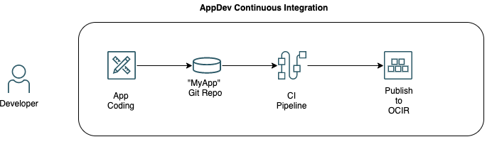

Estimated Lab time: 20 minutes

### Objectives

In this lab, you will:

* Create OCI Registry repository for the application
* Publish Java Microservice Container Image to OCI Registry.

### Prerequisites

* An Oracle Free Tier(Trial), Paid or LiveLabs Cloud Account
* GitHub account


## **STEP 1**: Create OCI Registry Repository

To create a repository in Container Registry you can go directly to the OCI console or you can use Infrastructure As Code with Terraform to automate that part.

If you want to use the OCI Console to create the repository, follow the steps in the section below. If you want to use Terraform, go to the next section.

### Create OCI Registry using OCI Console

1. In the Console, open the navigation menu and click Developer Services. Under Containers, click Container Registry.

1. Choose the region in which to create the repository.
1. Choose `cicd` compartment.
1. Click Create Repository.

1. In the Create Repository dialog box, specify details for the new repository:
    |Property|Value|
    |--|--|
    |Repository Name|oci-cloudnative-mushop/mushop-carts|
    |Access|Private|

    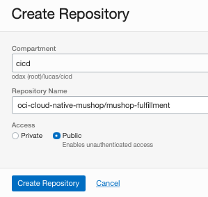

1. Click Create Repository to confirm the operation.

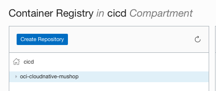

### Create OCI Registry using Infrastructure As Code

1. Go back to the oci-platform-devops repository in GitHub.

1. Open up the `devops_oke` folder under `Code` tab. 

1. Click on Add file -> Create New file.

    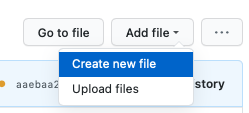

1. Set the file name `ocir.tf` and paste the following content:
    ```hcl
    resource "oci_artifacts_container_repository" "mushop_container_registry" {
        compartment_id = var.compartment_id
        display_name = "oci-cloudnative-mushop/mushop-carts"

        is_public = false
    }
    ```
    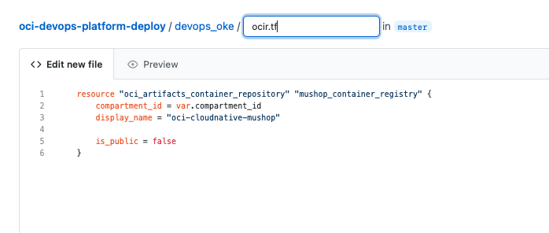 

1. Commit the file by creating a new branch (feature branch) named "ocir-onboard". Provide the appropriated comments and click on Propose new file.

1. After that, `Open a pull request` page will be presented. In a real scenario, you need to select someone from the SRE/Platform team to review your code, add linked issues, etc. Make sure you are selecting to merge the code to `master` branch from ( <- ) `ocir-onboard` one. Click on Create pull request to confirm the operation.

1. Someone that you (or your project) assigned should review the code. Once approved (someone need to click on `Merge pull request`), it will trigger an automated pipeline that will run the ORM job to provision the OCI Registry repository. After finishing the workflow, the `oci-cloud-native-mushop` repo should be visible in the OCI console.

1. In the Console, open the navigation menu and click Developer Services. Under Containers, click Container Registry. Select the `cicd` compartment if not selected and locate `oci-cloud-native-mushop/mushop-carts`.

    


## **STEP 2**: Import oci-cloudnative git repository 

Oracle has published a [quickstart]( https://github.com/oracle-quickstart/oci-cloudnative.git) which contains a complete polyglot micro-services application built to showcase a cloud native approach to application development on Oracle Cloud Infrastructure. MuShop Complete uses a Kubernetes cluster, and can be deployed using the provided helm charts (preferred), or Kubernetes manifests. It is recommended to use an Oracle Container Engine for Kubernetes cluster, however other Kubernetes distributions will also work.

1. Open up a new browser tab and go to [GitHub](https://github.com).

1. On the top navigation bar, click on the plus sign and then  Import Repository.


1. Enter the URL of the OCI Architecture DevOps repo: `https://github.com/oracle-quickstart/oci-cloudnative`


1. Enter a name for the new *myapp* repository. To better identify it, let's name it: `oci-cloud-native-mushop`. 

1. Set privacy settings to `Private` and then click on Begin import button in the bottom of the page to create a new repo.
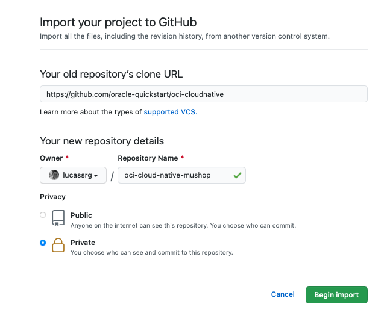
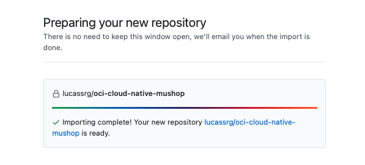

1. Open up the new project on your browser.
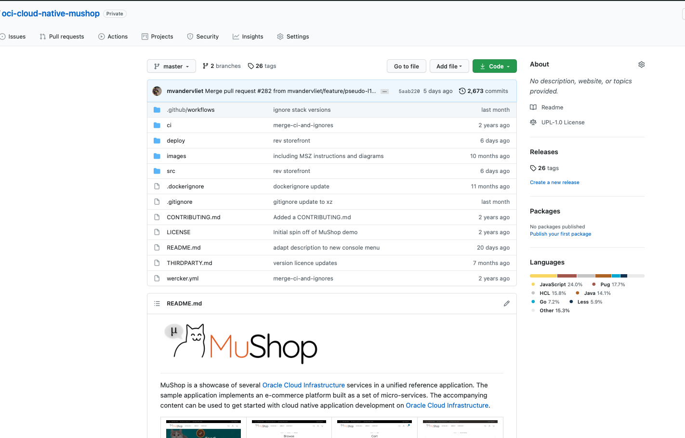

## **STEP 3**: Create GitHub Secrets

This project has some GitHub Actions pre-created that are responsible for publishing the image into OCIR and they are using secrets to hold some information related to OCI Registry/Docker.

1. Go back to the Github repository -> Settings --> Secrets. Let's create the following secret variables:

    ---
    | DOCKER_REGISTRY_URL

    The Docker Registry URL is composed in the format of:
    `<region-key>`.ocir.io/`<tenancy-namespace>`
    where:

    - `<region-key>` is the OCIR region endpoint. Check all available endpoints in the [documentation](https://docs.oracle.com/en-us/iaas/Content/Registry/Concepts/registryprerequisites.htm#regional-availability). E.g. US East(Ashburn) = `iad` or `us-ashburn-1`.
    - `<tenancy-namespace>` is the auto-generated Object Storage namespace string of the tenancy that owns the repository to which you want to push the image (as shown on the Tenancy Information or Container Registry repository page).

    For example, for a OCIR repository created in US East with a tenancy namespace named ansh81vru1zp, we should have the following URL:
    `iad.ocir.io/ansh81vru1zp` (do not include the https protocol or `/`)

    ---
    | DOCKER_REPOSITORY

    This is the name of the repository we previously defined: `oci-cloud-native-mushop`

    ---
    | DOCKER_USERNAME

    Enter your username in the format <tenancy-namespace>/<username>, where <tenancy-namespace> is the auto-generated Object Storage namespace string of your tenancy (as shown on the Tenancy Information or Container Registry repository page). For example, ansh81vru1zp/jdoe@acme.com. If your tenancy is federated with Oracle Identity Cloud Service, use the format <tenancy-namespace>/oracleidentitycloudservice/<username>.

    ---
    | DOCKER_PASSWORD

    You need to generate an [Auth Token](https://docs.oracle.com/en-us/iaas/Content/Registry/Tasks/registrygettingauthtoken.htm). Auth tokens are Oracle-generated token strings that you can use to authenticate with third-party APIs that do no support Oracle Cloud Infrastructure's signature-based authentication. Each user created in the IAM service automatically has the ability to create, update, and delete their own auth tokens in the Console or the API.

    1. In the top-right corner of the Console, open the Profile menu (User menu icon) and then click User Settings to view the details.
    1. On the Auth Tokens page, click Generate Token. Enter a friendly description for the auth token. Avoid entering confidential information.
    1. Click Generate Token. The new auth token is displayed. Copy the auth token immediately to a secure location from where you can retrieve it later, because you won't see the auth token again in the Console.
    Close the Generate Token dialog.

1. At the end you should have the following secret variables:
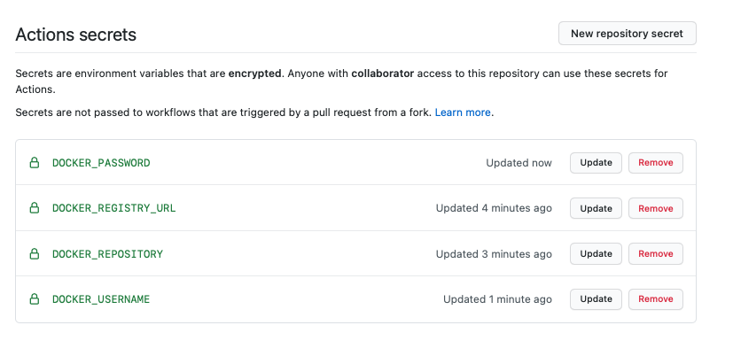


## **STEP 4**: Publish Application to OCI Registry

1. In order to publish a new version to the OCIR, you need to modify the `VERSION` file located in the `oci-cloud-native-mushop\src\<microservice>` directory, in this case, we will change `carts` microservice, located on `oci-cloud-native-mushop\src\carts`.

1. Edit the file by entering a new version, e.g. `1.5.2` (just increase the number by 1).

1. Commit the file. Like explalined earlier, you can create a feature branch and a pull request. For sake of simplicity, Commit on the master/main branch. This will trigger a workflow under the Actions tab on GitHub.

    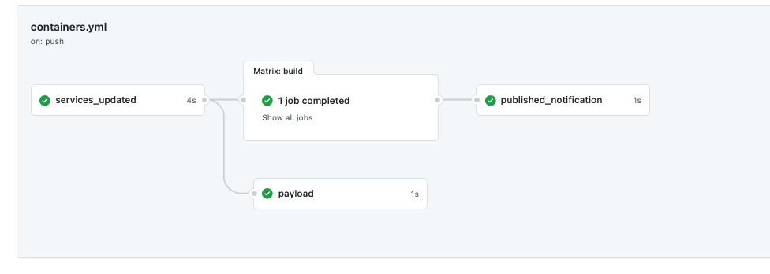

1. If you want to review/change the actions, go to code tab, then open the file: `.github/workflows/containers.yaml`.

1. After the workflow completes, the container image will be available on the OCIR.

    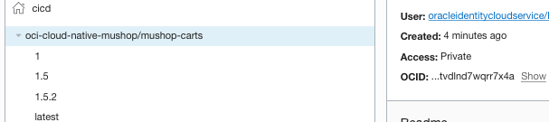
