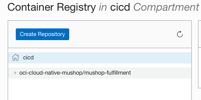
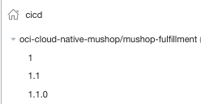

# Build and Publish Application

## Introduction

In this lab exercise, you will turn into a Developer and be responsible for releasing a Cloud Native Microservice Java application. The application source code is hosted on the application GitHub repository and you will use GitHub Actions and docker CLI to publish the Image to [Oracle Cloud Infrastructure Registry](https://docs.oracle.com/en-us/iaas/Content/Registry/Concepts/registryoverview.htm).

Oracle Cloud Infrastructure Registry (also known as Container Registry) is an Oracle-managed registry that enables you to simplify your development to production workflow. Container Registry makes it easy for you as a developer to store, share, and manage container images (such as Docker images). And the highly available and scalable architecture of Oracle Cloud Infrastructure ensures you can reliably deploy your applications. So you don't have to worry about operational issues, or scaling the underlying infrastructure.

You can use Container Registry as a private Docker registry for internal use, pushing and pulling Docker images to and from the Container Registry using the [Docker V2 API](https://docs.docker.com/registry/spec/api/) and the standard Docker command line interface (CLI). You can also use Container Registry as a public Docker registry, enabling any user with internet access and knowledge of the appropriate URL to pull images from public repositories in Container Registry.

Container Registry is an [Open Container Initiative](https://opencontainers.org/)-compliant registry. As a result, you can store container images (such as Docker images) that conform to Open Container Initiative specifications in Container Registry. You can also store manifest lists (sometimes known as multi-architecture images) to support multiple architectures (such as ARM and AMD64). And you can store Helm charts (for more information about the Helm feature that supports chart storage in Open Container Initiative-compliant registries, see [Registries](https://helm.sh/docs/topics/registries/) in the Helm documentation).


Estimated Lab time: 20 minutes

### Objectives

In this lab, you will:

* Create OCI Registry repository for the application
* Containeirize a Java Microservice Application
* Publish Java Microservice Container Image to OCI Registry.

### Prerequisites

* An Oracle Free Tier(Trial), Paid or LiveLabs Cloud Account
* GitHub account
* Docker CLI (optional)


## **STEP 1**: Create OCI Registry Repository

To create a repository in Container Registry you can go directly to the OCI console or you can use Infrastructure As Code with Terraform to automate that part.

If you want to use the OCI Console to create the repository, follow the steps in the section below. If you want to use Terraform, go to the next section.

### Create OCI Registry using OCI Console

1. In the Console, open the navigation menu and click Developer Services. Under Containers, click Container Registry.

1. Choose the region in which to create the repository.
1. Choose `cicd` compartment.
1. Click Create Repository.

1. In the Create Repository dialog box, specify details for the new repository:
    |Property|Value|
    |--|--|
    |Repository Name|oci-cloud-native-mushop/mushop-fulfillment|
    |Access|Public|

    

1. Click Create Repository to confirm the operation.



### Create OCI Registry using Infrastructure As Code

1. Go back to the oci-platform-devops repository in GitHub.

1. Open up the `devops_oke` folder under `Code` tab. 

1. Click on Add file -> Create New file.

    

1. Set the file name `ocir.tf` and paste the following content:
    ```hcl
    resource "oci_artifacts_container_repository" "mushop_container_registry" {
        compartment_id = var.compartment_id
        display_name = "oci-cloud-native-mushop/mushop-fulfillment"

        is_public = true
    }
    ```

1. Commit the file by creating a new branch (feature branch) named "ocir-onboard". Provide the appropriated comments and click on Propose new file.

1. After that, `Open a pull request` page will be presented. In a real scenario, you need to select someone from the SRE/Platform team to review your code, add linked issues, etc. Make sure you are selecting to merge the code to `master` branch from ( <- ) `ocir-onboard` one. Click on Create pull request to confirm the operation.

1. Someone that you (or your project) assigned should review the code. Once approved (someone need to click on `Merge pull request`), it will trigger an automated pipeline that will run the ORM job to provision the OCI Registry repository. After finishing the workflow, the `oci-cloud-native-mushop` repo should be visible in the OCI console.

1. In the Console, open the navigation menu and click Developer Services. Under Containers, click Container Registry. Select the `cicd` compartment if not selected and locate `oci-cloud-native-mushop/mushop-fulfillment`.

    


## **STEP 2**: Import oci-cloudnative git repository 

Oracle has published a [quickstart](https://github.com/oracle-quickstart/oci-micronaut.git) which contains a complete polyglot micro-services application built in Java using [Micronaut](https://micronaut.io) to showcase a cloud native application development on Oracle Cloud Infrastructure. MuShop can run on a Kubernetes cluster, and be deployed using helm charts or Kubernetes manifests. It is recommended to use an Oracle Container Engine for Kubernetes cluster, however other Kubernetes distributions will also work.

1. Open up a new browser tab and go to [GitHub](https://github.com).

1. On the top navigation bar, click on the plus sign and then  Import Repository.


1. Enter the URL of the OCI Architecture DevOps repo: `https://github.com/oracle-quickstart/oci-micronaut.git`

1. Enter a name for the *application* repository. To better identify it, let's name it: `oci-cloud-native-mushop`. 

1. Set privacy settings to `Private` and then click on Begin import button in the bottom of the page to create a new repo.


1. Open up the new project on your browser.


## **STEP 3**: Create GitHub Secrets

We are going to use GitHub Actions for publishing the image into OCIR and we need to create some secrets to hold the information related to OCI Registry/Docker.

1. Go back to the Github repository -> Settings --> Secrets. Let's create the following secret variables:

    ---
    | DOCKER_REGISTRY_URL

    The Docker Registry URL is composed in the format of:
    `<region-key>`.ocir.io/`<tenancy-namespace>`
    where:

    - `<region-key>` is the OCIR region endpoint. Check all available endpoints in the [documentation](https://docs.oracle.com/en-us/iaas/Content/Registry/Concepts/registryprerequisites.htm#regional-availability). E.g. US East(Ashburn) = `iad` or `us-ashburn-1`.
    - `<tenancy-namespace>` is the auto-generated Object Storage namespace string of the tenancy that owns the repository to which you want to push the image (as shown on the Tenancy Information or Container Registry repository page).

    For example, for a OCIR repository created in US East with a tenancy namespace named ansh81vru1zp, we should have the following URL:
    `iad.ocir.io/ansh81vru1zp` (do not include the https protocol or `/`)

    ---
    | DOCKER_REPOSITORY

    This is the name of the OCIR repository we created earlier: `oci-cloud-native-mushop`

    ---
    | DOCKER_USERNAME

    Enter your username in the format <tenancy-namespace>/<username>, where <tenancy-namespace> is the auto-generated Object Storage namespace string of your tenancy (as shown on the Tenancy Information or Container Registry repository page). For example, ansh81vru1zp/jdoe@acme.com. If your tenancy is federated with Oracle Identity Cloud Service, use the format <tenancy-namespace>/oracleidentitycloudservice/<username>.

    ---
    | DOCKER_PASSWORD

    You need to generate an [Auth Token](https://docs.oracle.com/en-us/iaas/Content/Registry/Tasks/registrygettingauthtoken.htm). Auth tokens are Oracle-generated token strings that you can use to authenticate with third-party APIs that do no support Oracle Cloud Infrastructure's signature-based authentication. Each user created in the IAM service automatically has the ability to create, update, and delete their own auth tokens in the Console or the API.

    1. In the top-right corner of the Console, open the Profile menu (User menu icon) and then click User Settings to view the details.
    1. On the Auth Tokens page, click Generate Token. Enter a friendly description for the auth token. Avoid entering confidential information.
    1. Click Generate Token. The new auth token is displayed. Copy the auth token immediately to a secure location from where you can retrieve it later, because you won't see the auth token again in the Console.
    Close the Generate Token dialog.

1. At the end you should have the following secret variables:


## **STEP 4**: Containerize Java Micronaut application

According to [Docker](https://www.docker.com/resources/what-container), "A container is a standard unit of software that packages up code and all its dependencies so the application runs quickly and reliably from one computing environment to another. A Docker container image is a lightweight, standalone, executable package of software that includes everything needed to run an application: code, runtime, system tools, system libraries and settings.".

A `Dockerfile` is a document that contains all the commands used to assemble a Container image. 

1. In order to *containerize* our java application, we need to create a `Dockerfile` in the `src/fulfillment` folder with the following content:

    ```Dockerfile
    ARG APPLICATION_NAME="fulfillment"
    ARG VERSION="0.0.1-SNAPSHOT"

    # Stage 1 : Setup the build environment
    FROM gradle:7.1.1-jdk11 as buildenv

    RUN mkdir -p /usr/src/app
    WORKDIR /usr/src/app

    COPY settings.gradle /usr/src/app
    # copy buildscript and cache all dependencies
    COPY build.gradle /usr/src/app
    COPY gradle.properties /usr/src/app
    #RUN gradle --refresh-dependencies

    # Stage 2 : Build the application
    FROM buildenv as appbuild
    # Copy the source code.
    # This layer is recreated only when there are actual source chnages
    COPY src /usr/src/app/src
    # build an executable fat jar
    RUN gradle clean assemble
    RUN mv build/libs/fulfillment*all.jar build/libs/fulfillment-all.jar

    # Stage 3 (OpenJDK): Build standard jar file
    FROM openjdk:11.0-slim as openjdk
    COPY --from=appbuild /usr/src/app/build /home/app/fulfillment
    RUN ls -la /home/app/fulfillment/libs
    EXPOSE 8082
    ENTRYPOINT ["java", "-jar", "/home/app/fulfillment/libs/fulfillment-all.jar", "-Djava.library.path=/app"]
    ```

1. To avoid addiitonal configuration, delete `src/main/resources/application-oraclecloud.yaml` file as we won't be using these resources in this lab.

## **STEP 5**: (Optional) Run containerized Java application in Cloud Shell

If you want to run this microservice before publihsing it into the OCI registry, you can do it on your own computer or in the [OCI Cloud Shell](https://docs.oracle.com/en-us/iaas/Content/API/Concepts/cloudshellintro.htm).

Oracle Cloud Infrastructure (OCI) Cloud Shell is a web browser-based terminal accessible from the Oracle Cloud Console. Cloud Shell is free to use (within monthly tenancy limits), and provides access to a Linux shell, with a pre-authenticated Oracle Cloud Infrastructure CLI, a pre-authenticated Ansible installation, and other useful tools for following Oracle Cloud Infrastructure service tutorials and labs.

1. [Open up Cloud Shell](https://docs.oracle.com/en-us/iaas/Content/API/Concepts/cloudshellgettingstarted.htm#Getting_Started_with_Cloud_Shell).

1. Clone the git repo you just created.
    ```bash
    git clone https://github.com/<your-user>/oci-cloud-native-mushop.git
    ```
    Since this is a private repo, you will be prompted to authenticate your user. Enter your username and use the Authentication Token that was created to provision the OCI infrastructure through ORM on Lab 1.

 1. After cloning the repo, go to `oci-cloud-native-mushop/src/fulfillment` directory. From there, you can run the following command to build the image:
    ```bash
    docker build -t mushop-fulfillment:latest .
    ```

1. This is a service that depends on [nats](https://nats.io). In order to orchestrate these 2 containers we will use Docker compose. Create the docker compose file `docker-compose.yaml` with the following content:
    ```yaml
    version: "3.5"
    services:
      nats:
        image: nats
        ports:
          - "4222:4222"
        networks: ["nats"]
        restart: always
      fulfillment:
        image: mushop-fulfillment:latest
        networks: ["nats"]
        restart: always
        read_only: true
        ports:
          - "8082:8082"
        tmpfs:
          - /tmp:rw,noexec,nosuid
        depends_on:
          - nats
        environment:
          - NATS_HOST=nats
          - NATS_PORT=4222
          - ORDERS_NEW=mushop-orders
          - ORDERS_SHIPPED=mushop-shipments
    networks:
      nats:
        name: nats

    ```

1. Install Docker Compose on Cloud Shell.
```
$ curl -L "https://github.com/docker/compose/releases/download/1.29.2/docker-compose-$(uname -s)-$(uname -m)" -o $HOME/docker-compose
$ chmod +x $HOME/docker-compose
$ ~/docker-compose --version
```

1. Run the following command to start the containers in detached mode:
    ```bash
    ~/docker-compose up -d
    ```
    After some seconds you should see the following message in the shell:
    ```
    [+] Running 2/2
    ⠿ Container fulfillment_nats_1         Started                                                                                                                           4.1s
    ⠿ Container fulfillment_fulfillment_1  Started                                                                                                                           7.6s
    Attaching to fulfillment_1, nats_1
    fulfillment_1  |  __  __ _                                  _
    fulfillment_1  | |  \/  (_) ___ _ __ ___  _ __   __ _ _   _| |_
    fulfillment_1  | | |\/| | |/ __| '__/ _ \| '_ \ / _` | | | | __|
    fulfillment_1  | | |  | | | (__| | | (_) | | | | (_| | |_| | |_
    fulfillment_1  | |_|  |_|_|\___|_|  \___/|_| |_|\__,_|\__,_|\__|
    fulfillment_1  |   Micronaut (v2.5.4)
    fulfillment_1  |
    fulfillment_1  | 20:03:39.997 [main] INFO  io.micronaut.runtime.Micronaut - Startup completed in 1833ms. Server Running: http://60ab1fd81701:8082
    ```

1. Let's start a separate container with a nats client to send some messages:
    ```
    docker run --network nats --rm -it synadia/nats-box
    ```
    Outcome:
    ```bash
    Unable to find image 'synadia/nats-box:latest' locally
    Trying to pull repository docker.io/synadia/nats-box ... 
    latest: Pulling from docker.io/synadia/nats-box
    ba3557a56b15: Pull complete 
    8591fa42d73d: Pull complete 
    248f99e65485: Pull complete 
    417204a428f2: Pull complete 
    6820ef7b0234: Pull complete 
    a3ed95caeb02: Pull complete 
    3b3563957223: Pull complete 
    Digest: sha256:caf0c9fe15a9a88d001c74fd9d80f7f6fd57474aa243cd63a9a086eda9e202be
    Status: Downloaded newer image for synadia/nats-box:latest
                _             _               
    _ __   __ _| |_ ___      | |__   _____  __
    | '_ \ / _` | __/ __|_____| '_ \ / _ \ \/ /
    | | | | (_| | |_\__ \_____| |_) | (_) >  < 
    |_| |_|\__,_|\__|___/     |_.__/ \___/_/\_\
                                            
    nats-box v0.5.0
    0ee854988232:~#     
    ```
1. Press enter to gain access into the container shell. Now you can push some data into the message queue with the following commands and json payloads:
    ```bash
    nats pub -s nats://nats:4222 mushop-orders '{"orderId":1}'
    nats pub -s nats://nats:4222 mushop-orders '{"orderId":2}'
    nats pub -s nats://nats:4222 mushop-orders '{"orderId":3}'
    ```
    After sending each message, you should get the following outcome in the shell:
    ```
    Published 13 bytes to "mushop-orders"
    ```

1. Exit the container by entering `exit`. In the same terminal window where you started up docker compose, you can run `~/docker-compose logs` to check the logs to ensure the fulfillment service is processing the messages. You should see something like this:
    ```bash
    fulfillment_1  | 21:36:02.861 [pool-1-thread-3] INFO  mushop.OrdersListener - got message OrderUpdate{orderId='1', shipment=null} on the mushop orders subject
    fulfillment_1  | 21:36:02.865 [pool-1-thread-3] INFO  mushop.OrdersListener - Sending shipment update OrderUpdate{orderId='1', shipment=Shipment{id='a6b9d8c2-141e-4078-bf74-c914a0e08e2c', name='Shipped'}}
    fulfillment_1  | 21:36:26.914 [pool-1-thread-3] INFO  mushop.OrdersListener - got message OrderUpdate{orderId='2', shipment=null} on the mushop orders subject
    fulfillment_1  | 21:36:26.914 [pool-1-thread-3] INFO  mushop.OrdersListener - Sending shipment update OrderUpdate{orderId='2', shipment=Shipment{id='f2c05674-57a8-4618-be5a-234d6159adf0', name='Shipped'}}
    fulfillment_1  | 21:36:27.984 [pool-1-thread-3] INFO  mushop.OrdersListener - got message OrderUpdate{orderId='3', shipment=null} on the mushop orders subject
    fulfillment_1  | 21:36:27.984 [pool-1-thread-3] INFO  mushop.OrdersListener - Sending shipment update OrderUpdate{orderId='3', shipment=Shipment{id='5f651e91-5f02-4fad-8b38-5e97e8490a8d', name='Shipped'}}
    ```

1. Finally, you can make a request to the fulfillment service endpoint to process the orders:

    ```bash
    curl http://localhost:8082/fulfillment/1
    ```

    Fulfillment service should return the response:
    ```bash
    Order 1 is fulfilled%
    ```
 

## **STEP 6**: Publish Application to OCI Registry using GitHub Actions

GitHub Actions is a popular Continuous Integration tool. We are going to setup continous integration using a workflow template to generate and publish the Container image to Oracle Cloud Infrastructure Registry (OCIR).

1. Go to `oci-cloud-native-mushop\.github\workflows` folder.
1. Open up the file `java-ci.yml` and replace the existing content with:
```yaml
name: Build and Publish Container Images to Registry

on:
  push:
    branches: [ main ]
    paths: ['src/**/VERSION']
  pull_request:
    branches: [ main ]
    paths: ['src/**/VERSION']

jobs:

  services_updated:
    runs-on: ubuntu-latest
    outputs:
      matrix: ${{ steps.version_services.outputs.matrix }}
    steps:
    - name: Gets commit SHA for Checkout and VERSION check
      id: commit_sha
      run: |
        # Gets commit SHA for Checkout and VERSION check
        if ${{ github.event_name == 'pull_request' }}; then
          VERSION_COMMIT_SHA="${{ github.event.pull_request.head.sha }}"
        else
          VERSION_COMMIT_SHA="${{ github.sha }}"
        fi
        echo ::set-output name=version_commit_sha::$VERSION_COMMIT_SHA
    - name: Checkout
      uses: actions/checkout@v2
      with:
        fetch-depth: 0
        ref: ${{ steps.commit_sha.outputs.version_commit_sha }}
    - name: Get updated service's VERSION files
      id: version_services
      run: |
        # Gets VERSION files (e.g. src/api/VERSION) that has been updated
        # updated_version_file contains the full path to the VERSION file (e.g. src/api/VERSION)
        services_prep=()
        for updated_version_file in $(git diff-tree --no-commit-id --name-only -r ${{ steps.commit_sha.outputs.version_commit_sha }} ${{ github.event.before }} | grep '\<src/[a-z]*/VERSION\>');
        do
          service=$(cut -d "/" -f 2 <<< "$updated_version_file")
          echo "::group::Processing $service"
          folder=${updated_version_file%"/VERSION"}
          service_version=$(cat $updated_version_file)
          service_platforms=$(cat $folder/PLATFORMS 2>/dev/null || echo "linux/amd64")
          services_prep+=("{\"service\":\"$service\", \"version\":\"$service_version\", \"platforms\":\"$service_platforms\", \"version_file_path\":\"$updated_version_file\"}")
          echo "::endgroup::"
        done
        echo "::set-output name=matrix::$(echo ${services_prep[@]} | jq -sc '{"include": . }')"

  payload:
    needs: services_updated
    runs-on: ubuntu-latest

    steps:
    - name: Service(s) Matrix Info
      run: echo ">>> ${{ needs.services_updated.outputs.matrix }} <<<"

  build:
    needs: services_updated
    runs-on: ubuntu-latest
    strategy:
      matrix: ${{fromJson(needs.services_updated.outputs.matrix)}}
    outputs:
      service_version: ${{ steps.prepare.outputs.service_version }}
    steps:
    - name: Checkout
      uses: actions/checkout@v2

    - name: Set up QEMU
      uses: docker/setup-qemu-action@v1

    - name: Set up Docker Buildx (moby/buildkit)
      id: buildx
      uses: docker/setup-buildx-action@v1
      with:
          install: true

    - name: Pre-build info
      run: |
          # Metadata
          # Get the service name and prefix it with "mushop"
          # E.g. "mushop-api", "mushop-fulfillment"
          IMAGE_NAME="mushop-${{ matrix.service }}"

          echo "::group::Service Metadata"
          echo "SERVICE >>> ${{ matrix.service }}"
          echo "VERSION >>> ${{ matrix.version }}"
          echo "PLATFORMS >>> ${{ matrix.platforms }}"
          echo "AVAILABLE PLATFORMS >>> ${{ steps.buildx.outputs.platforms }}"
          echo "IMAGE_NAME >>> ${IMAGE_NAME}"
          echo "::endgroup::"

    - name: Prepare parameters for build with BuildKit
      id: prepare
      run: |
          # Get variables
          echo "::group::Prepare Variables"
          VERSION=${{ matrix.version }}
          PLATFORMS=${{ matrix.platforms }}
          FILE_PATH=${{ matrix.version_file_path }}
          FOLDER=${FILE_PATH%"/VERSION"}
          SERVICE=${{ matrix.service }}
          DOCKER_TAGS=""
          NEXT_STEP_TITLE=""
          
          # Get the service name and prefix it with "mushop"
          # E.g. "mushop-api", "mushop-fulfillment"
          IMAGE_NAME="mushop-$SERVICE"
          if ${{ github.event_name == 'pull_request' }}; then
            IMAGE_ID=local/$IMAGE_NAME
          else
            IMAGE_ID=${{ secrets.DOCKER_REGISTRY_URL }}/${{ secrets.DOCKER_REPOSITORY }}/$IMAGE_NAME
          fi
          echo "::endgroup::"

          echo "::group::Prepare Container Tags"
          # Strip version for tags semver
          SEMREG='[^0-9]*\([0-9]*\)[.]\([0-9]*\)[.]\([0-9]*\)\([0-9A-Za-z-]*\)'
          SEM=`echo $VERSION | sed -e "s#^v##"`
          TAGS=$SEM
          MAJOR=`echo $SEM | sed -e "s#$SEMREG#\1#"`
          MINOR=`echo $SEM | sed -e "s#$SEMREG#\2#"`
          PATCH=`echo $SEM | sed -e "s#$SEMREG#\3#"`
          SPECIAL=`echo $SEM | sed -e "s#$SEMREG#\4#"`
          ## add semantic tags
          if [ "$MAJOR" != "$SEM" ] && [ -z "$SPECIAL" ]; then
              TAGS="$SEM $MAJOR.$MINOR $MAJOR latest"
              if [ -n "$SPECIAL" ]; then
                  TAGS="$MAJOR.$MINOR.$PATCH $TAGS"
              fi
          fi

          for tag in $TAGS; do
            DOCKER_TAGS+="$IMAGE_ID:$tag,"
            echo "tag >>> ${tag}"
          done
          echo "::endgroup::"

          if ${{ github.event_name == 'push' }}; then
            NEXT_STEP_TITLE+="and Publish"
          fi

          echo ::set-output name=container_tags::$DOCKER_TAGS
          echo ::set-output name=service_folder::$FOLDER
          echo ::set-output name=build_platforms::$PLATFORMS
          echo ::set-output name=service_version::$VERSION
          echo ::set-output name=build_title::$NEXT_STEP_TITLE
          echo ::set-output name=created::$(date -u +'%Y-%m-%dT%H:%M:%SZ')

    - name: Login to Container Registry
      if: ${{ github.event_name == 'push' }}
      uses: docker/login-action@v1 
      with:
        registry: ${{ secrets.DOCKER_REGISTRY_URL }}
        username: ${{ secrets.DOCKER_USERNAME }}
        password: ${{ secrets.DOCKER_PASSWORD }}

    - name: Build ${{ steps.prepare.outputs.build_title }} - ${{ matrix.service }}
      if: success()
      uses: docker/build-push-action@v2
      with:
        context: ${{ steps.prepare.outputs.service_folder }}
        platforms: ${{ steps.prepare.outputs.build_platforms }}
        push: ${{ github.event_name == 'push' }}
        tags: ${{ steps.prepare.outputs.container_tags }}
        labels: |
          org.opencontainers.image.url='${{ github.event.repository.html_url }}/${{ steps.prepare.outputs.service_folder }}'
          org.opencontainers.image.documentation='${{ github.event.repository.html_url }}/${{ steps.prepare.outputs.service_folder }}/README.md'
          org.opencontainers.image.source=${{ github.event.repository.clone_url }}
          org.opencontainers.image.created=${{ steps.prepare.outputs.created }}
          org.opencontainers.image.version=${{ steps.prepare.outputs.service_version }}
          org.opencontainers.image.revision=${{ github.sha }}

  published_notification:
    needs: [services_updated,build]
    if: ${{ success() && github.event_name == 'push' }}
    runs-on: ubuntu-latest

    steps:
    - name: Notify that Images have been published
      run: echo "Published"
```

1. In order to publish a new version to the OCIR, you need to update the version in a file named `VERSION`, located in the `oci-cloud-native-mushop\src\<microservice>` directory. In this case, we are creating the file in `oci-cloud-native-mushop\src\fulfillment`.

1. Enter a version for the application e.g. `1.1.0` in the content of the file.


 (next release, just increase the minor release by 1).

1. Commit the file. Like explalined earlier, you can create a feature branch and make a pull request. For sake of simplicity, Commit on the main branch. This will trigger a workflow under the Actions tab on GitHub.

    

1. After the workflow completes, the container image will be available in the OCIR. 

    

    In your application configuration or K8s manifests, you can use the following URL to access the container image:

    `<region-key>.ocir.io/<tenancy-namespace>/<repository>:<tag>`
     
    For version 1.1.0:

    `iad.ocir.io/ansh81vru1zp/oci-cloud-native-mushop/mushop-fulfillment:1.1.0`


You may now [proceed to the next lab](#next).