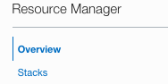
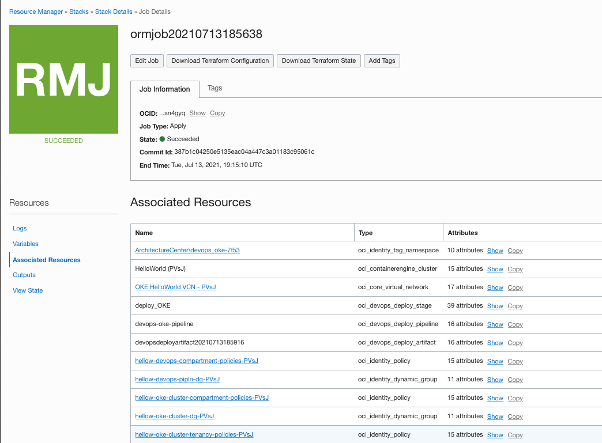

# Deploy the Infrastructure

## Introduction

In this lab exercise, you will turn into a SRE/Platform Administrator and will provision all the Infrastructure resources used by your applicaitons through Infrastructure As Code (IaC) using [Terraform](https://www.terraform.io) on [Oracle Cloud Infrastructure Resource Manager service (ORM)](https://docs.oracle.com/en-us/iaas/Content/ResourceManager/Concepts/resourcemanager.htm).  

If you are not familar with Terraform, this is an open-source tool that allow you to write infrastructure as code using declarative configuration files that will represent the state of your infrastructure. OCI Resource Manager allows you to share and manage Terraform configurations and state files across multiple teams and platforms. You can connect Resource Manager to your Git repository by setting up a Configuration Source Provider.


Estimated Lab time: 20 minutes

### Objectives

In this lab, you will:

* Create an IAM compartment to isolate and organize your CI/CD cloud resources
* Create ORM Stack and configuration pointing to a git repository.
* Provision Infrastructure: Network, IAM, Kubernetes Cluster on OKE, DevOps project

### Prerequisites

* An Oracle Free Tier(Trial), Paid or LiveLabs Cloud Account
* GitHub account

## **STEP 1**: Create a Compartment

1. Got to Navigation Menu -> Identity & Security -> Identity -> Compartments

1. To create a compartment in the tenancy (root compartment) click Create Compartment.
Otherwise, click through the hierarchy of compartments until you reach the detail page of the compartment in which you want to create the compartment. On the Compartment Details page, click Create Compartment.


1. Enter the compartment name and description:


## **STEP 2**: Import Git "deploy" repository 

Oracle has published a [Reference Architecture](https://docs.oracle.com/en/solutions/build-pipeline-using-devops/index.html) which contains a [quickstart](https://github.com/oracle-quickstart/oci-arch-devops) repository that we will use to automate the provisioning of OCI DevOps service and all target services/environments. Let's *import* that repository to your GitHub account.

1. Open up a new browser tab and go to [GitHub](https://github.com).

1. On the top navigation bar, click on the plus sign and then  Import Repository.


1. Enter the URL of the OCI Architecture DevOps repo: `https://github.com/oracle-quickstart/oci-arch-devops`


1. Enter a name for the new *deploy* repository. To better identify it, let's name it: `oci-devops-platform-deploy`. 

1. Set privacy settings to `Private` and then click on Begin import button in the bottom of the page to create a new repo.


1. Open up the new project on your browser.


## **STEP 3**: Setup ORM Configuration Source Provider 

A Configuration Source Provider is a connection information to a source code control system where your Terraform configuration files are stored.

### Generate GitHub Personal Access Token

In order to connect your GitHub account with ORM you need first to generate a Personal Access Token. 

1. Follow GitHub documentation on how to create your PAT: https://docs.github.com/en/github/authenticating-to-github/keeping-your-account-and-data-secure/creating-a-personal-access-token


1. Select the top level `repo` scope to enable access to your private repositories.


1. Click on generate token, then copy the token value and store it safely as we are going to use it soon and it won't be displayed again.


### Change Terraform template

The existing Terraform template code published in the git repo uses Terraform CLI which uses user/key authentication principal. In ORM, OCI uses service principal authentication, so, we need to make some changes to the template code and remove some variables before start the provisioning process.

To make it simple during this lab, let's make these changes directly through the browser rather than cloning the repo and using an IDE/git client:


1. Go back to the code tab on GitHub, open up `devops_oke` folder. There are 2 files we need to change:
    - providers.tf
    - variables.tf
  
  
1. Edit `providers.tf` file. Delete the code that contains the oci providers (`provider "oci"`). Then paste the following code (yes, we are replacingn 3 providers by 2):
    ```
    provider "oci" {
      alias        = "home_region"
      tenancy_ocid = var.tenancy_ocid
      region       = lookup(data.oci_identity_regions.home_region.regions[0], "name")
    }

    provider "oci" {
      alias        = "current_region"
      tenancy_ocid = var.tenancy_ocid
      region       = var.region
    }
    ```
    Note: this is required due to the fact that ORM injects the standard provider with the authentication based upon the identity associated with the CLI.


1. Let's commit these changes to the code, but instead of pushing the code to the master repo, we are creating a new feature branch and then we are going to merge the code into the master through Pull Requests when we complete all the changes. Select `Create a new branch for this commit and start a pull request`. Set the branch name to: `release-infra`. This will not trigger a new workflow since the workflow is expecting changes to the `master` repo.

1. Create a pull request, then you need to edit the next file,  `variables.tf`. Remove the following variables:
    - user_ocid
    - fingerprint
    - private_key_path

1. Commit the change into the `release-infra` branch. This will update the pull request. 

1. Finally, click on `Merge pull request` button. Provide your comments and then click on Confirm merge. You can finally check the workflow progres on the Action tab.


### Create ORM Configuration Source Provider

Now we will setup the connection between OCI Resource Manager service in your tenancy with the GitHub deploy repository. 

1. Open up Resource Manager service: Go to Navigation Menu -> Developer Services -> Resource Manager

1. On the left hand side menu, click on `Configuration Source Providers`. Make sure the `cicd` compartment is selected under the `List Scope` section.


1. Click on `Create Configuration Source Provider` button and fill out the form:

    |Field|Value|
    |--|--|
    |Name|GitHub|
    |Description|GitHub Integration|
    |Compartment|cicd|
    |Type|GitHub|
    |[Server URL](https://docs.oracle.com/en-us/iaas/Content/ResourceManager/Tasks/managingconfigurationsourceproviders.htm#CreateConfigurationSourceProvider__exampleurls)|https://github.com or https://github.com/"your account" (or check documentation for supported GitHub account types)|
    |Personal Access Token|Enter the GitHub PAT value you copied earlier|
    
    

1. Click on Create button to finish this process. Once the configuration source provider was created you can click on the Provider hyperlink to go to the details page where you can click to validate the connection with the Server URL.

## **STEP 4**: Create ORM Stack

Next step we are going to create a OCI Resource Manager Stack. The Stack is a collection of Oracle Cloud Infrastructure resources corresponding to a given Terraform configuration. Each stack resides in the compartment you specify, in a single region; however, resources on a given stack can be deployed across multiple regions. An OCID (unique identifier) is assigned to each stack.

1. Open up Resource Manager service: Go to Navigation Menu -> Developer Services -> Resource Manager

1. On the left hand side menu, click on `Stacks`, then Create Stack button to open up the Create Stack Wizard page. Make sure the `cicd` compartment is selected under the `List Scope` section.


1. In the Stack information page, select `Source Control System` for the Origin of the Terraform configuration, then select the followingn under Stack Configurations:

    |Property|Value|
    |--|--|
    |Configuration Source Provider|GitHub|
    |Repository|oci-devops-platform-deploy|
    |Branch|master|
    |Working Directory|devops_oke|

1. In the Stack Information section, enter:

    |Property|Value|
    |--|--|
    |Name|infrastructure-onboard|
    |Description|Provision OKE Kubernetes Cluster and sample DevOps project|
    |Create in Compartment|cicd|
    |Terraform Version|select the latest available or compatible leave the default option|

1. Click on Next in the bottom of the page to go to the `Configure variables` page.


1. In the `Configure Variables` page, change the following variables:

    DevOps Project:
    |Variable|Value|
    |-|-|
    |Compartment|cicd|
    |Project Name|HelloDevOps|
    |Show Advanced Options?|unchecked|

    Policy Settings: No changes required, use Stack default value.

    OKE Cluster Configuration: No changes required, use Stack default values to create a new OKE cluster.

    OKE Worker Nodes: Change the number of worker nodes from 3 to 1. Use default value for the remaining variables.
    
1. Click on Next in the bottom of the page to proceed to the Review page.

1. After Reviewing the variable values that were modified, click on Create button to create the `infrastructure-onboard` Stack.

## **STEP 5**: Provisioning the Infrastructure

1. After creating the Stack, you can perform some Terraform operations that are also known as `Jobs` in OCI. By clicking on `Plan` button and defining a name for your plan, Resource Manager will parse your Terraform configuration and creates an execution plan for the associated stack. The execution plan lists the sequence of specific actions planned to provision your Oracle Cloud Infrastructure resources. The execution plan is handed off to the apply job, which then executes the instructions.

1. Next, click on `Apply` button and select the plan resolution that was previously created (or select Automatically approve to bypass a plan). This will apply the execution plan to create (or modify) your Oracle Cloud Infrastructure resources. This operation will take some time to complete (15-20 minutes) as it is going to provision all infrastructure resources needed by this lab (IAM, Network, Logging, OKE). You can check status and logs while the job runs. After the end, you can click on `Associated Resources` menu to visualize the list of resources that were provisioned.


1. At anytime you can go back to the Stack details page, click on `Edit` button to change the variable values. After that, you need to run Plan -> Apply jobs to make these changes into the infrastructure. Always review the execution plan as some resources are immutable and they can be completely destroyed and recreated by Terraform/ORM after hitting `Apply`.

Note: in case of quota/service limit/permission issues, Apply job will fail and not all resources might have been provisioned. Click on Destroy button will trigger the job to remove provisioned resources. 
