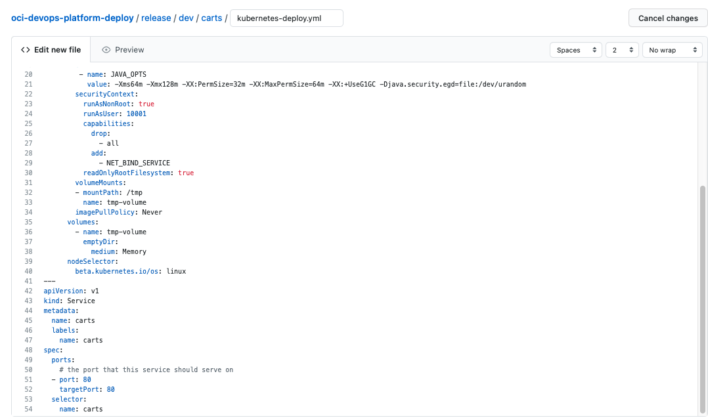
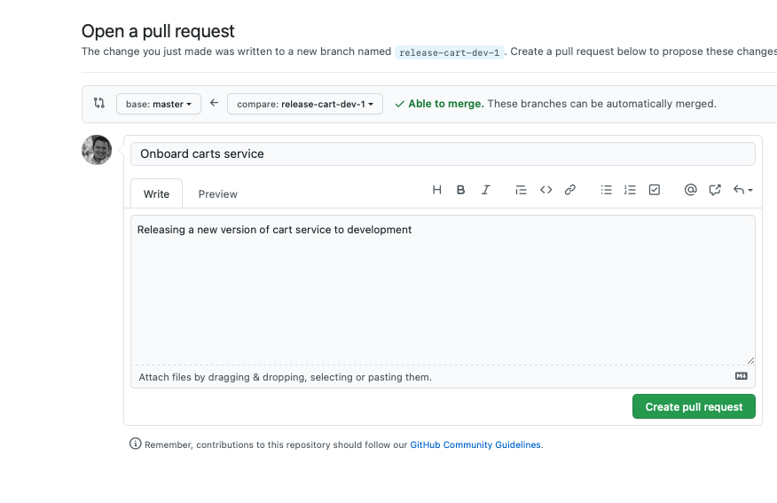

# Publish Artifact

## Introduction

In the previous labs, we played the role of a SRE/Platform Engineer that was responsible to provision all the infrastructure used by this project and we also had a developer who published their Cloud Native application into OCIR. In this lab exercise, we will deploy the application into the Kubernetes cluster on OKE through OCI DevOps. This is going to be a coordinated task among the two teams. In this process, developers will create/make changes to Kubernetes manifest and push them into the `oci-devops-platform-deploy` repositoy as Pull Requests. SREs/Platform Engineers will review these manifests, merge into the repo and then create an Artifact in the OCI DevOps project that will start the CD Pipeline automatically which will deploy the application to the target environment (OKE). For this lab exercise, we already created a sample OCI DevOps project with existing pipelines and Artifacts through Terraform (IaC). We are going to update them now.

Before jumping into the lab steps, let's understand key concepts of OCI DevOps:

---
| Projects

A project is a logical grouping of DevOps resources needed to implement your CI/CD workload. DevOps resources can be Artifacts, Deployment Pipelines, and Environments.
Projects makes it easy to enable logging, monitoring, and notifications for all your DevOps resources. The best practice is to group each application and all its microservices into a single project.

| Artifacts

A collection of text files, binaries, and deployment manifests that will be delivered to the target deployment environment. DevOps artifacts can point to an OCI Registry container image repository path, a generic artifact repository path, or provided inline. Artifacts must be in an OCI repository to work with the OCI DevOps service. We have this restriction so that OCI DevOps can ensure that the software version deployed contains the artifact versions specified - and then can rollback to a specific version that has not changed.

A DevOps Artifact is a reference or pointer to any file, binary, package, manifest, or Image that makes up your application. When creating an Artifact, you have to inform Oracle DevOps of the source location of the actual Artifact. DevOps supports OCI object storage, OCIR, or any generic Artifact Repository.
DevOps lets you "upload" an Artifact directly, this stores the Artifact in an OCI internal artifact location and creates a DevOps Artifact, which is just a Reference to it. 

Deleting an OCI DevOps Artifact only deletes the reference and does not delete the Artifact itself.

| Environment

An Environment is a collection of a customer’s computing resources where Artifacts will be deployed to. Environments can be a Function, Compute VM or BM instances, or an OKE cluster. Environments can be in different OCI regions than the region of the Deployment Pipeline - so developers can run a Deployment to multiple OCI regions.

| Deployment Pipeline

A Deployment Pipeline holds the requirements that must be satisfied to deliver a set of Artifacts to an Environment. Pipelines contain stages which are the building blocks of a Pipeline. A Pipeline can have Stages that run serially or in parallel, so you can control the flow and logic of your software release.

| Stage

Stages are an individual action that takes place during a run of a Pipeline. The DevOps Deployment pipeline includes pre-defined stage types for you to use in your release process:
- Rolling deployment - an incremental release to OKE, Functions, or Instance Groups
- Wait: wait N seconds
- Manual Approval: proceed if an approval is given, stop if an approval is rejected
- Traffic Shift: control the traffic sent to backend sets of a load balancer
- Invoke Function - preform custom tasks and integration by calling an OCI Function, and pass an artifact of request parameters
- Run OKE Job - run an OKE Job (different than a Deployment)
- Run Deployment - trigger the start of another Deployment Pipeline

| Deployment

The execution of the Deployment pipeline, and its release to the target environment.

| Rollback

Release a previous version, or updated version of your software, to fix an issue identified with a Deployment

---

Estimated Lab time: 20 minutes

### Objectives

In this lab, you will:

* Create DevOps Artifacts
* Create ORM Stack and configuration pointing to a git repository.
* Provision Infrastructure: Network, IAM, Kubernetes Cluster on OKE, DevOps project

### Prerequisites

* An Oracle Free Tier(Trial), Paid or LiveLabs Cloud Account
* GitHub account

## **STEP 1**: Developers push K8s Manifest to git

As previously defined, all changes to the infrastructure should go into the `oci-devops-platform-deploy`. This is going to make it easier to adopt a "GitOps" workflow, where all changes must be reviewed through a Pull/Merge request process on your favorite Git tool before getting the code merged. This gives more flexibility and agility to the organization as they can continue using well-known Development tools towards their release process.

You can use your favorite IDE to go over this process on your day-to-day operation. For this lab, let's use the browser.

1. Open `oci-cloud-native-mushop` repo and go to `src/carts/kubernetes`.
1. You should copy the content of the k8s manifest file `kubernetes-deploy.yml` and we will place it into the `oci-devops-platform-deploy` repository. This file conatins both Deployment and Service definitions for carts microservice.
1. Open `oci-devops-platform-deploy` repository on a different tab/window. Under the Code tab, make sure you are under the root folder.
1. Click on Add file -> Create new file.
1. At the new window, name your file `release/dev/carts/kubernetes-deploy.yml`. This is going to hold the files for releasing new features into the development environment for carts microservice. 
1. Paste the content of the yaml file into the appropriated area.

1. Let's commit the code, but instead of pushing the code to the master repo, we are creating a new feature branch and then we are going to merge the code into the master through Pull Requests when we complete all the changes. Select `Create a new branch for this commit and start a pull request`. Set the branch name to: `release-cart-dev`. Then click on Propose file name to proceed.
 
1. Open a pull request and have someone from the SRE/Platform team to review your code.
  
1. Now you can just monitor when your code is accepted and merged into the master.

## **STEP 2**: Create DevOps Artifact

1. Got to Navigation Menu -> Identity & Security -> Identity -> Compartments
