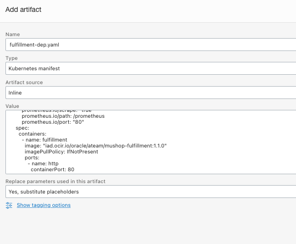
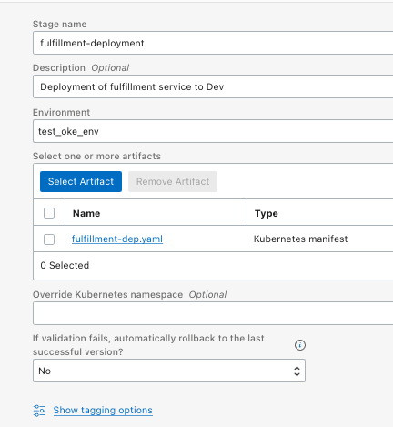

# Publish Artifact

## Introduction

In the previous labs, we played the role of a SRE/Platform Engineer that was responsible to provision all the infrastructure used by this project and we also had a developer who published their Cloud Native application into OCIR. In this lab exercise, we will deploy the application into the Kubernetes cluster on OKE through OCI DevOps. This is going to be a coordinated task among the two teams. In this process, developers will create an Artifact in the OCI DevOps project that will start the CD Pipeline automatically for deploying the application to the target environment (OKE). SREs will be responsible for approving the changes as part of the pipeline process.


Before jumping into the lab steps, let's understand key concepts of OCI DevOps:

---
| Projects

A project is a logical grouping of DevOps resources needed to implement your CI/CD workload. DevOps resources can be Artifacts, Deployment Pipelines, and Environments.
Projects makes it easy to enable logging, monitoring, and notifications for all your DevOps resources. The best practice is to group each application and all its microservices into a single project.


| Artifacts

A collection of text files, binaries, and deployment manifests that will be delivered to the target deployment environment. DevOps artifacts can point to an OCI Registry container image repository path, a generic artifact repository path, or provided inline. Artifacts must be in an OCI repository to work with the OCI DevOps service. We have this restriction so that OCI DevOps can ensure that the software version deployed contains the artifact versions specified - and then can rollback to a specific version that has not changed.

A DevOps Artifact is a reference or pointer to any file, binary, package, manifest, or Image that makes up your application. When creating an Artifact, you have to inform Oracle DevOps of the source location of the actual Artifact. DevOps supports OCI object storage, OCIR, or any generic Artifact Repository.
DevOps lets you "upload" an Artifact directly, this stores the Artifact in an OCI internal artifact location and creates a DevOps Artifact, which is just a Reference to it. 

Deleting an OCI DevOps Artifact only deletes the reference and does not delete the Artifact itself.


| Environment

An Environment is a collection of a customer’s computing resources where Artifacts will be deployed to. Environments can be a Function, Compute VM or BM instances, or an OKE cluster. Environments can be in different OCI regions than the region of the Deployment Pipeline - so developers can run a Deployment to multiple OCI regions.


| Deployment Pipeline

A Deployment Pipeline holds the requirements that must be satisfied to deliver a set of Artifacts to an Environment. Pipelines contain stages which are the building blocks of a Pipeline. A Pipeline can have Stages that run serially or in parallel, so you can control the flow and logic of your software release.


| Stage

Stages are an individual action that takes place during a run of a Pipeline. The DevOps Deployment pipeline includes pre-defined stage types for you to use in your release process:
- Rolling deployment - an incremental release to OKE, Functions, or Instance Groups
- Wait: wait N seconds
- Manual Approval: proceed if an approval is given, stop if an approval is rejected
- Traffic Shift: control the traffic sent to backend sets of a load balancer
- Invoke Function - preform custom tasks and integration by calling an OCI Function, and pass an artifact of request parameters
- Run OKE Job - run an OKE Job (different than a Deployment)
- Run Deployment - trigger the start of another Deployment Pipeline


| Deployment

The execution of the Deployment pipeline, and its release to the target environment.


| Rollback

Release a previous version, or updated version of your software, to fix an issue identified with a Deployment


| Pipeline Parameters 

Pipeline Parameters are names of placeholders that exist in DevOps resources. They are available to all resources within the deployment pipeline. They are names with an optional default value. When the pipeline is run, arguments must be provided for all the pipeline parameters that do not have a default value.

---

Estimated Lab time: 20 minutes

### Objectives

In this lab, you will:

* Create DevOps Artifacts
* Create ORM Stack and configuration pointing to a git repository.
* Provision Infrastructure: Network, IAM, Kubernetes Cluster on OKE, DevOps project

### Prerequisites

* An Oracle Free Tier(Trial), Paid or LiveLabs Cloud Account
* GitHub account


## **STEP 1**: Developers push K8s Manifest to git

As previously defined, all changes to the infrastructure should go into the `oci-devops-platform-deploy`. This is going to make it easier to adopt a "GitOps" workflow, where all changes must be reviewed through a Pull/Merge request process on your favorite Git tool before getting the code merged. This gives more flexibility and agility to the organization as they can continue using well-known Development tools towards their release process.

You can use your favorite IDE to go over this process on your day-to-day operation. For this lab, let's use the browser.

1. Open `oci-cloud-native-mushop` repo and go to `deploy/complete/kubernetes/manifests`.
1. You should copy the content of the k8s manifest file `fulfillment-dep.yaml` and we will place it into the `oci-devops-platform-deploy` repository. This file contains the Deployment definitions for fulfillment microservice.
1. Open `oci-devops-platform-deploy` repository on a different tab/window. Under the Code tab, make sure you are under the root folder.
1. Click on Add file -> Create new file.
1. At the new window, name your file `release/dev/fulfillment/fulfillment-dep.yaml`.
1. Paste the content of the yaml file into the appropriated area.

1. Let's commit the code, but instead of pushing the code to the master repo, we are creating a new feature branch and then we are going to merge the code into the master through Pull Requests when we complete all the changes. Select `Create a new branch for this commit and start a pull request`. Set the branch name to: `release-fulfillment-dev`. Then click on Propose file name to proceed.
 
1. Open a pull request and have someone from the SRE/Platform team to review your code. Make sure you click on Create Pull Request to confirm the operation.
  
1. As a developer, you can just monitor when your code is accepted and merged into the master.
1. As a SRE, you should review the code and merge the pull request.


## **STEP 2**: Create DevOps Artifact

As a SRE, we need to update the DevOps project and add the pipeline to publish and release the fulfillment service through the OKE Kubernetes cluster we provisioned.

1. Let's open the OCI DevOps project. Go to OCI Navigation Menu -> Developer Services -> DevOps -> Projects. The project name should starts with `hellow_`

1. Create your Artifact. From your project page, click `Add Artifacts`.

1. Fill ou the form with the following data:

    |Property Name|Property Value|
    |--|--|
    |Name|fulfillment-dep.yaml|
    |Type|Kubernetes Manifest|
    |Artifact Source|Inline|
    |Value|Paste the content of the file `fulfillment-dep.yaml` that was merged into the oci-devops-platform repository through the PR. Make sure you copy the raw file.|
    |Replace parameters used in this artifact|Yes, substitute placeholders|


    Before saving it, let's replace the original hardcoded container image tag with a [parameter](https://docs.oracle.com/en-us/iaas/devops/using/configuring_parameters.htm):

    Locate the line with the following snippet:
    ```
    spec:
      containers:
        - name: fulfillment
          image: "iad.ocir.io/oracle/ateam/mushop-fulfillment:1.1.0"
          imagePullPolicy: IfNotPresent
          ports:
            - name: http
              containerPort: 80
    ```

    and replace it with:
    ```
    spec:
      containers:
        - name: fulfillment
          image: ${mushop_fulfillment_image}
          imagePullPolicy: IfNotPresent
          ports:
            - name: http
              containerPort: 80
              protocol: TCP
    ```
    Now, we need to create a Pipeline and a Parameter for the Container Image Version which will be applied to the manifest during the pipeline.
     

## **STEP 3**: Create DevOps Pipeline

Let's create a DevOps pipeline for publishing the mushop fulfillment service. This is going to publish the artifact to our OKE environment. 

1. Go to Deployment Pipelines (left hand side menu of your DevOps project) and click on Create Pipeline.

1. Enter a name and a description for the pipeline and then click on Create pipeline:
    |Property Name|Property Value|
    |--|--|
    |Name|deploy-fulfillment-to-dev|
    |Description|Deploy Mushop Fulfillment service to OKE Development environment|

    

1. Before start designing the pipeline workflow, we need to create the parameter we used in the Artifact. Click on Parameter tab and enter the following data:

    |Name|Default Value|Description|
    |--|--|--|
    |mushop_fulfillment_image|Use the URL of the image published in the OCIR in the format of `<region-key>.ocir.io/<tenancy-namespace>/<repository>:<tag>`|Container Image for Mushop Fulfillment service|

1. Click on the plus button to save the parameter into the table.
      

1. Click on the Pipeline tab to design your workflow. Add a Stage to your Pipeline. Click on the plus icon to add a Stage.
     

1. In our use case, we are applying the Kubernetes manifest to our Development environment in OKE. If we needed to enforce more security controls, we could add a stage requesting someone to approve the stage in order to proceed to the next one. In our case, let's select `Apply manifest to your Kubernetes cluster`. Then click on next.

     

1. In the next window, enter the following data then click on Add:

    |Property Name|Property Value|
    |--|--|
    |Stage Name|fulfillment-deployment|
    |Description|Deployment of fulfillment service to Dev|
    |Environment|test_oke_env|
    |Select one or more artifacts|fulfillment-dep.yaml|
    |If validation fails, automatically rollback to the last successful version?|Yes|

    

1. Here is the pipeline we created.
 

## **STEP 4**: Deploy Carts Service to OKE

You can run a pipeline directly from the OCI Console or you can build integrations with the API, CLI or some external integrations. 

1. Click on `Run Pipeline` button on top right corner of the page. 

1. In the Start Manual Run enter a name for your deployment or leave it as is. 

1. In the Parameters section, set the URL for the container image that you want to deploy. 