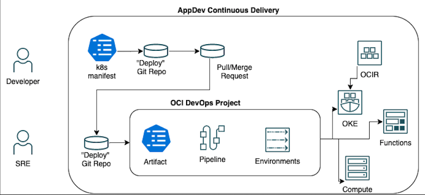
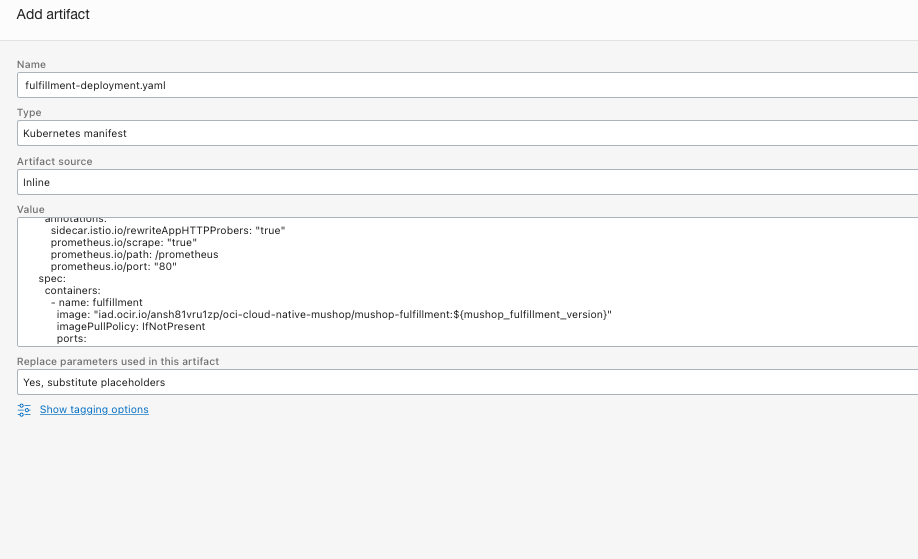
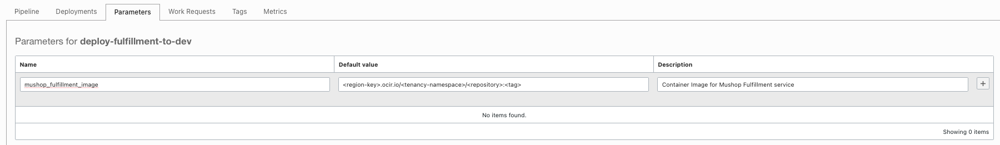
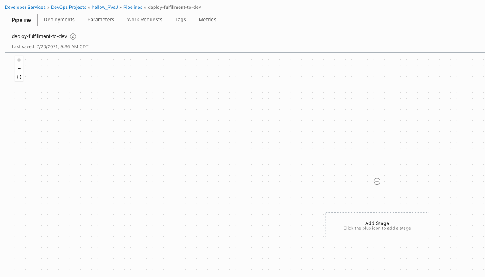

# Contiuous Delivery with OCI DevOps Pipeline

## Introduction

In the previous labs, we played the role of a SRE/Platform Engineer that was responsible to provision all the infrastructure used by this project and we also had a developer who published their Cloud Native application into OCIR. In this lab exercise, we will deploy the application into the Kubernetes cluster on OKE through a Continuous Delivery pipeline using OCI DevOps.  

This is going to be a coordinated task among the two teams. In this process, developers will create an Artifact in the OCI DevOps project that will start the CD Pipeline automatically for deploying the application to the target environment (OKE). SREs will be responsible for approving the changes as part of the pipeline process.



Before jumping into the lab steps, let's understand key concepts of OCI DevOps:

---
| Projects

A project is a logical grouping of DevOps resources needed to implement your CI/CD workload. DevOps resources can be Artifacts, Deployment Pipelines, and Environments.
Projects makes it easy to enable logging, monitoring, and notifications for all your DevOps resources. The best practice is to group each application and all its microservices into a single project.


| Artifacts

A collection of text files, binaries, and deployment manifests that will be delivered to the target deployment environment. DevOps artifacts can point to an OCI Registry container image repository path, a generic artifact repository path, or provided inline. Artifacts must be in an OCI repository to work with the OCI DevOps service. We have this restriction so that OCI DevOps can ensure that the software version deployed contains the artifact versions specified - and then can rollback to a specific version that has not changed.

A DevOps Artifact is a reference or pointer to any file, binary, package, manifest, or Image that makes up your application. When creating an Artifact, you have to inform Oracle DevOps of the source location of the actual Artifact. DevOps supports OCI object storage, OCIR, or any generic Artifact Repository.
DevOps lets you "upload" an Artifact directly, this stores the Artifact in an OCI internal artifact location and creates a DevOps Artifact, which is just a Reference to it. 

Deleting an OCI DevOps Artifact only deletes the reference and does not delete the Artifact itself.


| Environment

An Environment is a collection of a customer’s computing resources where Artifacts will be deployed to. Environments can be a Function, Compute VM or BM instances, or an OKE cluster. Environments can be in different OCI regions than the region of the Deployment Pipeline - so developers can run a Deployment to multiple OCI regions.


| Deployment Pipeline

A Deployment Pipeline holds the requirements that must be satisfied to deliver a set of Artifacts to an Environment. Pipelines contain stages which are the building blocks of a Pipeline. A Pipeline can have Stages that run serially or in parallel, so you can control the flow and logic of your software release.


| Stage

Stages are an individual action that takes place during a run of a Pipeline. The DevOps Deployment pipeline includes pre-defined stage types for you to use in your release process:
- Rolling deployment - an incremental release to OKE, Functions, or Instance Groups
- Wait: wait N seconds
- Manual Approval: proceed if an approval is given, stop if an approval is rejected
- Traffic Shift: control the traffic sent to backend sets of a load balancer
- Invoke Function - preform custom tasks and integration by calling an OCI Function, and pass an artifact of request parameters
- Run OKE Job - run an OKE Job (different than a Deployment)
- Run Deployment - trigger the start of another Deployment Pipeline


| Deployment

The execution of the Deployment pipeline, and its release to the target environment.


| Rollback

Release a previous version, or updated version of your software, to fix an issue identified with a Deployment


| Pipeline Parameters 

Pipeline Parameters are names of placeholders that exist in DevOps resources. They are available to all resources within the deployment pipeline. They are names with an optional default value. When the pipeline is run, arguments must be provided for all the pipeline parameters that do not have a default value.

---

Estimated Lab time: 20 minutes

### Objectives

In this lab, you will:

* Create DevOps Artifacts
* Define Pipeline Parameters
* Create DevOps Pipeline
* Deploy New Software Version on Kubernetes OKE cluster

### Prerequisites

* An Oracle Free Tier(Trial), Paid or LiveLabs Cloud Account
* GitHub account


## **STEP 1**: Create Artifacts

Up to this point, the Container Image built by developers is already available in the Oracle Cloud Infrastructure Registry. As SREs, we are responsible for designing the Continuous Delivery workflow in the OCI DevOps service to release the application to our customers. 

The OCI DevOps project was created automatically by the Terraform template using ORM. Now, we need to create the Artifacts that will contains the Kubernetes manifest files that are used to deploy the fulfillment microservice.

1. Let's open the OCI DevOps project. Go to OCI Navigation Menu -> Developer Services -> DevOps -> Projects. The project name should starts with `hellow_`

1. Create your Artifact. From your project page, click `Add Artifacts`.

1. Fill ou the form with the following data:

    |Property Name|Property Value|
    |--|--|
    |Name|fulfillment-deployment.yaml|
    |Type|Kubernetes Manifest|
    |Artifact Source|Inline|
    |Value|Paste the content below|
    |Replace parameters used in this artifact|Yes, substitute placeholders|

    
    ```yaml
    apiVersion: apps/v1
    kind: Deployment
    metadata:
      name: fulfillment
      labels:
        app.kubernetes.io/name: fulfillment
        app.kubernetes.io/instance: mushop
        run: fulfillment
    spec:
      replicas: 1
      minReadySeconds: 30
      selector:
        matchLabels:
          app: fulfillment
          app.kubernetes.io/name: fulfillment
          app.kubernetes.io/instance: mushop
          run: fulfillment
      template:
        metadata:
          labels:
            app: fulfillment
            version: "1.1.0"
            app.kubernetes.io/name: fulfillment
            app.kubernetes.io/instance: mushop
            run: fulfillment
          annotations:
            sidecar.istio.io/rewriteAppHTTPProbers: "true"
            prometheus.io/scrape: "true"
            prometheus.io/path: /prometheus
            prometheus.io/port: "80"
        spec:
          containers:
            - name: fulfillment
              image: "<region-key>.ocir.io/<tenancy-namespace>/<repository>:<tag>"
              imagePullPolicy: IfNotPresent
              ports:
                - name: http
                  containerPort: 80
                  protocol: TCP
              env:
                - name: NATS_HOST
                  value: "nats"
                - name: NATS_PORT
                  value: "4222"
                - name: ORDERS_NEW
                  value: "orders"
                - name: ORDERS_SHIPPED
                  value: "shipments"
                - name: SIMULATION_DELAY
                  value: "10000"    
    ```

    Before saving it, let's replace the hardcoded container image tag with a [parameter](https://docs.oracle.com/en-us/iaas/devops/using/configuring_parameters.htm) that represents the container image tag.

    Locate the line with the following snippet:
    ```
    spec:
      containers:
        - name: fulfillment
          image: "<region-key>.ocir.io/<tenancy-namespace>/<repository>:<tag>"
          imagePullPolicy: IfNotPresent
          ports:
            - name: http
              containerPort: 80
              protocol: TCP
    ```

    and replace it with the value below, assuming the original container image URL for the tag 1.1.0 was:  `iad.ocir.io/ansh81vru1zp/oci-cloud-native-mushop/mushop-fulfillment:1.1.0`. As the result, we should have the following snippet with the variable

    ```
    spec:
      containers:
        - name: fulfillment
          image: "iad.ocir.io/ansh81vru1zp/oci-cloud-native-mushop/mushop-fulfillment:${mushop_fulfillment_version}"
          imagePullPolicy: IfNotPresent
          ports:
            - name: http
              containerPort: 80
              protocol: TCP
    ```
    
    
    
     

1. Let's repeat this operation for the following Artifacts:

    > fulfillment-service.yaml

    |Property Name|Property Value|
    |--|--|
    |Name|fulfillment-service.yaml|
    |Type|Kubernetes Manifest|
    |Artifact Source|Inline|
    |Value|Paste the content below from `fulfillment-service.yaml`|
    |Replace parameters used in this artifact|Yes, substitute placeholders|

  
    ```yaml
    apiVersion: v1
    kind: Service
    metadata:
      name: fulfillment
      labels: 
        app.kubernetes.io/name: fulfillment
        run: fulfillment
    spec:
      selector:
        app.kubernetes.io/name: fulfillment
        run: fulfillment
      ports:
        - port: 80
          name: http
          protocol: TCP
          targetPort: 8082
    ```

    > nats-deployment.yaml

    |Property Name|Property Value|
    |--|--|
    |Name|nats-deployment.yaml|
    |Type|Kubernetes Manifest|
    |Artifact Source|Inline|
    |Value|Paste the content below from `nats-deployment.yaml`|
    |Replace parameters used in this artifact|Yes, substitute placeholders|

  
    ```yaml
    ---
    apiVersion: apps/v1
    kind: Deployment
    metadata:
      name: nats
      labels:
        app.kubernetes.io/name: nats
        run: nats
    spec:
      replicas: 1
      minReadySeconds: 30
      selector:
        matchLabels:
          app: nats
          app.kubernetes.io/name: nats
          run: nats
      template:
        metadata:
          labels:
            app: nats
            version: "2.1.2"
            app.kubernetes.io/name: nats
            run: nats
          annotations:
            sidecar.istio.io/rewriteAppHTTPProbers: "true"
            prometheus.io/scrape: "true"
            prometheus.io/path: /metrics
            prometheus.io/port: "7777"
        spec:
          containers:
            - name: nats
              image: "nats:2.1.2"
              imagePullPolicy: IfNotPresent
              ports:
                - name: client
                  containerPort: 4222
                  protocol: TCP
                - name: routes
                  containerPort: 6222
                  protocol: TCP
                - name: monitoring
                  containerPort: 8222
                  protocol: TCP
    ```

    > nats-service.yaml

    |Property Name|Property Value|
    |--|--|
    |Name|nats-service.yaml|
    |Type|Kubernetes Manifest|
    |Artifact Source|Inline|
    |Value|Paste the content below from `nats-service.yaml`|
    |Replace parameters used in this artifact|Yes, substitute placeholders|

  
    ```yaml
    apiVersion: v1
    kind: Service
    metadata:
      name: nats
      annotations:
        prometheus.io/path: "/prometheus"
      labels:
        app.kubernetes.io/name: nats
        app.kubernetes.io/instance: mushop
        run: nats
    spec:
      selector:
        app.kubernetes.io/name: nats
        run: nats
      ports:
        - name: client
          port: 4222
          protocol: TCP
          targetPort: 4222
        - name: routes
          port: 6222
          protocol: TCP
          targetPort: 6222
        - name: monitoring
          port: 8222
          protocol: TCP
          targetPort: 8222  
    ```


In the next steops, we are going to create a Pipeline and define a Parameter for the Container Image Version which will be applied to the manifest during the CD workflow.


## **STEP 3**: Create DevOps Pipeline

Let's create a DevOps pipeline for publishing the mushop fulfillment service and its dependencies. This is going to publish multiple artifacts to our OKE environment. 

1. Go to Deployment Pipelines (left hand side menu of your DevOps project) and click on Create Pipeline.

1. Enter a name and a description for the pipeline and then click on Create pipeline:
    |Property Name|Property Value|
    |--|--|
    |Name|deploy-fulfillment-to-dev|
    |Description|Deploy Mushop Fulfillment service to OKE Development environment|

    

1. Before start designing the pipeline workflow, we need to create the parameter we used in the Artifact. Click on Parameter tab and enter the following data:

    |Name|Default Value|Description|
    |--|--|--|
    |mushop_fulfillment_version|Enter default tag name that was used to publish mushop-fulfillment image. E.g. 1.1.0|
    |Description|Default version of mushop-fulfillment image. E.g. 1.1.0|

1. Click on the plus button to save the parameter into the table.
      

1. Click on the Pipeline tab on the top to design your workflow. Add a Stage to your Pipeline. Click on the plus icon to add a Stage.
     

1. OCI DevOps allow you to enforce more security controls, e.g. pause the deployment while it wait for apprvals. In our case, this is not necessary and just select `Apply manifest to your Kubernetes cluster` in the Deploy section. Then click on next.

     

1. We are going to create a Pipeline with 3 Stages to demonstrate how you could apply many Artifacts under the same stage or separately.


1. In the next window, enter the following data then click on Add:

    |Property Name|Property Value|
    |--|--|
    |Stage Name|fulfillment-deployment|
    |Description|Apply Deployment manifest for fulfillment |
    |Environment|test_oke_env|
    |Select one or more artifacts|fulfillment-deployment.yaml|
    |Override Kubernetes namespace|Leave empty|
    |If validation fails, automatically rollback to the last successful version?|Yes|

    

1. Here is the pipeline we created so far.
 

  You can either click on the plus icon in the top or the bottom of the stage we created, depending upon you want the Artifact to get applied before or after the current stage. Here is the order we want to deploy the Artifacts to the OKE cluster:

  | Nats Deployment -> Nats Service -> Fulfillment Deployment -> Fulfillment Service

1. Next, let's create a single stage for NATS that should be placed on top of the fulfillment deployment one. Click on the plus sign on top of fulfillment-deployment stage, then Add Stage.

1. Select Apply manifest to your Kubernetes cluster and click Next.

1. In the next window, enter the following data then click on Add:

    |Property Name|Property Value|
    |--|--|
    |Stage Name|nats|
    |Description|Apply Deployment and Service manifest for nats |
    |Environment|test_oke_env|
    |Select one or more artifacts|nats-deployment.yaml, nats-service.yaml|
    |Override Kubernetes namespace|Leave empty|
    |If validation fails, automatically rollback to the last successful version?|Yes|
    

1. Finally, we are going to create a stage for the fulfillment service. Click on the plus sign underneath fulfillment-deployment, then Add Stage.

1. Select Apply manifest to your Kubernetes cluster and click Next.

1. In the next window, enter the following data then click on Add:

    |Property Name|Property Value|
    |--|--|
    |Stage Name|fulfillment-service|
    |Description|Apply Service manifest for fulfillment |
    |Environment|test_oke_env|
    |Select one or more artifacts|nats-deployment.yaml, nats-service.yaml|
    |Override Kubernetes namespace|Leave empty|
    |If validation fails, automatically rollback to the last successful version?|Yes|
    

As the result, we have the following DevOps Pipeline:


## **STEP 4**: Deploy Fulfillment Service to OKE

You can run a pipeline directly from the OCI Console or you can build integrations with the API, CLI or some external integrations. 

1. Click on `Run Pipeline` button on top right corner of the page. 

1. In the Start Manual Run enter a name for your deployment or leave it as is. 

1. In the Parameters section, you can set the version of the container image that you want to deploy in case you don't want to use default value.

1. You can follow the execution of the pipeline directly in the console. Every stage that is running change its color to yellow or red in case of failure. 

1. You can also use Cloud Shell and [set up a connection with your cluster](https://docs.oracle.com/en-us/iaas/Content/ContEng/Tasks/contengdownloadkubeconfigfile.htm#cloudshelldownload), and then use `kubectl` to monitor the deployment of the resources. E.g.:
```
kubectl get svc -w
```
or
```
kubectl get deploy -w
```

After completing the execution, all stages should be green.


## **STEP 5**: (Optional) Test Fulfillment Service


1. Open up Cloud Shell, and let's use a nats client using the following command:
    ```
    kubectl run -i --rm --tty nats-box --image=synadia/nats-box --restart=Never
    ```

1. Press enter to gain access into the container shell. Push some data into the message queue with the following commands and json payloads:
    ```bash
    nats pub -s nats://nats:4222 mushop-orders '{"orderId":1}'
    nats pub -s nats://nats:4222 mushop-orders '{"orderId":2}'
    nats pub -s nats://nats:4222 mushop-orders '{"orderId":3}'
    ```
    After sending each message, you should get the following outcome in the shell:
    ```
    Published 13 bytes to "mushop-orders"
    ```
    Type `exit` to destroy the pod.

1. Let's use a pod with `curl` available to query our microservice. Run the command to create a pod: 
    ```bash
    kubectl run -i --rm --tty curl --image=radial/busyboxplus:curl --restart=Never
    ```

1. Once inside the pod, query the fulfillment service endpoint:
   ```bash
    curl http://fulfillment:80/fulfillment/1
   ````

    Response:
    ```bash
    Order 1 is fulfilled
    ```

