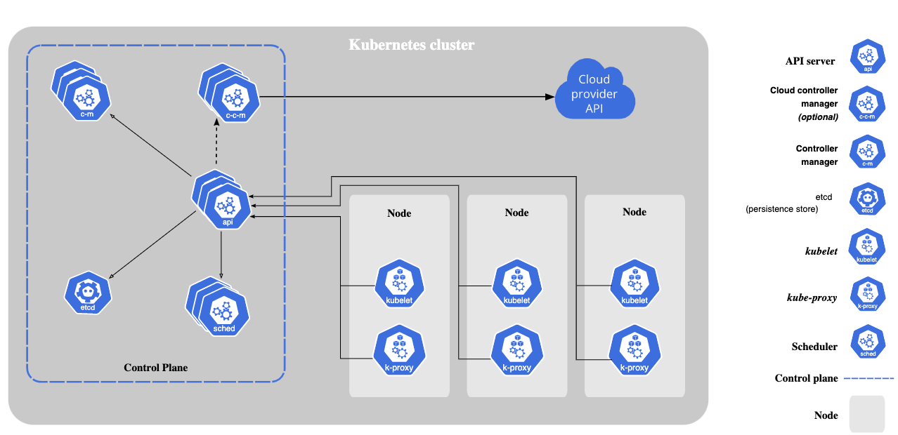

# Introduction

## Deploying a Highly Available Oracle Container Engine for Kubernetes Cluster

You will learn how to deploy a highly available Kubernetes cluster using Oracle Container Engine for Kubernetes (OKE) on Oracle Cloud Infrastructure (OCI). 

Estimated time: 60 minutes

## A Highly Available Kubernetes Cluster

A Highly Available Kubernetes cluster is about setting up Kubernetes without a single point of failure. OKE is a fully-managed, scalable, and highly available service that you can use to deploy your containerized applications to OCI. There are best practices to ensure your OKE data plane is highly available.

During this lab, you will take advantage of OCI and Kubernetes components in deploying a highly available data plane for your Kubernetes cluster. 
    

### Objectives

In this lab, you will:

* Provision an OKE cluster
* Use Node Affinity with OCI Availability Domains (ADs)
* Use Node Affinity with OCI Fault Domains
* Use Kubernetes Probes

### Prerequisites

1. An Oracle Free Tier(Trial), Paid or LiveLabs Cloud Account
1. [Familiarity with OCI console](https://docs.us-phoenix-1.oraclecloud.com/Content/GSG/Concepts/console.htm)
1. [Overview of Networking](https://docs.us-phoenix-1.oraclecloud.com/Content/Network/Concepts/overview.htm)
1. [Familiarity with Compartments](https://docs.us-phoenix-1.oraclecloud.com/Content/GSG/Concepts/concepts.htm)
1. Basic conceptual knowledge of containers and [Kubernetes](https://kubernetes.io/)

You may now [proceed to the next lab](#next).

## Learn More

* [Reference Architecture: Deploy a microservices-based application in Kubernetes](https://docs.oracle.com/en/solutions/cloud-native-ecommerce/index.html#GUID-CB180453-1F32-4465-8F27-EA7300ECF771)

## Acknowledgements

* **Author** - Rishi Johari
* **Last Updated By/Date** - Rishi Johari, August 2021
