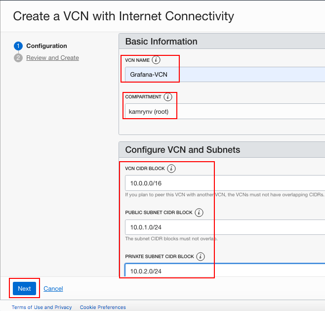
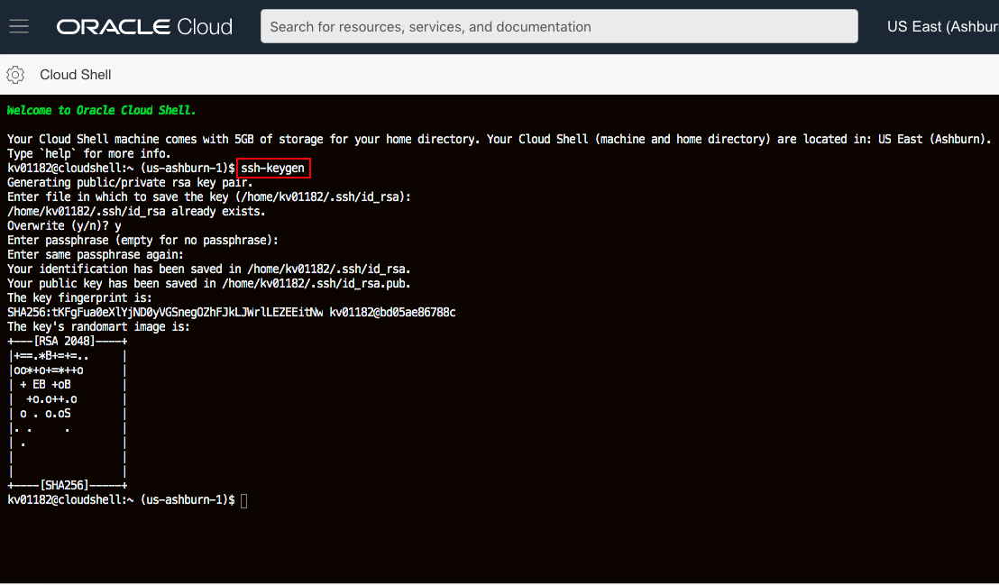
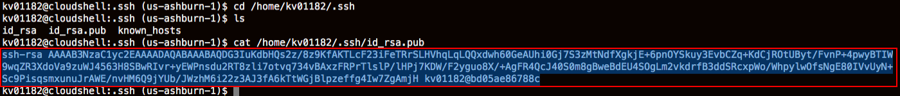
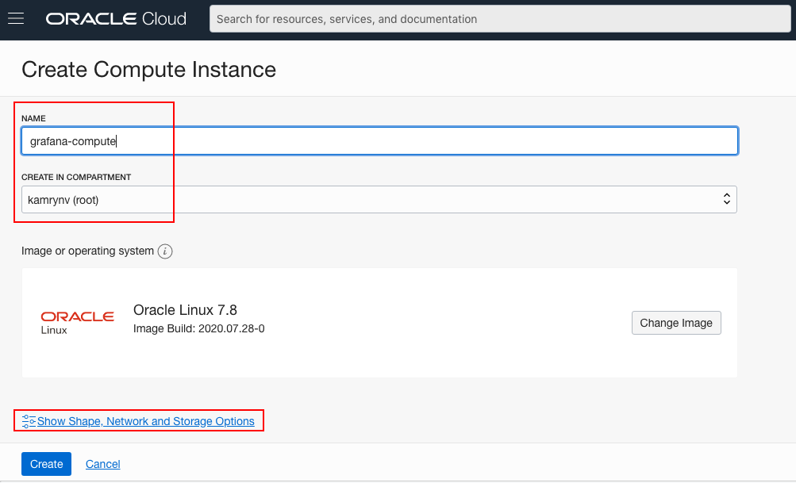
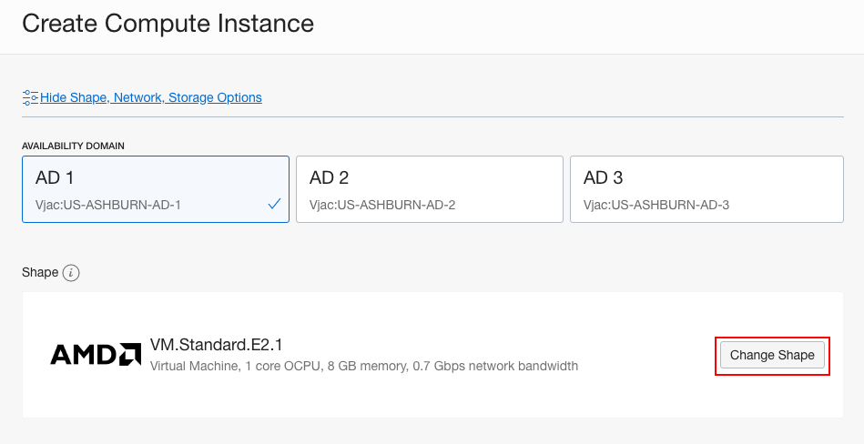
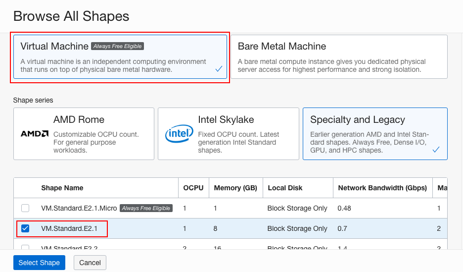
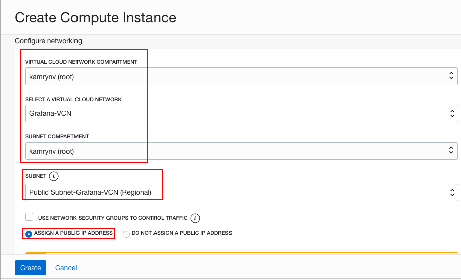
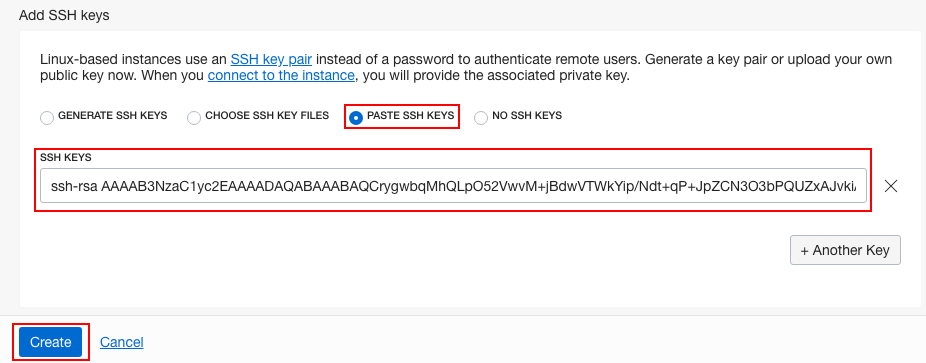

# Visualizing and monitoring compute instance using Grafana

## Introduction

Grafana is an open source visualization tool that can be used on top of a variety of different data stores

Essentially, it’s a feature-rich replacement for Graphite-web, which helps users to easily create and edit dashboards. It contains a unique Graphite target parser that enables easy metric and function editing. Users can create comprehensive charts with smart axis formats (such as lines and points) as a result of Grafana’s fast, client-side rendering — even over long ranges of time — that uses Flot as a default option.


### Prerequisites

1. Oracle Cloud Infrastructure account credentials (User, Password, Tenant, and Compartment)  

2. [OCI Training](https://cloud.oracle.com/en_US/iaas/training)

3. [Familiarity with OCI console](https://docs.us-phoenix-1.oraclecloud.com/Content/GSG/Concepts/console.htm)

4. [Overview of Networking](https://docs.us-phoenix-1.oraclecloud.com/Content/Network/Concepts/overview.htm)

5. [Familiarity with Compartment](https://docs.us-phoenix-1.oraclecloud.com/Content/GSG/Concepts/concepts.htm)

6. [Connecting to a compute instance](https://docs.us-phoenix-1.oraclecloud.com/Content/Compute/Tasks/accessinginstance.htm)

## **Step 1:** Sign in to OCI Console and create VCN


**Note:** OCI UI is being updated thus some screenshots in the instructions might be different than actual UI.

1. Sign in using your tenant name, user name and password. Use the login option under **Oracle Cloud Infrastructure**.
    

2. From the OCI Services menu, Click **Virtual Cloud Networks** under Networking. Select the compartment assigned to you from the drop down menu on the left part of the screen under Networking and Click **Start VCN Wizard**.

    **NOTE:** Ensure the correct Compartment is selected under COMPARTMENT list.

3. Click **VCN with Internet Connectivity** and click **Start VCN Wizard**.

4. Fill out the dialog box:

      - **VCN NAME**: Provide a name
      - **COMPARTMENT**: Ensure your compartment is selected
      - **VCN CIDR BLOCK**: Provide a CIDR block (10.0.0.0/16)
      - **PUBLIC SUBNET CIDR BLOCK**: Provide a CIDR block (10.0.1.0/24)
      - **PRIVATE SUBNET CIDR BLOCK**: Provide a CIDR block (10.0.2.0/24)
      - Click **Next**

      

5. Verify all the information and  Click **Create**.

6. This will create a VCN with following components.

    *VCN, Public subnet, Private subnet, Internet gateway (IG), NAT gateway (NAT), Service gateway (SG)*

7. Click **View Virtual Cloud Network** to display your VCN details.
             
## **Step 2:** Create ssh keys, compute instance


1. In Cloud Shell Terminal enter command:
    
    ```
    <copy>
    ssh-keygen
    </copy>
    ```

2. Press Enter When asked for 'Enter File in which to save the key', 'Created Directory, 'Enter passphrase', and 'Enter Passphrase again.

    

3. You should now have the Public and Private keys:

    /home/PhotonUser/.ssh/<sshkeyname\> (Private Key)

    /home/PhotonUser/.ssh/<sshkeyname\>.pub (Public Key)

    **NOTE:** The public key will be used to create 
    Compute instance and the private key will be used to connect via SSH into compute instance.

    **HINT:** Enter command 
    ```
    <copy>
    cd /home/PhotonUser/.ssh (No Spaces) 
    </copy>
    ```
    and then 
    ```
    <copy>
    ls 
    </copy>
    ```
    to verify the two files exist. 

4. In Cloud Shell Terminal Enter command  
    
    ```
    <copy>
    cat /home/PhotonUser/.ssh/<sshkeyname>.pub
    </copy>
    ```
    , highlight the key and copy 

    

5. Launch notepad and paste the key in Notepad (as backup).

6. Switch to the OCI console. From OCI services menu, Click **Instances** under **Compute**.

7. Click **Create Instance**. Enter a name for your instance and select the compartment you used earlier to create your VCN. Select Show **Shape, Network, and Storage Options.**

    

Leave **Image or Operating System** and **Availability Domain** as the default values.

Scroll down to **Shape** and click **Change Shape**.



Select **Virtual Machine** and **VM.Standard.E2.1**. Click **Select Shape**.



  - Scroll down to the section labelled **Configure Networking** and select the following:

    - **Virtual Cloud Network Compartment**: Choose the compartment you created your VCN in
    - **Virtual Cloud Network**: Choose the VCN you created in step 1
    - **Subnet Compartment**: Choose the compartment you created your VCN in
    - **Subnet**: Choose the Public Subnet under **Public Subnets** (it should be named Public subnet-NameOfVCN) 
    - **Use Network Security Groups to Control Traffic**: Leave un-checked
    - **Assign a Public IP Address**: Check this option

    

    - **Boot Volume**: Leave the default
    - **Add SSH Keys**: Choose 'Paste SSH Keys' and paste the Public Key you created in Cloud Shell earlier.

    *Ensure when you are pasting that you paste one line*

9. Click **Create**.

    **NOTE:** If 'Service limit' error is displayed choose a different shape from VM.Standard2.1, VM.Standard.E2.1, VM.Standard1.1, VM.Standard.B1.1  OR choose a different AD.

    


10. Wait for Instance to be in **Running** state. In Cloud Shell Terminal Enter Command:

    ```
    <copy>
    cd /home/PhotonUser/.ssh
    </copy>
    ```
11. Enter **ls** and verify your ssh key file exists.

12. Enter command 
    
    ```
    <copy>
    bash
    ssh -i <sshkeyname> opc@<PUBLIC_IP_OF_COMPUTE> -L 3000:localhost:3000
    </copy>
    ```
    **NOTE:** User name is opc. This will enable port forwarding on local host which is needed to access Grafana dash board later on.

    **HINT:** If 'Permission denied error' is seen, ensure you are using '-i' in the ssh command.

13. Enter 'Yes' when prompted for security message.
    
 
14. Verify opc@`<COMPUTE_INSTANCE_NAME>` appears on the prompt.

## **Step 3:** Install Grafana and stress tool on compute instance

As part of preparation for this lab, a dynamic group and IAM policy was created. This configuration enables Grafana based monitoring on the compute instance. Below 2 policy statements are already configured though, for any new deployment they must be configured under IAM Policy.

**allow group `<GROUP_NAME>` to read metrics in tenancy**

**allow group `<GROUP_NAME>` to read compartments in tenancy**

1. Switch to ssh session to compute install. Install Grafana, Enter Command:

    ```
    <copy>
    sudo yum install https://dl.grafana.com/oss/release/grafana-5.4.2-1.x86_64.rpm -y
    </copy>
    ```

    

2. Install OCI Plugin, Enter Command:

    ```
    <copy>
    sudo grafana-cli plugins install oci-datasource
    </copy>
    ```

    

3. We now need to set execute permission on one of the files, Enter command:

    ```
    <copy>
    sudo chmod 555 /var/lib/grafana/plugins/oci-datasource/dist/oci-plugin_linux_amd64
    </copy>
    ```

4. Start Grafana server, Enter Command: 

    ```     
    <copy>       
    sudo systemctl start grafana-server
    </copy>
    ```

5. Now we will login to Grafana Console, Open a new Browser tab and enter URL http://localhost:3000 , You should see grafana console.

    **NOTE: You can use your OCI compute instance Public IP instead of 'localhost' as well**

    User name and password are 'admin' 

    

6. Once logged in you will be asked to change the password or skip the step, Click **skip** so the user name and password stays as admin.
    

7. On the Home Dashboard Click the gear icon on the left side of the page and Click **Add data source**.
    

8. Choose **Oracle Cloud Infrastructure** as your data source type.
    

9. In the next screen you will be asked for some details of your OCI account. To get **Tenancy OCID** switch to OCI console window.

10. Click the Human icon on top right corner and then your tenacy name.
    

11. Click **copy** next to **OCID**. Also note down your region.
    

12. Switch to Grafana tab and paste the OCID in **Tenancy OCID**. Choose your region for **Default Region**
Choose **OCI Instance** for Enviornment.
    

13. Click **Save & Test** and verify **Data source is working** message is displayed.
    

14. Click **+** sign and then **Dashboard** to create a new dash board. Click **Graph**.
    

15. Click **Panel Title** and then **Edit** to add metrics to the dashboard.
    

16. Choose the appropriate fields;

    - Region: Choose your region
    - Compartment: Choose your compartment
    - Namespace: oci_computeagent
    - Metric: CpuUtilization

17. Click **Add Query** to add a second Query

     - Compartment: Choose your compartment
     - Namespace: oci\_computeagent
     - Metric: MemoryUtilization

    

18. Save the dashboard by clicking the save icon (disk icon). 

19. Switch to ssh session to compute instance and install tool called **stress**. We will use this tool to stress the CPU and Memory of the compute instance. Enter Command:
    
    ```
    <copy>
    sudo yum install stress
    </copy>
    ```

20. Now generate traffic, Enter Command:

    ```
    <copy>
    sudo stress --cpu 5 --io 12 --vm 5 --vm-bytes 256M --timeout 600s
    </copy>
    ```
We now have  completed our setup with a compute instance and installed and executed a tool to stress the CPU and Memory. Next we will monitor  Grafana dash board for this compute instance.

## **Step 4:** Adjust Parameters in Grafana dashboard

1. Switch to Grafana dash board, you should observe the CPU utilization and Memory utilization grpah changing. You can adjust parameters such as Time period and refresh rate as shown below.
    

We have now completed Grafana setup and can monitor the utilization of parameters on the compute instance. Next we will delete the resources we created.

## **Step 5:** Delete the resources

1. Switch to  OCI console window.

2. If your Compute instance is not displayed, From OCI services menu Click **Instances** under **Compute**.

3. Locate compute instance, Click Action icon and then **Terminate**.
    

4. Make sure Permanently delete the attached Boot Volume is checked, Click Terminate Instance. Wait for instance to fully Terminate.
    

5. From OCI services menu Click **Virtual Cloud Networks** under Networking, list of all VCNs will 
appear.

6. Locate your VCN , Click Action icon and then **Terminate**. Click **Delete All** in the Confirmation window. Click **Close** once VCN is deleted.
    


## Acknowledgements
*Congratulations! You have successfully completed the lab.*

- **Author** - Flavio Pereira, Larry Beausoleil
- **Adapted by** -  Yaisah Granillo, Cloud Solution Engineer
- **Last Updated By/Date** - Yaisah Granillo, June 2020

## Need Help?
Please submit feedback or ask for help using our [LiveLabs Support Forum](https://community.oracle.com/tech/developers/categories/oracle-cloud-infrastructure-fundamentals). Please click the **Log In** button and login using your Oracle Account. Click the **Ask A Question** button to the left to start a *New Discussion* or *Ask a Question*.  Please include your workshop name and lab name.  You can also include screenshots and attach files.  Engage directly with the author of the workshop.

If you do not have an Oracle Account, click [here](https://profile.oracle.com/myprofile/account/create-account.jspx) to create one.

