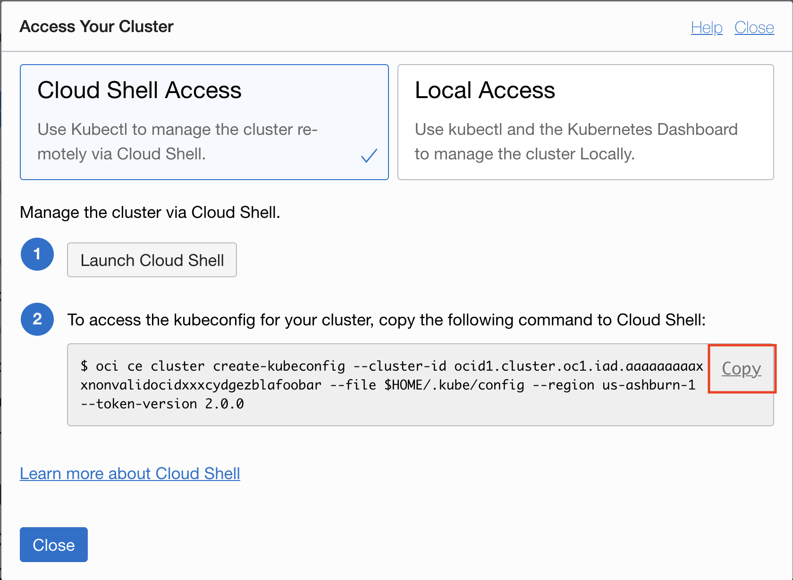
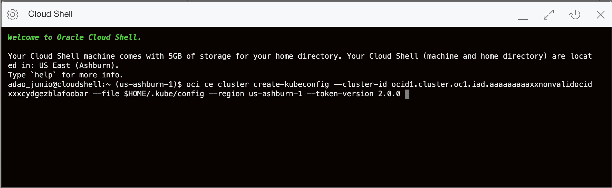

# Setup Cloud Environment

## Introduction

You will take on the persona of an Operations Engineer. You will initiate the Oracle cloud environment that will be used to create and deploy your microservices applications. This environment will be contained within a cloud Compartment, and communication within the Compartment will be via a Virtual Cloud Network (VCN). The Compartment and VCN will isolate and secure the overall environment. You will deploy the Oracle Cloud Infrastructure Container Engine for Kubernetes(OKE).

Estimated time: 20 minutes

### Objectives

- Log into OCI Tenancy.
- Setup Oracle Cloud Infrastructure (OCI) components.  

***We recommend that you create a notes page to write down all of the credentials you will need.***

### Prerequisites

- Your Oracle Cloud Trial Account
- You have already applied for and received your Oracle Cloud Free Tier Account.

*In addition to the workshop*, feel free to watch the walkthrough companion video by clicking on the following image:
[](youtube:wIoLDX7iWXo?start=0&end=60)

## **STEP 1:** Log into OCI Tenancy

   Log in to your OCI dashboard and retrieve information required to create resources.

1. From any browser go to oracle.com to access the Oracle Cloud.

    [https://www.oracle.com/](https://www.oracle.com/)

  

1. Click the icon in the upper right corner.  Click on **Sign in to Cloud**.

  

1. Enter your **Cloud Account Name** in the input field and click the **Next** button.  *NOTE: this is NOT your email. This is the name of your tenancy noted in the email you received during signup. Do NOT click the Sign-In button, this will take you to Single Sign-On, not the Oracle Cloud.*

  

1. Enter your username (this may be your email address) and password and click on **Sign In**.  

  

1. Once you log in you will see a page similar to the one below. Click on "Infrastructure Dashboard."

  

## **STEP 2:** Basic OCI Infrastructure Setup

1. Open the navigation menu. Under Governance and Administration, go to **Identity** and click **Compartments**. From this screen, you will see a list of compartments, click **Create Compartment**.

   

   

1. Enter the following:
      - Name: Enter **"AppDev".**
      - Description: Enter a description (required), for example: "AppDev compartment for the getting started tutorial". Avoid entering confidential information.
      - Parent Compartment: Select the compartment you want this compartment to reside in. Defaults to the root compartment (or tenancy).
      - Click **Create Compartment**.
      - Your compartment is displayed in the list.

  

1. Click the Cloud Shell icon in the Console header. Note that the OCI CLI running in the Cloud Shell will execute commands against the region selected in the Console's Region selection menu when the Cloud Shell was started.

  

  

Now you are ready to move on to Step 3.

## **STEP 3:** Create OKE Kubernetes Cluster

1. To create an OKE cluster, open up the hamburger button in the top-left corner of the Console and go to **Developer Services** >   **Kubernetes Clusters**.

   

1. Verify you are in the **AppDev** Compartment and click **Create Cluster**.

  

1. Choose Quick Create as it will create the new cluster along with the new network resources such as Virtual Cloud Network (VCN), Internet Gateway (IG), NAT Gateway (NAT), Regional Subnet for worker nodes, and a Regional Subnet for load balancers. Select **Launch Workflow**

   

1. Keep the name to **cluster1**, choose visibility type to **Public**, change number of nodes to **1** and click Next to review the cluster settings

   

1. Review the the Cluster Creation and then select **Create Cluster**.

   

1. Once launched it should usually take around 5-10 minutes for the cluster to be fully provisioned and display an Active.

## **STEP 4:** Setup OKE Kubernetes Cluster Cloud Shell Access

1. On the **Clusters** view, select the just created cluster and then click on the **Access Cluster** button.

   

1. Leave the **Cloud Shell Access** selected. If Cloud Shell is not already open, **Launch Cloud Shell**, copy the oci cli command to create the kubeconfig and paste on the Cloud Shell Terminal.

   

   

1. Check if you have access to your cluster with this command.

    ````shell
    <copy>
    kubectl get cs
    </copy>
    ````

You may now [proceed to the next lab](#next).

## Acknowledgements

- **Author** - Satyajeet Joshi
- **Contributors** -  Kamryn Vinson, Adao Junior
- **Last Updated By/Date** - Adao Junior, October 2020

## Need Help?

Please submit feedback or ask for help using our [LiveLabs Support Forum](https://community.oracle.com/tech/developers/categories/livelabsdiscussions). Please click the **Log In** button and login using your Oracle Account. Click the **Ask A Question** button to the left to start a *New Discussion* or *Ask a Question*.  Please include your workshop name and lab name.  You can also include screenshots and attach files.  Engage directly with the author of the workshop.

If you do not have an Oracle Account, click [here](https://profile.oracle.com/myprofile/account/create-account.jspx) to create one.   Please include the workshop name   and lab in your request.
