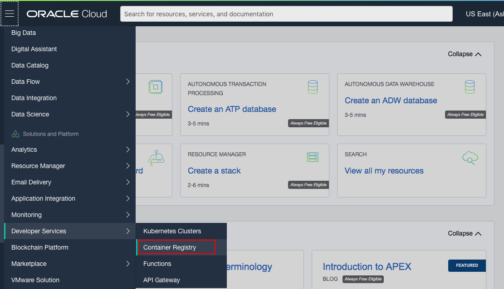
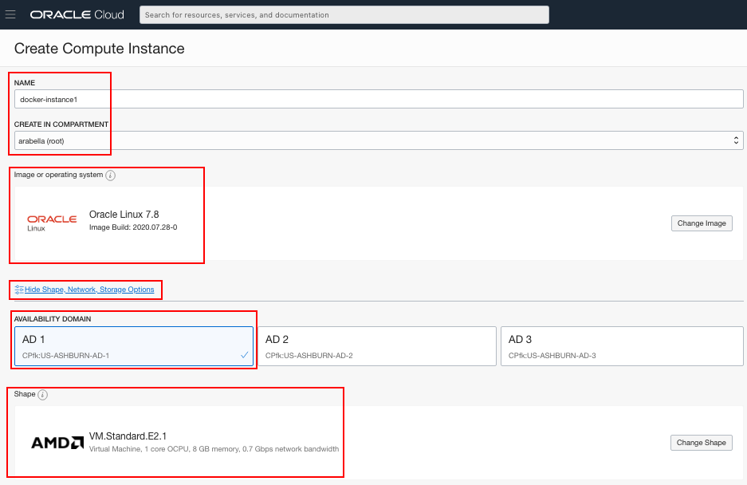
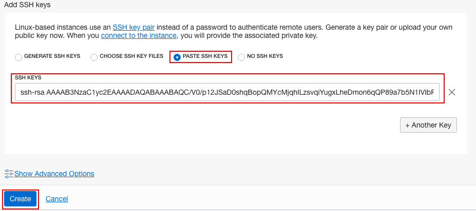
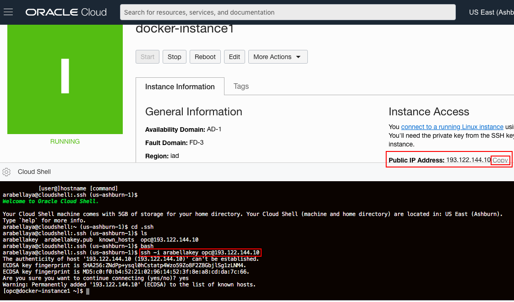
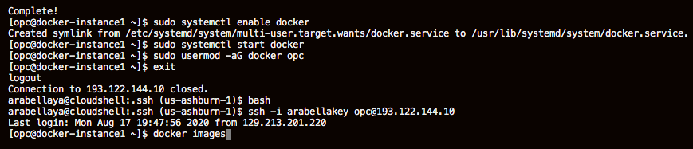
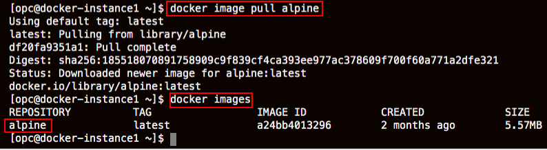
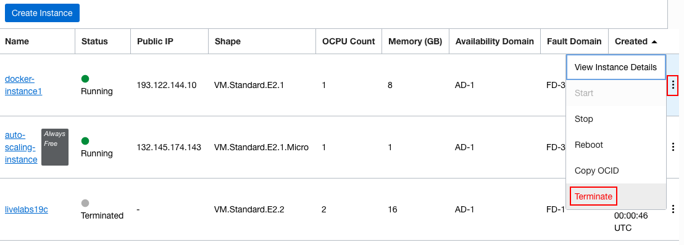
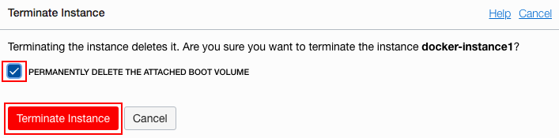
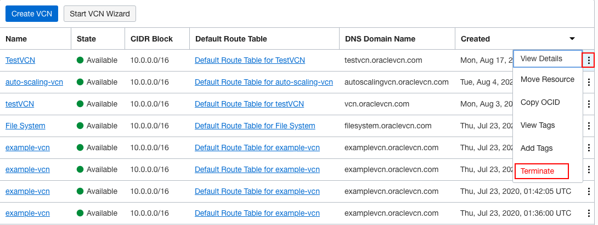

# Create Docker registry in OCI

## Introduction

Oracle Cloud Infrastructure Registry is an Oracle-managed registry that enables you to simplify your development to production workflow. Oracle Cloud Infrastructure Registry makes it easy for you as a developer to store, share, and manage development artifacts like Docker images. And the highly available and scalable architecture of Oracle Cloud Infrastructure ensures you can reliably deploy your applications.

## **Step 1**: Sign in to OCI Console and create VCN Auth token and Docker Registry

1. Sign in using your tenant name, user name and password. Use the login option under **Oracle Cloud Infrastructure**.
       


2. From the OCI Services menu, click **Virtual Cloud Networks** under Networking. Select the compartment assigned to you from the drop down menu on the left part of the screen under Networking and Click **Start VCN Wizard**.

    **NOTE:** Ensure the correct Compartment is selected under COMPARTMENT list

3. Click **VCN with Internet Connectivity** and click **Start VCN Wizard**

4. Fill out the dialog box:

    - **VCN NAME**: Provide a name
    - **COMPARTMENT**: Ensure your compartment is selected
    - **VCN CIDR BLOCK**: Provide a CIDR block (10.0.0.0/16)
    - **PUBLIC SUBNET CIDR BLOCK**: Provide a CIDR block (10.0.1.0/24)
    - **PRIVATE SUBNET CIDR BLOCK**: Provide a CIDR block (10.0.2.0/24)
    - Click **Next**

5. Verify all the information and  Click **Create**

6. This will create a VCN with following components.

    *VCN, Public subnet, Private subnet, Internet gateway (IG), NAT gateway (NAT), Service gateway (SG)*

7. Click **View Virtual Cloud Network** to display your VCN details.

    *We will now create an Auth Token. This token will be used to login to connect to OCI Docker registry from the Docker compute instance that will be created later on*

8. In OCI console Click the user icon (top right)  then **User settings**. Under Resources Click **Auth Token**, then **Generate Token**. In pop up window provide a description then Click **Generate Token**

     

     

9.  Click **Copy** and save the token in Notepad. **Do not close the window without saving the token as it can not be retrieved later**

     

10. From OCI Services menu, Click **Container Registry** under **Developer Services**

     

11. Click **Create Repository**. Provide Repository name (all Lowercase), Check **Public** for **Access**, Click **Create Repository**

12.  Once created, verify there are no existing images in the repository (as shown in OCI console)

     

*We now have a Docker registry and Auth token (to validate login to the registry). Next we will create a Public/Private key pair and then compute instance to test pushing and pulling images from the registry.*

## **Step 2**: Create compute instance install Docker and push images to registry

1. Go to your OCI console (homepage). From OCI services menu, under **Compute**, click **Instances**.

2. Click **Create Instance**. Fill out the dialog box:

    - **Name your instance**: Enter a name
      - **Choose an operating system or image source**: For the image, we recommend using the Latest Oracle Linux available.
      - **Availability Domain**: Select availability domain
      - **Instance Type**: Select Virtual Machine
      - **Instance Shape**: Select VM shape

    

    **Under Configure Networking**
      - **Virtual cloud network compartment**: Select your compartment
      - **Virtual cloud network**: Choose the VCN you created in Step 1
      - **Subnet Compartment:** Choose your compartment.
      - **Subnet:** Choose the Public Subnet under **Public Subnets**
      - **Use network security groups to control traffic** : Leave un-checked
      - **Assign a public IP address**: Check this option

     

      - **Boot Volume:** Leave the default
      - **Add SSH Keys:** Choose 'Paste SSH Keys' and paste the Public Key saved in Lab 1.

3. Click **Create**.

    **NOTE:** If 'Service limit' error is displayed choose a different shape from VM.Standard2.1, VM.Standard.E2.1, VM.Standard1.1, VM.Standard.B1.1  OR choose a different AD.

     

4.  Wait for Instance to be in **Running** state. In your Terminal, go to the folder where you created your SSH key:

    ```
    <copy>cd .ssh</copy>
    ```

5.  Enter **ls** and verify your SSH key file exists

6.  Enter command
    ```
    <copy>bash</copy>
    ```

    ```
    <copy>ssh -i <sshkeyname> opc@&lt;PUBLIC_IP_OF_COMPUTE></copy>
    ```

    **HINT:** If 'Permission denied error' is seen, ensure you are using '-i' in the ssh command. You MUST type the command, do NOT copy and paste ssh command

7.  Enter 'Yes' when prompted for security message

     

8.  Verify opc@<COMPUTE_INSTANCE_NAME> appears on the prompt. Next install Docker, Enter command:

    ```
    <copy>
    sudo yum install -y yum-utils device-mapper-persistent-data lvm2
    </copy>
    ```

     

9.  Enter command:

    ```
    <copy>
    sudo yum-config-manager --add-repo https://download.docker.com/linux/centos/docker-ce.repo
    </copy>
    ```

10. Enter command:

    ```
    <copy>
    sudo yum install docker-ce –y
    </copy>
    ```
    (Wait for ‘Complete’ message)

11. Enter command:

    ```
    <copy>
    sudo systemctl enable docker
    </copy>
    ```

12. Enter command:

    ```
    <copy>
    sudo systemctl start docker
    </copy>
    ```

13. Enter command: (To add user opc to Docker)

    ```
    <copy>
    sudo usermod -aG docker opc
    </copy>
    ```  

14. Docker is installed and user opc enabled to use Docker. Enter Command

    ```
    <copy>
    exit
    </copy>
    ```

    to logout of ssh session on compute instance and then ssh back in to the compute instance. Enter command **Docker images** and ensure no error is displayed

     

15. We will now pull a example image from Docker registry  to the compute instance. Enter Command:

    ```
    <copy>
    docker image pull alpine
    </copy>
    ```
    Verify image pull was successful, Enter Command
    ```
    <copy>
    docker images
    </copy>
    ```
    and verify alpine is present

     

16. Now we will push this image to Docker registry created in OCI. First login to Registry in OCI. Enter command:

    ```
    <copy>
    bash
    docker login <Region_Name_Code>.ocir.io
    </copy>
    ```

    **NOTE:** Region name code are, fra for Frankfurt, iad for Ashburn, lhr for London, phx for Phoenix.

    **HINT:** Your region is shown on top right corner of OCI console window

17. Provide the information:

    - Username:  Enter it in format Tenancy Name/User name (for example: TS-SPL-55/john_doe)
    - Password: Paste the Auth key saved earlier (Characters wont be visible)

     

18. Verify Login Succeeded message is displayed.

19. Next we will tag the image that we pulled from the web. Enter command:

    ```
    <copy>
    docker images
    </copy>
    ```
    and note down the image id of alpine. Enter command: (No Spaces)

    ```
    <copy>
    bash
    docker tag <image_id>  <Region_Name_Code>.ocir.io/<TenancyName>/<docker_registry_name>:<image_name>
    </copy>
    ```

20. Verify the tag was created, Enter command:

    ```
    <copy>
    docker images
    </copy>
    ```
    and verify version<x.y>.test is present.

    **NOTE:** In below example (version4.0.test) x is 4 and y is 0

      - Image\_Id is **3fd9065eaf02**
      - Region\_Name\_Code is **iad**
      - Tenancy\_Name is **us\_training**
      - docker\_registry\_name is **docker-test-image**
      - Image\_name is **version4.0.test**  

     

21. We will now push the image to docker registry in OCI. Enter command:

    ```
    <copy>
    docker push <Region_Name_Code>.ocir.io/<Tenancy_Name>/<docker_registry_name>:<image_name>* (No Spaces)
    </copy>
    ```
    **NOTE:** In below example:

     - Region\_Name\_Code is **iad**
     - Tenancy\_Name is **us\_training**
     - docker\_registry\_name is **docker-test-image**
     - Image\_name is **version4.0.test**  

     

22. Switch to OCI window and navigate to your registry. Newly pushed image should be visible.

    **HINT:** Refresh the browser window if image is not displayed

23. Switch to compute instance ssh window. Enter command:

    ```
    <copy>
    docker pull <Region_Name_Code>.ocir.io/<Tenancy_Name>/<docker_registry_name>:<image_name>*  (No Spaces)  
    </copy>  
    ```

24. Verify the pull command was successful

     

    **HINT:** We are pulling the same image that we just pushed.

*We now have a working Docker registry and can successfully push and pull images to/from it.*

## **Step 3:** Delete the resources

1. Switch to  OCI console window

2. If your Compute instance is not displayed, From OCI services menu Click **Instances** under **Compute**.

3. Locate first compute instance, Click Action icon and then **Terminate**.

     

4. Make sure Permanently delete the attached Boot Volume is checked, Click Terminate Instance. Wait for instance to fully Terminate

     


5. From OCI services menu Click **Virtual Cloud Networks** under Networking, list of all VCNs will
appear.

6. Locate your VCN , Click Action icon and then **Terminate**. Click **Terminate All** in the Confirmation window. Click **Close** once VCN is deleted

     

7. Navigate to your registry (**Container Registry** under **Developer Services**), Click Registry Name, Under **Actions** Click **Delete Repository**, Click **Delete** in confirmation window.

     


## Acknowledgements
*Congratulations! You have successfully completed the lab.*

- **Author** - Flavio Pereira, Larry Beausoleil
- **Adapted by** -  Yaisah Granillo, Cloud Solution Engineer
- **Last Updated By/Date** - Kamryn Vinson, August 2020

## See an issue?
Please submit feedback using this [form](https://apexapps.oracle.com/pls/apex/f?p=133:1:::::P1_FEEDBACK:1). Please include the *workshop name*, *lab* and *step* in your request.  If you don't see the workshop name listed, please enter it manually. If you would like for us to follow up with you, enter your email in the *Feedback Comments* section.
