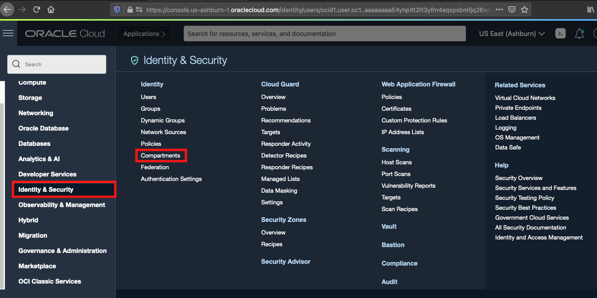
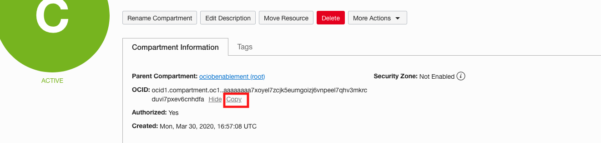
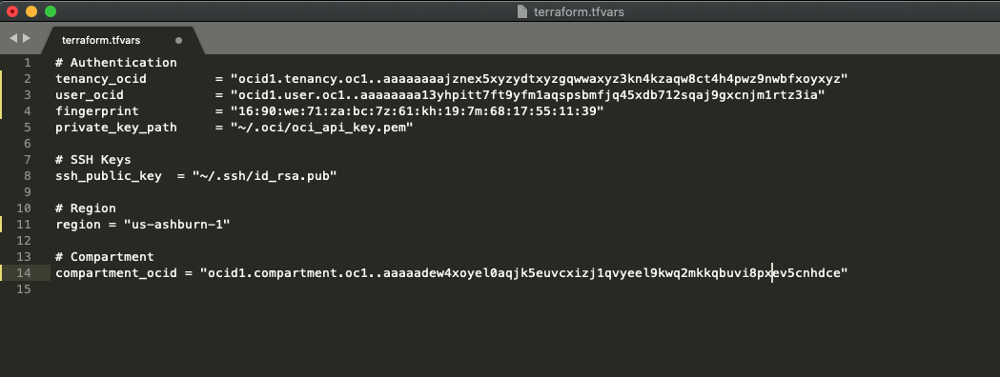
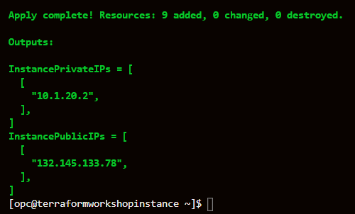
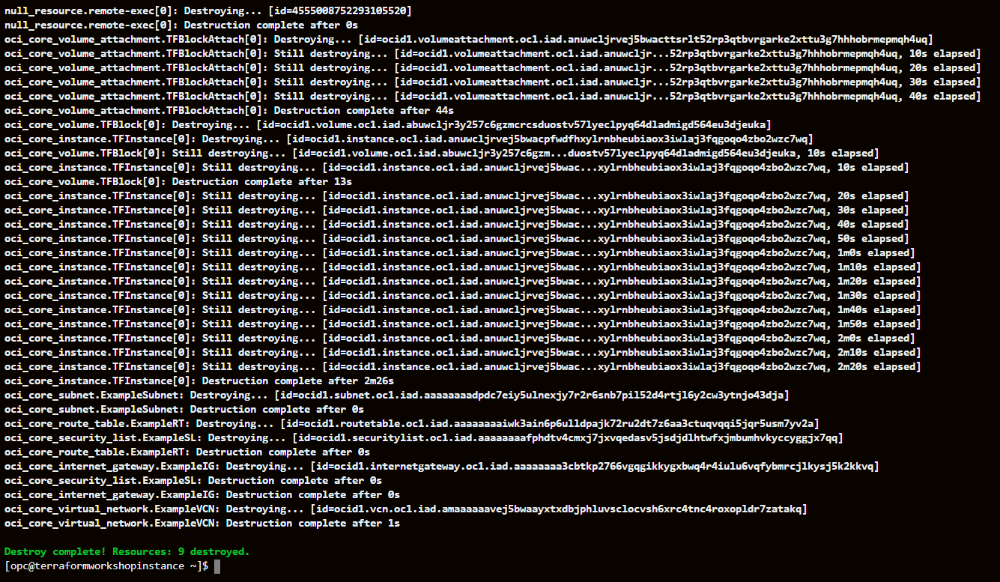

# Deploying Infrastructure Using Terraform

## Introduction
In this lab we will use pre-configured terraform scripts to deploy VCN, Compute Instance, Block storage and attach the block storage to compute instance without using OCI console. We will then delete all these infrastructure resources.

Estimated Time: 30-45 minutes

**Key points:**
- We recommend using Chrome or Edge as the browser.
- You will be asked to record some information during this workshop. It is recommended that you paste the information into a text file when prompted.

### Pre-Requisites

1. [OCI Training](https://cloud.oracle.com/en_US/iaas/training)
2. [Familiarity with OCI console](https://docs.us-phoenix-1.oraclecloud.com/Content/GSG/Concepts/console.htm)
3. [Overview of Networking](https://docs.us-phoenix-1.oraclecloud.com/Content/Network/Concepts/overview.htm)
4. [Familiarity with Compartment](https://docs.us-phoenix-1.oraclecloud.com/Content/GSG/Concepts/concepts.htm)
5. [Connecting to a compute instance](https://docs.us-phoenix-1.oraclecloud.com/Content/Compute/Tasks/accessinginstance.htm)

## **Step 1**: Create a Virtual Cloud Network

1. From the OCI Services menu, click **Virtual Cloud Networks** under **Networking**. Select the compartment assigned to you from the drop down menu on the left side of the screen(you may need to scroll down to see the dropdown) and Click **Start VCN Wizard**.

    

    *NOTE: Ensure the correct Compartment is selected under COMPARTMENT list*

2. Choose **VCN with Internet Connectivity** and click **Start VCN Wizard**.

    

3. Fill out the dialog box:

    - **VCN Name**: Provide a name
    - **Compartment**: Ensure your compartment is selected
    - **VCN CIDR Block**: Provide a CIDR block (10.0.0.0/16)
    - **Public Subnet CIDR Block**: Provide a CIDR block (10.0.1.0/24)
    - **Private Subnet CIDR Block**: Provide a CIDR block (10.0.2.0/24)
    - Click **Next**

    

    

4. Verify all the information and  Click **Create**.

    

5. This will create a VCN with the following components.

    * VCN
    * Public subnet
    * Private subnet
    * Internet gateway (IG)
    * NAT gateway (NAT)
    * Service gateway (SG)

6. Click **View Virtual Cloud Network** to display your VCN details.

    

    

## **Step 2**: Create and Connect to a Compute Instances
1. Switch to the OCI console. From OCI services menu, Click **Instances** under **Compute**.

    

2. Click **Create Instance**. Enter a name for your workshop and the compartment you used earlier to create your VCN. Select **Show Shape, Network and Storage Options**.

    

    

    Leave **Image or Operating System** and **Availability Domain** as the default values.

    Scroll down to **Shape** and click **Change Shape**.

    

    Select **Virtual Machine** and **VM.Standar2.1**. Click **Select Shape**.

    

    Scroll down to the section labeled **Configure Networking** select the following.

    - **Virtual Cloud Network Compartment**: Choose the compartment you created your VCN in
    - **Virtual Cloud Network**: Choose the VCN you created in step 1
    - **Subnet Compartment:** Choose the compartment you created your VCN in
    - **Subnet:** Choose the Public Subnet under **Public Subnets**(it should be named `Public Subnet-NameOfVCN`)
    - **Use Network Security Groups to Control Traffic** : Leave un-checked
    - **Assign a Public IP Address**: Check this option

    

    - **Boot Volume:** Leave the default
    - **Add SSH Keys:** Choose 'Paste SSH Keys' and paste the Public Key you created in Cloud Shell earlier.

    *Ensure when you are pasting that you paste one line*

    

3. Click **Create**.

    *NOTE: If 'Service limit' error is displayed choose a different shape from VM.Standard2.1, VM.Standard.E2.1, VM.Standard1.1, VM.Standard.B1.1  OR choose a different AD.*

4.  Wait for the instance to have the **Running** status. Note down the Public IP of the instance. You will need this later.

    

5.  Launch the Cloud Shell if it is not running.  When running, enter the command below.

    ```
    <copy>cd .ssh</copy>
    ```
6.  Enter **ls** and verify your key file exists.

    ```
    <copy>ls</copy>
    ```

7.  To ssh into the compute instance enter the following command replacing SSH-KEY-NAME with the name of your ssh key and replacing PUBLIC-IP-OF-COMPUTE1 with the IP address of the compute instance you created.

    *Note: Your SSH-KEY-NAME name should NOT end in .pub*

    ```
    <copy>
    ssh -i SSH-KEY-NAME opc@PUBLIC-IP-OF-COMPUTE-1
    </copy>
    ```
    *Note: User name is "opc".*

    *Note: If a "Permission denied error" is seen, ensure you are using '-i' in the ssh command. Also make sure that you correctly copied the name of your ssh key and the public IP of your compute instance.*

8.  Enter 'Yes' when prompted for security message.

    

9. Verify opc@`<COMPUTE_INSTANCE_NAME>` appears on the prompt.

    

## **Step 3**: Configure OCI CLI
1. Install OCI CLI on the compute instance by entering the following command. When prompted for the install directory press enter(leave default). When prompted for the oci executable directory press enter(leave default). When prompted for the OCI script directory press enter(leave default). When prompted to install optional packages press enter(leave default). When prompted to update your $PATH enter `Y`.

    ```
    <copy>
    bash -c "$(curl –L https://raw.githubusercontent.com/oracle/oci-cli/master/scripts/install/install.sh)"
    </copy>
    ```

    

    

2. Check oci CLI installed version, Enter command:

    ```
    <copy>
    oci -v
    </copy>
    ```
    **NOTE:** Version should be minimum 2.5.X (3/23/2019)

    

3. Next you will need to gather some information so that you can configure oci. First you will need your user OCID. Go to your profile page by clicking the human icon in the top right and then your username. Then click the copy button to copy your user OCID. Record your OCID in a text file because you will need it later.

    

4. Next you will need to get your tenancy OCID. Click the human icon in the top right and then your tenancy. Then click the copy button to copy your tenancy OCID. Record your tenancy OCID because you will need it later.

    

5. Next you will need to get your region identifier. Click your region and then click manage regions. Then copy your region identifier and record it.

    

6. Next we will configure OCI CLI. Enter the following command.

    ```
    <copy>
    oci setup config
    </copy>
    ```

7. When prompted for a location for your config press enter to choose the default location. When prompted for your user OCID, tenancy OCID, and region ID enter the information the appropriate information. When asked if you want to generate a new RSA key pair enter `Y`. For all other prompts press enter to accept the default.

    

8. The `oci setup config` command also generated an API key. We will need to upload this API key into our OCI account for authentication of API calls.

    ```
    <copy>
    cat ~/.oci/oci_api_key_public.pem
    </copy>
    ```

9. Highlight and copy the content from the oracle cloud shell. Click the human icon followed by your user name. Then scroll down and click **API Keys**. In your user details page click **Add Public Key**. In the dialog box paste the public key content and click **Add**.

    

    

## **Step 4**: Install and Verify Terraform Functionality

1. Next, download the script to install Terraform. Enter the following command into the cloud shell.

    ```
    <copy>
    sudo curl https://objectstorage.us-ashburn-1.oraclecloud.com/p/biiTfGyz5f3atH8iqX3hX-mLrwyVygwD366yVWZun3Y/n/c4u03/b/oci-library/o/tf_setup.sh -o tf_setup.sh
    </copy>
    ```

    This will download a script file called **tf_setup.sh**.

    

2. Next modify the permission on the script and execute it, Enter Commands:

    ```
    <copy>
    sudo chmod 755 tf_setup.sh
    </copy>
    ```

    ```
    <copy>
    ./tf_setup.sh
    </copy>
    ```

    Press **Enter** when prompted

    

3. The script will install needed packages and create a new directory called **tflab**. We will need to modify some environment variables in the file. Enter the following command.

    ```
    <copy>
    cd tflab
    </copy>
    ```

4. tf_setup.sh creates a example .tf called **tftest.tf**, this file needs to be removed as we will download another .tf file to create infrastructure. Enter the following command.

    ```
    <copy>
    rm tftest.tf
    </copy>
    ```

5. Now edit the env-variables file. We will update 2 variables. Enter the following command.

    ```
    <copy>
    nano env-vars
    </copy>
    ```

    *NOTE: You can use another editor such as vi as well.*

6. Update the TF\_VAR\_user\_ocid variable with your user OCID you saved earlier.

    

7. Next Update the TF\_VAR\_Compartment\_ocid variable. Switch to the OCI console window, Click **Compartment** under **Identity**. Locate your compartment name and click it. In the compartment details page, click **copy** to copy the OCID.

    Paste this OCID in **env-vars** file.

    

    

8. After updating the env-vars file the content will look like the image below.

    

    After copying both your user OCID and compartment OCID you now need to close nano. Close nano with the following key commands `Ctrl+X`, `Shift+Y`, `Enter`.

9. Save the file and then source it. Enter the following command.

    ```
    <copy>
    source env-vars
    </copy>
    ```

10. The environment is now set. Next we will download a terraform file (.tf) file that will be used to create VCN, Compute instance, block volume and attach block volume to compute instance. We will download this file in **/home/opc** directory. Enter the following command.

    ```
    <copy>
    cd /home/opc
    </copy>
    ```

    Enter the following command.

    ```
    <copy>
    sudo curl https://objectstorage.us-ashburn-1.oraclecloud.com/p/I4me2s0NE9z_kJprisLSUFyyekXXSGldT1wGFPQIiok/n/c4u03/b/oci-library/o/compute.tf -o compute.tf
    </copy>
    ```

11. Now initialize terraform with the following command.

    ```
    <copy>
    terraform init
    </copy>
    ```

    Verify successful initialization.

    

12. To see the deployment plan enter the following command.

    ```
    <copy>
    terraform plan
    </copy>
    ```

    This will provide details on what will be configured in OCI.

13. Finally apply the plan to create the infrastructure. Enter the following command.

    ```
    <copy>
    terraform apply
    </copy>
    ```

    *NOTE: You must type yes when prompted.*

    

14. This script will take some time to execute. You can switch to the OCI console and observe the creation of the VCN, Compute instance, Block Volume and attachment of block volume to the compute instance.

15. Finally, destroy the infrastructure that we created. Enter the following command.

    ```
    <copy>
    terraform destroy
    </copy>
    ```

    *NOTE: You must type yes when prompted.*

    You can switch to the OCI console and observe deletion of VCN, Compute instance, Block Volume.

    

## **Step 5**: Delete the Resources
1. From the OCI services menu click **Instances** under **Compute**.

    

2. Locate the compute instance you created, Click the action icon and then click **Terminate**.

    

3. Make sure **Permanently Delete the Attached Boot Volume** is checked. Click **Terminate Instance**. Wait for the instance to fully terminate.

    

4. From the OCI services menu click **Virtual Cloud Networks** under **Networking**, the list of all VCNs will appear.

    

5. Locate your VCN, click action icon and then click **Terminate**. Click **Terminate All** in the confirmation window. Click **Close** once the VCN is deleted.

    

    

    *Congratulations! You have successfully completed the lab.*

## Acknowledgements

- **Author** - Flavio Pereira, Larry Beausoleil
- **Adapted by** -  Yaisah Granillo, Cloud Solution Engineer
- **Contributors** - Jaden McElvey, Technical Lead - Oracle LiveLabs Intern
- **Last Updated By/Date** - Kamryn Vinson, August 2020

## See an issue?
Please submit feedback using this [form](https://apexapps.oracle.com/pls/apex/f?p=133:1:::::P1_FEEDBACK:1). Please include the *workshop name*, *lab* and *step* in your request.  If you don't see the workshop name listed, please enter it manually. If you would like us to follow up with you, enter your email in the *Feedback Comments* section.
