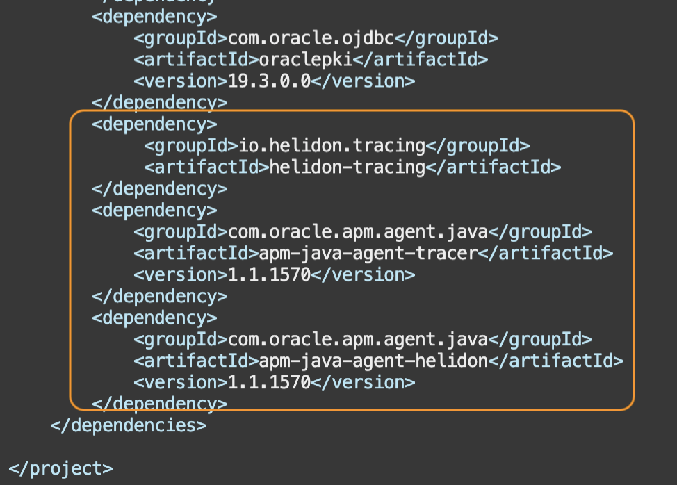
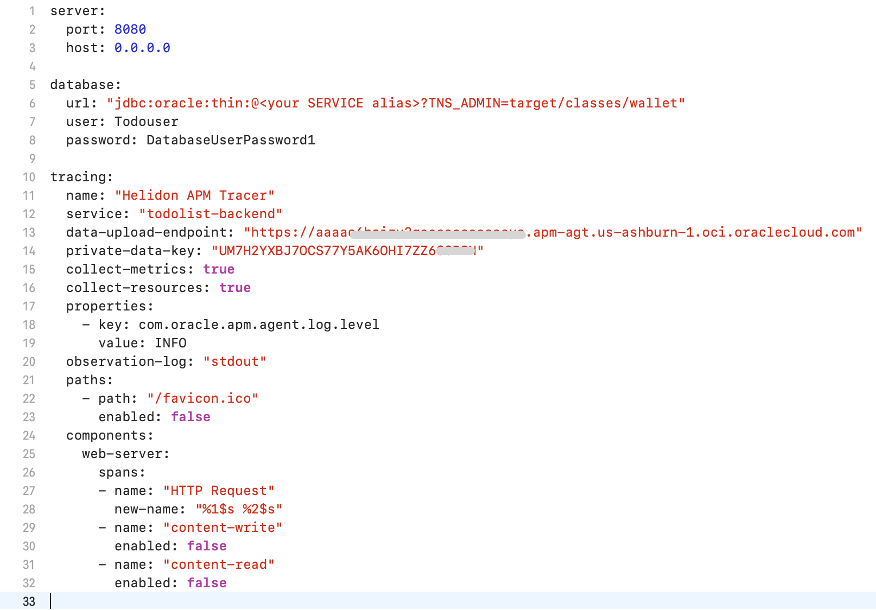
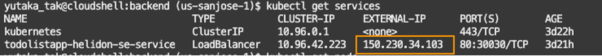
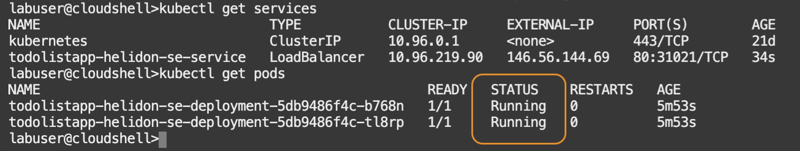
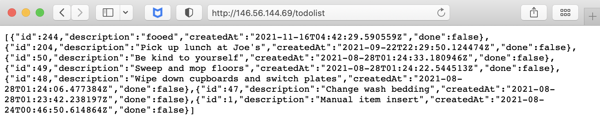
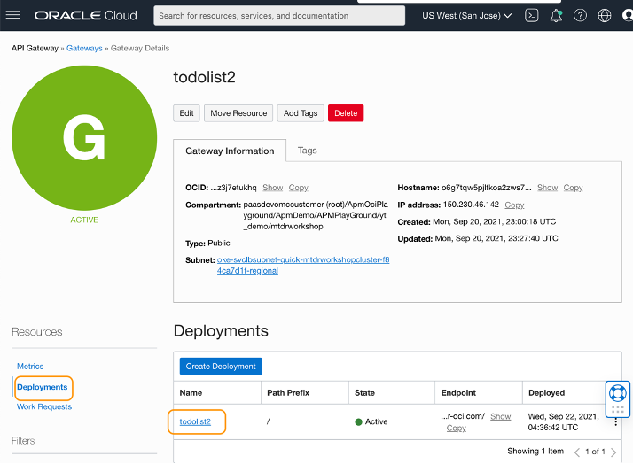
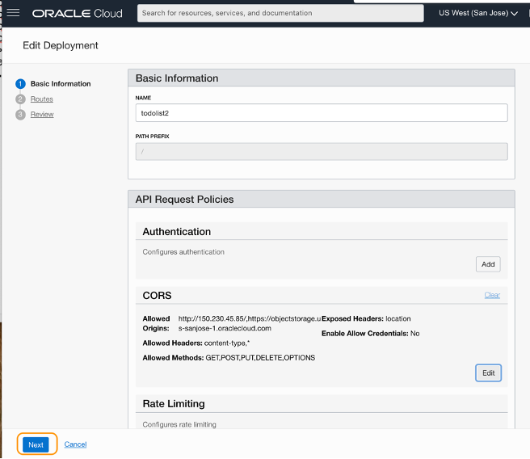
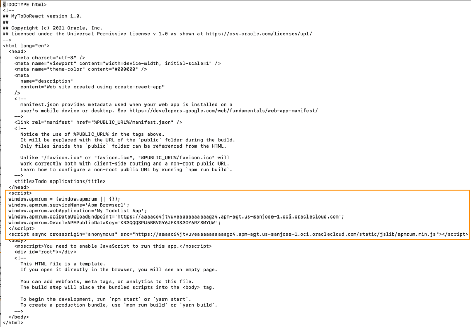
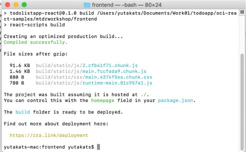

# Configure APM Tracer for Maven, Helidon, Browser, and add custom spans

## Introduction

In this tutorial, you will configure APM data sources on the application to gather data and upload to APM for monitoring. You will enable the APM Tracer in Helidon, configure the APM Browser agent, add custom spans to Java files, modify the Gateway to add APM headers, and finally rebuild the application.

Estimated time: 20 minutes

### Objectives

* Modify configuration and java files to enable the APM Tracer
*	Add custom spans to Java files to capture SQL executions
*	Rebuild the application with APM Tracer configurations, and deploy it on Kubernetes
*	Insert JavaScript to a html file to enable the APM Browser Agent
*	Launch the application in a web browser, perform transactions to generate traffic


### Prerequisites

* This lab requires completion of lab 1 of this workshop
* This Lab also assumes you have completed the tutorials in the [React+Java+ADB = Native Cloud App](https://apexapps.oracle.com/pls/apex/dbpm/r/livelabs/workshop-attendee-2?p210_workshop_id=814&p210_type=1&session=10648029398196).

## Task 1: Launch Cloud Shell
1. Launch the Oracle Cloud Shell <br/>
  The Oracle Cloud Shell is a small virtual machine running a Bash shell that you access through the Oracle Cloud Console. It comes with a pre-authenticate Command Line Interface (CLI) pre-installed and configured so you can immediately start working in your tenancy without spending time on its installation and configuration.

	Click the Cloud Shell icon in the top-right corner of the Console.
	

## Task 2: Modify pom.xml file in the application

1.	Change to ***mtdrworkshop/backend*** directory

	``` bash
	<copy>
	cd ~/mtdrworkshop/backend
	</copy>
	```
2.	Open the file with an editor tool (e.g., vi editor)
	``` bash
	<copy>
	vi pom.xml
	</copy>
	```

	  >NOTE: If you are using the vi editor, type ***i*** to enter Insert mode, and make the text editable. Use allow keys to navigate the text and make changes to where you set the cursor. To save a file, press Esc key, then type ***:wq*** to write and quit the file. If you do not wish a change, press Esc then type ***:q!*** to discard your changes. Please refer to the editor references for more usages or how to use other editors.

4. Add the following repositories blocks between the ***properties*** and ***build*** sections:

			<repositories>
				<repository>
				  <id>oci</id>
					<name>OCI Object Store</name>
					<url>https://objectstorage.us-ashburn-1.oraclecloud.com/n/idhph4hmky92/b/prod-agent-binaries/o</url>
					</repository>
			</repositories>

	

5.	At the end of the dependencies section, find a line ***&lt;/dependencies&gt;*** and add the followings before that line:

			<dependency>
			     <groupId>io.helidon.tracing</groupId>
			         <artifactId>helidon-tracing</artifactId>
			 </dependency>
			<dependency>
			    <groupId>com.oracle.apm.agent.java</groupId>
			    <artifactId>apm-java-agent-tracer</artifactId>
			    <version>[1.0.1389,)</version>
			</dependency>
			<dependency>
			    <groupId>com.oracle.apm.agent.java</groupId>
			    <artifactId>apm-java-agent-helidon</artifactId>
			    <version>[1.0.1389,)</version>
			</dependency>

	

## Task 3: Modify application.yaml file

1.	Change to ***backend/src/target/classes*** directory, then open the ***application.yaml*** file with an editor tool.

	``` bash
	<copy>
	vi ~/mtdrworkshop/backend/target/classes/application.yaml
	</copy>
	```
	Add the following properties to the file. Replace ***&lt;data upload endpoint&gt;*** and ***&lt;private data key&gt;*** with the values collected from the OCI console in the earlier steps.


		tracing:
		  name: "Helidon APM Tracer"
		  service: "todolist-backend"
		  data-upload-endpoint: <data upload endpoint of your OCI domain>
		  private-data-key: <private data key of your OCI domain>
		  collect-metrics: true
		  collect-resources: true
		  properties:
		    - key: com.oracle.apm.agent.log.level
		      value: INFO
			observation-log: "stdout"
		  paths:
		    - path: "/favicon.ico"
		      enabled: false
		  components:
		    web-server:
		      spans:
		        - name: "HTTP Request"
		          new-name: "%1$s %2$s"
		        - name: "content-write"
		          enabled: false
		        - name: "content-read"
		          enabled: false


	>Suggested Tips:
	* Copy the above text and paste it into a text file, replace the endpoint and the private key, then copy the modified text into the yaml file.
	* Make sure to keep the syntax of 2 space indentation.
	* Refer to the screenshot image below to see how it should look like after the file is modified.

	


4.	Copy the edited yaml file to ***/backend/src/main/resources/*** directory.
	``` bash
	<copy>
	cp ~/mtdrworkshop/backend/target/classes/application.yaml ~/mtdrworkshop/backend/src/main/resources/application.yaml
	</copy>
	```

> NOTE: For more details, see [Use APM Tracer for Helidon](https://docs.oracle.com/en-us/iaas/application-performance-monitoring/doc/use-apm-tracer-helidon.html).  

## Task 4: Modify Main.java file

1.	Open ***Main.java*** with any editor.
	``` bash
  <copy>
  vi ~/mtdrworkshop/backend/src/main/java/com/oracle/todoapp/Main.java
  </copy>
  ```

2. Configure the tracer with the application. (Refer to the sample image in the next step)

 a.	Add the import statements below.

	``` bash
	<copy>
	import io.helidon.webserver.WebTracingConfig;		
	import io.helidon.tracing.TracerBuilder;
	</copy>
	```

 b.	 In the ***main*** method, find a line ***.addMediaSupport(JsonpSupport.create())***. Add the following above that line:
	``` bash
	<copy>
	.tracer(TracerBuilder.create(config.get("tracing")).build())
	</copy>
	```
 c.	In the ***createRouting*** method, find a line ***.register("/todolist", corsSupport, todoListAppService)***. Add the following above that line:
	``` bash
	<copy>
	.register(WebTracingConfig.create(config.get("tracing")))
	</copy>
	```
3.	Refer to the below screenshots of the ***Main.java*** where the changes are highlighted in blue.

	

	

## Task 5: Add custom spans to the Service implementation

Next, you will add custom spans to Java files to trace the workloads of the SQL executions in the application. The application has 4 methods that execute SQLs. They are:

*	List All (select),
*	Get by ID (select),
*	Update and
*	Delete.

In this lab, we are adding custom spans to the first two, ***List All*** and ***Get by ID***.

1. Open ***TodoListAppService.java*** with any editor.

	 ``` bash
	 <copy>
	 vi ~/mtdrworkshop/backend/src/main/java/com/oracle/todoapp/TodoListAppService.java
	 </copy>
	 ```
   	>NOTE: For how to use the vi editor, refer to the Task2, step 2 in this Lab.

	 a. Add the import statement below.

	 ``` bash
	 <copy>
	 import io.opentracing.Scope;
	 import io.opentracing.Span;
	 import io.opentracing.SpanContext;
	 import io.opentracing.util.GlobalTracer;
	 </copy>
	 ```

	b. Replace the ***getAllTodos*** method with the following:
	 ``` bash
	 <copy>
	 private void getAllTodos(ServerRequest serverRequest, ServerResponse serverResponse) {
	    LOGGER.fine("getAllTodos");
	  SpanContext parentContext = serverRequest.spanContext().get();
	  Span span = GlobalTracer.get().buildSpan("getAllTodos").asChildOf(parentContext).start();
	  Scope scope = GlobalTracer.get().activateSpan(span);
	    try {
	    serverResponse.send(TodoItem.toJsonArray(this.todoItems.all()));
	  }finally {
	    span.finish();
	    scope.close();
	  }
	}

	 </copy>
	 ```
	c. Replace the ***getTodoById*** method with the following:

	``` bash
	<copy>
	private void getTodoById(ServerRequest serverRequest, ServerResponse serverResponse) {
	    LOGGER.fine("getTodoById");
	  SpanContext parentContext = serverRequest.spanContext().get();
	  Span span = GlobalTracer.get().buildSpan("getTodoById").asChildOf(parentContext).start();
	  Scope scope = GlobalTracer.get().activateSpan(span);
	    String id = serverRequest.path().param("id");
	    try {
	      TodoItem todo = this.todoItems.getById(id);
	      if (todo == null) {
	        span.setTag("error", true);
	        span.log("todo  identified by " + id + " wasn't found");
	        serverRequest.next(new TodoItemNotFoundException(id));
	      } else {
	        serverResponse.status(200).send(TodoItem.toJsonObject(todo));
	      }
	    }finally {
	      span.finish();
	      scope.close();
	    }
	}
	</copy>
	```
Refer to the screenshots of the ***TodoListAppService.java*** where the changes are highlighted in blue. Observe that custom spans are added to the methods.

	
	
	

2. Open ***TodoItemStorage.java*** with any editor.

	``` bash
	<copy>
	vi ~/mtdrworkshop/backend/src/main/java/com/oracle/todoapp/TodoItemStorage.java
	</copy>
	```

	a. Add the import statements below.

	``` bash
	<copy>
	import io.opentracing.Span;
	import io.opentracing.util.GlobalTracer;
	</copy>
	```

	b. Replace the ***List &lt;TodoItem&gt;all*** method with the following:
	``` bash
	<copy>
	List<TodoItem> all() {
	LOGGER.fine("all");
	ArrayList<TodoItem> list = new ArrayList<TodoItem>();
	Span span = GlobalTracer.get().buildSpan("all_sql").start();

	try (
		Connection conn = pool.getConnection();
		PreparedStatement pstmt = conn.prepareStatement("SELECT id, description, creation_ts, done FROM todoitem ORDER BY creation_ts DESC");
		ResultSet rs = pstmt.executeQuery();
	) {
		addConnectionInfo(span, "SELECT id, description, creation_ts, done FROM todoitem ORDER BY creation_ts DESC");
		while(rs.next()) {
			TodoItem item = TodoItem.of(
				rs.getInt("id"),
				rs.getString("description"),
				rs.getObject("creation_ts", OffsetDateTime.class),
				rs.getBoolean("done"));
			list.add(item);
		}
	  } catch (SQLException e) {
		  LOGGER.log(Level.SEVERE, e, ()->"in all()");
		  addErrorDetails(span, e);
	    } finally {
	    span.finish();
      }
	    LOGGER.fine("all() returns:");
	    LOGGER.fine(()->list.toString());
	   return list;
    }

	</copy>
	```

	c. Replace the ***TodoItem GetById (int id)*** method with the following:
	``` bash
	<copy>
	TodoItem getById(int id) {
	LOGGER.fine(()->"getById("+id+")");
	Span span = GlobalTracer.get().buildSpan("getById_sql").start();
	span.log("id="+id);
	TodoItem ret = null;
	try (
			Connection conn = pool.getConnection();
			PreparedStatement pstmt = conn.prepareStatement("SELECT id, description, creation_ts, done FROM todoitem WHERE id=?");
			){
		pstmt.setInt(1, id);
		addConnectionInfo(span, "SELECT id, description, creation_ts, done FROM todoitem WHERE id=?");
		try (ResultSet rs = pstmt.executeQuery();) {
			if(rs.next()) {
				ret = TodoItem.of(rs.getInt("id"), rs.getString("description"),
					rs.getObject("creation_ts", OffsetDateTime.class), rs.getBoolean("done"));
			 }
		 }
		} catch (SQLException e) {
			LOGGER.log(Level.SEVERE, e, ()->"in getById("+id+")");
			addErrorDetails(span, e);
		}
		if(ret != null){
			LOGGER.fine(()->"getById("+id+") returns:");
			LOGGER.fine(ret.toString());
		} else {
			LOGGER.fine(()->"getById("+id+") returns: null");
		}
		span.finish();
		return ret;
  }

	</copy>
	```

	d. Add the following methods:
	``` bash
	<copy>
	private void addConnectionInfo(Span span, String sql) {
  	span.setTag("DbStatment", sql);
		span.setTag("DbConnUrl", pool.getURL());
		span.setTag("DbType", "sql");
		span.setTag("DbUser", pool.getUser());
	}
	private void addErrorDetails(Span span, SQLException e) {
		span.setTag("error", true);
		span.setTag("ErrorMessage", e.getMessage());
		span.setTag("DbOracleErrorCode", e.getErrorCode());
	}
	</copy>
	```
Refer to the below screenshots of the ***TodoItemStorage.java*** where the changes are highlighted in blue.

	
	
	
	

## Task 6: Rebuild application with the APM Tracer configuration

1. Ensure the Java version in the path is 11.0.7.
	``` bash
	<copy>
	java -version
	</copy>
	```

	if you completed the [React+Java+ADB = Native Cloud App](https://apexapps.oracle.com/pls/apex/dbpm/r/livelabs/workshop-attendee-2?p210_workshop_id=814&p210_type=1&session=10648029398196) Workshop in a different Cloud Shell session, you will need to reset the JAVA_HOME environment variable, by running run the followings.

	``` bash
	<copy>
	export JAVA_HOME=~/graalvm-ce-java11-20.1.0
	export PATH="$JAVA_HOME/bin:$PATH"
	</copy>
	```

2. From the backend directory, run ***undeploy.sh*** script to delete the service and the pods.

	``` bash
	<copy>
	cd ~/mtdrworkshop/backend; ./undeploy.sh
	</copy>
	```
3.	Run ***build.sh*** script to build and push the microservices images into the repository.
	``` bash
	<copy>
	cd  ~/mtdrworkshop/backend; ./build.sh
	</copy>
	```

## Task 7: Verify container registry from the root compartment

1.	In the OCI console, click the menu from the top-left corner and open **Developer Services** > **Container Registry**.
2.	From the tree view, select the repository you created in the Native Cloud App Workshop.
3.	Ensure the access is Public. if the access is Private, change it to “Public” by **Actions** > **Change** to Public


	

## Task 8: Deploy on Kubernetes and Check the status
1.	From the ***mtdrworkshop/backend*** directory, run the ***deploy.sh*** script.

	``` bash
	<copy>
	cd  ~/mtdrworkshop/backend; ./deploy.sh
	</copy>
	```

2.	Run kubectl command to check the status of the Kubernetes services. This command returns the service of the application with a load balancer exposed through an external API.
	``` bash
	<copy>
	kubectl get services
	</copy>
	```

	Copy the load balancer’s external IP from the output and save it to a text file. You will use this value later in the steps to start the application.

	


3.	Run the kubectl get pods command to verify the status of the pods.
	``` bash
	<copy>
	kubectl get pods
	</copy>
	```
	Make sure the pods are in the Running state.

	

4. You can test the application with a browser on your laptop. Enter the URL: ***http://&lt;LB external-IP&gt;/todolist*** in the browwer, replacing the IP with the load balancer’s external IP copied in the previous step.

	


## Task 9: Add APM headers to the API Gateway

To run the application from the Gateway, you will need to add headers, which are required by APM, to the CORS policy in the API Gateway that you setup in the [React+Java+ADB = Native Cloud App](https://apexapps.oracle.com/pls/apex/dbpm/r/livelabs/workshop-attendee-2?p210_workshop_id=814&p210_type=1&session=10648029398196) Workshop. APM Tracer uses several different headers. In this lab, to simplify the steps, we will add an asterisk to accept all headers in the CORS policy.

1. From the OCI menu, select **Developer Services** > **Gateways**.

	

2. Select the gateway you created in the Native Cloud App Workshop.

	

3. Click  **Deployments** under **Resources**, then click the name of the deployment you created in the Native Cloud App Workshop. In the example image, the deployment name is “todolist2”.

	

4. Click **Edit**.

	

5. Under **API Request Policies**, scroll down to find **CORS** section, then click **Edit**.

	

6. Under the **Headers**, click **+ Another Header** to create a new entry field. Enter an asterisk "*****" to the field, then click Apply **Changes**.

	

7. Click **Next**.

	

8. Click **Next**.

	

9. Click **Save Changes**.

	

10. Click **Copy** next to the Endpoint. This will copy the endpoint URL to the clipboard.

	

11. Open a text editor and paste the copied endpoint and append ***‘/todolist’*** to it. Re-copy the entire URL to your clipboard. Your URL should look like below.

		E.g.,
		https://abcdefg12345one.apigateway.us-sanjose-1.oci.customer-oci.com/todolist

12.	Open another browser tab and paste the URL to the browser’s address bar. Verify the response shows the data in a format similar to the below image.

	

## Task 10: Insert a JavaScript to the index.html

To capture traces from the browser, the **APM Browser Agent** needs to be deployed to the application's frontend. In this lab, you will  insert a JavaScript that configures the APM agent to ***index.html*** file.

  >NOTE: This task assumes you completed the Tutorials of the [React+Java+ADB = Native Cloud App](https://apexapps.oracle.com/pls/apex/dbpm/r/livelabs/workshop-attendee-2?p210_workshop_id=814&p210_type=1&session=10648029398196) Workshop, and cloned the workshop git repository on your laptop.

1.	On your laptop, open a terminal. Go to your React JS project directory, which you created in the Native Cloud App Workshop, and change to ***mtdrworkshop/frontend*** directory.

	``` bash
	<copy>
	cd <project directory on your laptop>/oci-react-samples/mtdrworkshop/frontend
	</copy>
	```

	

2.	from the ***frontend/public*** directory, open ***index.html*** with an editor.
	``` bash
	<copy>
	vi public/index.html
	</copy>
	```

3.	Insert the following JavaScript to the ***index.html*** file, just below the ***&lt;head&gt;*** section.

	``` bash
	<copy>
	<script>
	window.apmrum = (window.apmrum || {});
	window.apmrum.serviceName='todolist browser ';
	window.apmrum.webApplication='My TodoList App';
	window.apmrum.ociDataUploadEndpoint='<ociDataUploadEndpoint>';
	window.apmrum.OracleAPMPublicDataKey='<APM_Public_Datakey>';
	</script>
	<script async crossorigin="anonymous" src="<ociDataUploadEndpoint>/static/jslib/apmrum.min.js"></script>
	</copy>
	```

	*	**todolist browser** is the service name for your APM Browser Agent. If you don't set a value, the default service name ‘APM Browser’ is assigned.
	*	**My TodoList App** is the web application name value.
	*	**ociDataUploadEndpoint** is the Data Upload Endpoint value, which can be obtained from the Administration menu in the APM Domain page.  Replace with the value collected in the Lab 1. Note that there are ***two places where Data Upload Endpoint must be specified***.
	*	**APM Public Datakey** is the APM Public Data key value. Replace with the value collected from the OCI console in the Lab 1.

	

4.	Save and close the file.

## Task 11: Build the frontend and upload to the OCI Object Storage

1.	Make sure you are in the ***frontend*** directory, then run the **npm run build** command. It packages the build files into the ***‘build’*** folder for the deployment.
	``` bash
	<copy>
	npm run build
	</copy>
	```
	

2.	Next you will upload the files to the ***Object Storage***. You can either use the staci tool as instructed in the Native Cloud App Workshop, or use the OCI console. In this Lab, we will upload the built files using the OCI console. From the OCI menu, select **Storage** then **Buckets**.

	

3.	Click the name of the bucket you created in the Native Cloud App Workshop.

	

4.	Scroll down to the **Objects** section. You will see the files uploaded already from your Native Cloud App Workshop session. Replace them with the file you have just built in the previous steps. Click **Upload**.

	

5. Click **select files** link to open a file browser dialog. Then, navigate to ***frontend/build*** directory, select all files. Click **Open**.

	
	

6. Review the list of files which will be replaced. Click **Upload**.

	

7. Click **Close**.

	

8. Next, upload the files in the subfolders. Expand the **static** folder link from the tree view.

	

9.	Expand the **js** folder link

	

10.	Click **Upload**

  

11. click **“select files”**

	

12. Select all files from the ***build/static/js*** folder. Then click **Open**.

  

13. Review the files that will be replaced and click **Upload**. Click **Close** when the upload is completed.

	

14.	Select **static** from the pulldown menu to go back to the static directory

	

15. Expand the **css** folder link. Upload the files from your local css directory, by repeating the upload steps similar to the steps 9 to 14.

	

16.	After all the css files are uploaded, go back to root directory by selecting **(root)** from the pulldown menu.

	

17. From the tree view and find ***index.html***. Click the three dots at the right side of the row, then select **View Object Details**.

	

18.	Click the **URL Path** to open the application in a browser tab.

	

19.	Ensure that the application opens in a new browser tab without any error.

	

20.	Perform a few transactions to generate traffic. For example, add a new entery, press **Add**, verify that the new item was added to the list, then click **Done**.

	


You may now [proceed to the next lab](#next).

## Acknowledgements

- **Author** - Yutaka Takatsu, Product Manager, Enterprise and Cloud Manageability
- **Contributors** -
- **Last Updated By/Date** - Yutaka Takatsu, September 2021
