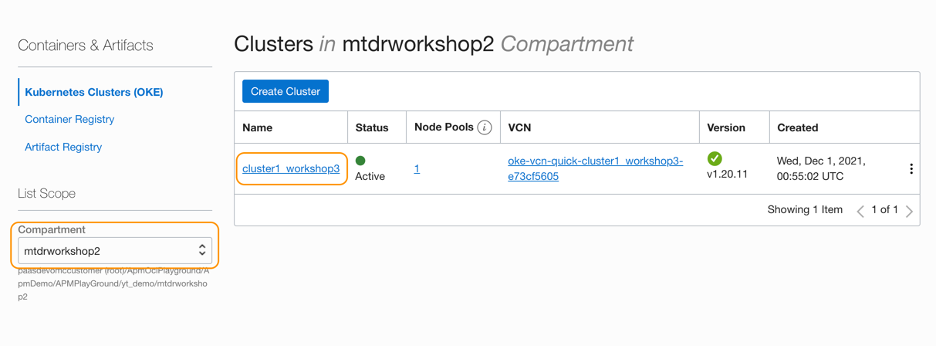
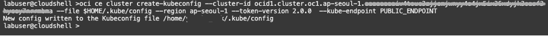
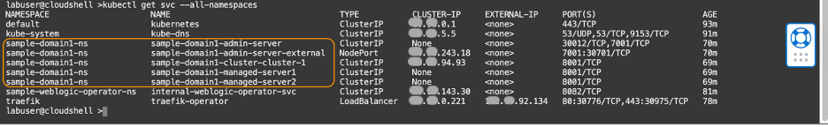
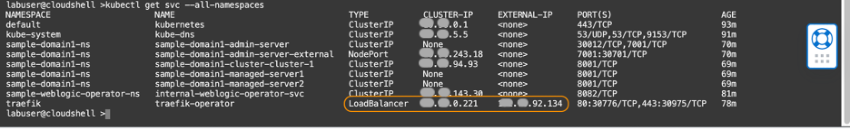

# Verify WebLogic Application

## Introduction

This workshop uses **WebLogic Operator** Demo app, which is a simple JSP based WebLogic application that runs in a Kubernetes cluster. It is a prerequisite to complete the **[Migrating WebLogic Server to Kubernetes on OCI](https://apexapps.oracle.com/pls/apex/dbpm/r/livelabs/workshop-attendee-2?p210_workshop_id=567&p210_type=2&session=102696148940850)** workshop, up to Lab 4 to setup the app, prior to start the tutorials in this workshop.

In this lab, you will make sure the application is running and ready to configure the APM Java Agent.


Estimated time: 5 minutes

### Objectives
* Ensure the WebLogic Operator Demo application is running  

### Prerequisites

* Completion of the **[Migrating WebLogic Server to Kubernetes on OCI](https://apexapps.oracle.com/pls/apex/dbpm/r/livelabs/workshop-attendee-2?p210_workshop_id=567&p210_type=2&session=102696148940850)** workshop, labs 1, 2, 3 and 4.


## Task 1: Verify the application in a browser

1. Click the three-bar icon at the top left corner in the Oracle Cloud console. From the menu, select **Developer Services** > **Kubernetes Clusters (OKE)**.

   

2. Select the compartment, which you created the Kubernetes cluster in the **[Migrating WebLogic Server to Kubernetes on OCI](https://apexapps.oracle.com/pls/apex/dbpm/r/livelabs/workshop-attendee-2?p210_workshop_id=567&p210_type=2&session=102696148940850)** workshop. Then click the name of the cluster.

   

3.	Click **Access Cluster**

   

4.	Select **Cloud Shell Access**, then click **Launch Cloud Shell**.

   

5.	Cloud Shell window opens at the bottom of the Oracle Cloud console screen.

   

6.	Go back to the **Access Your Cluster** page, find a textbox with an OCI command, then click **Copy**.

   

7.	Paste the command into the Cloud Shell and execute. It configures the Cloud Shell session to work with the cluster.

   


   > ***NOTE***:  Save the command to a text file in your laptop, and execute it every time when you start a new Cloud Shell session, while working the labs in this workshop.


8.	In the Cloud Shell, run the following command.

    ``` bash
    <copy>
    kubectl get svc --all-namespaces
    </copy>
    ```

   The output will be similar to the image below. The namespace of the WebLogic Server services used in the WebLogic workshop is ***sample-domain1-ns*** by default.

   


9.	Within the same command output, find the LoadBalancer service. Note down the External-IP.

   


10.	On your laptop, start a browser and access the application with the following URL pattern:

     ``` bash
     <copy>
     http://<External IP of the Load Balancer>/opdemo/?dsname=testDatasource
     </copy>
     ```
     Make sure the WebLogic Operator Demo application launches as in the image below. This is the target web application you will use to configure the APM Java Agent in this workshop.


     


     If you have not set up the application yet, please visit the **[Migrating WebLogic Server to Kubernetes on OCI](https://apexapps.oracle.com/pls/apex/dbpm/r/livelabs/workshop-attendee-2?p210_workshop_id=567&p210_type=2&session=102696148940850)** workshop, and complete the tutorials from the Lab 1 to Lab 4.


You may now [proceed to the next lab](#next).

## Acknowledgements

* **Author** - Yutaka Takatsu, Product Manager, Enterprise and Cloud Manageability
- **Contributors** - Steven Lemme, Senior Principal Product Manager,<br>
David Le Roy, Director, Product Management,<br>
Avi Huber, Senior Director, Product Management
* **Last Updated By/Date** - Yutaka Takatsu, December 2021
